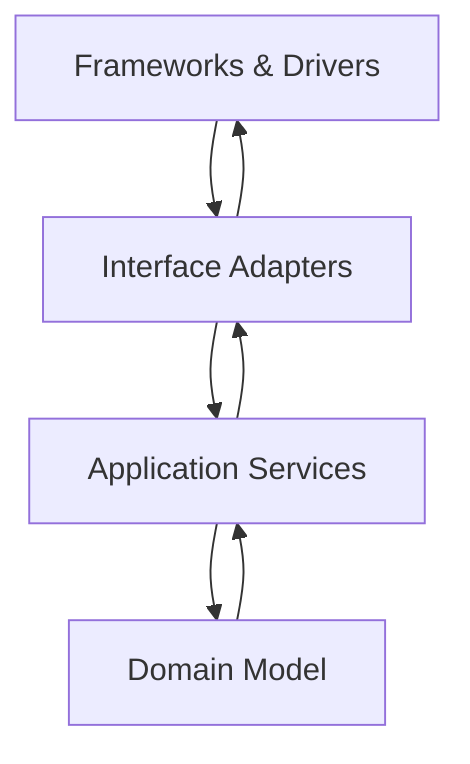

# Engineering Philosophy

> The values and decision heuristics that drive our day-to-day engineering work.

This is the **moral compass** of the handbook. Every other document derives from the principles here. When in doubt, read this first.

---

## Core principles

### 1. Domain-Driven Design (DDD)

The code mirrors the business. We invest in **ubiquitous language**, **bounded contexts**, and **aggregate modeling** so that the code reads like a conversation between engineers and domain experts.

**Implications:**

- The folder structure under `apps/backend/src/` reflects bounded contexts, not technical layers.
- Aggregate roots own their invariants. Application services orchestrate; they do not mutate domain state directly.
- Repositories are per-aggregate. There is no "god repository" that knows every table.

> See [Bounded Contexts](../03-domain/bounded-contexts.md) and [Aggregates](../03-domain/aggregates.md).

### 2. Clean Architecture

We separate **policy** (what to do) from **mechanism** (how to do it).

The dependency rule: **dependencies point inward**. The domain model knows nothing of FastAPI, SQLAlchemy, or Redis.

### 3. SOLID

| Principle | What it means here |
|---|---|
| Single responsibility | A module, class, and function each have one reason to change. |
| Open/closed | Extend behavior via composition or new modules, not by editing existing ones. |
| Liskov substitution | Subtypes honor the contracts of their parents. |
| Interface segregation | Prefer narrow protocols over fat interfaces. |
| Dependency inversion | High-level modules own abstractions; low-level modules implement them. |

### 4. DRY

Every piece of knowledge has a single, authoritative representation.

**Not** to be confused with **"don't repeat similar-looking code"**. Three similar lines is fine. Three repeated business rules is not.

> **Pitfall** — DRY for code; **SSOT (Single Source of Truth)** for data. Don't store the same fact in two tables; do write similar functions when each has a slightly different meaning.

### 5. KISS

The simplest solution that meets today's requirements is preferred.

- Don't add a caching layer until you've measured that you need one.
- Don't introduce an event bus for a single producer/consumer pair.
- Don't write an abstraction for one caller.

### 6. YAGNI

Build for today's requirements. Build for tomorrow when tomorrow arrives.

- We do **not** pre-build "for the multi-region future".
- We **do** keep clear seams so we can add it later without rewriting.

### 7. Test-Driven Development (TDD)

Red → Green → Refactor.

Tests are not a safety net to add later. They are the **specification** we write first.

Coverage targets are not goals in themselves — they are a sanity check that we have tested the things that matter.

> See [TDD Handbook](../10-testing/tdd-handbook.md).

### 8. Security by Design

Security is a **non-functional requirement** with the same priority as correctness. It is not a checklist at the end.

- We threat-model significant features.
- We never log secrets, PII, or payment data.
- We never store PAN/CVV. We never roll our own crypto.
- We assume breach: every endpoint is authenticated, authorized, audited, and rate-limited.

### 9. Event-Driven Design (Internal)

Within the backend, modules communicate via **domain events** for cross-context workflows, and via **direct calls** for in-context operations.

- **Direct calls** are simple, fast, and tightly coupled to a context.
- **Events** decouple producer from consumer and enable async processing.
- We do **not** use events as a substitute for a clear API contract.

### 10. Modular Monolith First

We start as a **modular monolith** and only extract services when there is a **measured** reason to do so.

> See [ADR-0001](../17-adrs/0001-modular-monolith.md).

### 11. Evolutionary Architecture

We design for change.

- Module boundaries are enforced.
- Data is owned by one module per aggregate.
- Public interfaces (APIs, events) are versioned and documented.
- We can replace any component without rewriting the platform.

---

## Anti-patterns (we explicitly avoid these)

> **Anti-pattern** — if you see this in a PR, request a change.

### Premature microservices

We do **not** split the platform into multiple services until there is a **measured** need.

**Symptoms:**

- Two services that share a database.
- Network calls inside a single user request.
- Synchronous chains across service boundaries.
- A "service" that is one developer and one VM.

### Tight coupling

Modules must not reach into each other's internals.

**Symptoms:**

- A module importing another's database models.
- A module directly reading another's tables.
- A module depending on another's HTTP API for in-process operations.

### Business logic in controllers

Controllers translate HTTP, nothing more.

**Symptoms:**

- Domain decisions in route handlers.
- Validation beyond input shape.
- More than 10 lines in a controller method (almost always a sign).

### Hardcoded business rules

Tax rates, slot durations, cancellation windows, pricing tiers — these are **data**, not code.

**Symptoms:**

- A `if sport == "TENNIS"` branch in a service.
- A constant for the cancellation window.
- A literal for a tax rate.

### Fat models

Domain entities must not accumulate convenience methods that have nothing to do with their core invariants.

**Symptoms:**

- A `Customer` class with `send_marketing_email()`, `calculate_lifetime_value()`, and `cancel_all_bookings()`.
- Aggregates with > 30 fields.

### God objects

A single class/module that knows everything.

**Symptoms:**

- A `BookingService` that handles pricing, invoicing, notifications, and analytics.
- A single repository with 50 methods.

### Shared mutable state

Cross-request mutable state is a recipe for races.

**Symptoms:**

- Module-level globals.
- Class attributes that mutate at runtime.
- Caches without clear invalidation.

### Copy-paste programming

Duplication of similar-looking code is fine when each occurrence has different meaning. Duplication of the **same rule** in two places is a bug magnet.

**Symptoms:**

- The same validation in API and DB.
- The same tax calculation in service and report.
- The same status enum defined in two modules.

---

## Decision heuristics

When facing a design choice, ask these questions in order:

### 1. Is this in the requirements?

If no → YAGNI. Don't build it.

### 2. What's the smallest thing that works?

If you can't describe it in one sentence, it's not small enough.

### 3. Is the boundary clear?

If two things will always change together, they belong in the same module. If they change for different reasons, separate them.

### 4. Can I delete this code easily?

If not, the abstraction is wrong. We optimize for delete-ability.

### 5. Will this be testable?

If the test requires 100 lines of setup, the design is wrong. Simplify until tests are short.

### 6. What does this look like in 5 years?

If you can't imagine this design surviving 5 years of evolution, redesign now.

---

## Trade-off awareness

Every decision is a trade-off. We name the trade-off explicitly in ADRs.

| Decision | What we gain | What we give up |
|---|---|---|
| Modular monolith | Simpler deployment, easier refactoring | Can't scale modules independently |
| Configuration-driven sports | New sports in days, not months | Slightly more complex generic code |
| Event-driven cross-context | Decoupled consumers, async processing | Harder to trace end-to-end flows |
| PWA-only | One codebase for all platforms | No native push on iOS in v1 |
| Strict RBAC | Clear authorization model | More upfront modeling work |
| Cursor pagination | Stable under inserts | Can't jump to page N |

---

## How this philosophy is enforced

- **PR review** — every PR is checked against this list.
- **ADRs** — material decisions are recorded with rationale.
- **Architecture tests** — module dependency rules are verified by automated tests.
- **Code review checklist** — see [Code Review Checklist](../13-coding-standards/code-review-checklist.md).

---

## When to revisit this document

- When a principle is violated consistently without pain → the principle is wrong.
- When a new principle is needed → propose it in an ADR.
- When language/framework shifts the cost calculus → update, don't ignore.
