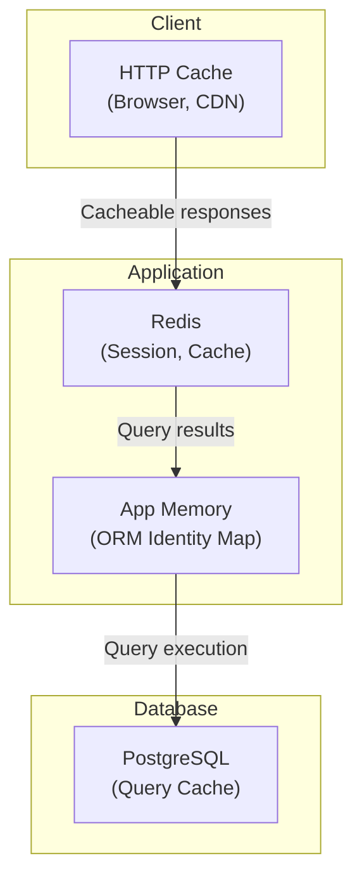

# Caching Strategy

> Cache layers: HTTP cache, application cache (Redis), query result cache, ORM identity map. Cache keys, TTLs, invalidation patterns, and stampede prevention.

This document covers caching across all layers of the stack. Caching is essential for performance — database round-trips are the most common source of latency. This level answers: **what to cache**, **where**, **for how long**, and **how to invalidate**.

---

## Cache Layers



### Cache Layer Summary

| Layer | What | Technology | Scope | Latency |
|---|---|---|---|---|
| HTTP | GET responses with Cache-Control | Browser, CDN | Per-tenant | <1ms |
| Redis | Session data, query results, locks | Redis | Per-tenant | 1-5ms |
| App | ORM identity map | Memory | Per-request | <1ms |
| DB | Query plan cache | PostgreSQL | Global | N/A |

---

## HTTP Cache (Browser + CDN)

### Cache Headers

We use standard HTTP caching with `Cache-Control`:

```python
@router.get("/facilities/{id}/slots")
async def get_slots(
    facility_id: UUID,
    date: date,
    slot_service: SlotService = Depends(get_slot_service),
) -> list[SlotResponse]:
    slots = await slot_service.get_slots(facility_id, date)

    response = JSONResponse(
        content=[SlotResponse.model_validate(s) for s in slots],
    )

    # Cache for 60 seconds — slots change frequently
    response.headers["Cache-Control"] = "public, max-age=60"

    return response
```

### Cache Strategy by Endpoint

| Endpoint Type | Cacheable | TTL | Notes |
|---|---|---|---|
| GET /slots | Yes | 60s | Changes frequently |
| GET /facilities | Yes | 3600s | Changes rarely |
| GET /bookings | No | — | User-specific |
| POST /bookings | No | — | Mutation |
| GET /plans | Yes | 300s | Changes occasionally |

### CDN Caching

Static assets (PWA) are cached at CDN:

```python
# In Nginx/Vercel config
location /static/ {
    expires 1y;
    add_header Cache-Control "public, immutable";
}

location /_next/static/ {
    expires 1y;
    add_header Cache-Control "public, immutable";
}
```

---

## Redis Application Cache

### Cache Keys

All Redis keys follow a consistent pattern:

```
cache:{tenant_id}:{entity}:{id}
session:{tenant_id}:{session_id}
lock:{resource}:{id}
```

### Cache TTLs

| Entity | TTL | Rationale |
|---|---|---|
| User session | 7 days | Matches session lifetime |
| Customer profile | 300s | May change, moderate staleness OK |
| Slot availability | 60s | Changes frequently |
| Facility details | 3600s | Changes rarely |
| Membership plan | 86400s | Changes rarely |
| Booking list | 0 (no cache) | User-specific, security risk |

### Cache Example

```python
class CustomerRepository:
    def get_by_id(self, customer_id: UUID, tenant_id: UUID) -> Customer | None:
        # Check cache
        cache_key = f"cache:{tenant_id}:customer:{customer_id}"
        cached = self.redis.get(cache_key)
        if cached:
            return self._deserialize(cached)

        # Query database
        customer = self.session.query(Customer).filter(
            Customer.id == customer_id,
            Customer.tenant_id == tenant_id,
        ).first()

        # Cache result
        if customer:
            self.redis.setex(
                cache_key,
                300,  # 5 minutes
                self._serialize(customer),
            )

        return customer
```

---

## ORM Identity Map

SQLAlchemy provides an identity map that caches objects within a session:

```python
# Identity map is automatic in SQLAlchemy
session = get_session()

# First query loads customer
customer1 = session.query(Customer).filter_by(id=customer_id).first()

# Second query returns same object (from identity map)
customer2 = session.query(Customer).filter_by(id=customer_id).first()

assert customer1 is customer2  # Same object
```

> **Note:** The identity map is per-session, not per-request. FastAPI's dependency injection creates a new session per request by default.

---

## Cache Invalidation

### Write-Through

When data changes, update both DB and cache:

```python
class CustomerService:
    async def update_customer(self, customer_id: UUID, tenant_id: UUID, data: UpdateCustomer) -> Customer:
        # Update database
        customer = await self.customer_repo.update(customer_id, tenant_id, data)

        # Invalidate cache
        cache_key = f"cache:{tenant_id}:customer:{customer_id}"
        await self.redis.delete(cache_key)

        return customer
```

### Event-Based Invalidation

When one context updates data, other contexts invalidate their caches via events:

```python
# Membership module updates customer
class MembershipService:
    async def activate_subscription(self, subscription: Subscription) -> None:
        subscription.status = SubscriptionStatus.ACTIVE
        await self.subscription_repo.save(subscription)

        # Publish event
        await self.event_bus.publish(SubscriptionActivatedEvent(
            subscription_id=subscription.id,
            customer_id=subscription.customer_id,
        ))

# Customer module invalidates cache on event
@event_handler(EventType.SUBSCRIPTION_ACTIVATED)
async def handle_subscription_activated(event: SubscriptionActivatedEvent) -> None:
    cache_key = f"cache:{event.tenant_id}:customer:{event.customer_id}"
    await redis.delete(cache_key)
```

### Time-Based Expiration

Most caches expire based on time:

```python
# Set TTL at write time
redis.setex(cache_key, ttl_seconds, value)
```

---

## Cache Stampede Prevention

A cache stampede occurs when many requests miss the cache simultaneously and all query the database.

### Prevention: Distributed Lock

```python
async def get_customer(self, customer_id: UUID, tenant_id: UUID) -> Customer:
    cache_key = f"cache:{tenant_id}:customer:{customer_id}"

    # Check cache
    cached = await self.redis.get(cache_key)
    if cached:
        return self._deserialize(cached)

    # Acquire lock to prevent stampede
    lock_key = f"lock:customer:{tenant_id}:{customer_id}"
    lock = await self.redis.lock(lock_key, timeout=10)

    async with lock:
        # Double-check after acquiring lock
        cached = await self.redis.get(cache_key)
        if cached:
            return self._deserialize(cached)

        # Query database
        customer = await self.customer_repo.get(customer_id, tenant_id)

        # Cache result
        if customer:
            await self.redis.setex(cache_key, 300, self._serialize(customer))

    return customer
```

### Prevention: Stale-While-Revalidate

Allow serving stale data while refreshing:

```python
async def get_customer(self, customer_id: UUID, tenant_id: UUID) -> Customer:
    cache_key = f"cache:{tenant_id}:customer:{customer_id}"

    cached = await self.redis.get(cache_key)
    if cached:
        customer = self._deserialize(cached)

        # If cache is stale, refresh in background
        if await self.redis.ttl(cache_key) < 60:
            asyncio.create_task(self._refresh_customer(customer_id, tenant_id))

        return customer

    # Cache miss - query immediately
    return await self._load_customer(customer_id, tenant_id)
```

---

## Cache Patterns

### Pattern: Cache-Aside (Read)

```python
# Read pattern
async def get_data(key):
    value = redis.get(key)
    if value:
        return value

    value = db.query(key)
    redis.setex(key, ttl, value)
    return value
```

### Pattern: Write-Through

```python
# Write pattern
async def write_data(key, value):
    db.write(key, value)
    redis.setex(key, ttl, value)
```

### Pattern: Write-Behind

```python
# Write pattern (async)
async def write_data(key, value):
    redis.setex(key, ttl, value)  # Fast
    asyncio.create_task(db.write(key, value))  # Slow, async
```

---

## Cache Metrics

We monitor cache effectiveness:

| Metric | Description | Target |
|---|---|---|
| Cache hit rate | % of requests served from cache | >80% |
| Cache miss rate | % requiring DB query | <20% |
| Avg cache latency | Time to get from Redis | <5ms |
| Cache eviction rate | Items evicted due to memory pressure | Low |

---

## Why This Design

### Multi-Layer Caching

We cache at multiple layers because:

- HTTP cache: Reduces network traffic, fastest
- Redis: Shared across instances, sub-millisecond latency
- Identity map: Per-request, no network overhead

> **Trade-off:** Caching adds complexity (invalidation, staleness, debugging). The benefit (latency reduction) outweighs the cost for frequently-accessed data.

### Redis for Application Cache

We chose Redis over memcached because:

- Data structures (sets, sorted sets for queues)
- Pub/sub for events
- Lua scripting for atomic operations
- Persistence options

> **Alternative considered:** memcached. Simpler, but lacks data structures we need.

---

## What's Next

- [Scaling Strategy](./scaling-strategy.md) — horizontal scaling.
- [Disaster Recovery](./disaster-recovery.md) — backup and recovery.
- [Performance Goals](../11-performance/response-time-goals.md) — latency targets.
