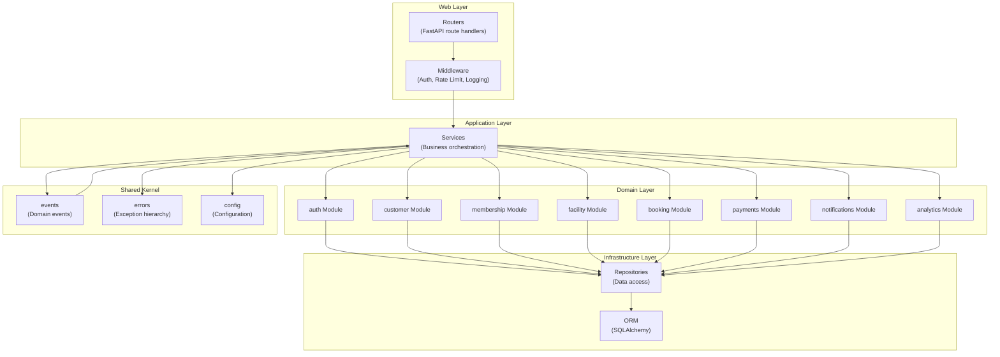
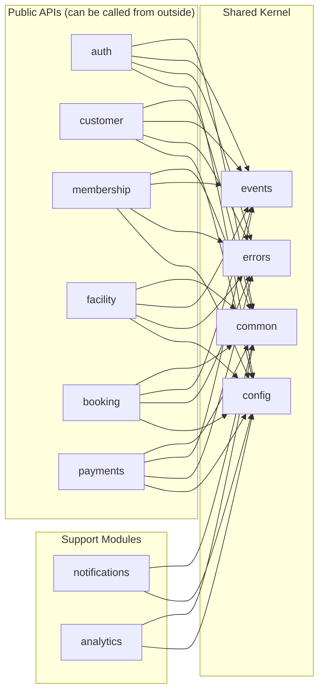

# Component Diagram (C4 Level 3)

> The internal structure of the Backend API — modules, layers, and their dependencies.

This document drills into the Backend API container to show the components that implement the business logic. Each component is a logical grouping of related code (a Python package). This level answers: **what modules exist**, **how they are organized**, and **what depends on what**.

---

## Component Overview



---

## Layer Architecture

The backend follows a layered architecture with strict dependency rules. Dependencies point inward — domain code knows nothing of infrastructure code.

### Layer 1: Web Layer (Routers + Middleware)

The web layer handles HTTP concerns: routing, request parsing, response formatting, and cross-cutting concerns.

**Components:**

| Component | Responsibility |
|---|---|
| `routers/` | FastAPI route handlers that translate HTTP requests into domain operations |
| `middleware/` | Request ID injection, authentication, rate limiting, structured logging |

**Key characteristics:**

- Routers are thin. They extract path/query parameters, call a service, and return the response.
- No business logic in routers. Validation is done by Pydantic schemas, not router code.
- Middleware runs on every request and handles concerns that span endpoints.

```python
# Example router — deliberately thin
@router.post("/bookings", response_model=BookingResponse)
def create_booking(
    body: CreateBookingRequest,
    booking_service: BookingService = Depends(get_booking_service),
    current_user: User = Depends(get_current_user),
) -> BookingResponse:
    booking = booking_service.create_booking(
        customer_id=current_user.id,
        slot_id=body.slot_id,
        tenant_id=current_user.tenant_id,
    )
    return BookingResponse.model_validate(booking)
```

### Layer 2: Application Services

Application services orchestrate domain operations. They do not contain business logic themselves — they coordinate between domain services, repositories, and external services.

**Components:**

Each domain module has a corresponding application service (e.g., `BookingService` for the `booking` module). The service is the transaction script that coordinates the flow.

**Key characteristics:**

- Services are transactional boundaries. They begin and commit database transactions.
- Services publish domain events when significant things happen.
- Services handle cross-module operations (e.g., booking involves facility + booking + payments modules).

```python
class BookingService:
    def create_booking(self, customer_id: UUID, slot_id: UUID, tenant_id: UUID) -> Booking:
        # Validate slot exists and is available (facility module)
        slot = self.slot_repo.get_for_update(slot_id, tenant_id)
        if not slot or slot.is_booked:
            raise SlotNotAvailableError(slot_id)

        # Create booking (booking module)
        booking = Booking(customer_id=customer_id, slot_id=slot_id, tenant_id=tenant_id)
        self.booking_repo.save(booking)

        # Publish event for notification
        self.event_bus.publish(BookingCreatedEvent(booking_id=booking.id))

        return booking
```

### Layer 3: Domain Modules (Bounded Contexts)

Each domain module encapsulates a bounded context — a coherent area of the business that changes for its own reasons.

| Module | Responsibility | Key Aggregates |
|---|---|---|
| `auth` | Identity, authentication, sessions | User, Tenant, Session |
| `customer` | Member profiles, guardians, waivers | Customer, Guardian, Waiver |
| `membership` | Plans, subscriptions, renewals | MembershipPlan, Subscription |
| `facility` | Resources, availability, schedules | Facility, Resource, AvailabilityRule |
| `booking` | Reservations, check-in, waitlist | Booking, Slot, WaitlistEntry |
| `payments` | Invoices, transactions, refunds | Invoice, Payment, Refund |
| `notifications` | Templates, delivery, channels | NotificationTemplate, NotificationDelivery |
| `analytics` | Reporting, aggregations, exports | (Read models) |
| `common` | Shared utilities used everywhere | Address, Phone, DateRange |

**Module structure:**

Each module follows a standard structure:

```
module/
├── __init__.py
├── models.py      # Domain entities
├── schemas.py     # Pydantic DTOs
├── repository.py  # Data access
├── service.py     # Domain logic
├── router.py      # HTTP routes
└── events.py     # Domain events
```

### Layer 4: Infrastructure Layer

Infrastructure layer components handle persistence and external integrations.

| Component | Responsibility |
|---|---|
| `repositories/` | Database access abstractions per aggregate |
| `orm/` | SQLAlchemy configuration, migrations, connection pooling |
| `external/` | Abstractions for payment gateway, SMS, email, storage |

### Layer 5: Shared Kernel

Shared kernel contains code that is used across modules. It is the **only** allowed cross-module dependency.

| Component | Responsibility |
|---|---|
| `events/` | Event bus, event types, event handlers |
| `errors/` | Exception hierarchy, error codes |
| `config/` | Configuration loading, environment variables |

> **Rule** — Modules may depend on shared kernel. Modules may NOT depend on each other directly. Cross-module communication happens via events or service-to-service calls at the application layer.

---

## Dependency Graph



---

## Module Detail

### auth Module

The authentication and authorization module. Handles identity, sessions, and access control.

| Entity | Role |
|---|---|
| `User` | Identity with email, password hash, MFA config |
| `Tenant` | Organization (club) that owns users and data |
| `Session` | Active login with device, IP, expiry |

**Public API:**

- `POST /auth/login` — Authenticate and issue JWT
- `POST /auth/refresh` — Rotate refresh token
- `POST /auth/logout` — Invalidate session
- `POST /auth/mfa/setup` — Enable MFA
- `GET /auth/me` — Current user info

### customer Module

Member and guardian management. Handles profiles, contact information, waivers, and KYC.

| Entity | Role |
|---|---|
| `Customer` | Member with profile, contact, membership status |
| `Guardian` | Parent/guardian for junior members |
| `Waiver` | Signed liability waiver with expiry |

**Public API:**

- `GET /customers` — List members (staff only)
- `GET /customers/{id}` — Member detail
- `POST /customers` — Create member
- `PATCH /customers/{id}` — Update member
- `POST /customers/{id}/waiver` — Sign waiver

### membership Module

Subscription and plan management. Handles plan definitions, subscriptions, renewals, and freezes.

| Entity | Role |
|---|---|
| `MembershipPlan` | Plan definition with pricing, duration, benefits |
| `Subscription` | Active subscription linking customer to plan |

**Public API:**

- `GET /memberships/plans` — Available plans
- `GET /memberships/subscriptions` — My subscriptions
- `POST /memberships/subscribe` — Purchase subscription
- `POST /memberships/{id}/freeze` — Freeze membership
- `POST /memberships/{id}/cancel` — Cancel subscription

### facility Module

Resource and availability management. Handles courts, pools, slots, and schedules.

| Entity | Role |
|---|---|
| `Facility` | Physical location (club) |
| `Resource` | Bookable unit (court, lane, gym equipment) |
| `AvailabilityRule` | Operating hours, blackout dates |
| `Slot` | Time-bound availability of a resource |

**Public API:**

- `GET /facilities` — List facilities
- `GET /facilities/{id}/resources` — List resources at facility
- `GET /facilities/{id}/slots` — Available slots
- `POST /facilities/{id}/resources` — Create resource (admin)
- `PATCH /resources/{id}/availability` — Update availability (admin)

### booking Module

Reservation and check-in. Handles booking creation, cancellation, check-in, and waitlist.

| Entity | Role |
|---|---|
| `Booking` | Reservation linking customer to slot |
| `WaitlistEntry` | Customer waiting for unavailable slot |

**Public API:**

- `GET /bookings` — My bookings
- `POST /bookings` — Create booking
- `POST /bookings/{id}/cancel` — Cancel booking
- `POST /bookings/{id}/check-in` — Check in
- `GET /bookings/waitlist` — My waitlist entries

### payments Module

Financial transactions. Handles invoicing, payment processing, refunds, and dunning.

| Entity | Role |
|---|---|
| `Invoice` | Bill to customer with line items |
| `Payment` | Transaction record with gateway reference |
| `Refund` | Reversal of payment |

**Public API:**

- `GET /invoices` — My invoices
- `POST /invoices/{id}/pay` — Initiate payment
- `POST /payments/{id}/refund` — Request refund (admin)

### notifications Module

Message delivery. Handles templating, channel selection, and delivery tracking.

| Entity | Role |
|---|---|
| `NotificationTemplate` | Message template with variables |
| `NotificationDelivery` | Delivery record with status |

**Integration:** This module is primarily event-driven. It consumes events like `BookingCreatedEvent` and delivers notifications asynchronously.

### analytics Module

Reporting and data export. Provides aggregated views for dashboards and exports.

| Entity | Role |
|---|---|
| (Read models) | Materialized views and aggregations |

**Public API:**

- `GET /analytics/dashboard` — Dashboard metrics
- `GET /analytics/reports/{type}` — Generate report

---

## Cross-Module Communication

Modules communicate in two ways, depending on the coupling requirement:

### 1. Direct Calls (Tight Coupling)

When two modules are always used together, application services orchestrate direct calls:

```python
class BookingService:
    def create_booking(self, ...):
        # Direct call to facility module
        slot = self.facility_service.get_slot(slot_id)

        # Direct call to customer module
        customer = self.customer_service.get_customer(customer_id)

        # Booking module logic
        booking = self.booking_repo.create(...)
```

> **When to use direct calls:** When the operations must be atomic (all-or-nothing), have tight consistency requirements, or are always used together.

### 2. Events (Loose Coupling)

When one module's action triggers another module's action asynchronously:

```python
class BookingService:
    def create_booking(self, ...):
        booking = self.booking_repo.create(...)

        # Publish event — don't wait for handlers
        self.event_bus.publish(BookingCreatedEvent(
            booking_id=booking.id,
            customer_id=booking.customer_id,
            slot_id=booking.slot_id,
        ))
```

> **When to use events:** When the trigger is fire-and-forget, the handlers can fail independently, or multiple handlers need the same event.

---

## Why This Structure

### Separation of Concerns

Each layer has a single responsibility. Routers handle HTTP, services orchestrate, domain modules encapsulate logic, repositories persist.

**Trade-off:**

- We gain testability (each layer can be mocked independently), maintainability (changes are localized), and clarity (where to look for code).
- We add indirection. Simple operations require jumping through layers. This cost is acceptable at our scale.

### Module Isolation

Modules own their data and expose it only through defined interfaces. No module can directly read another's tables.

**Trade-off:**

- We gain clear ownership, independent deployment (when we eventually extract services), and reduced bug propagation.
- We add complexity in cross-module queries (must go through APIs). This is by design — it forces explicit contracts.

### Shared Kernel

The shared kernel is the **only** allowed coupling. It contains truly shared concerns: events, errors, configuration.

**Trade-off:**

- We gain a single source of truth for common types and avoid duplicated code.
- We risk shared kernel bloat if we aren't disciplined. This is mitigated by code review discipline.

---

## What's Next

- [Module Diagram](./module-diagram.md) — bounded contexts, DDD relationships, dependency matrix.
- [Request Lifecycle](./request-lifecycle.md) — trace a request through the stack.
- [Flow Documents](./flow-authentication.md) — detailed flows for key operations.
