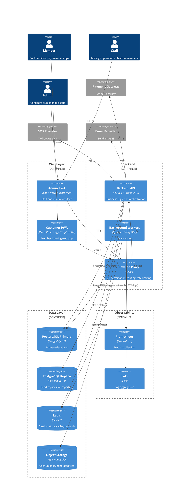
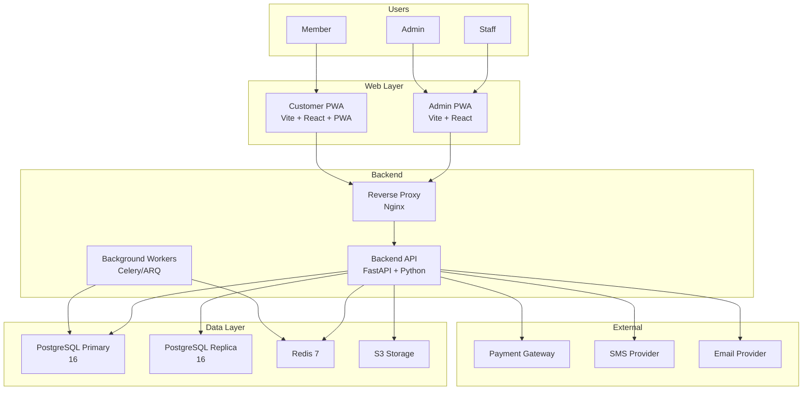

# Container Diagram (C4 Level 2)

> The runtime containers that compose the system: applications, databases, caches, queues, and external integrations.

This document drills into C4 Level 1 to show the major executable units. Each container is a separately deployable thing: a web application, a database, a cache, a queue, or an external service. This level answers: **what runs where**, **how data flows**, and **what technologies** we use.

---

## Container Overview



> **Note**: If your Markdown viewer does not render C4Container diagrams, the flowchart below provides equivalent information.



---

## Container Descriptions

### Admin PWA

| Attribute | Detail |
|---|---|
| Technology | Vite + React 18 + TypeScript |
| Purpose | Staff and admin operational interface |
| Deployment | Static assets on CDN, fetches from Backend API |
| Authentication | JWT Bearer token stored in memory (not localStorage for security) |
| State management | TanStack Query for server state, React Context for UI state |
| Key features | Dashboard, facility management, booking management, member search, reports |

> **Why React for Admin?** The admin interface requires complex state management, data-intensive tables, and form-heavy workflows. React's ecosystem provides the best tooling for this class of application.

### Customer PWA

| Attribute | Detail |
|---|---|
| Technology | Vite + React 18 + TypeScript + Vite PWA Plugin |
| Purpose | Member booking, account management, check-in |
| Deployment | Static assets on CDN, fetches from Backend API |
| Authentication | JWT Bearer token with refresh token rotation |
| State management | TanStack Query + offline queue via IndexedDB |
| Key features | Slot booking, membership purchase, payment, QR check-in, push notifications |

> **Why PWA?** Members access the platform on mobile devices in club environments with variable connectivity. The PWA provides installability, offline capability (booking queue), and push notifications — critical for a club experience.

### Backend API

| Attribute | Detail |
|---|---|
| Technology | FastAPI + Python 3.12 + SQLAlchemy 2.0 + Pydantic v2 |
| Purpose | All business logic, API endpoints, authentication, authorization |
| Deployment | Docker container behind reverse proxy, auto-scaled based on CPU/memory |
| Process model | ASGI worker processes (Uvicorn), typically 4-8 workers per instance |
| Database connections | Connection pool (SQLAlchemy), 20-50 connections per worker |
| Caching | Redis for session data, query results, and distributed locks |

> **Why FastAPI?** FastAPI provides async/await natively, automatic OpenAPI documentation, and Pydantic validation — reducing boilerplate while maintaining performance. Python's ecosystem aligns with our data-heavy, domain-modeling needs.

### Background Workers

| Attribute | Detail |
|---|---|
| Technology | Python + Celery (or ARQ for Redis-native) |
| Purpose | Async tasks: notifications, report generation, data cleanup, recurring billing |
| Deployment | Docker container, scaled independently based on queue depth |
| Task dispatch | Redis Streams as message broker |
| Retries | Exponential backoff with max 3 attempts, dead-letter queue after exhaustion |

> **Why separate workers?** Background tasks have different latency requirements than API requests. Notifications can take seconds; API requests must complete in hundreds of milliseconds. Separating them prevents noisy neighbor problems.

### Reverse Proxy

| Attribute | Detail |
|---|---|
| Technology | Nginx |
| Purpose | SSL termination, load balancing, static asset serving, rate limiting |
| Deployment | One container per availability zone, or managed service (ALB/Cloudflare) |
| Rate limiting | Per-IP and per-tenant limits at the proxy layer |
| Caching | Static assets cached at CDN; dynamic responses not cached (invalidatable) |

> **Why Nginx?** Nginx is the battle-tested standard for reverse proxying. It handles SSL termination, health checks, and basic rate limiting efficiently. In cloud deployments, we offload this to managed load balancers.

### PostgreSQL Primary

| Attribute | Detail |
|---|---|
| Technology | PostgreSQL 16 |
| Purpose | Primary transactional database |
| Deployment | Single primary with streaming replication to replica |
| Isolation | Row-level tenant filtering via tenant_id column |
| Backup | Daily full backups + continuous WAL archiving for PITR |
| Connection | TLS-encrypted, connection pooling via PgBouncer (optional) |

> **Why PostgreSQL?** PostgreSQL is the gold standard for relational data: ACID compliance, JSON support, rich indexing, and a mature ecosystem. It handles our multi-tenant isolation needs cleanly via row-level security.

### PostgreSQL Replica

| Attribute | Detail |
|---|---|
| Technology | PostgreSQL 16 |
| Purpose | Read replicas for reporting, analytics, and read-heavy workloads |
| Deployment | Streaming replica of primary, read-only |
| Use cases | Dashboard queries, export jobs, read-heavy API endpoints |
| Lag monitoring | Replica lag exposed as metric; queries route to replica only when lag is acceptable |

> **Why read replicas?** Reporting and analytics queries are resource-intensive. Offloading them to replicas prevents impacting transactional workloads. The trade-off is read-after-write inconsistency — addressed by routing user-facing reads to primary.

### Redis

| Attribute | Detail |
|---|---|
| Technology | Redis 7 (cluster mode optional) |
| Purpose | Session store, application cache, pub/sub, distributed locks, task queue |
| Deployment | Single instance or cluster depending on scaling needs |
| Persistence | AOF + RDB snapshots |
| Data eviction | volatile-lru policy for caches |
| Connection | TLS-encrypted, connection pooling |

> **Why Redis?** Redis provides microsecond-latency data access essential for session management and caching. Its pub/sub and sorted set data structures are perfect for task queues and rate limiting.

### Object Storage

| Attribute | Detail |
|---|---|
| Technology | S3-compatible (AWS S3, MinIO, or Cloudflare R2) |
| Purpose | User-uploaded files: profile photos, documents, generated reports |
| Access | Pre-signed URLs for uploads; CDN-distributed for downloads |
| Encryption | Server-side encryption (AES-256) |
| Versioning | Enabled for compliance and recovery |

---

## Multi-Tenant Architecture

The platform uses a **shared database, shared application** model. All tenants share the same PostgreSQL database and the same backend API instances. Isolation is enforced at the application layer.

### Shared Database Schema

```sql
-- Every table includes tenant_id for row-level filtering
CREATE TABLE customers (
    id UUID PRIMARY KEY DEFAULT gen_random_uuid(),
    tenant_id UUID NOT NULL REFERENCES tenants(id),
    email VARCHAR(255) NOT NULL,
    name VARCHAR(255) NOT NULL,
    created_at TIMESTAMP WITH TIME ZONE DEFAULT NOW(),
    updated_at TIMESTAMP WITH TIME ZONE DEFAULT NOW()
);

CREATE INDEX idx_customers_tenant_id ON customers(tenant_id);
```

### Application-Layer Filtering

Every query includes tenant_id. We enforce this at the repository layer:

```python
class CustomerRepository:
    def get_by_id(self, customer_id: UUID, tenant_id: UUID) -> Customer | None:
        return self.session.query(Customer).filter(
            Customer.id == customer_id,
            Customer.tenant_id == tenant_id  # Always filtered
        ).first()
```

> **Rule** — Every repository method that fetches data MUST accept tenant_id and include it in the WHERE clause. There are no exceptions. This is enforced by architecture tests.

### Tenant Isolation in Cache

Redis keys include tenant_id to prevent cross-tenant data leakage:

```
# Key format
cache:tenant:{tenant_id}:entity:{entity_id}
```

> **Why shared database?** Splitting tenants into separate databases (schema-per-tenant) adds operational complexity without proportional benefit at our scale. The shared model with row-level filtering is simpler to operate and secure enough for our threat model.

---

## Deployment Topology

### Development

```
┌─────────────┐
│   Developer │ localhost:3000 (admin)
│   Machine   │ localhost:3001 (customer)
│             │ localhost:8000 (backend)
│             │ localhost:5432 (postgres)
│             │ localhost:6379 (redis)
└─────────────┘
```

### Production

```
                    ┌──────────────────┐
                    │   Cloudflare/    │
                    │   CDN (static)  │
                    └────────┬─────────┘
                             │
                    ┌────────▼─────────┐
                    │  Load Balancer   │
                    │  (HTTPS term)    │
                    └────────┬─────────┘
                             │
              ┌──────────────┼──────────────┐
              │              │              │
       ┌──────▼──────┐ ┌─────▼─────┐ ┌─────▼──────┐
       │ API Pod 1   │ │ API Pod 2 │ │ API Pod N  │
       │ (FastAPI)   │ │ (FastAPI) │ │ (FastAPI)  │
       └──────┬──────┘ └─────┬─────┘ └─────┬──────┘
              │              │              │
              └──────────────┼──────────────┘
                             │
         ┌───────────────────┼───────────────────┐
         │                   │                   │
    ┌────▼────┐        ┌─────▼─────┐      ┌─────▼────┐
    │Primary  │◄──────►│ Replica 1 │      │ Replica 2│
    │Postgres │        │ Postgres  │      │ Postgres │
    └────┬────┘        └───────────┘      └──────────┘
         │
    ┌────▼────┐
    │  Redis │
    │ Cluster│
    └────────┘
```

> **Why this topology?** This is a standard cloud-native deployment: stateless API pods behind a load balancer, stateful data stores behind them. It scales horizontally by adding API pods and vertically by sizing the data stores.

---

## Technology Choices Rationale

| Component | Choice | Rationale |
|---|---|---|
| Backend | FastAPI | Async-first, native OpenAPI, Pydantic validation, Python ecosystem |
| Frontend | React + Vite | Component model, mature ecosystem, fast dev server, PWA plugin |
| Database | PostgreSQL | ACID, JSON,成熟的生态, row-level security |
| Cache/Queue | Redis | Microsecond latency, pub/sub, sorted sets, Lua scripting |
| Workers | Celery/ARQ | Task queue with retries, scheduling, dead-letter support |
| Object Storage | S3-compatible | Vendor-neutral, CDN integration, cost-effective |
| Proxy | Nginx | Battle-tested, efficient, rate limiting built-in |

---

## What's Next

- [Component Diagram (C4 L3)](./component-diagram.md) — explore the internal structure of the Backend API.
- [Module Diagram](./module-diagram.md) — understand bounded contexts and their relationships.
- [Request Lifecycle](./request-lifecycle.md) — trace a request through the stack.
