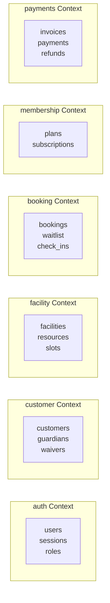
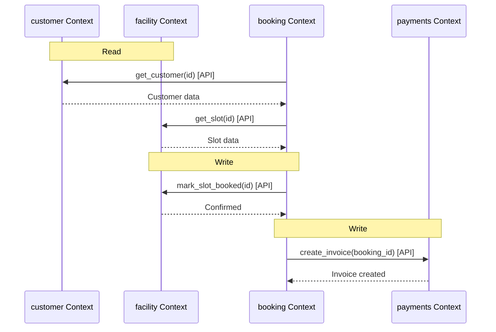
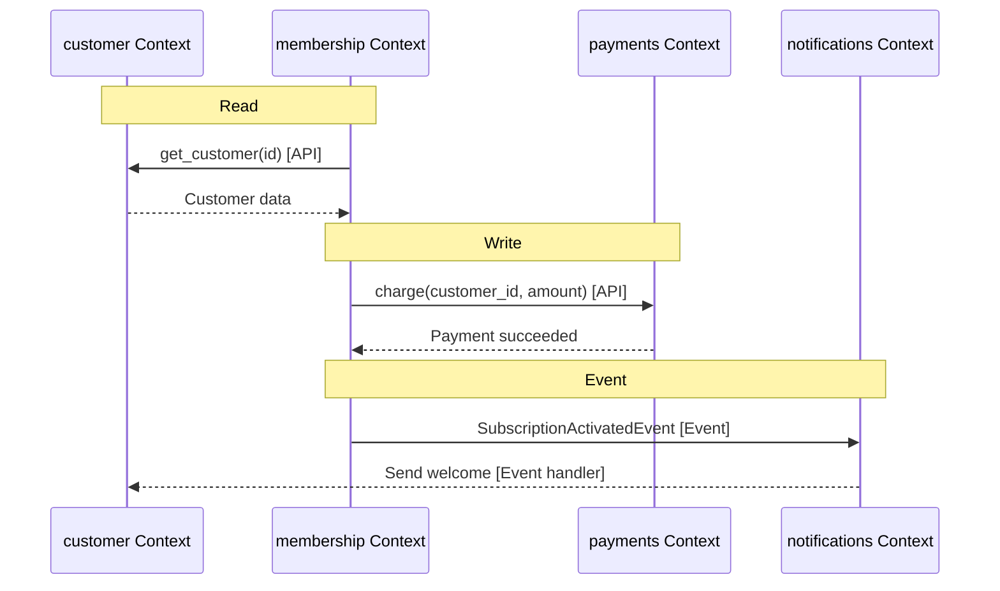

# Data Flow

> Where data is owned, who can read what, multi-tenant row-level filtering, and cross-context data access patterns.

This document defines data ownership and movement within the system. Data flows are the hardest part of distributed systems — getting them wrong leads to consistency bugs and security vulnerabilities. This level answers: **who owns what data**, **how data moves between contexts**, and **what is never allowed**.

---

## Data Ownership

Each bounded context owns its data exclusively. No context can directly access another context's database tables.



### Ownership Matrix

| Context | Owns Tables | Can Read From | Can Write To |
|---|---|---|---|
| auth | users, sessions, roles | — | — |
| customer | customers, guardians, waivers | auth (user lookup) | — |
| facility | facilities, resources, slots, availability_rules | — | — |
| booking | bookings, waitlist_entries, check_ins | facility (slot lookup), customer (validation) | facility (slot status) |
| membership | plans, subscriptions, benefits | customer (customer lookup) | — |
| payments | invoices, payments, refunds | booking (amount lookup), membership (plan lookup) | — |
| notifications | templates, deliveries | all (read-only) | — |
| analytics | materialized views | all (read replicas) | — |

---

## Multi-Tenant Row-Level Filtering

Every table includes `tenant_id`. Every query filters by `tenant_id`.

### Database Schema

```sql
-- Every table has tenant_id
CREATE TABLE customers (
    id UUID PRIMARY KEY DEFAULT gen_random_uuid(),
    tenant_id UUID NOT NULL REFERENCES tenants(id),
    email VARCHAR(255) NOT NULL,
    name VARCHAR(255) NOT NULL,
    created_at TIMESTAMP WITH TIME ZONE DEFAULT NOW(),
    updated_at TIMESTAMP WITH TIME ZONE DEFAULT NOW()
);

-- Index for tenant lookups
CREATE INDEX idx_customers_tenant_id ON customers(tenant_id);

-- Unique constraint per tenant
CREATE UNIQUE INDEX idx_customers_tenant_email
    ON customers(tenant_id, email);
```

### Repository Layer Enforcement

Every repository method enforces tenant filtering:

```python
class CustomerRepository:
    def get_by_id(self, customer_id: UUID, tenant_id: UUID) -> Customer | None:
        return self.session.query(Customer).filter(
            Customer.id == customer_id,
            Customer.tenant_id == tenant_id  # Always filtered
        ).first()

    def find_by_email(self, email: str, tenant_id: UUID) -> Customer | None:
        return self.session.query(Customer).filter(
            Customer.email == email,
            Customer.tenant_id == tenant_id
        ).first()

    def list(self, tenant_id: UUID, limit: int = 100) -> list[Customer]:
        return self.session.query(Customer).filter(
            Customer.tenant_id == tenant_id
        ).limit(limit).all()
```

> **Rule** — There are no exceptions. Every query MUST include tenant_id. Architecture tests verify this.

---

## Cross-Context Data Access

Context A cannot directly read Context B's tables. Access happens via:

1. **API calls** — Context A calls Context B's service layer
2. **Events** — Context B publishes events; Context A consumes them
3. **Read replicas** — Analytics reads from read replicas

### API-Based Access

```python
class BookingService:
    def create_booking(self, customer_id: UUID, slot_id: UUID, tenant_id: UUID) -> Booking:
        # Call customer service for validation
        customer = self.customer_service.get(customer_id, tenant_id)
        if not customer.has_valid_membership:
            raise MembershipRequiredError()

        # Call facility service to get slot
        slot = self.facility_service.get_slot(slot_id, tenant_id)
        if slot.is_booked:
            raise SlotNotAvailableError()

        # Create booking in our own context
        booking = Booking(
            tenant_id=tenant_id,
            customer_id=customer_id,
            slot_id=slot_id,
            status=BookingStatus.PENDING,
        )
        self.booking_repo.save(booking)

        return booking
```

### Event-Based Access

```python
# Customer module publishes event
class CustomerService:
    async def create_customer(self, user: User, profile: CustomerProfile) -> Customer:
        customer = Customer(
            tenant_id=user.tenant_id,
            user_id=user.id,
            name=profile.name,
        )
        await self.customer_repo.save(customer)

        # Publish event
        await self.event_bus.publish(CustomerCreatedEvent(
            customer_id=customer.id,
            tenant_id=customer.tenant_id,
            email=customer.email,
        ))

        return customer

# Membership module subscribes
@event_handler(EventType.CUSTOMER_CREATED)
async def handle_customer_created(event: CustomerCreatedEvent) -> None:
    # Membership module receives data from event
    # No direct database access to customer table
    await membership_service.suggest_plans(event.customer_id, event.tenant_id)
```

### Read Replica Access (Analytics)

```python
class AnalyticsService:
    def __init__(self, read_replica_session: Session):
        self.session = read_replica_session

    def get_booking_stats(self, tenant_id: UUID, date: date) -> BookingStats:
        # Read from read replica (allowed for analytics)
        query = text("""
            SELECT
                COUNT(*) as total_bookings,
                COUNT(*) FILTER (WHERE status = 'CONFIRMED') as confirmed,
                COUNT(*) FILTER (WHERE status = 'CANCELLED') as cancelled
            FROM bookings
            WHERE tenant_id = :tenant_id
            AND DATE(created_at) = :date
        """)
        result = self.session.execute(query, {"tenant_id": tenant_id, "date": date})
        return result.one()
```

---

## Data Flow Diagrams

### Booking Flow Data Movement



### Membership Purchase Flow



---

## What Is Never Allowed

> **Anti-pattern** — The following are NOT permitted:

1. **Direct table access** — Context A reading Context B's tables directly
2. **Shared tables** — Two contexts sharing the same table
3. **Foreign keys across contexts** — FK constraint referencing another context's table
4. **Database views spanning contexts** — Joining tables from different contexts
5. **Cross-context transactions** — Distributed transactions between contexts

### Bad Example (Don't Do This)

```python
# WRONG: Booking module directly reads customer table
class BookingRepository:
    def get_customer_for_booking(self, customer_id: UUID):
        # Direct access to customer table - NOT ALLOWED
        return self.session.query(Customer).filter(...).first()
```

### Good Example (Do This Instead)

```python
# CORRECT: Booking module calls customer service
class BookingService:
    def create_booking(self, customer_id: UUID, ...):
        # API call to customer context
        customer = self.customer_service.get(customer_id, self.tenant_id)
```

---

## Tenant Isolation in Queries

Every query includes tenant filtering. This is enforced at the repository layer:

```python
class BaseRepository:
    def _apply_tenant_filter(self, query, tenant_id: UUID):
        """Apply tenant filter to any query."""
        return query.filter(self.model_class.tenant_id == tenant_id)

    def find_by_id(self, id: UUID, tenant_id: UUID):
        return self.session.query(self.model_class).filter(
            self.model_class.id == id,
            self.model_class.tenant_id == tenant_id
        ).first()
```

### Architecture Test

We verify tenant isolation with automated tests:

```python
def test_customer_queries_require_tenant_id():
    """Verify all customer queries include tenant_id."""
    for method_name in dir(CustomerRepository):
        method = getattr(CustomerRepository, method_name)
        if not callable(method):
            continue

        # Inspect method source
        source = inspect.getsource(method)

        # Must contain tenant_id filter
        assert "tenant_id" in source, f"{method_name} missing tenant_id filter"
```

---

## Why This Design

### Ownership Isolation

Each context owns its data exclusively. This provides:

- Clear ownership — no ambiguity about who fixes data bugs
- Independent evolution — contexts can change schemas without coordination
- Security — contexts can't accidentally expose other contexts' data

> **Trade-off:** Cross-context queries require API calls, adding latency. The trade-off is worth it for maintainability and security.

### Row-Level Security

We use application-layer tenant filtering (not database RLS) because:

- More control over query patterns
- No performance overhead from RLS
- Easier to test and debug

> **Alternative considered:** PostgreSQL Row-Level Security (RLS). We chose application filtering for finer control and easier debugging.

---

## What's Next

- [Module Diagram](./module-diagram.md) — bounded contexts and relationships.
- [Caching Strategy](./caching-strategy.md) — caching layers.
- [Scaling Strategy](./scaling-strategy.md) — horizontal scaling.
