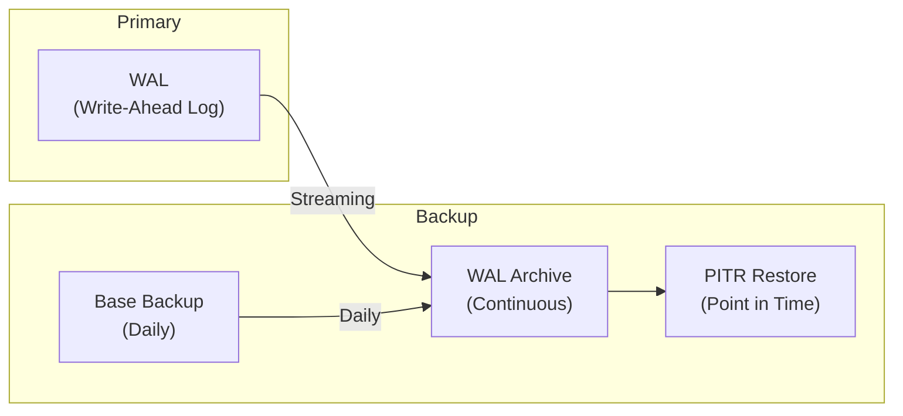
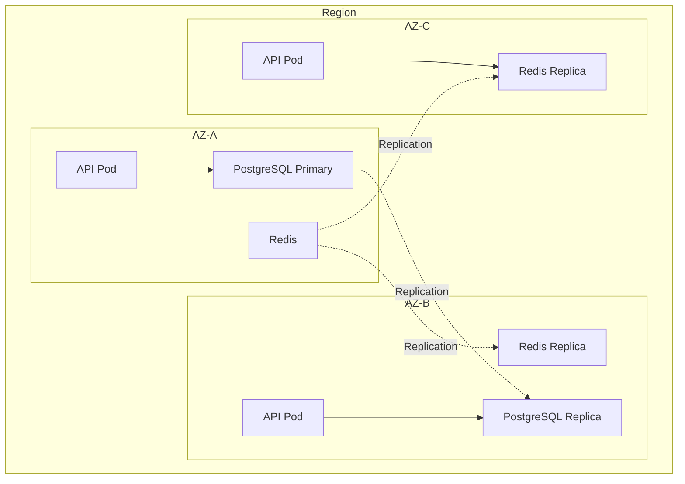

# Disaster Recovery

> RTO 1 hour, RPO 5 minutes. PostgreSQL PITR, Redis persistence, object store replication, multi-AZ deployment, and DR drills.

This document covers disaster recovery — how we protect against data loss and recover from failures. This level answers: **our recovery targets**, **how we back up data**, **how we test recovery**, and **what happens when things go wrong**.

---

## Recovery Targets

| Metric | Target | Rationale |
|---|---|---|
| RTO (Recovery Time Objective) | 1 hour | Club operations can't be down longer |
| RPO (Recovery Point Objective) | 5 minutes | Max acceptable data loss |
| Availability | 99.9% | ~8.7 hours downtime/year |

---

## Backup Strategy

### PostgreSQL



#### Backup Configuration

```yaml
postgresql:
  backup:
    enabled: true
    schedule: "0 2 * * *"  # Daily at 2 AM
    retention: 30 days

  # Point-in-time recovery
  pitr:
    enabled: true
    archive_timeout: 300  # 5 minutes
```

#### Backup Types

| Type | Frequency | Retention | Use Case |
|---|---|---|---|
| Full base backup | Daily | 30 days | Full restore |
| WAL archives | Continuous | 7 days | PITR |
| pg_dump | Weekly | 90 days | Logical backup |

### Redis

```yaml
redis:
  persistence:
    enabled: true
    size: 10Gi
    storageClass: fast-ssd

  # AOF (Append-Only File)
  aof:
    enabled: true
    fsync: everysec  # Compromise between performance and durability
```

#### Redis Persistence

| Mode | Durability | Performance |
|---|---|---|
| RDB (snapshots) | Good (periodic) | Best |
| AOF (append-only) | Best (everysec) | Good |
| Both | Best | Acceptable |

### Object Storage (S3)

```yaml
s3:
  versioning: true
  replication:
    enabled: true
    destination_bucket: backup-bucket
  lifecycle:
    transition_to_glacier: 30 days
    expiration: 365 days
```

---

## Multi-AZ Deployment

We deploy across multiple availability zones:



### AZ Recovery

| Failure | Behavior | Recovery |
|---|---|---|
| AZ-A fails | API fails in AZ-A | LB routes to B, C |
| PostgreSQL primary fails | Automatic failover to replica | < 60 seconds |
| Redis primary fails | Automatic failover | < 30 seconds |

---

## Recovery Procedures

### Database Recovery

```bash
#!/bin/bash
# Emergency database restore script

# Stop application
kubectl scale deployment backend --replicas=0

# Restore from base backup
pg_restore -h primary-db -U postgres -d splashh backup.dump

# Restore to specific point in time (PITR)
pg_restore -h primary-db -U postgres -d splashh \
  --target-time="2024-01-15 10:30:00 UTC" \
  backup.dump

# Verify data
psql -h primary-db -U postgres -d splashh -c "SELECT COUNT(*) FROM bookings;"

# Restart application
kubectl scale deployment backend --replicas=3
```

### Redis Recovery

```bash
#!/bin/bash
# Redis recovery

# Stop Redis
kubectl scale statefulset redis --replicas=0

# Wait for pods to stop
kubectl wait --for=delete pod/redis-0 --timeout=60s

# Restore from snapshot
kubectl exec -it redis-0 -- redis-cli DEBUG LOADFILE /data/dump.rdb

# Restart Redis
kubectl scale statefulset redis --replicas=3
```

---

## DR Testing

### Quarterly DR Drills

| Quarter | Scenario | Team | Outcome |
|---|---|---|---|
| Q1 | Database restore | Backend | RTO: 45 min |
| Q2 | Full region failover | DevOps | RTO: 30 min |
| Q3 | Data corruption recovery | Backend | RPO: 3 min |
| Q4 | Complete disaster simulation | All | RTO: 55 min |

### DR Test Checklist

- [ ] Verify backup files exist and are valid
- [ ] Test restore to isolated environment
- [ ] Verify application starts after restore
- [ ] Test critical user flows (booking, payment)
- [ ] Verify data integrity (row counts, checksums)
- [ ] Document any issues found
- [ ] Update runbook if needed

---

## Runbook: Database Failure

```markdown
# Database Failure Runbook

## Symptoms
- API returns 500 errors
- "Connection refused" errors in logs
- Database pods in CrashLoopBackOff

## Diagnosis
1. Check database pods: `kubectl get pods -l app=postgresql`
2. Check database logs: `kubectl logs postgresql-0`
3. Check connection pool: `kubectl exec -it postgresql-0 -- psql -c "SELECT * FROM pg_stat_activity;"`

## Recovery Steps

### Option 1: Restart Database (RTO ~10 min)
```bash
kubectl delete pod postgresql-0
kubectl rollout status statefulset/postgresql
```

### Option 2: Failover to Replica (RTO ~5 min)
```bash
# Promote replica
kubectl exec -it postgresql-1 -- pg_ctl promote -D /bitnami/postgresql/data

# Update connection strings
kubectl set env deployment/backend DATABASE_URL=postgresql-replica-url
```

### Option 3: Full Restore (RTO ~60 min)
```bash
# See recovery procedures above
```

## Post-Recovery
- [ ] Verify all data present
- [ ] Check for data corruption
- [ ] Monitor error rates
- [ ] Update status page
- [ ] Document incident
```

---

## Runbook: Full Region Failure

```markdown
# Full Region Failure Runbook

## Symptoms
- Entire region unreachable
- All API endpoints timeout
- Health checks fail

## Recovery Steps

### 1. Confirm Failure
- [ ] Check CloudWatch/Stackdriver for region status
- [ ] Verify internal communication is down
- [ ] Confirm this is not a DNS issue

### 2. Activate Standby Region
```bash
# Update DNS to point to standby region
aws route53 change-resource-record-sets \
  --hosted-zone-id ZONE_ID \
  --change-batch file://dns-failover.json

# Scale up standby API
kubectl scale deployment backend --replicas=10 -n standby
```

### 3. Verify Standby
- [ ] Check health endpoints
- [ ] Test booking flow
- [ ] Verify database connections

### 4. Communicate
- [ ] Update status page
- [ ] Notify stakeholders
- [ ] Send customer notification

## Recovery Time
- DNS propagation: 5-30 minutes
- Instance startup: 5-10 minutes
- **Estimated RTO: 30-60 minutes**
```

---

## Monitoring and Alerts

### Backup Alerts

| Alert | Condition | Severity |
|---|---|---|
| Backup failed | Last backup > 25 hours | Critical |
| Backup too large | Size increased > 50% | Warning |
| WAL lagging | Replication lag > 5 min | Warning |

### Recovery Alerts

| Alert | Condition | Severity |
|---|---|---|
| Database down | Primary unreachable | Critical |
| Replica lag | Lag > 1 minute | Warning |
| AZ capacity | < 2 AZs available | Critical |

---

## Why This Design

### RTO 1 Hour

We chose 1 hour because:

- Club operations depend on the system
- Longer downtime = direct revenue loss
- Achievable with our architecture

> **Trade-off:** Shorter RTO requires more redundancy (cost). 1 hour is the sweet spot for our business requirements.

### RPO 5 Minutes

We chose 5 minutes because:

- Booking data is critical
- Payment data cannot be lost
- WAL archiving every 5 minutes is achievable

> **Trade-off:** Shorter RPO requires more frequent backups (cost). 5 minutes is achievable with continuous WAL archiving.

---

## What's Next

- [Scaling Strategy](./scaling-strategy.md) — capacity planning.
- [Monitoring](../12-devops/monitoring.md) — observability.
- [Incident Response](../09-security/incident-response.md) — handling incidents.
