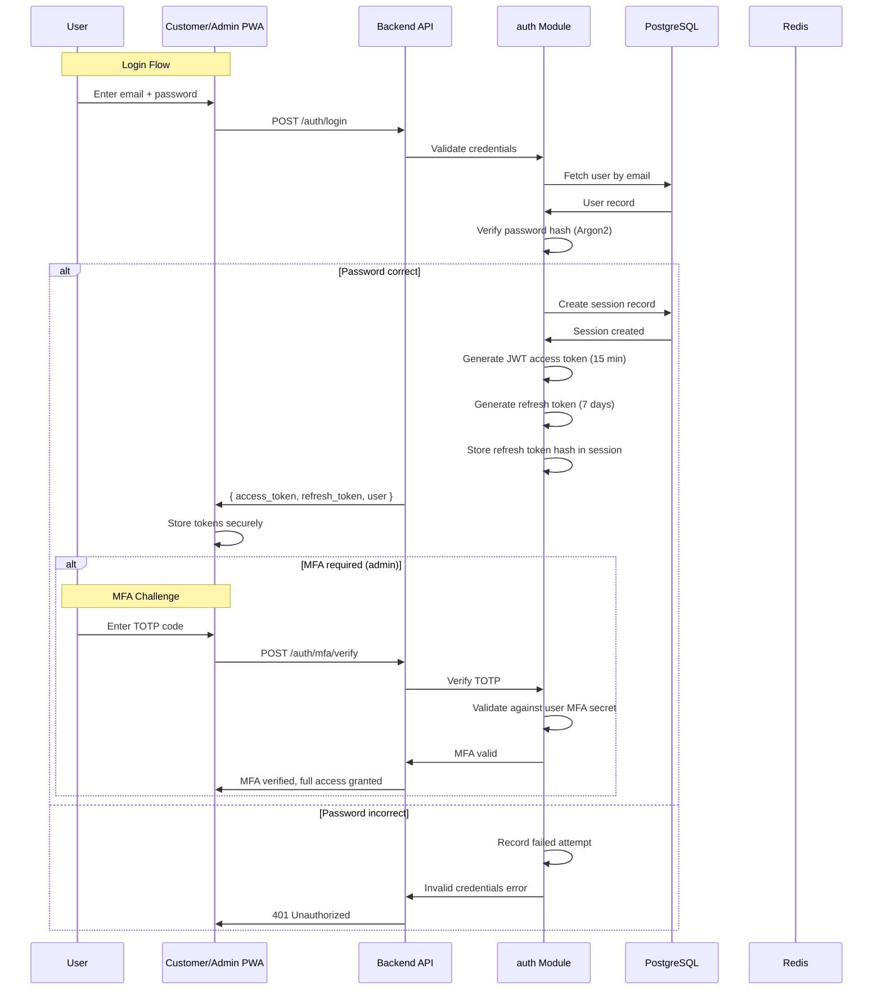
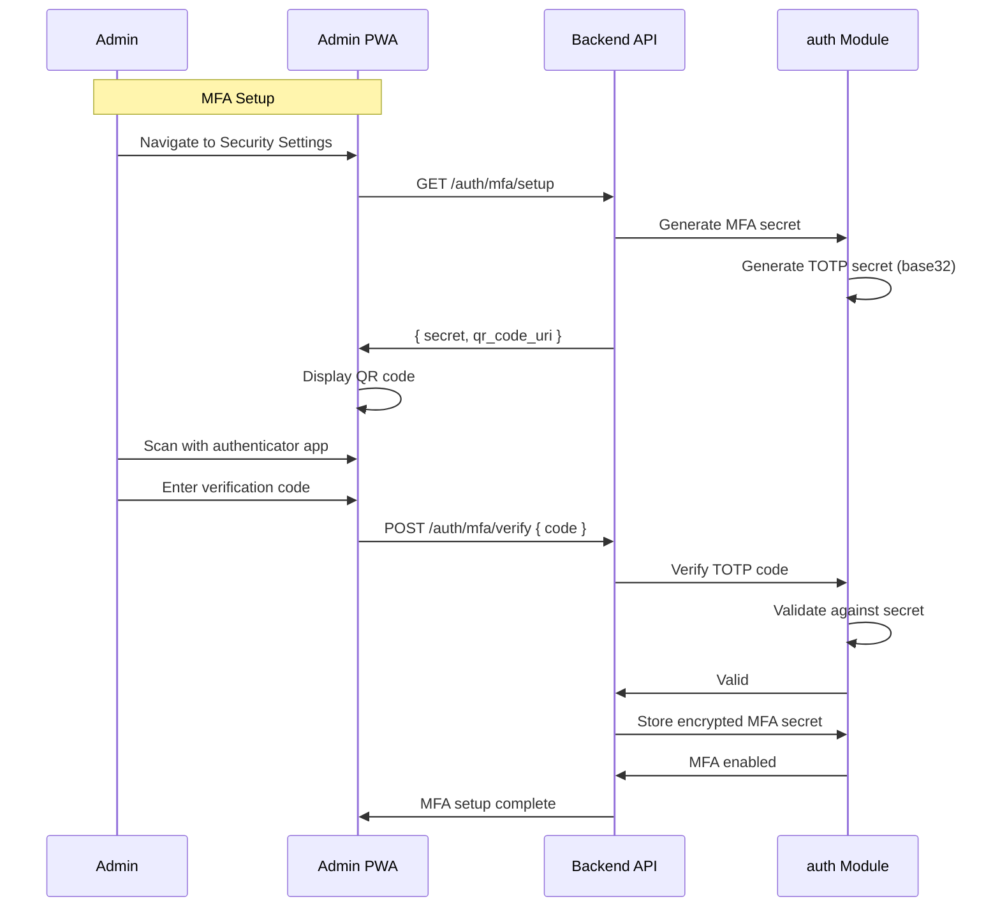
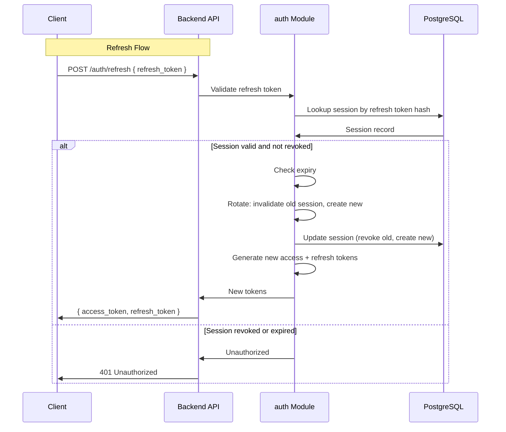
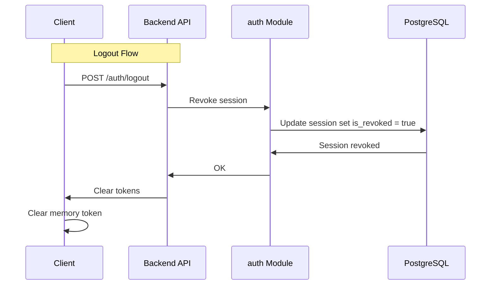

# Authentication Flow

> Detailed authentication and authorization flow: login, MFA, JWT issuance, refresh token rotation, session management, and logout.

This document covers the complete authentication lifecycle, from user credentials to session termination. Authentication is the foundation of security — understanding this flow is essential for security reviews and incident response. This level answers: **how users authenticate**, **how tokens work**, and **how we prevent token theft**.

---

## Authentication Overview

The platform uses a **JWT-based authentication** with refresh token rotation. This provides stateless authentication (JWT) while allowing token revocation (refresh tokens stored in database).



---

## Login Flow

### Step 1: Credential Validation

The user enters email and password. The client sends these to the authentication endpoint.

```python
@router.post("/auth/login")
async def login(
    body: LoginRequest,
    auth_service: AuthService = Depends(get_auth_service),
) -> LoginResponse:
    # Rate limit by IP to prevent brute force
    await check_rate_limit(f"login:{request.client.host}", limit=5, window=300)

    result = await auth_service.login(
        email=body.email,
        password=body.password,
        ip_address=request.client.host,
        user_agent=request.headers.get("user-agent"),
    )

    if result.is_err():
        error = result.err()
        if error.is_authentication_error():
            await auth_service.record_failed_login(body.email, ip)
            raise AuthenticationError(error.message)
        raise error

    return result.value()
```

### Step 2: Password Verification

Passwords are hashed using **Argon2id** — the winner of the Password Hashing Competition, resistant to both GPU and ASIC attacks.

```python
def verify_password(plain: str, hashed: str) -> bool:
    try:
        return argon2.verify(hashed, plain)
    except Exception:
        # Log but don't reveal internals
        return False
```

> **Why Argon2?** bcrypt and scrypt were previous standards, but Argon2 won the Password Hashing Competition and is recommended by OWASP. Argon2id provides the best balance of security and usability.

### Step 3: Session Creation

On successful login, a session record is created in the database:

```sql
CREATE TABLE sessions (
    id UUID PRIMARY KEY DEFAULT gen_random_uuid(),
    user_id UUID NOT NULL REFERENCES users(id),
    tenant_id UUID NOT NULL,
    refresh_token_hash TEXT NOT NULL,
    device_info JSONB,
    ip_address INET,
    user_agent TEXT,
    created_at TIMESTAMP WITH TIME ZONE DEFAULT NOW(),
    expires_at TIMESTAMP WITH TIME ZONE NOT NULL,
    last_used_at TIMESTAMP WITH TIME ZONE,
    is_revoked BOOLEAN DEFAULT FALSE
);
```

The refresh token is a cryptographically random string, hashed before storage:

```python
def create_session(user: User, device_info: dict, ip: str) -> Session:
    refresh_token = secrets.token_urlsafe(32)
    refresh_token_hash = hashlib.sha256(refresh_token.encode()).hexdigest()

    session = Session(
        user_id=user.id,
        tenant_id=user.tenant_id,
        refresh_token_hash=refresh_token_hash,
        device_info=device_info,
        ip_address=ip,
        expires_at=datetime.utcnow() + timedelta(days=7),
    )
    return session, refresh_token  # Return token to client, hash to DB
```

---

## Token Issuance

### Access Token (JWT)

The access token is a short-lived JWT that carries identity information. It is never stored in the database — validation is stateless.

```python
def create_access_token(user: User, session_id: UUID) -> str:
    now = datetime.utcnow()
    payload = {
        "sub": str(user.id),
        "tenant_id": str(user.tenant_id),
        "session_id": str(session_id),
        "role": user.role,
        "iat": now,
        "exp": now + timedelta(minutes=15),  # 15 minutes
        "jti": str(uuid4()),  # Unique token ID for revocation
    }
    return jwt.encode(payload, settings.jwt_secret, algorithm="HS256")
```

**Token claims:**

| Claim | Description | Why |
|---|---|---|
| sub | User ID | Identity |
| tenant_id | Tenant ID | Multi-tenant isolation |
| session_id | Session ID | Links to revokable session |
| role | User role | Authorization |
| iat | Issued at | Validation |
| exp | Expiry | Security (short lifetime) |
| jti | JWT ID | Revocation lookup |

### Refresh Token

The refresh token is a long-lived random string used to obtain new access tokens. It is stored (hashed) in the session table.

```python
# Refresh token is ONLY sent to client on login and refresh
# It is never stored in JWT or anywhere else
refresh_token = secrets.token_urlsafe(32)  # 43 characters
```

---

## MFA Flow (Admin Users)

Admins must enable MFA. We support TOTP (Google Authenticator, Authy) as the primary method.



### MFA Verification

On subsequent logins, after password validation, the user is prompted for MFA:

```python
async def login_with_mfa(
    email: str,
    password: str,
    mfa_code: str,
    session_data: dict,
) -> LoginResult:
    # Step 1: Validate password
    user = await validate_password(email, password)

    # Step 2: Verify MFA
    if user.mfa_enabled:
        mfa_valid = await verify_totp(user.mfa_secret, mfa_code)
        if not mfa_valid:
            raise MFAError("Invalid MFA code")

    # Step 3: Create session
    return await create_session(user, session_data)
```

---

## Token Refresh Flow

Access tokens expire after 15 minutes. The client uses the refresh token to obtain a new pair.



### Refresh Token Rotation

Every refresh creates a new session and invalidates the old one. This prevents token theft — if a stolen refresh token is used, the legitimate token becomes invalid.

```python
async def refresh_access_token(
    refresh_token: str,
) -> LoginResponse:
    # Hash the incoming token
    token_hash = hashlib.sha256(refresh_token.encode()).hexdigest()

    # Lookup session
    session = await session_repo.find_by_refresh_hash(token_hash)

    # Validate
    if not session or session.is_revoked or session.expires_at < now():
        raise UnauthorizedError("Invalid refresh token")

    # Rotate: revoke old, create new
    await session_repo.revoke(session.id)

    new_session = await session_repo.create(
        user_id=session.user_id,
        tenant_id=session.tenant_id,
        device_info=session.device_info,
        ip_address=session.ip_address,
    )

    # Issue new tokens
    user = await user_repo.get(session.user_id)
    return LoginResponse(
        access_token=create_access_token(user, new_session.id),
        refresh_token=create_refresh_token(),  # New token
        user=UserResponse.from_entity(user),
    )
```

> **Why rotation?** Without rotation, a stolen refresh token is valid until expiry (7 days). With rotation, stolen tokens are invalidated immediately upon use of the legitimate token. This limits the window of opportunity for attackers.

---

## Token Storage (Client-Side)

### Access Token

Stored in **memory only** (JavaScript variable). Never stored in localStorage, sessionStorage, or cookies.

```javascript
// CORRECT: Store in memory
const [accessToken, setAccessToken] = useState(null);

// INCORRECT: Never do this
localStorage.setItem('access_token', token);  // XSS-vulnerable
sessionStorage.setItem('access_token', token); // XSS-vulnerable
document.cookie = `token=${token}`;           // CSRF-vulnerable
```

> **Why memory?** localStorage is vulnerable to XSS attacks. An attacker who executes JavaScript can read any localStorage item. Memory storage requires the attacker to have code execution at the exact moment the token is in memory.

### Refresh Token

Stored in **HttpOnly, Secure, SameSite=Strict cookie**.

```python
@router.post("/auth/refresh")
async def refresh(
    refresh_token: str = Body(..., embed=True),
    response: Response,
) -> LoginResponse:
    result = await auth_service.refresh(refresh_token)

    # Set refresh token in HttpOnly cookie
    response.set_cookie(
        key="refresh_token",
        value=result.refresh_token,
        httponly=True,
        secure=True,
        samesite="strict",
        max_age=7 * 24 * 60 * 60,  # 7 days
    )

    return {
        "access_token": result.access_token,
        "user": result.user,
    }
```

> **Why HttpOnly cookie?** Prevents JavaScript from reading the refresh token, eliminating XSS-based token theft. The SameSite=Strict attribute prevents CSRF attacks.

---

## Logout Flow

Logout revokes the session and clears tokens.



```python
@router.post("/auth/logout")
async def logout(
    current_user: User = Depends(get_current_user),
    auth_service: AuthService = Depends(get_auth_service),
) -> None:
    await auth_service.revoke_session(current_user.session_id)
    # Client clears access token from memory
```

---

## Session Management

### Session Lifecycle

| Event | Access Token | Refresh Token | Session |
|---|---|---|---|
| Login | Issued | Issued | Created |
| In use (every 15 min) | Refreshed | Rotated | Updated |
| Logout | Invalidated | Cleared | Revoked |
| Token theft detected | Invalidated | Revoked | Revoked |
| Inactivity (7 days) | Expired | Expired | Expired |

### Session Limits

| Limit | Value | Rationale |
|---|---|---|
| Max sessions per user | 5 | Prevent account sharing |
| Session lifetime | 7 days | Balance convenience/security |
| Failed login attempts | 5 per 15 min | Brute force prevention |
| Concurrent sessions | 1 (configurable) | Prevent sharing |

---

## Token Reuse Detection

If a refresh token is reused after rotation (potential theft), we revoke the entire session chain:

```python
async def refresh_access_token(refresh_token: str) -> LoginResponse:
    token_hash = hashlib.sha256(refresh_token.encode()).hexdigest()
    session = await session_repo.find_by_refresh_hash(token_hash)

    if not session:
        raise UnauthorizedError("Invalid refresh token")

    # Check for token reuse (race condition or theft)
    if session.last_used_token_hash is not None:
        # Previous token was used after this one — possible theft
        # Revoke entire session chain
        await session_repo.revoke_all_for_user(session.user_id)
        await audit_log.warning(
            "Token reuse detected",
            user_id=session.user_id,
            session_id=session.id,
        )
        raise UnauthorizedError("Session revoked for security")

    # Normal refresh
    await session_repo.update_last_used(session.id, token_hash)
    # ... issue new tokens
```

> **Why detect reuse?** If an attacker steals a refresh token and uses it, the legitimate user's subsequent refresh will fail (token already used). This triggers the reuse detection, revoking both tokens and forcing re-login. It limits the damage from stolen tokens.

---

## What's Next

- [Authorization & RBAC](../09-security/authorization-rbac.md) — role-based access control.
- [Tenant Isolation](../09-security/tenant-isolation.md) — multi-tenant data isolation.
- [JWT Best Practices](../09-security/jwt-best-practices.md) — token security details.
