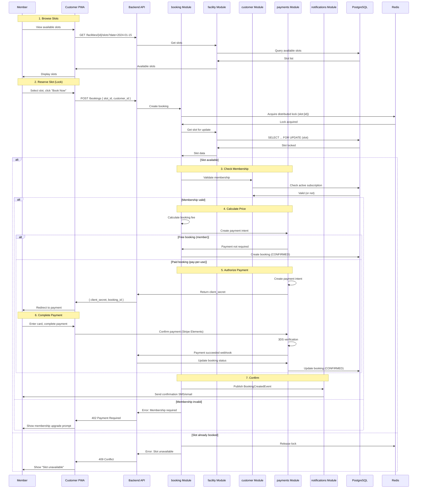
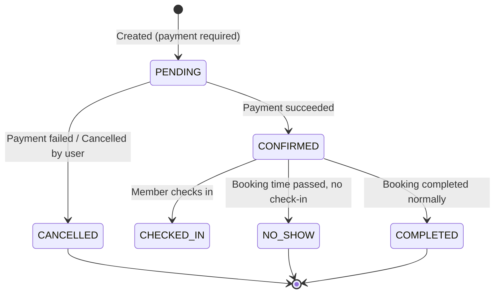
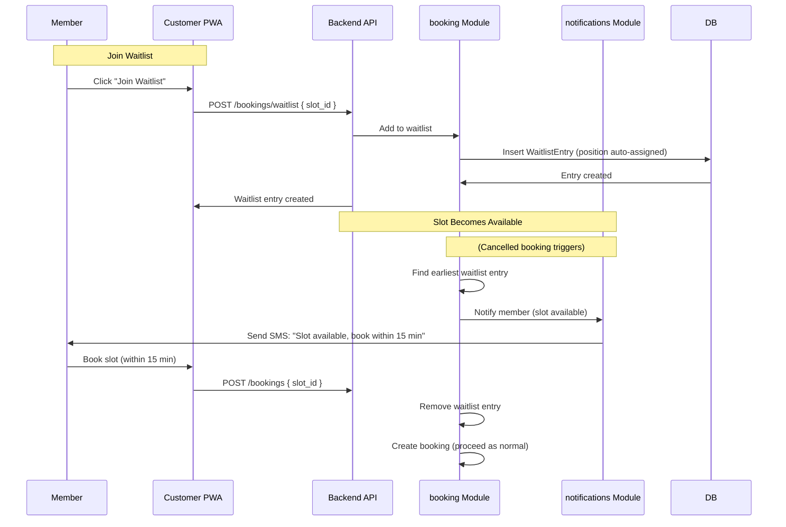

# Booking Flow

> The most critical flow in the system: slot reservation, double-booking prevention, pricing, payment, confirmation, and notifications.

This document covers the complete booking lifecycle, the system's most complex and critical operation. Booking involves multiple modules, distributed locking, and strong consistency requirements. This level answers: **how bookings are created**, **how we prevent double-booking**, and **what invariants must hold**.

---

## Booking Flow Overview



---

## Double-Booking Prevention

The most critical invariant: **a slot can be booked by at most one customer at any time**. We enforce this with **pessimistic locking** at the database level.

### The Invariant

> **Rule** — A slot can only transition from `available` to `booked` if it is currently `available`. This must be enforced atomically.

### Implementation: Pessimistic Lock

```python
class SlotRepository:
    def get_for_update(self, slot_id: UUID, tenant_id: UUID) -> Slot | None:
        """Get slot with exclusive lock for update."""
        query = (
            select(Slot)
            .where(Slot.id == slot_id)
            .where(Slot.tenant_id == tenant_id)
            .with_for_update()  # Pessimistic lock
            .skip_locked()      # Skip if already locked
        )
        return self.session.execute(query).scalar_one_or_none()

    def mark_booked(self, slot_id: UUID, tenant_id: UUID) -> bool:
        """Atomically mark slot as booked. Returns True if successful."""
        result = self.session.execute(
            update(Slot)
            .where(Slot.id == slot_id)
            .where(Slot.tenant_id == tenant_id)
            .where(Slot.status == SlotStatus.AVAILABLE)  # Atomic check
            .values(status=SlotStatus.BOOKED)
        )
        return result.rowcount > 0
```

### Implementation: Distributed Lock

For additional safety (preventing concurrent requests at the application layer), we use Redis-based locking:

```python
class BookingService:
    async def create_booking(
        self,
        tenant_id: UUID,
        customer_id: UUID,
        slot_id: UUID,
    ) -> Booking:
        # Acquire distributed lock
        lock_key = f"lock:slot:{slot_id}"
        async with self.redis_lock(lock_key, timeout=10):
            # Get slot with pessimistic lock
            slot = self.slot_repo.get_for_update(slot_id, tenant_id)

            if not slot or slot.status != SlotStatus.AVAILABLE:
                raise SlotNotAvailableError(slot_id)

            # Create booking
            booking = Booking(
                tenant_id=tenant_id,
                customer_id=customer_id,
                slot_id=slot_id,
                status=BookingStatus.PENDING,
            )
            self.booking_repo.save(booking)

            # Mark slot as booked (atomic)
            self.slot_repo.mark_booked(slot_id, tenant_id)

        # Publish event (outside lock)
        await self.event_bus.publish(BookingCreatedEvent(
            booking_id=booking.id,
            customer_id=customer_id,
            slot_id=slot_id,
        ))

        return booking
```

> **Why both locks?** Database locks (SELECT FOR UPDATE) ensure consistency within the database. Redis locks prevent concurrent application instances from attempting the same booking, reducing wasted database round-trips. The database is the source of truth; Redis is an optimization.

---

## State Machine



### States

| State | Description | Next States |
|---|---|---|
| PENDING | Created, awaiting payment | CONFIRMED, CANCELLED |
| CONFIRMED | Payment received, slot reserved | CHECKED_IN, NO_SHOW, CANCELLED |
| CHECKED_IN | Member has arrived | COMPLETED |
| NO_SHOW | Booking time passed without check-in | (terminal) |
| COMPLETED | Booking finished successfully | (terminal) |
| CANCELLED | Cancelled (by user, system, or payment failure) | (terminal) |

### Transitions

```python
class Booking:
    def confirm(self) -> None:
        """Transition from PENDING to CONFIRMED."""
        if self.status != BookingStatus.PENDING:
            raise InvalidTransitionError(f"Cannot confirm {self.status}")
        self.status = BookingStatus.CONFIRMED
        self.confirmed_at = datetime.utcnow()

    def cancel(self, reason: str) -> None:
        """Transition to CANCELLED."""
        if self.status not in (BookingStatus.PENDING, BookingStatus.CONFIRMED):
            raise InvalidTransitionError(f"Cannot cancel {self.status}")
        self.status = BookingStatus.CANCELLED
        self.cancelled_at = datetime.utcnow()
        self.cancellation_reason = reason
        # Slot is automatically freed by database trigger

    def check_in(self) -> None:
        """Transition from CONFIRMED to CHECKED_IN."""
        if self.status != BookingStatus.CONFIRMED:
            raise InvalidTransitionError(f"Cannot check in {self.status}")
        if self.slot.start_time > datetime.utcnow():
            raise ValidationError("Cannot check in before booking time")
        self.status = BookingStatus.CHECKED_IN
        self.checked_in_at = datetime.utcnow()
```

---

## Pricing Calculation

Booking price depends on multiple factors:

| Factor | Description |
|---|---|
| Slot type | Premium slots (peak hours) cost more |
| Membership | Members get discounts or free bookings |
| Day of week | Weekend pricing may differ |
| Duration | Longer slots cost more |
| Facility | Different facilities have different base rates |

```python
class PricingService:
    def calculate_booking_price(
        self,
        slot: Slot,
        customer: Customer,
        tenant_id: UUID,
    ) -> Money:
        # Get base price from slot
        base_price = slot.price

        # Apply membership discount
        if customer.has_active_subscription:
            discount = self._get_membership_discount(
                customer.subscription.plan_id,
                slot.resource.facility_id,
            )
            base_price = base_price * (1 - discount.percentage)

        # Apply day-of-week modifier
        day_modifier = self._get_day_modifier(slot.start_time)
        base_price = base_price * day_modifier

        # Round to two decimal places
        return Money(
            amount=round(base_price, 2),
            currency=tenant.default_currency,
        )
```

---

## Waitlist Flow

When a slot is unavailable, customers can join a waitlist. When a booking is cancelled, the system notifies the first waitlist entry.



---

## Check-In

Members check in at the facility using QR code, OTP, or NFC (future).

```python
@router.post("/bookings/{booking_id}/check-in")
async def check_in(
    booking_id: UUID,
    current_user: User = Depends(get_current_user),
    booking_service: BookingService = Depends(get_booking_service),
) -> CheckInResponse:
    booking = await booking_service.check_in(
        booking_id=booking_id,
        tenant_id=current_user.tenant_id,
        customer_id=current_user.id,
    )
    return CheckInResponse(
        booking_id=booking.id,
        status=booking.status,
        checked_in_at=booking.checked_in_at,
    )
```

Check-in rules:

- Can check in 15 minutes before booking start time
- Can check in up to 30 minutes after start time (no-show threshold)
- Must be at the facility location (future: geofencing)

---

## Cancellation

### User Cancellation

Users can cancel bookings. Cancellation rules depend on timing:

| Time before slot | Refund |
|---|---|
| > 24 hours | Full refund |
| 12-24 hours | 50% refund |
| < 12 hours | No refund |

```python
class CancellationService:
    def calculate_refund(self, booking: Booking) -> Money | None:
        hours_until_slot = (booking.slot.start_time - datetime.utcnow()).hours

        if hours_until_slot > 24:
            return booking.paid_amount  # Full refund
        elif hours_until_slot >= 12:
            return booking.paid_amount * Decimal('0.5')  # 50%
        else:
            return None  # No refund

    def cancel(self, booking: Booking, reason: str) -> None:
        booking.cancel(reason)

        # Release slot
        self.slot_repo.mark_available(booking.slot_id)

        # Process refund if applicable
        refund = self.calculate_refund(booking)
        if refund:
            self.payment_service.initiate_refund(booking.payment_id, refund)

        # Notify waitlist
        self.waitlist_service.notify_next(booking.slot_id)
```

### System Cancellation

The system cancels bookings in these cases:

| Scenario | Trigger | Action |
|---|---|---|
| Payment failed | Webhook indicates failure | Cancel booking, release slot |
| Slot deleted | Admin deletes slot | Cancel booking, full refund |
| Facility closed | Blackout date added | Cancel bookings, full refund |

---

## Why This Design

### Pessimistic Locking vs Optimistic Locking

We chose pessimistic locking (SELECT FOR UPDATE) over optimistic locking (version columns) because:

| Aspect | Pessimistic | Optimistic |
|---|---|---|
| Latency | Higher (lock acquisition) | Lower (no lock) |
| Conflict handling | Serialized | Retry required |
| Reliability | Guaranteed | Race condition possible |
| Suitability | Contended resources | Low-contention resources |

> **Why pessimistic?** Slots are a **high-contention** resource — during peak booking times, many users attempt the same slots simultaneously. Optimistic locking would cause many retries and user-visible failures. Pessimistic locking serializes requests and guarantees the first request wins.

### Redis + Database Locking

Using both Redis and database locks may seem redundant, but each serves a purpose:

| Lock | Purpose | Failure Mode |
|---|---|---|
| Redis lock | Application-level serialization | Fast failure if locked |
| Database lock | Source-of-truth serialization | Ensures consistency |

> **Trade-off:** We accept the added complexity for the guarantee that no double-booking can occur. The cost of a double-booking (refunds, customer complaints, reputation damage) far exceeds the cost of the locking infrastructure.

---

## What's Next

- [Payment Flow](./flow-payment.md) — payment processing details.
- [Membership Flow](./flow-membership.md) — subscription lifecycle.
- [Notification Flow](./flow-notification.md) — message delivery.
