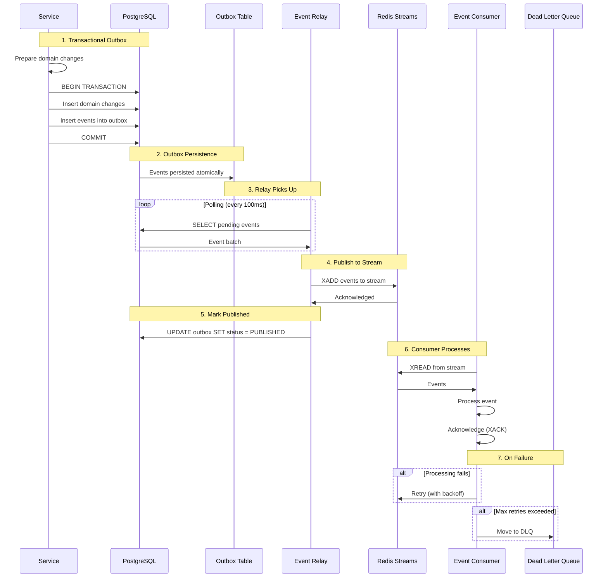
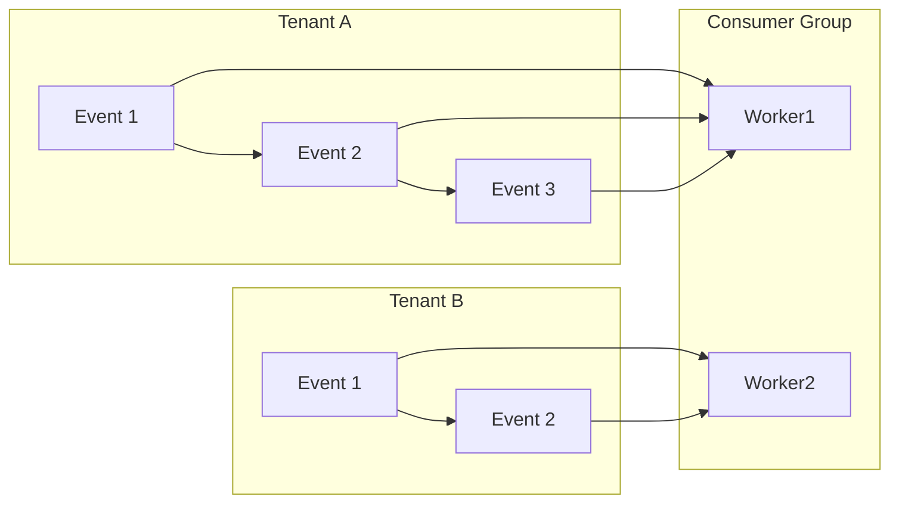

# Event Flow

> Internal event bus: producer → outbox table → relay → Redis Streams → consumer → DLQ. Why outbox pattern, at-least-once semantics, and idempotency.

This document covers the internal event architecture — how domain events are published, transported, and consumed reliably. Events are the backbone of our loose coupling between modules. This level answers: **how events flow**, **why the outbox pattern**, and **how we handle failures**.

---

## Event Architecture Overview



---

## Why Outbox Pattern

The outbox pattern solves a fundamental problem: **how to reliably publish events when the primary operation succeeds**.

### The Problem

Naive event publishing fails when:

1. Service publishes event to message broker
2. Database commit succeeds
3. Message broker fails
4. Event never reaches consumers
5. System is now inconsistent (operation succeeded, but no event)

### The Solution: Transactional Outbox

The outbox pattern combines the domain operation and event publication in a single transaction:

```sql
BEGIN TRANSACTION;

-- 1. Domain operation
INSERT INTO bookings (id, customer_id, slot_id, tenant_id, status)
VALUES ('abc', 'cust1', 'slot1', 'tenant1', 'CONFIRMED');

-- 2. Event outbox (same transaction)
INSERT INTO outbox_events (id, type, payload, tenant_id, status, created_at)
VALUES (
    'evt-1',
    'BOOKING_CREATED',
    '{"booking_id": "abc", ...}',
    'tenant1',
    'PENDING',
    NOW()
);

COMMIT;
```

> **Why this works:** The domain operation and event are in the same database transaction. If the transaction commits, both happen. If the transaction rolls back, neither happens. There's no way for one to succeed without the other.

---

## Event Structure

```python
class DomainEvent(BaseModel):
    """Base event structure."""
    id: UUID
    type: EventType
    tenant_id: UUID
    payload: dict
    metadata: EventMetadata
    created_at: datetime

class EventMetadata(BaseModel):
    """Event metadata."""
    correlation_id: UUID | None  # Links to parent event/request
    causation_id: UUID | None   # What caused this event
    user_id: UUID | None         # Who triggered this
    source_service: str          # Which service created this
```

### Event Types

| Category | Events |
|---|---|
| Booking | BookingCreated, BookingConfirmed, BookingCancelled, BookingCheckedIn |
| Payment | PaymentSucceeded, PaymentFailed, RefundCreated |
| Membership | SubscriptionActivated, SubscriptionExpired, SubscriptionFrozen |
| Customer | CustomerCreated, WaiverSigned |
| Facility | SlotCreated, SlotDeleted |

---

## Event Relay

The relay reads from the outbox and publishes to Redis Streams:

```python
class EventRelay:
    async def relay_pending_events(self) -> int:
        """Read pending events from outbox and publish to Redis."""
        events = await self.outbox_repo.get_pending(limit=100)

        for event in events:
            try:
                # Publish to Redis Stream
                await self.redis.xadd(
                    f"events:{event.tenant_id}",
                    {
                        "id": str(event.id),
                        "type": event.type.value,
                        "payload": event.payload,
                    },
                )

                # Mark as published
                await self.outbox_repo.mark_published(event.id)

            except Exception as e:
                self.logger.error(f"Failed to relay event {event.id}: {e}")
                await self.outbox_repo.mark_failed(event.id, str(e))

        return len(events)
```

---

## Redis Streams

We use Redis Streams for event transport. Streams provide:

- Persistent storage (vs. pub/sub which is fire-and-forget)
- Consumer groups (multiple consumers can share work)
- Acknowledgment semantics (exactly-once processing)
- Message IDs (ordered processing)

```python
# Create consumer group
await redis.xgroup_create(
    "events:tenant-123",
    "notifications",
    id="0",  # Start from beginning
    mkstream=True,
)

# Consumer reads from stream
messages = await redis.xreadgroup(
    group="notifications",
    consumer="worker-1",
    streams={"events:tenant-123": ">"},
    count=10,
    block=5000,  # 5 second blocking read
)
```

---

## Event Consumer

Consumers read from streams and process events:

```python
class EventConsumer:
    async def consume(self, stream: str, handler: Callable) -> None:
        while True:
            messages = await self.redis.xreadgroup(
                group=self.group,
                consumer=self.consumer_id,
                streams={stream: ">"},
            )

            for stream_name, entries in messages:
                for msg_id, payload in entries:
                    try:
                        await handler(payload)
                        await self.redis.xack(stream_name, self.group, msg_id)
                    except Exception as e:
                        await self.handle_failure(msg_id, payload, e)
```

### Handler Example

```python
@event_handler(EventType.BOOKING_CREATED)
async def handle_booking_created(event: BookingCreatedEvent) -> None:
    # Load template
    template = await template_service.get("BOOKING_CONFIRMED", event.tenant_id)

    # Get customer
    customer = await customer_service.get(event.customer_id, event.tenant_id)

    # Send notification
    await notification_service.send(
        customer=customer,
        template=template,
        variables={"booking_id": str(event.booking_id)},
    )
```

---

## At-Least-Once Semantics

We guarantee **at-least-once** delivery. Events may be delivered more than once (never zero times). Consumers must handle duplicates.

### Why At-Least-Once?

Exactly-once is extremely expensive (requires two-phase commit between broker and consumer). At-least-once is achievable and sufficient when combined with idempotency.

### Idempotency Keys

Every event includes an idempotency key. Consumers track processed events:

```python
class EventConsumer:
    async def handle_event(self, event: DomainEvent) -> None:
        # Check if already processed
        processed = await self.idempotency_repo.exists(event.id)
        if processed:
            self.logger.info(f"Skipping duplicate event {event.id}")
            return

        # Process event
        await self.process(event)

        # Mark as processed
        await self.idempotency_repo.save(event.id, ttl=24 * 3600)  # 24 hours
```

### Idempotency Table

```sql
CREATE TABLE event_idempotency (
    event_id UUID PRIMARY KEY,
    processed_at TIMESTAMP WITH TIME ZONE DEFAULT NOW(),
    expires_at TIMESTAMP WITH TIME ZONE NOT NULL
);

-- Index for TTL cleanup
CREATE INDEX idx_event_idempotency_expires ON event_idempotency(expires_at);
```

---

## Dead Letter Queue (DLQ)

Events that fail after max retries go to the DLQ:

```python
async def handle_failure(self, msg_id: str, event: DomainEvent, error: Exception) -> None:
    # Check retry count
    retry_count = await self.retry_tracker.increment(event.id)

    if retry_count >= MAX_RETRIES:
        # Move to DLQ
        await self.dlq.add(event, error)
        await self.redis.xack(self.stream, self.group, msg_id)

        # Alert
        await self.alert_service.alert(
            f"Event {event.id} moved to DLQ after {MAX_RETRIES} retries: {error}",
            severity=AlertSeverity.HIGH,
        )
    else:
        # Retry with backoff
        delay = 2 ** retry_count  # 2, 4, 8, 16, 32 seconds
        await asyncio.sleep(delay)
        # Re-raise to trigger retry
        raise error
```

### DLQ Monitoring

DLQ events require manual intervention:

```python
@router.get("/admin/dlq/events")
async def list_dlq_events(
    current_user: User = Depends(require_admin),
    limit: int = 50,
) -> list[DLQEvent]:
    events = await dlq_service.list(limit=limit)
    return events
```

---

## Event Ordering

Events for the same tenant are processed in order. Events across tenants are processed in parallel.



---

## Why This Design

### Outbox Pattern

| Aspect | Why |
|---|---|
| Transactional | Ensures event and domain operation are atomic |
| Database-backed | Uses existing database, no new infrastructure |
| Polled | Simple, reliable, no special privileges needed |

### Redis Streams

| Aspect | Why |
|---|---|
| Persistent | Messages survive consumer restarts |
| Consumer groups | Multiple workers can share load |
| Acknowledgment | Exactly-once semantics achievable |
| Low latency | Sub-millisecond latency |

### At-Least-Once

| Aspect | Why |
|---|---|
| Simpler | No two-phase commit required |
| Reliable | Handles network failures gracefully |
| Idempotent | Consumers handle duplicates correctly |

---

## What's Next

- [Event Catalog](../07-events/event-catalog.md) — all events documented.
- [Data Flow](./data-flow.md) — data ownership and movement.
- [Caching Strategy](./caching-strategy.md) — caching layers.
