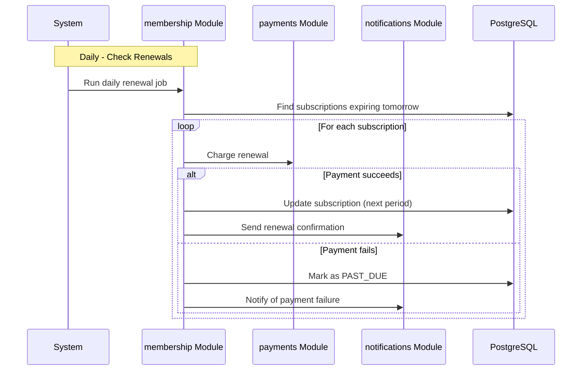
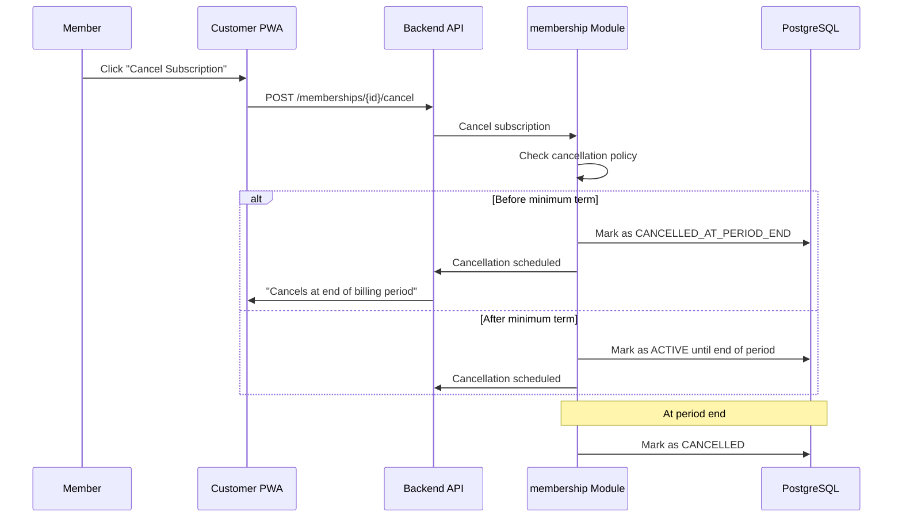
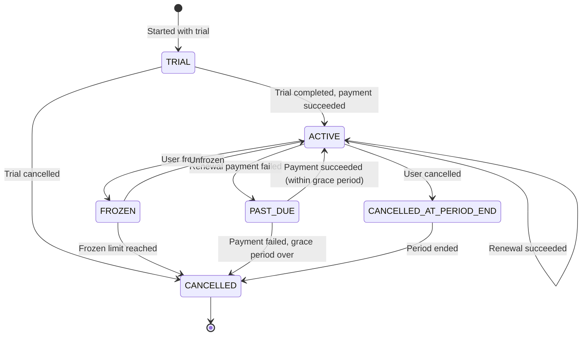

# Membership Flow

> Plan purchase, prorated activation, renewal, freeze, cancellation, and downgrade.

This document covers the complete membership lifecycle, from initial purchase through renewal and cancellation. Memberships are the primary revenue model — the flow must be reliable, transparent, and financially accurate. This level answers: **how subscriptions work**, **how we handle proration**, and **what happens at each state transition**.

---

## Membership Flow Overview

```mermaid
sequenceDiagram
    participant Member
    participant PWA as Customer PWA
    member API as Backend API
    participant Membership as membership Module
    participant Customer as customer Module
    participant Payments as payments Module
    participant Notifications as notifications Module
    participant DB as PostgreSQL

    Note over Member,PWA: 1. Browse Plans
    Member->>PWA: View membership plans
    PWA->>API: GET /memberships/plans
    API->>Membership: Get active plans
    Membership->>DB: Query plans
    DB->>Membership: Plan list
    Membership->>PWA: Plans with pricing
    PWA->>Member: Display plans

    Note over Member,PWA: 2. Select Plan
    Member->>PWA: Select "Gold Annual"
    PWA->>API: GET /memberships/plans/{id}/preview { start_date }
    API->>Membership: Calculate proration
    Membership->>Membership: Calculate prorated amount
    Membership->>PWA: Prorated price

    Note over Member,PWA: 3. Purchase
    Member->>PWA: Click "Subscribe"
    PWA->>API: POST /memberships/subscribe { plan_id, payment_method_id }
    API->>Membership: Create subscription
    Membership->>Customer: Validate customer
    Membership->>Payments: Create payment intent
    Payments->>PWA: Payment form
    Member->>PWA: Complete payment
    Payments->>Membership: Payment succeeded
    Membership->>DB: Create subscription (ACTIVE)
    Membership->>Notifications: Publish SubscriptionActivatedEvent

    Note over Notifications,Member: 4. Confirm
    Notifications->>Member: Send welcome email + SMS
```

---

## Plan Structure

Membership plans define the terms and pricing:

```python
class MembershipPlan:
    id: UUID
    tenant_id: UUID
    name: str  # "Gold Annual", "Silver Monthly"
    description: str
    billing_cycle: BillingCycle  # MONTHLY, ANNUAL
    price: Money
    currency: str

    # Benefits
    included_bookings: int | None  # None = unlimited
    booking_discount_percent: float
    advance_booking_days: int  # How far in advance members can book
    guest_passes: int

    # Constraints
    min_term_months: int
    can_freeze: bool
    freeze_limit_days: int
```

---

## Subscription Creation

### Step 1: Preview Proration

When a user selects a plan, we show the prorated amount:

```python
@router.get("/memberships/plans/{plan_id}/preview")
async def preview_subscription(
    plan_id: UUID,
    start_date: date,
    current_user: User = Depends(get_current_user),
    membership_service: MembershipService = Depends(get_membership_service),
) -> SubscriptionPreview:
    plan = await membership_service.get_plan(plan_id, current_user.tenant_id)
    customer = await membership_service.get_customer(current_user.id, current_user.tenant_id)

    proration = membership_service.calculate_proration(
        customer=customer,
        plan=plan,
        start_date=start_date,
    )

    return SubscriptionPreview(
        plan_id=plan.id,
        plan_name=plan.name,
        proration_credit=proration.credit,
        proration_charge=proration.charge,
        total_due=proration.total,
        next_billing_date=proration.next_billing_date,
    )
```

### Step 2: Calculate Proration

Proration ensures customers only pay for the time they have the subscription:

```python
def calculate_proration(
    self,
    customer: Customer,
    plan: MembershipPlan,
    start_date: date,
) -> ProrationResult:
    # If customer has existing subscription, calculate credit
    credit = Decimal(0)
    if customer.subscription:
        remaining_days = (customer.subscription.expires_at - start_date).days
        daily_rate = customer.subscription.plan.price / customer.subscription.plan.billing_days
        credit = daily_rate * remaining_days

    # Calculate new plan charge
    new_plan_days = plan.billing_days - start_date.day + 1
    daily_rate = plan.price / plan.billing_days
    charge = daily_rate * new_plan_days

    total = max(0, charge - credit)  # Don't charge negative

    return ProrationResult(
        credit=round(credit, 2),
        charge=round(charge, 2),
        total=round(total, 2),
        next_billing_date=self._next_billing_date(start_date, plan.billing_cycle),
    )
```

### Step 3: Create Subscription

```python
async def create_subscription(
    self,
    customer_id: UUID,
    plan_id: UUID,
    payment_method_id: str,
    tenant_id: UUID,
) -> Subscription:
    # Validate customer
    customer = await self.customer_repo.get(customer_id, tenant_id)
    if not customer:
        raise CustomerNotFoundError(customer_id)

    # Get plan
    plan = await self.plan_repo.get(plan_id, tenant_id)
    if not plan or not plan.is_active:
        raise PlanNotFoundError(plan_id)

    # Calculate proration
    proration = self.calculate_proration(customer, plan, date.today())

    # Process payment
    payment = await self.payment_service.create_and_charge(
        customer_id=customer_id,
        amount=proration.total,
        currency=plan.currency,
        description=f"Subscription: {plan.name}",
    )

    if payment.status != PaymentStatus.SUCCEEDED:
        raise PaymentFailedError(payment.failure_reason)

    # Create subscription
    subscription = Subscription(
        tenant_id=tenant_id,
        customer_id=customer_id,
        plan_id=plan_id,
        status=SubscriptionStatus.ACTIVE,
        current_period_start=date.today(),
        current_period_end=self._next_billing_date(date.today(), plan.billing_cycle),
    )
    await self.subscription_repo.save(subscription)

    # Publish event
    await self.event_bus.publish(SubscriptionActivatedEvent(
        subscription_id=subscription.id,
        customer_id=customer_id,
        plan_id=plan_id,
    ))

    return subscription
```

---

## Renewal

Subscriptions renew automatically at the end of each billing period.



### Renewal Logic

```python
async def process_renewals(self) -> RenewalsResult:
    tomorrow = date.today() + timedelta(days=1)
    expiring = await self.subscription_repo.find_expiring(tomorrow)

    succeeded = 0
    failed = 0

    for subscription in expiring:
        try:
            await self.renew_subscription(subscription)
            succeeded += 1
        except Exception as e:
            await self.handle_renewal_failure(subscription, e)
            failed += 1

    return RenewalsResult(succeeded=succeeded, failed=failed)

async def renew_subscription(self, subscription: Subscription) -> None:
    plan = await self.plan_repo.get(subscription.plan_id, subscription.tenant_id)

    # Charge the customer
    payment = await self.payment_service.charge(
        customer_id=subscription.customer_id,
        amount=plan.price,
        currency=plan.currency,
        description=f"Renewal: {plan.name}",
    )

    if payment.status != PaymentStatus.SUCCEEDED:
        raise PaymentFailedError(payment.failure_reason)

    # Update subscription
    subscription.current_period_start = subscription.current_period_end
    subscription.current_period_end = self._next_billing_date(
        subscription.current_period_start,
        plan.billing_cycle,
    )
    await self.subscription_repo.save(subscription)
```

---

## Freeze

Members can temporarily freeze their subscription (e.g., during vacation or injury):

```python
@router.post("/memberships/{subscription_id}/freeze")
async def freeze_subscription(
    subscription_id: UUID,
    body: FreezeRequest,
    current_user: User = Depends(get_current_user),
    membership_service: MembershipService = Depends(get_membership_service),
) -> SubscriptionResponse:
    subscription = await membership_service.freeze(
        subscription_id=subscription_id,
        tenant_id=current_user.tenant_id,
        customer_id=current_user.id,
        freeze_days=body.days,
    )
    return SubscriptionResponse.model_validate(subscription)
```

### Freeze Rules

| Plan Property | Rule |
|---|---|
| `can_freeze` | Must be true for plan |
| `freeze_limit_days` | Max days per year (default: 30) |
| Usage tracking | Track total frozen days per year |
| Billing | Freezing pauses billing; unfreezing resumes |

```python
def freeze(self, subscription: Subscription, days: int) -> Subscription:
    plan = subscription.plan

    if not plan.can_freeze:
        raise FreezeNotAllowedError("This plan does not allow freezing")

    if subscription.frozen_days_this_year + days > plan.freeze_limit_days:
        raise FreezeLimitExceededError(
            f"Maximum {plan.freeze_limit_days} freeze days per year"
        )

    subscription.status = SubscriptionStatus.FROZEN
    subscription.frozen_until = date.today() + timedelta(days=days)
    subscription.frozen_days += days

    return subscription
```

---

## Cancellation

Members can cancel their subscription. Depending on timing, they may receive a refund:



### Cancellation Rules

| Scenario | Effect |
|---|---|
| Before minimum term | No refund, immediate cancellation |
| During trial | No charge, immediate cancellation |
| After minimum term | Service until period end, no refund |
| Outstanding balance | Cancellation blocked until paid |

```python
def cancel(self, subscription: Subscription, reason: str) -> Subscription:
    if subscription.status != SubscriptionStatus.ACTIVE:
        raise InvalidStateError("Can only cancel active subscriptions")

    # Check for outstanding balance
    if subscription.outstanding_balance > 0:
        raise OutstandingBalanceError(
            f"Pay outstanding balance of {subscription.outstanding_balance} first"
        )

    # Determine cancellation type
    if subscription.is_within_minimum_term:
        subscription.status = SubscriptionStatus.CANCELLED
        subscription.cancelled_at = datetime.utcnow()
        subscription.cancellation_reason = reason
    else:
        subscription.status = SubscriptionStatus.CANCELLED_AT_PERIOD_END
        subscription.cancelled_at_period_end = subscription.current_period_end

    return subscription
```

---

## Upgrade/Downgrade

Members can change their plan during their billing period:

```python
@router.post("/memberships/{subscription_id}/change-plan")
async def change_plan(
    subscription_id: UUID,
    body: ChangePlanRequest,
    current_user: User = Depends(get_current_user),
    membership_service: MembershipService = Depends(get_membership_service),
) -> SubscriptionResponse:
    subscription = await membership_service.change_plan(
        subscription_id=subscription_id,
        new_plan_id=body.plan_id,
        tenant_id=current_user.tenant_id,
        customer_id=current_user.id,
    )
    return SubscriptionResponse.model_validate(subscription)
```

### Change Plan Proration

```python
def change_plan(
    self,
    subscription: Subscription,
    new_plan: MembershipPlan,
) -> Subscription:
    old_plan = subscription.plan

    # Calculate credit for unused time on old plan
    remaining_days = (subscription.current_period_end - date.today()).days
    daily_rate_old = old_plan.price / old_plan.billing_days
    credit = daily_rate_old * remaining_days

    # Calculate charge for remaining time on new plan
    daily_rate_new = new_plan.price / new_plan.billing_days
    charge = daily_rate_new * remaining_days

    # Net amount (may be positive or negative)
    net = charge - credit

    if net > 0:
        # Charge the difference
        self.payment_service.charge(subscription.customer_id, net, new_plan.currency)
    elif net < 0:
        # Apply as credit to account
        self.account_service.apply_credit(subscription.customer_id, abs(net))

    # Update subscription
    subscription.plan_id = new_plan.id
    subscription.current_period_start = date.today()  # Reset billing cycle
    subscription.current_period_end = self._next_billing_date(date.today(), new_plan.billing_cycle)

    return subscription
```

---

## Subscription States



---

## Why This Design

### Proration

We prorate because:

- Customers expect to pay only for what they use
- It reduces friction when upgrading/downgrading
- It is the industry standard (Netflix, Spotify, etc.)

> **Trade-off:** Proration adds complexity in calculation and testing. The financial impact of proration bugs is high. We use a dedicated proration library (not custom code) to reduce risk.

### Freeze vs Cancellation

Freeze allows members to maintain their membership during short breaks without losing their benefits or having to re-enroll. It's a retention mechanism.

> **Trade-off:** Freeze adds complexity (state tracking, billing logic). The retention benefit outweighs the complexity for our business model.

---

## What's Next

- [Booking Flow](./flow-booking.md) — how bookings use membership.
- [Payment Flow](./flow-payment.md) — payment processing.
- [Notification Flow](./flow-notification.md) — member communications.
