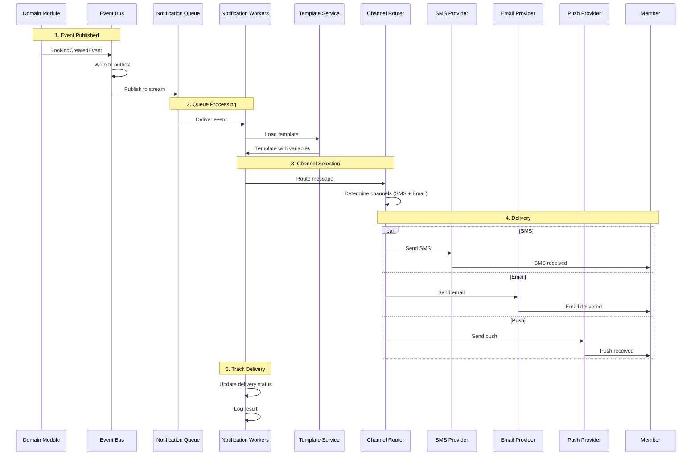

# Notification Flow

> Domain event publishing, queue dispatch, channel selection, delivery tracking, retry, and suppression.

This document covers the complete notification delivery lifecycle. Notifications are critical for user engagement — missed notifications mean missed bookings and angry members. This level answers: **how notifications are triggered**, **how we route messages**, and **how we handle failures**.

---

## Notification Flow Overview



---

## Event Subscription

Domain modules publish events when significant things happen. The notifications module subscribes to these events.

```python
# Event definition
class BookingCreatedEvent(DomainEvent):
    type = EventType.BOOKING_CREATED
    booking_id: UUID
    customer_id: UUID
    slot_id: UUID
    slot_start_time: datetime
    facility_name: str

# Event handler
@event_handler(EventType.BOOKING_CREATED)
async def handle_booking_created(event: BookingCreatedEvent) -> None:
    customer = await customer_service.get(event.customer_id)

    notification = NotificationRequest(
        tenant_id=customer.tenant_id,
        customer_id=customer.id,
        template_code="BOOKING_CONFIRMED",
        variables={
            "name": customer.name,
            "facility": event.facility_name,
            "time": event.slot_start_time.strftime("%A %d %B at %H:%M"),
            "booking_id": str(event.booking_id),
        },
        channels=[Channel.SMS, Channel.EMAIL],
    )

    await notification_service.send(notification)
```

---

## Template Management

Templates define the message content with placeholders:

```python
class NotificationTemplate:
    id: UUID
    tenant_id: UUID
    code: str  # e.g., "BOOKING_CONFIRMED"
    channel: Channel  # SMS, EMAIL, PUSH, IN_APP

    # Content
    subject: str | None  # For email
    body: str           # The template
    short_body: str | None  # For SMS (truncated)

    # Settings
    is_active: bool
    locale: str  # "en", "hi", etc.
```

### Template Example

```
# Template code: BOOKING_CONFIRMED
# Channel: SMS
# Body:
Hi {name}, your booking at {facility} is confirmed
for {time}. Booking ID: {booking_id}.
See you there!

# Rendered:
Hi John, your booking at Splashh Downtown is confirmed
for Monday 15 January at 10:00. Booking ID: abc123.
See you there!
```

---

## Channel Selection

The system selects channels based on notification type and user preferences:

```python
def select_channels(
    self,
    template_code: str,
    customer: Customer,
    event_type: EventType,
) -> list[Channel]:
    # Always send critical notifications (booking, payment) via SMS
    if event_type in CRITICAL_EVENTS:
        channels = [Channel.SMS]
    else:
        channels = [Channel.EMAIL]

    # Add push if user has mobile app installed
    if customer.has_mobile_app:
        channels.append(Channel.PUSH)

    # In-app for all
    channels.append(Channel.IN_APP)

    return channels
```

### Channel Priority

| Event Type | SMS | Email | Push | In-App |
|---|---|---|---|---|
| Booking confirmation | Yes | Yes | Yes | Yes |
| Booking reminder | No | Yes | Yes | Yes |
| Payment success | Yes | Yes | No | Yes |
| Payment failed | Yes | Yes | No | Yes |
| Membership expiry | Yes | Yes | Yes | Yes |
| Marketing | No | Yes | No | Yes |

---

## Queue Dispatch

Events are processed asynchronously via a queue:

```python
class NotificationQueue:
    async def enqueue(self, notification: NotificationRequest) -> None:
        # Write to outbox for reliability
        await self.outbox_repo.save(OutboxNotification(
            id=uuid4(),
            tenant_id=notification.tenant_id,
            customer_id=notification.customer_id,
            template_code=notification.template_code,
            variables=notification.variables,
            channels=notification.channels,
            scheduled_at=datetime.utcnow(),
            status=OutboxStatus.PENDING,
        ))

        # Publish to stream for immediate processing
        await self.redis.xadd(
            "notifications:pending",
            {
                "id": str(notification.id),
                "tenant_id": str(notification.tenant_id),
            }
        )
```

---

## Delivery Processing

Workers process notifications from the queue:

```python
async def process_notification(self, notification: OutboxNotification) -> None:
    # Load template
    template = await self.template_repo.get(
        notification.template_code,
        notification.tenant_id,
    )

    # Get customer
    customer = await self.customer_repo.get(notification.customer_id, notification.tenant_id)

    # Render template
    rendered = self.template_renderer.render(template, notification.variables)

    # Send to each channel
    results = []
    for channel in notification.channels:
        try:
            result = await self.send_to_channel(
                channel=channel,
                customer=customer,
                rendered=rendered,
            )
            results.append(DeliveryResult(channel=channel, status=result))
        except Exception as e:
            results.append(DeliveryResult(channel=channel, status=DeliveryStatus.FAILED, error=str(e)))

    # Update delivery records
    for result in results:
        await self.delivery_repo.save(NotificationDelivery(
            notification_id=notification.id,
            channel=result.channel,
            status=result.status,
            error=result.error,
            sent_at=datetime.utcnow() if result.status == DeliveryStatus.SENT else None,
        ))

    # Update outbox status
    notification.status = OutboxStatus.PROCESSED
    await self.outbox_repo.save(notification)
```

---

## Channel Implementation

### SMS (Twilio/AWS SNS)

```python
async def send_sms(self, customer: Customer, rendered: RenderedTemplate) -> DeliveryResult:
    result = await self.sms_gateway.send(
        to=customer.phone,
        body=rendered.short_body or rendered.body,
    )

    return DeliveryResult(
        status=DeliveryStatus.SENT if result.sid else DeliveryStatus.FAILED,
        external_id=result.sid,
    )
```

### Email (SendGrid/AWS SES)

```python
async def send_email(self, customer: Customer, rendered: RenderedTemplate) -> DeliveryResult:
    result = await self.email_gateway.send(
        to=customer.email,
        subject=rendered.subject,
        body=rendered.body,
        from_address=f"noreply@{self.tenant_domain}",
    )

    return DeliveryResult(
        status=DeliveryStatus.SENT if result.message_id else DeliveryStatus.FAILED,
        external_id=result.message_id,
    )
```

### Push Notification

```python
async def send_push(self, customer: Customer, rendered: RenderedTemplate) -> DeliveryResult:
    if not customer.push_token:
        return DeliveryResult(status=DeliveryStatus.SKIPPED)

    result = await self.push_gateway.send(
        token=customer.push_token,
        title=rendered.subject,
        body=rendered.body,
    )

    return DeliveryResult(
        status=DeliveryStatus.SENT if result.ok else DeliveryStatus.FAILED,
    )
```

---

## Retry Logic

Failed deliveries are retried with exponential backoff:

```python
async def handle_failure(self, notification: OutboxNotification, error: Exception) -> None:
    notification.retry_count += 1

    if notification.retry_count >= MAX_RETRIES:
        notification.status = OutboxStatus.DEAD_LETTER
        await self.alert_service.alert(
            f"Notification failed after {MAX_RETRIES} retries: {notification.id}",
            severity=AlertSeverity.HIGH,
        )
    else:
        # Exponential backoff: 1min, 5min, 15min, 30min, 1hr
        delays = [1, 5, 15, 30, 60]
        delay = delays[min(notification.retry_count - 1, len(delays) - 1)]

        notification.status = OutboxStatus.RETRY_SCHEDULED
        notification.scheduled_at = datetime.utcnow() + timedelta(minutes=delay)

    await self.outbox_repo.save(notification)
```

### Retry Schedule

| Attempt | Delay | Total Time |
|---|---|---|
| 1 | 1 minute | 1 minute |
| 2 | 5 minutes | 6 minutes |
| 3 | 15 minutes | 21 minutes |
| 4 | 30 minutes | 51 minutes |
| 5 | 60 minutes | ~2 hours |

---

## Delivery Tracking

Every delivery is tracked:

```python
class NotificationDelivery:
    id: UUID
    notification_id: UUID
    channel: Channel
    status: DeliveryStatus  # PENDING, SENT, DELIVERED, FAILED, BOUNCED
    external_id: str | None  # Provider's message ID
    sent_at: datetime | None
    delivered_at: datetime | None
    read_at: datetime | None
    error: str | None
```

### Webhooks for Delivery Status

Providers send webhooks for delivery status:

```python
@router.post("/webhooks/sms-status")
async def handle_sms_status(request: Request) -> Response:
    payload = await request.json()
    external_id = payload.get("message_sid")
    status = payload.get("status")  # "delivered", "failed", "undelivered"

    delivery = await delivery_repo.find_by_external_id(external_id)
    if delivery:
        delivery.status = self._map_status(status)
        if status == "delivered":
            delivery.delivered_at = datetime.utcnow()
        await delivery_repo.save(delivery)

    return Response(status_code=200)
```

---

## Suppression

We suppress notifications based on user preferences and provider feedback:

```python
async def should_send(self, customer: Customer, channel: Channel) -> bool:
    # Check user preference
    if channel == Channel.EMAIL and not customer.email_notifications_enabled:
        return False
    if channel == Channel.SMS and not customer.sms_notifications_enabled:
        return False
    if channel == Channel.PUSH and not customer.push_notifications_enabled:
        return False

    # Check suppression (bounced, unsubscribed)
    if await self.is_suppressed(customer, channel):
        return False

    return True
```

### Suppression Sources

| Source | Action |
|---|---|
| Hard bounce (email) | Suppress email permanently |
| Hard bounce (SMS) | Suppress SMS permanently |
| Unsubscribe | Suppress that channel |
| Do Not Disturb | Suppress all channels |
| Account suspended | Suppress all channels |

---

## Why This Design

### Event-Driven

Notifications are triggered by events, not direct calls. This provides:

- Loose coupling between domain modules
- Ability to add notification channels without modifying domain code
- Reliability via outbox pattern

> **Trade-off:** Event-driven adds complexity (event definitions, handlers, eventual consistency). The benefit is worth it for notifications — they are inherently asynchronous and can tolerate delay.

### Queue-Based Processing

We queue notifications because:

- External provider calls can be slow (seconds)
- Providers have rate limits
- We need retry logic
- We need to track delivery status

> **Trade-off:** Queue adds infrastructure complexity. The benefit is reliability — we never lose notifications even if providers are down.

---

## What's Next

- [Event Flow](./flow-events.md) — internal event bus details.
- [Data Flow](./data-flow.md) — data ownership and movement.
- [Caching Strategy](./caching-strategy.md) — caching across layers.
