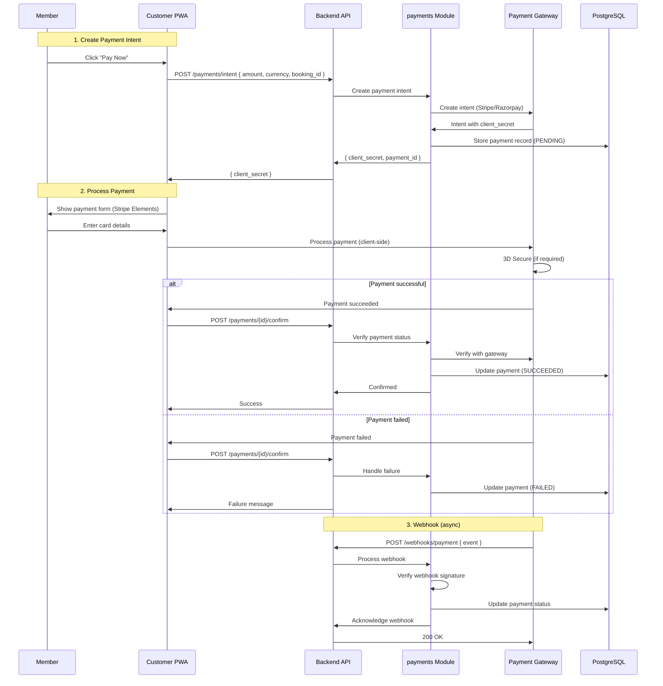
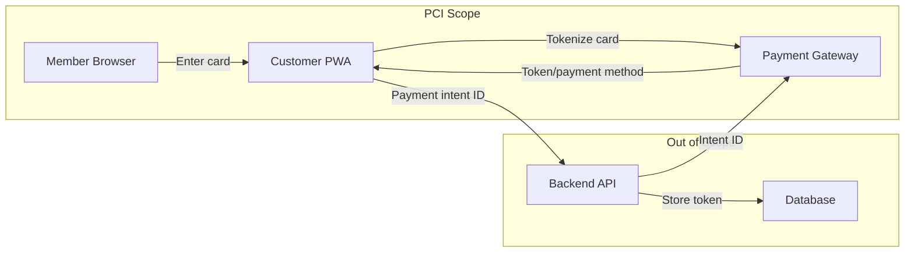
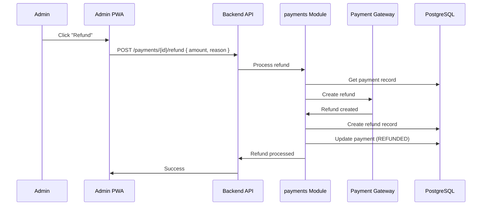
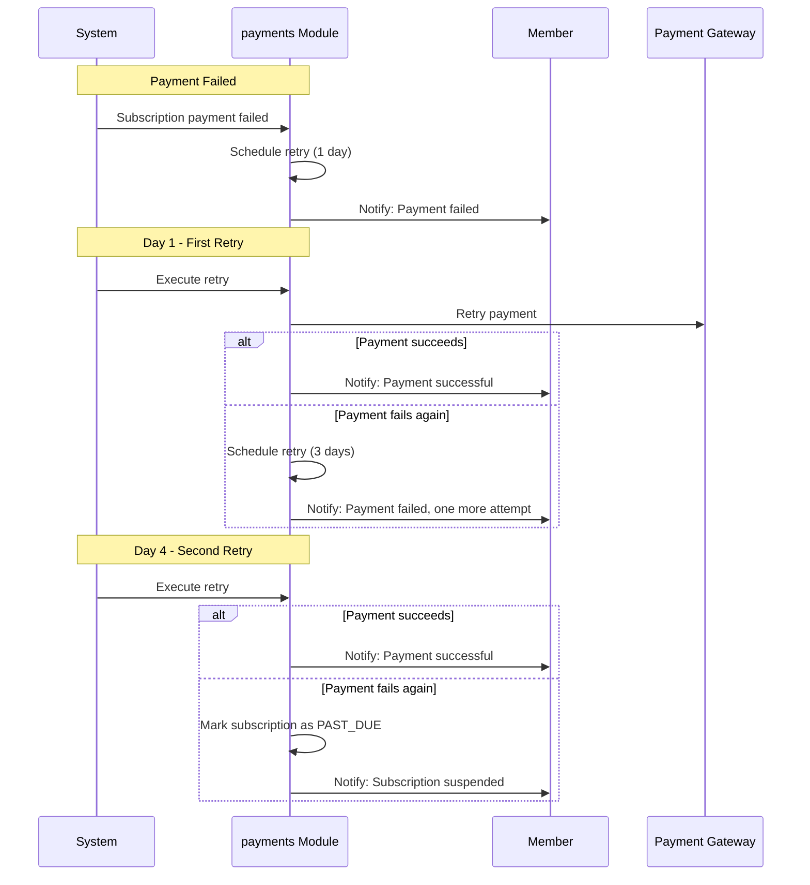
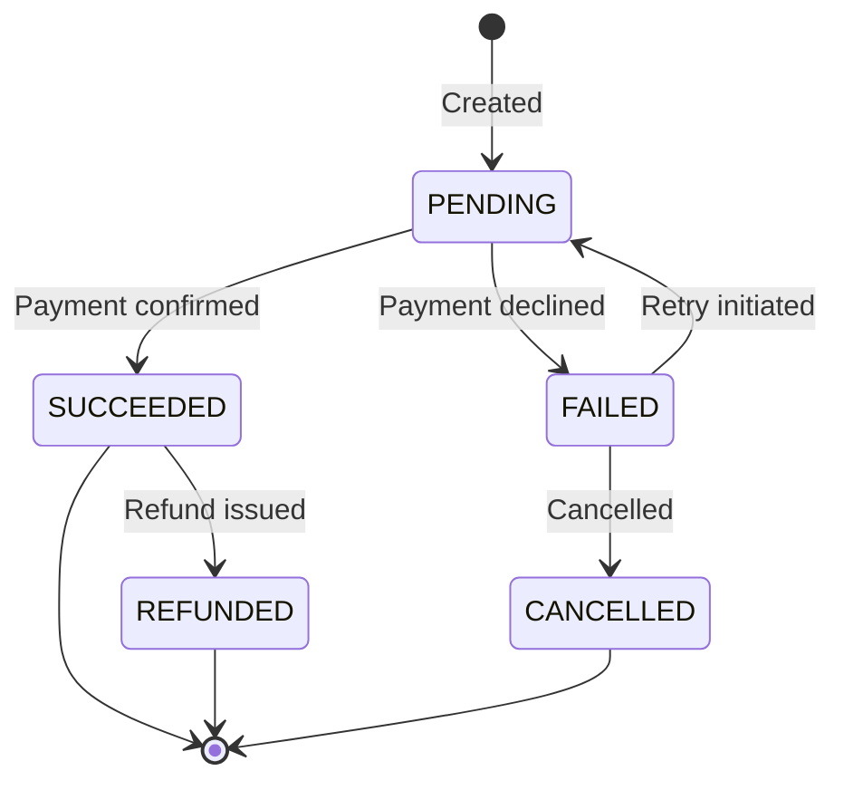

# Payment Flow

> Payment intent creation, gateway redirect/webhook, idempotent capture, refund, dunning, and PCI scope minimization.

This document covers the complete payment lifecycle from intent creation through refund. Payments are the highest-stakes operation in the system — errors result in financial loss. This level answers: **how payments are processed**, **how we handle failures**, and **how we stay PCI-compliant**.

---

## Payment Flow Overview



---

## Payment Intent Creation

Payments use the **Payment Intent** pattern (Stripe terminology) or equivalent (Razorpay "Order"). This allows the gateway to handle 3D Secure and provides a clean state machine.

```python
@router.post("/payments/intent")
async def create_payment_intent(
    body: CreatePaymentIntentRequest,
    current_user: User = Depends(get_current_user),
    payment_service: PaymentService = Depends(get_payment_service),
) -> PaymentIntentResponse:
    # Verify the amount matches expected (prevent tampering)
    expected_amount = await payment_service.calculate_expected_amount(
        body.booking_id,
        current_user.tenant_id,
    )

    if body.amount != expected_amount:
        raise ValidationError("Amount mismatch")

    # Create payment intent with idempotency key
    intent = await payment_service.create_intent(
        tenant_id=current_user.tenant_id,
        amount=body.amount,
        currency=body.currency,
        customer_id=current_user.id,
        booking_id=body.booking_id,
        idempotency_key=body.idempotency_key,
    )

    return PaymentIntentResponse(
        payment_id=intent.id,
        client_secret=intent.client_secret,
        amount=intent.amount,
        currency=intent.currency,
    )
```

### Idempotency

Every payment intent creation includes an idempotency key. This prevents duplicate charges if the client retries:

```python
async def create_intent(
    tenant_id: UUID,
    amount: Money,
    booking_id: UUID,
    idempotency_key: str,
) -> PaymentIntent:
    # Check if already processed
    existing = await self.payment_repo.find_by_idempotency_key(idempotency_key)
    if existing:
        return existing

    # Create with gateway
    gateway_intent = await self.gateway.create_intent(
        amount=int(amount * 100),  # Convert to cents
        currency=amount.currency,
        metadata={
            "booking_id": str(booking_id),
            "tenant_id": str(tenant_id),
        },
    )

    # Store locally
    payment = Payment(
        tenant_id=tenant_id,
        booking_id=booking_id,
        gateway_id=gateway_intent.id,
        amount=amount,
        status=PaymentStatus.PENDING,
        idempotency_key=idempotency_key,
    )
    await self.payment_repo.save(payment)

    return PaymentIntent(
        id=payment.id,
        client_secret=gateway_intent.client_secret,
        amount=amount,
    )
```

---

## PCI Scope Minimization

We minimize PCI compliance scope by **never handling raw card data**. All card collection happens on the client side via the gateway's embedded UI.



> **Why tokenization?** Raw card data (PAN, CVV) should never reach our servers. We only handle tokens or payment method IDs from the gateway. This reduces our PCI compliance requirements from SAQ-D to SAQ-A (self-assessment问卷).

---

## Payment Confirmation

### Client-Side Confirmation

The client uses the gateway's UI to collect card details and process payment:

```javascript
// Stripe Elements (similar pattern for Razorpay)
const stripe = await loadStripe(PUBLISHABLE_KEY);
const elements = stripe.elements({ clientSecret });
const paymentElement = elements.create('payment');
paymentElement.mount('#payment-element');

await stripe.confirmPayment({
  elements,
  confirmParams: {
    return_url: `${window.location.origin}/payment/complete`,
  },
});
```

### Server-Side Verification

After the client completes payment, we verify the result:

```python
@router.post("/payments/{payment_id}/confirm")
async def confirm_payment(
    payment_id: UUID,
    current_user: User = Depends(get_current_user),
    payment_service: PaymentService = Depends(get_payment_service),
) -> PaymentConfirmResponse:
    payment = await payment_service.get(payment_id, current_user.tenant_id)

    # Verify with gateway
    gateway_payment = await payment_service.gateway.get_payment(payment.gateway_id)

    if gateway_payment.status == "succeeded":
        await payment_service.mark_succeeded(payment_id)
        # Publish event for booking confirmation
        await payment_service.publish_payment_event(payment_id, "succeeded")
    else:
        await payment_service.mark_failed(
            payment_id,
            reason=gateway_payment.last_payment_error,
        )

    return PaymentConfirmResponse(status=payment.status)
```

---

## Webhook Processing

Payments can succeed or fail asynchronously (especially with 3D Secure). Webhooks are the authoritative source of payment state.

```python
@router.post("/webhooks/payment")
async def handle_payment_webhook(
    request: Request,
    payment_service: PaymentService = Depends(get_payment_service),
) -> Response:
    # Verify webhook signature
    payload = await request.body()
    signature = request.headers.get("stripe-signature")

    try:
        event = payment_service.gateway.construct_event(
            payload, signature, settings.webhook_secret
        )
    except InvalidSignatureError:
        raise HTTPException(status_code=400, detail="Invalid signature")

    # Process event
    if event.type == "payment_intent.succeeded":
        await payment_service.handle_success(event.data.object)
    elif event.type == "payment_intent.payment_failed":
        await payment_service.handle_failure(event.data.object)

    return Response(status_code=200)
```

### Webhook Idempotency

Webhooks can be delivered multiple times. We handle this:

```python
async def handle_success(self, gateway_payment_id: str) -> None:
    payment = await self.payment_repo.find_by_gateway_id(gateway_payment_id)
    if not payment:
        return  # Unknown payment, ignore

    if payment.status == PaymentStatus.SUCCEEDED:
        return  # Already processed, idempotent

    payment.status = PaymentStatus.SUCCEEDED
    payment.succeeded_at = datetime.utcnow()
    await self.payment_repo.save(payment)

    # Publish event (idempotent — consumers must handle duplicates)
    await self.event_bus.publish(PaymentSucceededEvent(
        payment_id=payment.id,
        booking_id=payment.booking_id,
    ))
```

---

## Refund Flow

Refunds can be initiated by the system (cancellation) or manually by admins.



### Full vs Partial Refunds

```python
async def refund(
    self,
    payment_id: UUID,
    amount: Money | None = None,
    reason: str,
) -> Refund:
    payment = await self.payment_repo.get(payment_id)

    # Determine refund amount
    refund_amount = amount or payment.amount  # Default: full refund
    if refund_amount > payment.amount:
        raise ValidationError("Refund exceeds payment")

    # Create refund via gateway
    gateway_refund = await self.gateway.create_refund(
        payment_intent=payment.gateway_id,
        amount=int(refund_amount * 100),
    )

    # Store locally
    refund = Refund(
        payment_id=payment_id,
        amount=refund_amount,
        reason=reason,
        gateway_refund_id=gateway_refund.id,
        status=RefundStatus.PENDING,
    )
    await self.refund_repo.save(refund)

    # Publish event
    await self.event_bus.publish(RefundCreatedEvent(refund_id=refund.id))

    return refund
```

---

## Dunning (Failed Payment Recovery)

For subscription payments that fail, we implement a dunning process:



### Dunning Schedule

| Day | Action | Notification |
|---|---|---|
| 0 | Payment failed | "Payment failed, retrying in 1 day" |
| 1 | First retry | "Payment failed, retrying in 3 days" |
| 4 | Second retry | "Payment failed, last attempt" |
| 7 | Final retry | "Subscription suspended" |

---

## Payment States



---

## Why This Design

### Payment Gateway Abstraction

We abstract the payment gateway behind an internal interface. This allows:

- Different tenants to use different gateways
- Easy migration if a gateway changes pricing or deprecates APIs
- Unified internal API regardless of gateway quirks

> **Trade-off:** The abstraction adds complexity. Each gateway has different APIs, error codes, and features. The abstraction must be thin enough to not hide important functionality.

### Webhooks as Source of Truth

We trust webhooks over client callbacks because:

- Client-side confirmation can be manipulated
- Webhooks come directly from the gateway
- Webhooks are stored and processed idempotently

> **Why not client callbacks?** The client can lie about payment status. The gateway's webhook is the authoritative source.

---

## What's Next

- [Membership Flow](./flow-membership.md) — subscription lifecycle.
- [Notification Flow](./flow-notification.md) — message delivery.
- [PCI Compliance](../09-security/overview.md) — security details.
