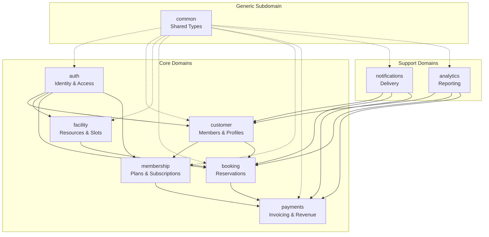
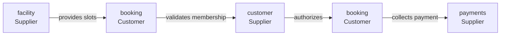
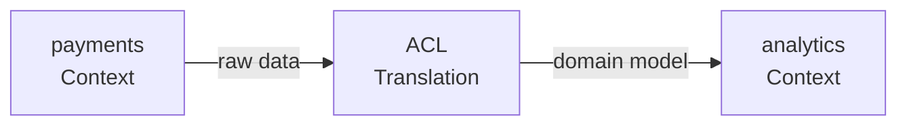
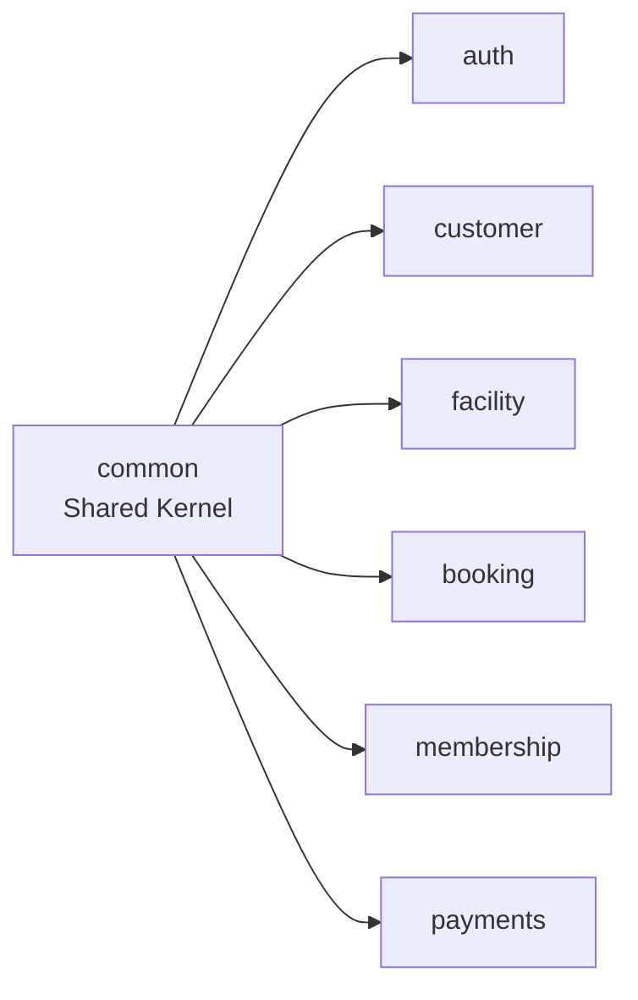

# Module Diagram (Bounded Context Map)

> The Domain-Driven Design bounded context map: contexts, their relationships, permitted integrations, and dependency rules.

This document maps the domain into bounded contexts and defines how they interact. This is the DDD strategic layer — where contexts meet, where they isolate, and where translation layers are needed. This level answers: **what belongs where**, **what can depend on what**, and **how data crosses boundaries**.

---

## Bounded Context Map



---

## Context Definitions

### auth (Identity & Access)

**Responsibility:** Identity management, authentication, session lifecycle, role assignment.

**Core entities:** User, Tenant, Session, Role, Permission

**Ubiquitous terms:**
- **User** — Any person who can log in (member, staff, coach, admin)
- **Tenant** — The organization (sports club) that owns data
- **Session** — An active login with associated device/IP context
- **Role** — Named collection of permissions (admin, staff, coach, member)

**Public API style:** REST with JWT Bearer authentication.

**Integration style:** Other contexts call auth for authentication and authorization. No direct database access.

---

### customer (Members & Profiles)

**Responsibility:** Member profiles, contact information, guardian relationships, waivers, KYC.

**Core entities:** Customer, Guardian, Waiver, ContactInfo

**Ubiquitous terms:**
- **Customer** — A member of a club, may have subscriptions and bookings
- **Guardian** — Parent/guardian for junior members under 18
- **Waiver** — Signed liability release, has expiry date
- **ContactInfo** — Phone, email, address with validation

**Public API style:** REST, most endpoints restricted to authenticated users.

**Integration style:**
- Receives events from auth (user created → create customer profile)
- Sends events to membership (customer created → suggest plans)
- Sends events to booking (customer updated → update booking records)

---

### facility (Resources & Slots)

**Responsibility:** Physical resources (courts, pools), availability rules, slot generation.

**Core entities:** Facility, Resource, AvailabilityRule, Slot

**Ubiquitous terms:**
- **Facility** — A physical location (Splashh Downtown, Splashh Airport)
- **Resource** — A bookable item (Tennis Court 1, Swimming Lane 3)
- **AvailabilityRule** — Operating hours, blackout dates, slot duration
- **Slot** — A time-bound availability of a resource (2024-01-15 10:00-11:00)

**Public API style:** REST, read operations public; write operations authenticated.

**Integration style:**
- Sends events when slots are created/modified (booking subscribes)
- Called by booking to check slot availability

---

### booking (Reservations)

**Responsibility:** Creating reservations, managing check-in, waitlist management, cancellation.

**Core entities:** Booking, WaitlistEntry, CheckIn

**Ubiquitous terms:**
- **Booking** — A reservation linking a customer to a slot
- **WaitlistEntry** — A request to be notified when a slot becomes available
- **CheckIn** — Record of member arrival at facility

**Public API style:** REST, authenticated required for most operations.

**Integration style:**
- Calls facility to validate and lock slots
- Calls customer to verify membership validity
- Calls payments to authorize/capture booking fees
- Publishes BookingCreatedEvent for notifications

---

### membership (Plans & Subscriptions)

**Responsibility:** Membership plans, subscriptions, renewals, freezes, upgrades/downgrades.

**Core entities:** MembershipPlan, Subscription, MembershipBenefit

**Ubiquitous terms:**
- **MembershipPlan** — A product offering (Gold Annual, Silver Monthly)
- **Subscription** — An active subscription linking customer to plan
- **Benefit** — Something the plan includes (10 bookings/month, gym access)

**Public API style:** REST, authenticated for subscription management.

**Integration style:**
- Calls customer to verify identity
- Calls payments to process subscription charges
- Publishes SubscriptionActivatedEvent, SubscriptionExpiredEvent

---

### payments (Invoicing & Revenue)

**Responsibility:** Invoicing, payment processing, refunds, financial reporting, dunning.

**Core entities:** Invoice, Payment, Refund, PaymentMethod

**Ubiquitous terms:**
- **Invoice** — A bill with line items and due date
- **Payment** — A successful transaction with gateway reference
- **Refund** — A full or partial reversal of a payment
- **PaymentMethod** — Tokenized card/wallet for recurring payments

**Public API style:** REST, authenticated, PCI-compliant (no card data touches our servers).

**Integration style:**
- Called by booking (pay booking fee), membership (pay subscription)
- Publishes PaymentSucceededEvent, PaymentFailedEvent

---

### notifications (Delivery)

**Responsibility:** Message templates, channel selection (SMS/email/push/in-app), delivery tracking.

**Core entities:** NotificationTemplate, NotificationDelivery, NotificationChannel

**Ubiquitous terms:**
- **Template** — Message with placeholders (Hello {name}, your booking is confirmed)
- **Delivery** — Record of send attempt with status (sent, delivered, failed)
- **Channel** — Delivery method (SMS, email, push, in-app)

**Public API style:** Primarily event-driven. Optional REST for admin management.

**Integration style:**
- Subscribes to all domain events and delivers appropriate notifications
- No direct calls from other modules — fully event-driven

---

### analytics (Reporting)

**Responsibility:** Aggregations, dashboards, exports, data warehousing.

**Core entities:** (Read models — materialized views, aggregates)

**Ubiquitous terms:**
- **Dashboard** — Pre-computed metrics for UI (today's bookings, revenue)
- **Report** — On-demand aggregation (monthly revenue by facility)

**Public API style:** REST, typically read-only.

**Integration style:**
- Reads from all other modules via replicas (not direct table access)
- Materialized views refreshed periodically

---

## Context Relationships

### Customer-Supplier (Upstream/Downstream)



| Supplier | Customer | Relationship |
|---|---|---|
| facility | booking | Booking depends on slots. If slots don't exist, bookings can't be made. |
| customer | booking | Booking validates customer exists and is in good standing. |
| customer | membership | Membership depends on customer identity. |
| payments | booking | Bookings may require payment. |
| payments | membership | Subscriptions require payment. |

**Integration pattern:** Downstream contexts call upstream contexts' APIs or services. Upstream contexts publish events that downstream contexts consume.

### Anti-Corruption Layer (ACL)

When one context must consume another's data but the upstream model doesn't fit the downstream needs, an ACL translates:



**Example:** The analytics context needs booking data but the booking module's model is optimized for transactions. The analytics module creates its own read model (materialized view) that translates the booking data into analytics-friendly form.

> **Why ACL?** Analytics needs flexibility to change its queries without affecting the booking module's schema. Read models provide that flexibility.

### Shared Kernel

Some types are shared across contexts. The `common` context contains these:



**Shared types:**

- `Address` — Postal address used by customer and facility
- `PhoneNumber` — Validated phone number
- `Money` — Currency and amount with rounding rules
- `DateRange` — Start/end time range
- `UUID` — Identifier type

> **Rule** — Shared kernel types must be truly shared (same meaning in every context). If a type's meaning differs between contexts, it belongs in each context separately, not in common.

---

## Dependency Matrix

| Depends On | auth | customer | facility | booking | membership | payments | notifications | analytics |
|---|---|---|---|---|---|---|---|---|
| **auth** | - | | | | | | | |
| **customer** | API | - | | | | | | |
| **facility** | | | - | API/Event | | | | |
| **booking** | | API | API/Event | - | | Event | Event | |
| **membership** | | API | | | - | API/Event | | |
| **payments** | | | | API/Event | API/Event | - | Event | |
| **notifications** | | | | Event | Event | Event | - | |
| **analytics** | | Read | Read | Read | Read | Read | | - |
| **common** | Shared | Shared | Shared | Shared | Shared | Shared | Shared | Shared |

**Legend:**

- **API** — Direct service-to-service call
- **Event** — Publishes/consumes domain events
- **Read** — Reads from read replica or materialized view
- **Shared** — Uses shared kernel types

---

## Permitted Integrations

> **Rule** — The following integration patterns are permitted:

1. **Direct call** — Context A calls Context B's service layer. Permitted when the operation must be atomic.
2. **Event publish** — Context A publishes event; Context B subscribes. Permitted when the operation is fire-and-forget.
3. **Shared kernel** — Both contexts use types from common. Permitted for truly shared concepts.
4. **Read replica** — Context A reads Context B's data from replica. Permitted for analytics/reporting only.

> **Anti-pattern** — The following are NOT permitted:

1. **Direct table access** — Context A reads Context B's tables directly.
2. **Shared database** — Two contexts sharing the same tables (beyond tenant_id).
3. **Circular dependency** — Context A depends on B, and B depends on A.

---

## Context Isolation Boundaries

Each context owns its data exclusively. No other context accesses another context's database tables directly.

```
┌─────────────────────────────────────────────────────────────┐
│                      PostgreSQL Primary                       │
├─────────────┬─────────────┬─────────────┬───────────────────┤
│  auth       │ customer    │ facility    │ booking           │
│  ─────────  │ ─────────   │ ─────────   │ ─────────         │
│  users      │ customers   │ facilities  │ bookings          │
│  sessions   │ guardians   │ resources   │ waitlist          │
│  tenants    │ waivers     │ slots       │ check_ins         │
├─────────────┼─────────────┼─────────────┼───────────────────┤
│  membership │ payments    │ notifications│ analytics         │
│  ─────────  │ ─────────   │ ─────────   │ ─────────         │
│  plans      │ invoices    │ templates   │ dashboard_views   │
│  subs       │ payments    │ deliveries  │ report_views      │
│  benefits   │ refunds     │             │                   │
└─────────────┴─────────────┴─────────────┴───────────────────┘
```

> **Why separate tables?** Clear ownership. Each context can evolve its schema without coordinating with other contexts. This is essential for independent team ownership.

---

## What Can Depend on What

| Consumer | Provider | Allowed? | Reason |
|---|---|---|---|
| booking | facility | Yes | Must validate slot exists |
| booking | customer | Yes | Must validate member |
| booking | payments | Yes | Must collect fee |
| booking | notifications | No | Events only |
| membership | payments | Yes | Must collect subscription fee |
| membership | customer | Yes | Must know who subscribed |
| notifications | any | No | Events only |
| analytics | any | Yes | Read replicas only |

---

## What's Next

- [Bounded Contexts (Domain)](../03-domain/bounded-contexts.md) — detailed context documentation.
- [Aggregates (Domain)](../03-domain/aggregates.md) — aggregate roots per context.
- [Request Lifecycle](./request-lifecycle.md) — trace a request through the stack.
