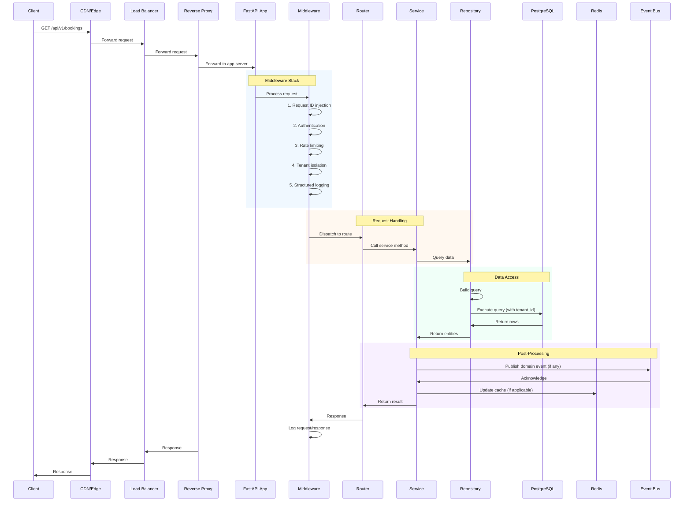

# Request Lifecycle

> The end-to-end journey of an HTTP request through the system, from edge to database and back.

This document traces the path of a typical API request through all layers of the system. Understanding this flow is essential for debugging, performance tuning, and security review. This level answers: **what happens at each layer**, **where latency accumulates**, and **what cross-cutting concerns apply**.

---

## Request Flow Overview



---

## Layer-by-Layer Breakdown

### Layer 1: Edge (CDN/Load Balancer)

The request first hits the CDN (for static assets) or load balancer (for API requests).

| Step | Action | Latency | Notes |
|---|---|---|---|
| 1.1 | DNS resolution | 5-50ms | Cached by OS |
| 1.2 | TLS handshake | 50-200ms | Full handshake; resumption reduces |
| 1.3 | CDN lookup | 10-30ms | Static assets only |
| 1.4 | Load balancer routing | <5ms | Layer 7 routing |

**What happens here:**

- SSL/TLS termination
- Request routing to healthy instances
- DDoS protection and WAF
- Static asset caching (for admin-pwa and customer-pwa)

> **Optimization** — Static assets are cached at CDN with long TTLs. API responses are not cached (except specific read-only endpoints with explicit cache headers).

### Layer 2: Reverse Proxy (Nginx)

Nginx handles routing, rate limiting, and static file serving.

```nginx
# Simplified configuration
server {
    location /api/ {
        proxy_pass http://backend-upstream;
        proxy_set_header X-Request-ID $request_id;
        proxy_set_header X-Tenant-ID $http_x_tenant_id;
        limit_req zone=api_limit burst=20 nodelay;
    }

    location / {
        # Serve PWA static files
        try_files $uri $uri/ /index.html;
    }
}
```

| Step | Action | Latency | Notes |
|---|---|---|---|
| 2.1 | Rate limiting check | <1ms | Per-IP and per-tenant limits |
| 2.2 | Header injection | <1ms | X-Request-ID, X-Forwarded-* |
| 2.3 | Proxy to backend | 1-5ms | HTTP/2 to upstream |

> **Why Nginx?** It handles connection management and rate limiting efficiently at the edge. In cloud environments, this layer may be replaced by managed load balancers (ALB, Cloudflare).

### Layer 3: FastAPI Application

The FastAPI application processes the request. This is where most of the logic resides.

#### 3.1: ASGI Server (Uvicorn)

Uvicorn runs the ASGI application. It manages worker processes and connection handling.

| Step | Action | Latency | Notes |
|---|---|---|---|
| 3.1.1 | Accept connection | <1ms | Async |
| 3.1.2 | Route to app | <1ms | ASGI protocol |

#### 3.2: Middleware Stack

Middleware runs before and after the route handler. The order matters.

```python
# Middleware order (first = outermost)
middleware = [
    RequestIDMiddleware,      # 1. Inject request ID
    CORSMiddleware,           # 2. CORS headers
    AuthenticationMiddleware, # 3. JWT validation
    RateLimitMiddleware,      # 4. Per-user limits
    TenantIsolationMiddleware,# 5. Tenant context
    LoggingMiddleware,        # 6. Structured logging
]
```

| Middleware | Responsibility | Failure Mode |
|---|---|---|
| RequestIDMiddleware | Inject X-Request-ID into context | None (always succeeds) |
| CORSMiddleware | Validate Origin, set CORS headers | None (allow/deny) |
| AuthenticationMiddleware | Validate JWT, extract user | 401 if invalid |
| RateLimitMiddleware | Check Redis for user limits | 429 if exceeded |
| TenantIsolationMiddleware | Extract tenant_id, set context | 400 if missing |
| LoggingMiddleware | Log request/response | None |

**Middleware details:**

```python
class AuthenticationMiddleware:
    async def __call__(self, scope, receive, send):
        # Extract token from Authorization header
        auth_header = scope.get("headers", {}).get(b"authorization", b"")
        if not auth_header.startswith(b"Bearer "):
            return await self._unauthorized(send)

        token = auth_header[7:]  # Strip "Bearer "

        # Validate token (cache in Redis for speed)
        user = await self._validate_token(token)
        if not user:
            return await self._unauthorized(send)

        # Add user to scope for downstream access
        scope["state"]["user"] = user
        scope["state"]["tenant_id"] = user.tenant_id

        await self.app(scope, receive, send)
```

#### 3.3: Router

The router dispatches to the appropriate handler function based on the path and method.

```python
@router.get("/bookings", response_model=List[BookingResponse])
async def list_bookings(
    current_user: User = Depends(get_current_user),
    booking_service: BookingService = Depends(get_booking_service),
) -> List[BookingResponse]:
    # Router is intentionally thin
    bookings = booking_service.list_bookings(
        tenant_id=current_user.tenant_id,
        customer_id=current_user.id,
    )
    return [BookingResponse.model_validate(b) for b in bookings]
```

| Step | Action | Latency | Notes |
|---|---|---|---|
| 3.3.1 | Path matching | <1ms | Radix tree lookup |
| 3.3.2 | Dependency injection | 1-5ms | Service resolution |
| 3.3.3 | Parameter parsing | <1ms | Pydantic validation |

#### 3.4: Service Layer

The service contains the business logic. It orchestrates repositories and other services.

```python
class BookingService:
    def list_bookings(
        self, tenant_id: UUID, customer_id: UUID
    ) -> list[Booking]:
        # Get from repository (cached or DB)
        bookings = self.booking_repository.find_by_customer(
            tenant_id=tenant_id,
            customer_id=customer_id,
        )
        return bookings

    def create_booking(
        self, tenant_id: UUID, customer_id: UUID, slot_id: UUID
    ) -> Booking:
        # Validate slot (facility module)
        slot = self.slot_repository.get_for_update(slot_id, tenant_id)
        if not slot or slot.is_booked:
            raise SlotNotAvailableError()

        # Validate customer membership (customer module)
        customer = self.customer_repository.get(customer_id, tenant_id)
        if not customer.has_valid_membership:
            raise MembershipRequiredError()

        # Create booking
        booking = Booking(
            tenant_id=tenant_id,
            customer_id=customer_id,
            slot_id=slot_id,
            status=BookingStatus.PENDING,
        )
        self.booking_repository.save(booking)

        # Publish event
        self.event_bus.publish(BookingCreatedEvent(
            booking_id=booking.id,
            customer_id=customer_id,
            slot_id=slot_id,
        ))

        return booking
```

| Step | Action | Latency | Notes |
|---|---|---|---|
| 3.4.1 | Service orchestration | 5-50ms | Varies by complexity |
| 3.4.2 | Domain validation | 1-5ms | Invariant checks |
| 3.4.3 | Event publishing | 1-10ms | Async, non-blocking |

#### 3.5: Repository Layer

The repository handles database access. It builds and executes queries.

```python
class BookingRepository:
    def find_by_customer(
        self, tenant_id: UUID, customer_id: UUID
    ) -> list[Booking]:
        # Check cache first
        cache_key = f"bookings:{tenant_id}:{customer_id}"
        cached = self.redis.get(cache_key)
        if cached:
            return self._deserialize(cached)

        # Query database
        query = (
            select(Booking)
            .where(Booking.tenant_id == tenant_id)
            .where(Booking.customer_id == customer_id)
            .order_by(Booking.created_at.desc())
        )
        bookings = self.session.execute(query).scalars().all()

        # Cache result
        self.redis.setex(cache_key, 300, self._serialize(bookings))

        return bookings
```

| Step | Action | Latency | Notes |
|---|---|---|---|
| 3.5.1 | Cache lookup | 1-5ms | Redis round-trip |
| 3.5.2 | Query building | <1ms | SQLAlchemy |
| 3.5.3 | Query execution | 5-50ms | Network to DB |
| 3.5.4 | Result parsing | 1-5ms | ORM mapping |

### Layer 4: Database (PostgreSQL)

The database executes queries and returns results.

| Step | Action | Latency | Notes |
|---|---|---|---|
| 4.1 | Connection checkout | <1ms | From pool |
| 4.2 | Query parsing | 1-5ms | Parser + planner |
| 4.3 | Query execution | 5-50ms | Depends on indexes |
| 4.4 | Result transfer | 1-10ms | Network |
| 4.5 | Connection return | <1ms | To pool |

**Tenant isolation:**

Every query includes tenant_id:

```sql
SELECT * FROM bookings
WHERE tenant_id = 'abc-123'  -- Always filtered
  AND customer_id = 'def-456'
ORDER BY created_at DESC;
```

### Layer 5: Event Bus

For operations that trigger downstream effects, the service publishes a domain event.

```python
class EventBus:
    async def publish(self, event: DomainEvent) -> None:
        # Write to outbox table
        self.session.execute(
            insert(OutboxEvent).values(
                id=event.id,
                type=event.type.value,
                payload=event.model_dump_json(),
                tenant_id=event.tenant_id,
                created_at=datetime.utcnow(),
            )
        )
        await self.session.commit()

        # Redis pub/sub for immediate consumers
        await self.redis.publish(
            f"events:{event.tenant_id}",
            event.model_dump_json(),
        )
```

| Step | Action | Latency | Notes |
|---|---|---|---|
| 5.1 | Write to outbox | 2-10ms | ACID transaction |
| 5.2 | Publish to Redis | <1ms | Fire-and-forget |

---

## Where Latency Accumulates

| Layer | Typical Latency | P95 Latency | Notes |
|---|---|---|---|
| Edge (CDN/LB) | 10-50ms | 100ms | Depends on geography |
| Nginx | 1-5ms | 10ms | Rate limiting adds overhead |
| Authentication | 1-5ms | 20ms | JWT validation + cache |
| Routing | <1ms | 2ms | Radix tree is fast |
| Service logic | 5-50ms | 100ms | Business complexity |
| Repository (cache hit) | 1-5ms | 10ms | Redis is fast |
| Repository (cache miss) | 10-50ms | 100ms | DB round-trip |
| Database query | 5-50ms | 100ms | Depends on indexing |
| Event publishing | 2-10ms | 20ms | Outbox write |
| **Total (cache hit)** | **30-120ms** | **250ms** | |
| **Total (cache miss)** | **50-200ms** | **400ms** | |

> **Target** — Our P95 target is 200ms for API responses. This leaves headroom for database complexity and network variability.

---

## Audit Logging

Every request generates structured logs:

```json
{
  "timestamp": "2024-01-15T10:30:00.123Z",
  "level": "INFO",
  "request_id": "req-abc123",
  "tenant_id": "tenant-xyz",
  "user_id": "user-789",
  "method": "POST",
  "path": "/api/v1/bookings",
  "status_code": 201,
  "duration_ms": 145,
  "db_duration_ms": 32,
  "cache_hit": true,
  "ip": "203.0.113.42",
  "user_agent": "Mozilla/5.0..."
}
```

> **Security** — Logs never contain: passwords, tokens, PII, payment data, or request bodies that may contain sensitive information.

---

## Error Handling

Errors propagate up the stack with appropriate HTTP status codes:

| Error Type | HTTP Status | Example |
|---|---|---|
| ValidationError | 400 | Invalid input |
| AuthenticationError | 401 | Missing/invalid token |
| AuthorizationError | 403 | Token valid, no permission |
| NotFoundError | 404 | Resource doesn't exist |
| SlotNotAvailableError | 409 | Booking conflict |
| RateLimitError | 429 | Too many requests |
| InternalError | 500 | Unexpected failure |

---

## What's Next

- [Authentication Flow](./flow-authentication.md) — detailed auth flow.
- [Booking Flow](./flow-booking.md) — critical booking lifecycle.
- [Caching Strategy](./caching-strategy.md) — how we cache at each layer.
