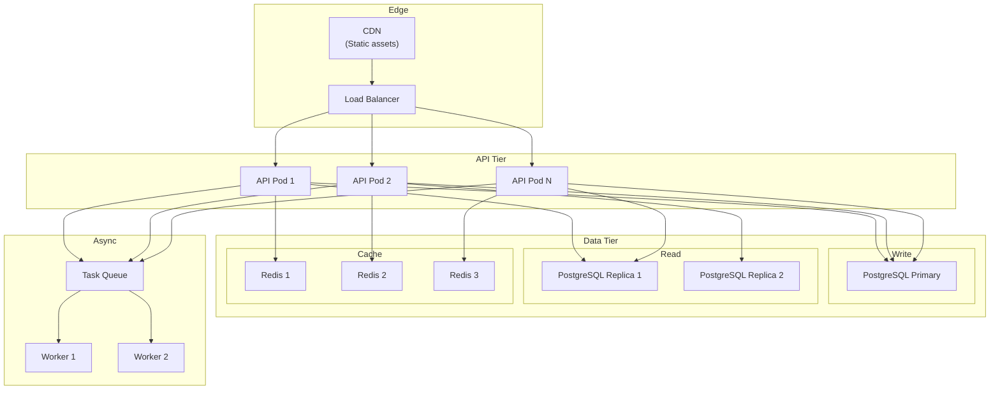
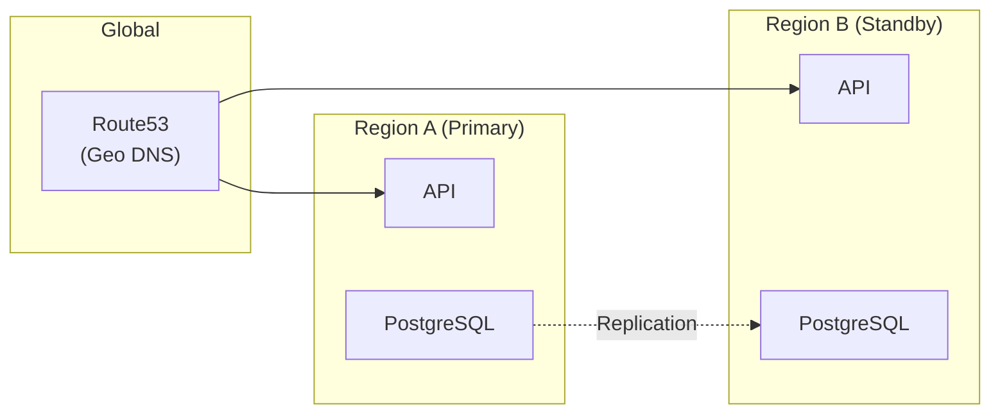

# Scaling Strategy

> Horizontal scaling of stateless services, read replicas, Redis clustering, connection pooling, queue-based backpressure, and future multi-region architecture.

This document covers how the system scales under load. We design for horizontal scaling from day one — adding more instances rather than bigger instances. This level answers: **how we scale each component**, **what the limits are**, and **what happens when we hit them**.

---

## Scaling Architecture



---

## API Tier Scaling

### Horizontal Pod Autoscaling (HPA)

The API tier scales based on CPU and memory:

```yaml
apiVersion: autoscaling/v2
kind: HorizontalPodAutoscaler
metadata:
  name: backend-hpa
spec:
  scaleTargetRef:
    apiVersion: apps/v1
    kind: Deployment
    name: backend
  minReplicas: 2
  maxReplicas: 20
  metrics:
    - type: Resource
      resource:
        name: cpu
        target:
          type: Utilization
          averageUtilization: 70
    - type: Resource
      resource:
        name: memory
        target:
          type: Utilization
          averageUtilization: 80
```

### Scaling Triggers

| Metric | Scale Up | Scale Down |
|---|---|---|
| CPU | >70% for 2 min | <30% for 5 min |
| Memory | >80% for 2 min | <40% for 5 min |
| Request count | >1000 RPS per pod | <200 RPS per pod |

### Capacity Planning

| Instance Type | Requests/Pod | Max Pods | Max RPS |
|---|---|---|---|
| 2 vCPU, 4GB | 500 | 20 | 10,000 |
| 4 vCPU, 8GB | 1000 | 20 | 20,000 |

> **Current capacity:** 20,000 RPS should handle 200+ tenants easily.

---

## Database Scaling

### Read Replicas

We use PostgreSQL streaming replicas for read scaling:

```yaml
# PostgreSQL replica configuration
postgresql:
  replicaCount: 2
  resources:
    limits:
      cpu: 2000m
      memory: 4Gi
```

### Read/Write Splitting

Reads go to replicas; writes go to primary:

```python
class DatabaseRouter:
    def db_for_read(self, model):
        if model._meta.tenant_id:
            return "replica"  # Read replicas for multi-tenant tables
        return "replica"

    def db_for_write(self, model):
        return "primary"

# In settings
DATABASE_ROUTERS = ["app.db.Router"]
```

### Routing Logic

```python
class ReadReplicaMiddleware:
    async def __call__(self, scope, receive, send):
        # Determine if this is a read-only operation
        if scope["method"] == "GET" and not scope.get("user"):
            # Anonymous read - use replica
            scope["db"] = "replica"
        elif scope["method"] == "GET":
            # Authenticated read - use replica with lag check
            if await self.is_replica_lag_acceptable():
                scope["db"] = "replica"
            else:
                scope["db"] = "primary"
        else:
            # Writes always go to primary
            scope["db"] = "primary"

        await self.app(scope, receive, send)
```

---

## Connection Pooling

### PostgreSQL Connection Pool

Each API pod maintains a connection pool:

| Setting | Value | Rationale |
|---|---|---|
| Pool size | 20 | Connections per pod |
| Max overflow | 10 | Burst capacity |
| Pool timeout | 30s | Don't wait forever |
| Pool recycle | 3600s | Refresh stale connections |

```python
from sqlalchemy.pool import NullPool

engine = create_engine(
    DATABASE_URL,
    pool_size=20,
    max_overflow=10,
    pool_timeout=30,
    pool_recycle=3600,
    poolclass=NullPool,  # For async
)
```

### Pool Sizing

| Pods | Connections/Pod | Total Connections |
|---|---|---|
| 2 | 20 | 40 |
| 10 | 20 | 200 |
| 20 | 20 | 400 |

> **PostgreSQL limit:** Default max_connections = 100. With 20 pods, we need PgBouncer.

### PgBouncer

We use PgBouncer for connection pooling:

```yaml
pgbouncer:
  pool_mode: transaction
  max_client_conn: 1000
  default_pool_size: 20
  min_pool_size: 5
```

---

## Redis Scaling

### Redis Cluster

For high availability and scaling, we use Redis Cluster:

```
Redis Cluster: 3 masters, 3 replicas
- Each master: 4GB RAM
- Automatic sharding
- Automatic failover
```

### Redis Configuration

```yaml
redis:
  cluster:
    enabled: true
    nodes: 6
  resources:
    limits:
      memory: 4Gi
  persistence:
    enabled: true
    size: 10Gi
```

---

## Queue-Based Backpressure

When the system is overloaded, queues provide backpressure:

```python
class TaskQueue:
    async def enqueue(self, task: Task) -> str:
        queue_length = await self.redis.llen(self.queue_name)

        # Reject if queue is too long
        if queue_length > MAX_QUEUE_LENGTH:
            raise QueueFullError("System overloaded, try again later")

        # Add to queue
        task_id = await self.redis.lpush(self.queue_name, task.json())

        return task_id
```

### Queue Limits

| Queue | Max Length | Behavior |
|---|---|---|
| notifications | 100,000 | Drop oldest if full |
| reports | 10,000 | Reject if full |
| sync | 50,000 | Reject if full |

---

## Multi-Region (Future)

We design for multi-region but don't implement it yet:



### Future Multi-Region Strategy

| Component | Primary Region | Secondary Region |
|---|---|---|
| API | Active | Standby |
| PostgreSQL | Primary | Read replica (async) |
| Redis | Cluster | Standby |
| S3 | Cross-region replication | — |

> **Current:** Single-region. Multi-region added when needed (RTO/RPO requirements increase).

---

## Capacity Planning

### Current Capacity

| Resource | Current Limit | With Scaling |
|---|---|---|
| API RPS | 2,000 | 20,000 |
| Database writes | 500/sec | 2,000/sec (sharding) |
| Database reads | 5,000/sec | 20,000 (replicas) |
| Redis ops | 50,000/sec | 200,000 (cluster) |

### Growth Projections

| Year | Tenants | Members | Booking RPS |
|---|---|---|---|
| 1 | 1 | 5,000 | 50 |
| 2 | 10 | 50,000 | 200 |
| 3 | 50 | 200,000 | 1,000 |
| 5 | 200 | 1,000,000 | 5,000 |

---

## Why This Design

### Horizontal Scaling

We scale horizontally because:

- Individual instances are smaller (less blast radius on failure)
- Cloud-native (Kubernetes handles orchestration)
- Cost-effective (pay for what you use)

> **Trade-off:** Horizontal scaling adds complexity (load balancing, session affinity, distributed state). The benefit (reliability, cost) outweighs the cost.

### Read Replicas

We use replicas because:

- Analytics queries are expensive
- Offloading reads improves write performance
- Provides data redundancy

> **Trade-off:** Replicas have replication lag (read-after-write inconsistency). We handle this by routing critical reads to primary.

---

## What's Next

- [Disaster Recovery](./disaster-recovery.md) — backup and recovery.
- [Disaster Recovery](../09-security/disaster-recovery.md) — security-focused DR.
- [Monitoring](../12-devops/monitoring.md) — observability.
