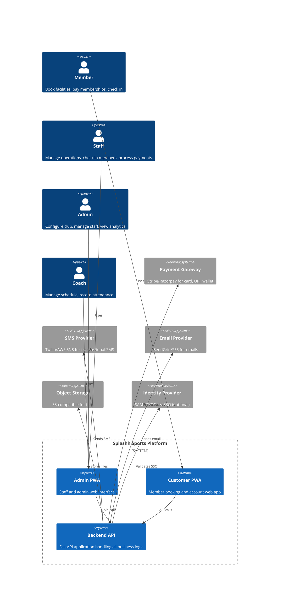
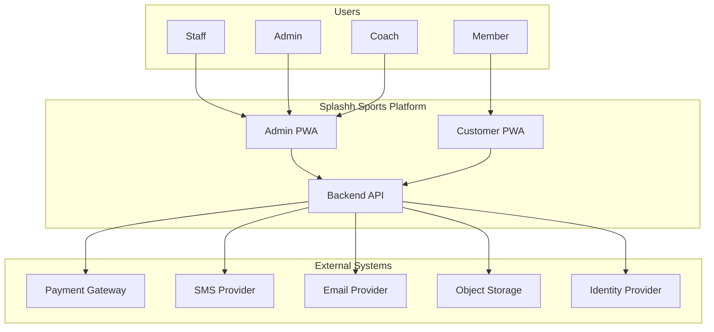

# System Context (C4 Level 1)

> The highest level of abstraction: who uses the system, what external systems it integrates with, and where the system boundary lies.

This document establishes the outermost boundary of the Splashh Sports Platform. It answers: **who** interacts with the system, **what** those interactions accomplish, and **which** external systems the platform depends on. This is the C4 Level 1 diagram — the 10,000-foot view that anchors all subsequent architectural decisions.

---

## Actors (Users)

The platform serves four primary actor types, each with distinct workflows, permissions, and access patterns.

### Member (Customer)

The end consumer who books facilities, pays for memberships, and interacts with the club. Members access the platform primarily through the **Customer PWA** (a Progressive Web App installable on mobile and desktop).

| Attribute | Detail |
|---|---|
| Primary workflow | Browse available slots → Book a facility → Pay → Check in → Receive notifications |
| Access pattern | Mobile-first, intermittent connectivity, expect offline booking queue |
| Security boundary | Authenticated via JWT, tenant-scoped to their club |
| Data sensitivity | Personal identity, payment methods, booking history, health declarations (waivers) |

> **Why PWA for members?** Members are transient users who want zero-friction access without installing an app. PWA provides installability, push notifications, and offline capability — matching the reality of club environments with spotty connectivity.

### Staff

Club employees who manage day-to-day operations: configuring facilities, processing walk-in payments, managing the check-in kiosk, and handling member support. Staff access the platform through the **Admin PWA**.

| Attribute | Detail |
|---|---|
| Primary workflow | Open facility slots → Process payments → Check in members → View reports → Manage member accounts |
| Access pattern | Desktop-first, reliable connectivity, high-frequency operations |
| Security boundary | Authenticated via JWT with role-based permissions, tenant-scoped |
| Data sensitivity | Member PII, financial transactions, operational data |

### Admin

Club managers who configure club settings, manage staff roles, set pricing, configure integrations, and view high-level analytics. Admins also access the **Admin PWA** but with elevated permissions.

| Attribute | Detail |
|---|---|
| Primary workflow | Configure club settings → Manage staff → Set pricing → View analytics → Manage integrations |
| Access pattern | Desktop-first, strategic rather than operational |
| Security boundary | Authenticated via JWT with admin roles, tenant-scoped, MFA required |
| Data sensitivity | All tenant data, audit logs, billing configuration, integration secrets |

### Coach

Instructors who manage their teaching schedules, view class rosters, and record attendance. Coaches access the platform through the **Admin PWA** (they are staff with a specialized role).

| Attribute | Detail |
|---|---|
| Primary workflow | Set availability → View scheduled classes → Record attendance → View earnings |
| Access pattern | Mobile-first, calendar integration important |
| Security boundary | Authenticated via JWT with coach role, tenant-scoped |
| Data sensitivity | Class schedules, student information, earnings data |

---

## External Systems

The platform integrates with five external service categories. Each integration is an abstraction boundary — the backend defines internal contracts so that swapping providers requires code changes in only one place.

### Payment Gateway

Processes credit/debit cards, UPI, net banking, and wallet payments. The platform supports multiple gateway backends (Stripe, Razorpay) to accommodate different regional preferences and pricing structures.

| Integration pattern | Detail |
|---|---|
| Protocol | REST API (provider's webhooks for async events) |
| PCI compliance | Platform never stores PAN or CVV. Tokenization happens client-side or via gateway's tokenization API |
| Idempotency | Every payment intent includes an idempotency key to prevent duplicate charges |
| Failure handling | Automatic retry on network failure, manual reconciliation for disputes |

> **Why separate payment gateway abstraction?** Different tenants have different banking relationships. We abstract the gateway behind an internal interface so tenants can configure their preferred provider without code changes.

### SMS Provider

Delivers transactional SMS notifications: booking confirmations, payment receipts, reminder alerts, and OTP for authentication.

| Integration pattern | Detail |
|---|---|
| Protocol | REST API (Twilio, AWS SNS, or local provider) |
| Rate limiting | Per-provider throttling enforced at application layer |
| Delivery tracking | Webhook callbacks for delivery status updates |
| Fallback | If primary provider fails, queue messages for retry with secondary provider |

### Email Provider

Delivers transactional and marketing emails: booking confirmations, invoices, membership renewals, and newsletters.

| Integration pattern | Detail |
|---|---|
| Protocol | SMTP or REST API (SendGrid, AWS SES) |
| Bounce handling | Webhook callbacks for hard/soft bounces, automatic suppression list updates |
| Templating | Provider-side template rendering with tenant-specific variables |
| Compliance | Unsubscribe headers per RFC 8058, DPDPA-compliant opt-out |

### Object Storage

Stores user-uploaded files: profile photos, facility images, scanned documents (waivers, ID proofs), and generated reports.

| Integration pattern | Detail |
|---|---|
| Protocol | S3-compatible API (AWS S3, MinIO, Cloudflare R2) |
| Access pattern | Pre-signed URLs for uploads; CDN for downloads |
| Retention | Tenant-configurable retention policies; automatic archival after N days |
| Security | Server-side encryption at rest; bucket policies enforce tenant isolation |

### Identity Provider

Optional integration for enterprise tenants who wish to authenticate via their own identity provider (SAML 2.0, OIDC). Most tenants use the platform's native authentication.

| Integration pattern | Detail |
|---|---|
| Protocol | SAML 2.0 or OIDC |
| Attribute mapping | Tenant-configurable mapping from IdP claims to platform roles |
| Session | Platform issues JWT after IdP authentication; IdP session lifetime independent |

---

## System Boundary

The system boundary encompasses all components built and operated by the Splashh engineering team. Everything inside the boundary is our responsibility to secure, scale, and maintain.

> **Note**: The C4Context diagram above uses standard Mermaid syntax. If your Markdown viewer does not render C4 diagrams, the flowchart equivalent below provides the same information.

---

## Multi-Tenant Evolution Story

The platform begins with a single tenant (Splashh Sports Club) but is architected from day one to serve multiple tenants. Understanding this evolution clarifies why certain decisions were made.

### Phase 1: Single Tenant (Splashh Only)

The platform launches with Splashh as the sole tenant. All configuration is hardcoded or minimally parameterized. The primary goal is operational reliability — Splashh's day-to-day operations depend on the platform.

**Characteristics:**

- Single database schema
- No tenant_id column in tables (or always NULL)
- Tenant-specific logic via environment variables
- Minimal multi-tenant abstraction cost

### Phase 2: Shared Infrastructure

The platform adds a second tenant. Configuration-driven behavior becomes essential. Every tenant-specific value (pricing, facility names, branding) moves to database tables.

**Characteristics:**

- tenant_id column added to all tables
- Row-level security via tenant_id filtering
- Tenant-scoped caching
- White-label support (custom CSS, logo, subdomain)

### Phase 3: Multi-Tenant SaaS

The platform operates as a true SaaS with dozens of tenants. Self-service onboarding, tenant-specific pricing tiers, and usage-based billing emerge.

**Characteristics:**

- Tenant self-service signup
- Per-tenant feature flags
- Usage metering and quota enforcement
- Isolation between tenants verified by automated tests

> **Why this evolution?** Premature multi-tenancy adds complexity that provides no value for a single tenant. We invest in the abstraction when the second tenant arrives. This is YAGNI in action — we built the seams but didn't pay the full cost until needed.

---

## Why This Structure

### Single Backend API

We maintain one backend codebase regardless of tenant count. This simplifies operations: one deployment, one set of secrets, one security audit, one set of tests.

**Trade-off:**

- We gain operational simplicity and consistent behavior across tenants.
- We sacrifice the ability to scale individual tenants independently (solved in Phase 3 with tenant-level resource quotas if needed).

### Two Frontend Applications

The Admin PWA and Customer PWA are separate applications. This separation reflects different user personas, security boundaries, and operational cadences.

**Trade-off:**

- We gain clear security boundaries (different attack surfaces), distinct UX patterns, and independent deployment cycles.
- We duplicate some infrastructure code (authentication, API clients). This cost is acceptable because the user experiences are genuinely different.

### External System Abstractions

Every external integration is abstracted behind an internal interface. The payment gateway, SMS, email, and storage integrations can be swapped without affecting business logic.

**Trade-off:**

- We gain flexibility to change providers, test against mocks, and support multiple regional providers.
- We add indirection cost. The abstraction must be thin enough to not obscure the provider's capabilities.

---

## What's Next

- [Container Diagram (C4 L2)](./container-diagram.md) — drill into the containers that compose the system.
- [Component Diagram (C4 L3)](./component-diagram.md) — explore the internal structure of the backend.
- [Module Diagram](./module-diagram.md) — understand bounded contexts and their relationships.
