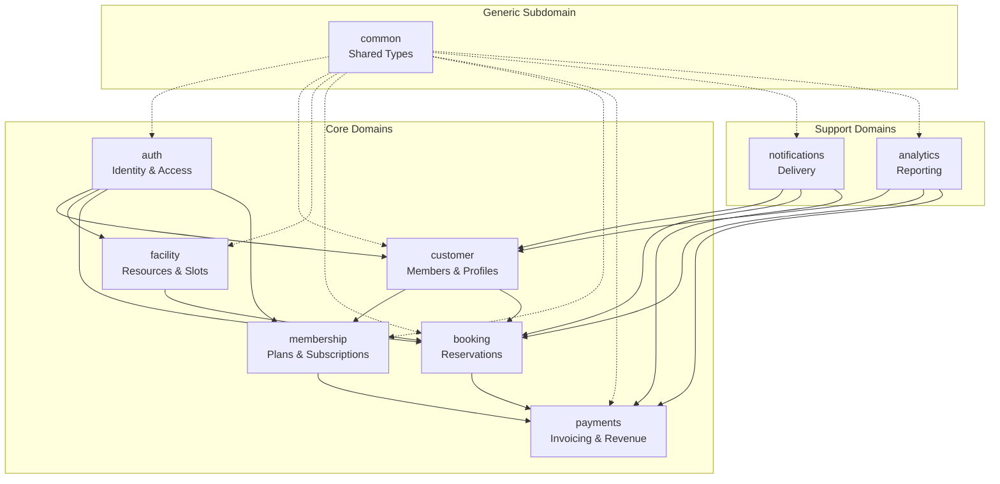

# Bounded Contexts

> Each bounded context: purpose, aggregates, ubiquitous terms, public API style, integration style. Context map visualization.

This document details each bounded context in the domain model. Bounded contexts are the strategic units of DDD — each has a clear responsibility and owns its data. This level answers: **what each context does**, **what it owns**, and **how it integrates with others**.

---

## Context Map



---

## auth Context (Identity & Access)

### Purpose

Manages user identity, authentication, sessions, and role-based access control.

### Aggregates

| Aggregate | Root Entity | Description |
|---|---|---|
| User | User | Identity with credentials, MFA config |
| Session | Session | Active login with device/IP context |
| Tenant | Tenant | Organization (club) |

### Ubiquitous Terms

- **User** — Person who authenticates
- **Session** — Active login
- **Tenant** — Organization
- **Role** — Permission collection (admin, staff, coach, member)
- **MFA** — Multi-factor authentication

### Public API Style

```python
# REST API with JWT Bearer auth
POST   /auth/login          # Authenticate
POST   /auth/logout         # Invalidate session
POST   /auth/refresh        # Rotate token
GET    /auth/me             # Current user
POST   /auth/mfa/setup      # Enable MFA
POST   /auth/mfa/verify     # Verify MFA
```

### Integration Style

- Provides authentication for all other contexts
- Other contexts call auth for user validation
- Events: UserCreated, SessionRevoked

---

## customer Context (Members & Profiles)

### Purpose

Manages member profiles, contact information, guardians, waivers, and KYC.

### Aggregates

| Aggregate | Root Entity | Description |
|---|---|---|
| Customer | Customer | Member with profile |
| Guardian | Guardian | Parent/guardian for minors |
| Waiver | Waiver | Signed liability release |

### Ubiquitous Terms

- **Customer** — Member of the club
- **Guardian** — Parent for junior members
- **Waiver** — Liability release
- **KYC** — Identity verification

### Public API Style

```python
# REST API
GET    /customers                    # List members
GET    /customers/{id}               # Get member
POST   /customers                    # Create member
PATCH  /customers/{id}               # Update member
GET    /customers/{id}/waivers       # Member waivers
POST   /customers/{id}/waiver        # Sign waiver
```

### Integration Style

- Called by booking to verify membership
- Publishes events when customer data changes
- Subscribes to UserCreated event to create profile

---

## facility Context (Resources & Slots)

### Purpose

Manages facilities, resources (courts, pools), availability rules, and slot generation.

### Aggregates

| Aggregate | Root Entity | Description |
|---|---|---|
| Facility | Facility | Physical location |
| Resource | Resource | Bookable item (court, lane) |
| AvailabilityRule | AvailabilityRule | Operating hours |
| Slot | Slot | Time-bound availability |

### Ubiquitous Terms

- **Facility** — Club location
- **Resource** — Bookable item
- **Slot** — Available time slot
- **AvailabilityRule** — Operating schedule
- **BlackoutDate** — Closed date

### Public API Style

```python
# REST API
GET    /facilities                       # List facilities
GET    /facilities/{id}                   # Get facility
GET    /facilities/{id}/resources         # Resources at facility
GET    /facilities/{id}/slots             # Available slots
POST   /resources                        # Create resource (admin)
PATCH  /resources/{id}/availability      # Update availability (admin)
```

### Integration Style

- Publishes events when slots change
- Called by booking to validate and reserve slots

---

## booking Context (Reservations)

### Purpose

Manages reservations, check-in, waitlist, and booking lifecycle.

### Aggregates

| Aggregate | Root Entity | Description |
|---|---|---|
| Booking | Booking | Reservation |
| WaitlistEntry | WaitlistEntry | Slot request |
| CheckIn | CheckIn | Attendance record |

### Ubiquitous Terms

- **Booking** — Reservation
- **Slot** — Time slot (from facility)
- **CheckIn** — Attendance
- **Waitlist** — Demand queue
- **Cancellation** — Booking cancellation

### Public API Style

```python
# REST API
GET    /bookings                     # My bookings
POST   /bookings                     # Create booking
GET    /bookings/{id}                # Get booking
POST   /bookings/{id}/cancel         # Cancel booking
POST   /bookings/{id}/check-in       # Check in
GET    /bookings/waitlist            # My waitlist
POST   /bookings/waitlist            # Join waitlist
```

### Integration Style

- Calls facility to validate slots
- Calls customer to verify membership
- Calls payments to collect fees
- Publishes BookingCreatedEvent, BookingCancelledEvent

---

## membership Context (Plans & Subscriptions)

### Purpose

Manages membership plans, subscriptions, renewals, freezes, upgrades/downgrades.

### Aggregates

| Aggregate | Root Entity | Description |
|---|---|---|
| MembershipPlan | MembershipPlan | Product offering |
| Subscription | Subscription | Active subscription |

### Ubiquitous Terms

- **MembershipPlan** — Product
- **Subscription** — Active plan
- **BillingCycle** — Monthly/Annual
- **Freeze** — Temporary pause
- **Renewal** — Auto-renewal
- **Upgrade/Downgrade** — Plan change

### Public API Style

```python
# REST API
GET    /memberships/plans                  # List plans
GET    /memberships/plans/{id}               # Get plan
GET    /memberships/subscriptions           # My subscriptions
POST   /memberships/subscribe               # Purchase
POST   /memberships/{id}/freeze             # Freeze
POST   /memberships/{id}/cancel             # Cancel
POST   /memberships/{id}/change-plan        # Upgrade/downgrade
```

### Integration Style

- Calls customer for identity
- Calls payments for subscription charges
- Publishes SubscriptionActivatedEvent, SubscriptionExpiredEvent

---

## payments Context (Invoicing & Revenue)

### Purpose

Manages invoicing, payment processing, refunds, and financial tracking.

### Aggregates

| Aggregate | Root Entity | Description |
|---|---|---|
| Invoice | Invoice | Bill |
| Payment | Payment | Transaction |
| Refund | Refund | Payment reversal |

### Ubiquitous Terms

- **Invoice** — Bill
- **Payment** — Transaction
- **Refund** — Reversal
- **PaymentMethod** — Stored credential
- **IdempotencyKey** — Duplicate prevention

### Public API Style

```python
# REST API
GET    /invoices                  # My invoices
GET    /invoices/{id}            # Get invoice
POST   /invoices/{id}/pay        # Pay invoice
POST   /payments/{id}/refund     # Refund (admin)
```

### Integration Style

- Called by booking for booking fees
- Called by membership for subscriptions
- Publishes PaymentSucceededEvent, PaymentFailedEvent

---

## notifications Context (Delivery)

### Purpose

Manages message templates, channel routing (SMS/email/push), and delivery tracking.

### Aggregates

| Aggregate | Root Entity | Description |
|---|---|---|
| Template | NotificationTemplate | Message template |
| Delivery | NotificationDelivery | Delivery record |

### Ubiquitous Terms

- **Template** — Message with placeholders
- **Channel** — SMS, Email, Push, In-App
- **Delivery** — Delivery attempt
- **Suppression** — Opt-out

### Public API Style

```python
# Primarily event-driven
# REST for admin management
GET    /notifications/templates   # List templates
POST   /notifications/templates   # Create template
```

### Integration Style

- Subscribes to all domain events
- Delivers notifications asynchronously
- No direct calls from other modules

---

## analytics Context (Reporting)

### Purpose

Provides aggregated data for dashboards, reports, and exports.

### Aggregates

| Aggregate | Root Entity | Description |
|---|---|---|
| Dashboard | DashboardView | Pre-computed metrics |
| Report | ReportConfig | Report definition |

### Ubiquitous Terms

- **Dashboard** — Real-time metrics
- **Report** — Scheduled export
- **MaterializedView** — Pre-computed query

### Public API Style

```python
# REST API
GET    /analytics/dashboard           # Dashboard metrics
GET    /analytics/reports/{type}     # Generate report
GET    /analytics/export             # Export data
```

### Integration Style

- Reads from all contexts via read replicas
- No direct writes to other contexts
- Uses materialized views for performance

---

## common Context (Shared Kernel)

### Purpose

Contains types shared across all contexts.

### Shared Types

| Type | Description |
|---|---|
| Address | Postal address |
| PhoneNumber | Validated phone |
| Money | Currency + amount |
| DateRange | Start/end range |
| UUID | Identifier |

### Integration Style

- All contexts depend on common
- No circular dependencies

---

## Context Relationships Summary

| Context | Owns | Depends On | Publishes | Subscribes |
|---|---|---|---|---|
| auth | User, Session, Tenant | — | UserCreated | — |
| customer | Customer, Guardian, Waiver | auth | CustomerCreated | UserCreated |
| facility | Facility, Resource, Slot | — | SlotCreated | — |
| booking | Booking, WaitlistEntry, CheckIn | facility, customer, payments | BookingCreated | — |
| membership | MembershipPlan, Subscription | customer, payments | SubscriptionActivated | CustomerCreated |
| payments | Invoice, Payment, Refund | — | PaymentSucceeded | BookingCreated, SubscriptionActivated |
| notifications | Template, Delivery | — | — | All events |
| analytics | Dashboard, Report | — | — | — (read replicas) |

---

## What's Next

- [Aggregates](./aggregates.md) — aggregate roots and boundaries.
- [Module Diagram](../02-architecture/module-diagram.md) — context relationships.
- [Ubiquitous Language](./ubiquitous-language.md) — term definitions.
