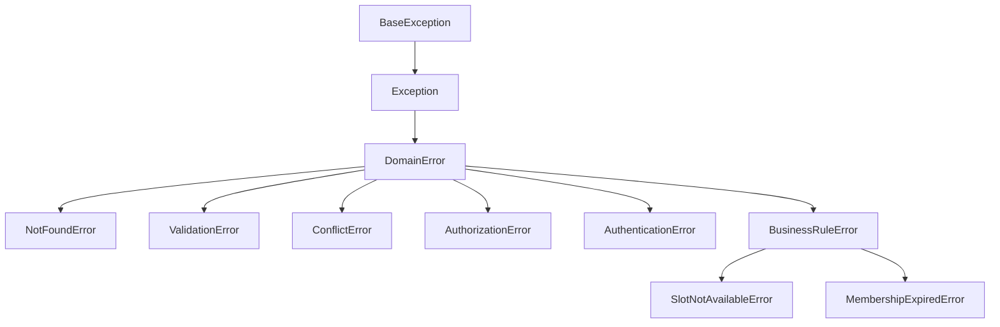

# Error Handling

> This document defines the exception hierarchy, error mapping, and RFC 7807 problem response format.

## Overview

We use a **domain exception hierarchy** that separates business errors from technical errors. Domain exceptions are raised in services and translated to HTTP responses in routers.

## Exception Hierarchy



## Domain Exceptions

```python
# src/booking/domain/exceptions.py
from typing import Optional


class DomainError(Exception):
    """Base exception for all domain errors."""

    def __init__(self, message: str, code: str = "domain_error"):
        self.message = message
        self.code = code
        super().__init__(message)


class NotFoundError(DomainError):
    """Resource not found."""

    def __init__(self, resource: str, identifier: str):
        self.resource = resource
        self.identifier = identifier
        super().__init__(
            message=f"{resource} with ID {identifier} not found",
            code="not_found",
        )


class ValidationError(DomainError):
    """Input validation failed."""

    def __init__(self, message: str, field: Optional[str] = None):
        self.field = field
        super().__init__(message=message, code="validation_error")


class ConflictError(DomainError):
    """Resource state conflict."""

    def __init__(self, message: str, resource_id: Optional[str] = None):
        self.resource_id = resource_id
        super().__init__(message=message, code="conflict")


class AuthorizationError(DomainError):
    """User not authorized for action."""

    def __init__(self, message: str = "Access denied"):
        super().__init__(message=message, code="authorization_error")


class AuthenticationError(DomainError):
    """Authentication failed."""

    def __init__(self, message: str = "Authentication required"):
        super().__init__(message=message, code="authentication_error")


class BusinessRuleError(DomainError):
    """Business rule violation."""
    pass


class SlotNotAvailableError(BusinessRuleError):
    """Requested time slot is not available."""

    def __init__(self, slot_info: str):
        super().__init__(
            message=f"Slot not available: {slot_info}",
            code="slot_not_available",
        )


class BookingAlreadyConfirmedError(BusinessRuleError):
    """Booking is already confirmed."""

    def __init__(self, booking_id: str):
        super().__init__(
            message=f"Booking {booking_id} is already confirmed",
            code="booking_already_confirmed",
        )


class MembershipExpiredError(BusinessRuleError):
    """Membership has expired."""

    def __init__(self, customer_id: str):
        super().__init__(
            message=f"Membership expired for customer {customer_id}",
            code="membership_expired",
        )
```

## Exception Mapping to HTTP

Routers translate domain exceptions to HTTP responses.

```python
# src/common/exceptions.py
from fastapi import Request, status
from fastapi.responses import JSONResponse
from fastapi.exceptions import RequestValidationError

from booking.domain.exceptions import (
    DomainError,
    NotFoundError,
    ValidationError,
    ConflictError,
    AuthorizationError,
    AuthenticationError,
    BusinessRuleError,
)


async def domain_error_handler(request: Request, exc: DomainError) -> JSONResponse:
    """Map domain exceptions to HTTP responses."""
    status_code = {
        NotFoundError: status.HTTP_404_NOT_FOUND,
        ValidationError: status.HTTP_400_BAD_REQUEST,
        ConflictError: status.HTTP_409_CONFLICT,
        AuthorizationError: status.HTTP_403_FORBIDDEN,
        AuthenticationError: status.HTTP_401_UNAUTHORIZED,
        BusinessRuleError: status.HTTP_422_UNPROCESSABLE_ENTITY,
    }.get(type(exc), status.HTTP_500_INTERNAL_SERVER_ERROR)

    return JSONResponse(
        status_code=status_code,
        content={
            "type": f"https://api.splashh.com/errors/{exc.code}",
            "title": exc.__class__.__name__,
            "status": status_code,
            "detail": exc.message,
            "instance": str(request.url),
        },
    )


async def validation_exception_handler(request: Request, exc: RequestValidationError) -> JSONResponse:
    """Handle Pydantic validation errors."""
    errors = []
    for error in exc.errors():
        field = ".".join(str(loc) for loc in error["loc"] if loc != "body")
        errors.append({
            "field": field,
            "message": error["msg"],
            "code": error["type"],
        })

    return JSONResponse(
        status_code=status.HTTP_400_BAD_REQUEST,
        content={
            "type": "https://api.splashh.com/errors/validation_error",
            "title": "Validation Error",
            "status": 400,
            "detail": "Request validation failed",
            "errors": errors,
        },
    )
```

## Register Exception Handlers

```python
# src/main.py
from fastapi import FastAPI
from fastapi.exceptions import RequestValidationError

from common.exceptions import domain_error_handler, validation_exception_handler


app = FastAPI()

# Register exception handlers
app.add_exception_handler(DomainError, domain_error_handler)
app.add_exception_handler(RequestValidationError, validation_exception_handler)
```

## RFC 7807 Problem Details

Every error response follows RFC 7807:

```json
{
  "type": "https://api.splashh.com/errors/not_found",
  "title": "NotFoundError",
  "status": 404,
  "detail": "Booking with ID abc-123 not found",
  "instance": "/v1/bookings/abc-123"
}
```

### With Field Errors

```json
{
  "type": "https://api.splashh.com/errors/validation_error",
  "title": "Validation Error",
  "status": 400,
  "detail": "Request validation failed",
  "errors": [
    {
      "field": "end_time",
      "message": "end_time must be after start_time",
      "code": "value_error"
    },
    {
      "field": "date",
      "message": "booking date cannot be in the past",
      "code": "value_error"
    }
  ],
  "instance": "/v1/bookings"
}
```

## Error Codes

| Code | HTTP Status | Description |
|------|-------------|-------------|
| `not_found` | 404 | Resource doesn't exist |
| `validation_error` | 400 | Invalid input |
| `conflict` | 409 | State conflict |
| `authorization_error` | 403 | Forbidden |
| `authentication_error` | 401 | Unauthorized |
| `slot_not_available` | 422 | Business rule violation |
| `rate_limit_exceeded` | 429 | Too many requests |
| `internal_error` | 500 | Unexpected error |

## Global Exception Handler for Unexpected Errors

```python
# src/common/exceptions.py
import logging
from fastapi import Request, status
from fastapi.responses import JSONResponse

logger = logging.getLogger(__name__)


async def generic_exception_handler(request: Request, exc: Exception) -> JSONResponse:
    """Handle unexpected exceptions."""
    logger.exception(
        "Unhandled exception",
        extra={
            "request_id": request.state.request_id,
            "path": str(request.url),
            "method": request.method,
        },
    )

    return JSONResponse(
        status_code=status.HTTP_500_INTERNAL_SERVER_ERROR,
        content={
            "type": "https://api.splashh.com/errors/internal_error",
            "title": "Internal Server Error",
            "status": 500,
            "detail": "An unexpected error occurred",
            "instance": str(request.url),
        },
    )
```

## Raising Exceptions in Services

```python
# src/booking/application/services.py
from booking.domain.exceptions import (
    NotFoundError,
    SlotNotAvailableError,
    AuthorizationError,
)


class BookingService:
    def confirm_booking(self, booking_id: UUID, actor_id: UUID) -> BookingResult:
        booking = self._repository.get(booking_id)

        if not booking:
            raise NotFoundError("Booking", str(booking_id))

        if not booking.can_be_confirmed_by(actor_id):
            raise AuthorizationError(
                f"User {actor_id} is not authorized to confirm this booking"
            )

        booking.confirm()
        self._repository.save(booking)

        return BookingResult.from_entity(booking)
```

## Logging Errors

```python
# src/common/exceptions.py
import logging
from uuid import UUID


logger = logging.getLogger(__name__)


class DomainError(Exception):
    def __init__(self, message: str, code: str = "domain_error"):
        self.message = message
        self.code = code
        super().__init__(message)

    def log(self, context: dict = None) -> None:
        """Log the error with context."""
        logger.error(
            f"Domain error: {self.code} - {self.message}",
            extra={
                "error_code": self.code,
                "error_message": self.message,
                **(context or {}),
            },
        )
```

## Testing Error Handling

```python
# tests/booking/test_error_handling.py
import pytest
from fastapi.testclient import TestClient

from main import app
from booking.domain.exceptions import NotFoundError


client = TestClient(app)


def test_not_found_error_mapping():
    """Test that NotFoundError maps to 404."""
    response = client.get("/v1/bookings/nonexistent-id")

    assert response.status_code == 404
    data = response.json()
    assert data["type"] == "https://api.splashh.com/errors/not_found"
    assert data["title"] == "NotFoundError"


def test_validation_error_includes_field_details():
    """Test that validation errors include field information."""
    response = client.post("/v1/bookings", json={
        "customer_id": "invalid-uuid",
        "facility_id": "invalid-uuid",
        "date": "not-a-date",
    })

    assert response.status_code == 400
    data = response.json()
    assert "errors" in data
    assert len(data["errors"]) > 0
```

## Anti-Patterns

1. **Catching Exception in router** — Let exceptions propagate to handlers
2. **Returning error dicts** — Use exception handlers
3. **Generic 500 for all errors** — Map specific exceptions to specific codes
4. **Leaking internal details** — Don't expose stack traces in production

## Related Documents

- [Services](services.md)
- [Schemas & Validation](schemas-validation.md)
- [Error Responses](../08-apis/error-responses.md)
- [Status Codes](../08-apis/status-codes.md)
