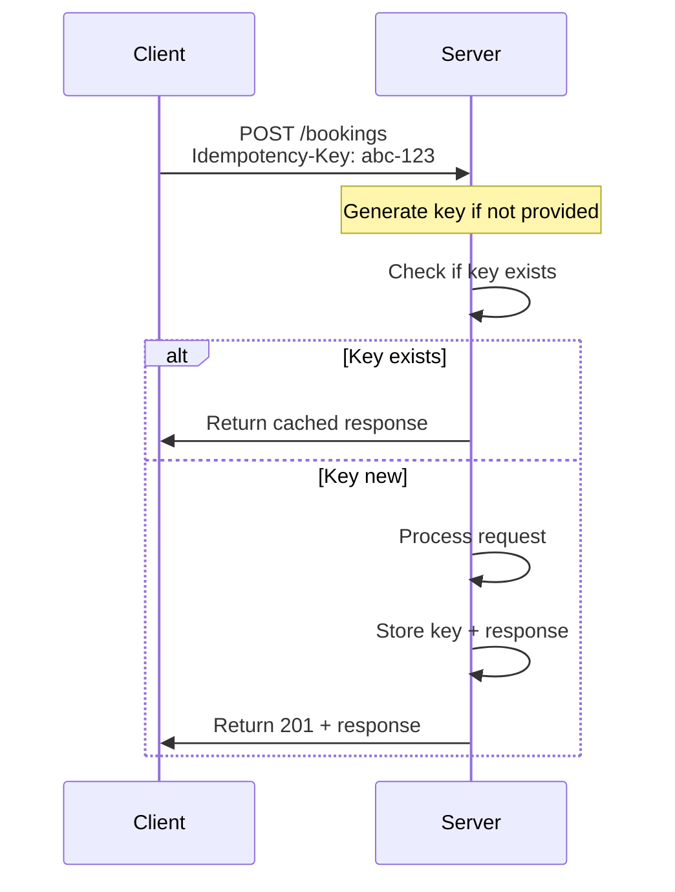

# Idempotency

> This document covers idempotency key patterns for safe API retries, response caching, and duplicate detection.

## Overview

**Idempotency** means that making the same request multiple times produces the same result. This is critical for:

1. **Retry safety** — Network failures cause automatic retries
2. **Client errors** — Users double-click submit buttons
3. **Exactly-once semantics** — For payments and bookings

## Idempotency Key Pattern

Clients include a unique key with POST requests. The server stores the key with the response for a defined period.



## Implementation

### Storage

Use Redis with TTL for idempotency keys:

```python
# src/common/idempotency.py
import json
import hashlib
from typing import Optional, Any
from uuid import UUID

import redis.asyncio as redis


class IdempotencyService:
    """Service for handling idempotency keys."""

    def __init__(self, redis_client: redis.Redis, ttl_seconds: int = 86400):
        self._redis = redis_client
        self._ttl = ttl_seconds
        self._prefix = "idempotency:"

    def _make_key(self, key: str, tenant_id: UUID) -> str:
        """Create Redis key with tenant isolation."""
        return f"{self._prefix}{tenant_id}:{key}"

    async def get(self, key: str, tenant_id: UUID) -> Optional[dict]:
        """Get cached response for idempotency key."""
        redis_key = self._make_key(key, tenant_id)
        data = await self._redis.get(redis_key)
        if data:
            return json.loads(data)
        return None

    async def set(
        self,
        key: str,
        tenant_id: UUID,
        response: dict,
        status_code: int,
    ) -> None:
        """Store response for idempotency key."""
        redis_key = self._make_key(key, tenant_id)
        payload = {
            "status_code": status_code,
            "response": response,
        }
        await self._redis.setex(
            redis_key,
            self._ttl,
            json.dumps(payload),
        )

    async def exists(self, key: str, tenant_id: UUID) -> bool:
        """Check if idempotency key exists."""
        redis_key = self._make_key(key, tenant_id)
        return await self._redis.exists(redis_key) > 0
```

### Middleware

```python
# src/common/middleware.py
from fastapi import Request, Response
from fastapi.responses import JSONResponse
from starlette.middleware.base import BaseHTTPMiddleware

from common.idempotency import IdempotencyService


class IdempotencyMiddleware(BaseHTTPMiddleware):
    """Handle idempotency keys for POST/PATCH/PUT requests."""

    async def dispatch(self, request: Request, call_next):
        # Only for mutating methods
        if request.method not in ("POST", "PUT", "PATCH"):
            return await call_next(request)

        # Get idempotency key from header
        idempotency_key = request.headers.get("Idempotency-Key")

        if not idempotency_key:
            # Auto-generate if not provided (optional)
            idempotency_key = str(uuid4())

        # Get tenant from request state
        tenant_id = getattr(request.state, "tenant_id", None)

        if tenant_id:
            # Check for cached response
            idempotency_service = request.app.state.idempotency_service
            cached = await idempotency_service.get(idempotency_key, tenant_id)

            if cached:
                # Return cached response
                return JSONResponse(
                    status_code=cached["status_code"],
                    content=cached["response"],
                    headers={
                        "Idempotency-Key": idempotency_key,
                        "X-Idempotent-Replayed": "true",
                    },
                )

            # Store reference for later
            request.state.idempotency_key = idempotency_key

        response = await call_next(request)

        # Cache successful responses (2xx)
        if 200 <= response.status_code < 300 and tenant_id:
            # Read response body
            body = b""
            async for chunk in response.body_iterator:
                body += chunk

            response_body = json.loads(body)

            await idempotency_service.set(
                idempotency_key,
                tenant_id,
                response_body,
                response.status_code,
            )

            # Return new response
            return JSONResponse(
                status_code=response.status_code,
                content=response_body,
                headers={
                    "Idempotency-Key": idempotency_key,
                },
            )

        return response
```

### Usage in Router

```python
# src/booking/interfaces/router.py
from fastapi import APIRouter, Depends, Request
from common.idempotency import IdempotencyService


router = APIRouter()


@router.post(
    "/bookings",
    response_model=BookingOut,
    status_code=status.HTTP_201_CREATED,
)
async def create_booking(
    request: Request,
    data: BookingCreate,
    service: BookingService = Depends(get_booking_service),
    idempotency: IdempotencyService = Depends(get_idempotency_service),
):
    # Check idempotency - business logic can use it too
    existing = await idempotency.get(
        request.state.idempotency_key,
        request.state.tenant_id,
    )
    if existing:
        return BookingOut(**existing["response"])

    # Normal processing
    booking = service.create_booking(data)

    return BookingOut.from_entity(booking)
```

## Client Usage

```python
import requests
import uuid

# Generate idempotency key
idempotency_key = str(uuid.uuid4())

# Make request
response = requests.post(
    "https://api.splashh.com/v1/bookings",
    json={...},
    headers={
        "Idempotency-Key": idempotency_key,
        "Authorization": f"Bearer {token}",
    },
)

# Response includes the key
print(response.headers.get("Idempotency-Key"))

# Safe to retry with same key if network error
if response.status_code == 0:  # Network error
    response = requests.post(
        "https://api.splashh.com/v1/bookings",
        json={...},
        headers={"Idempotency-Key": idempotency_key},
    )
```

## Validation

```python
# Validate idempotency key format
class IdempotencyKey:
    @field_validator("idempotency_key")
    @classmethod
    def validate_key(cls, v: str) -> str:
        if not v:
            raise ValueError("Idempotency-Key is required")

        if len(v) < 16:
            raise ValueError("Idempotency-Key must be at least 16 characters")

        # Allow UUIDs or custom keys
        if not (v.replace("-", "").isalnum()):
            raise ValueError("Idempotency-Key must be alphanumeric")

        return v
```

## TTL Selection

| Resource | TTL | Rationale |
|----------|-----|-----------|
| Bookings | 24 hours | Typical booking window |
| Payments | 7 days | Dispute window |
| Subscriptions | 24 hours | Quick operations |

## Conflict Detection

For same key but different body, return 409:

```python
async def dispatch(self, request: Request, call_next):
    existing = await idempotency.get(key, tenant_id)
    if existing:
        # Compare request body
        if existing.get("body_hash") != hash(request.body):
            return JSONResponse(
                status_code=409,
                content={
                    "type": "https://api.splashh.com/errors/idempotency_conflict",
                    "title": "Idempotency Conflict",
                    "detail": "Request with same key but different body",
                },
            )
```

## Testing

```python
# tests/api/test_idempotency.py
import pytest
from fastapi.testclient import TestClient


def test_idempotent_request(client: TestClient):
    """Test that duplicate requests return same response."""
    key = "test-idempotency-key-12345678"

    response1 = client.post(
        "/v1/bookings",
        json={...},
        headers={"Idempotency-Key": key},
    )

    response2 = client.post(
        "/v1/bookings",
        json={...},
        headers={"Idempotency-Key": key},
    )

    assert response1.status_code == response2.status_code
    assert response1.json() == response2.json()
    assert response2.headers.get("X-Idempotent-Replayed") == "true"


def test_different_body_same_key(client: TestClient):
    """Test that different body with same key returns 409."""
    key = "test-idempotency-key-12345678"

    client.post(
        "/v1/bookings",
        json={"facility_id": "a"},
        headers={"Idempotency-Key": key},
    )

    response = client.post(
        "/v1/bookings",
        json={"facility_id": "b"},
        headers={"Idempotency-Key": key},
    )

    assert response.status_code == 409
```

## Related Documents

- [API Idempotency](../08-apis/idempotency.md)
- [Event Idempotency](../07-events/idempotency.md)
- [Background Tasks](background-tasks.md)
