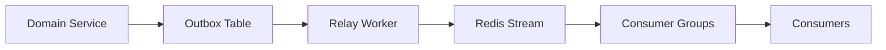

# Event Bus

> This document covers the event bus architecture, outbox pattern, Redis Streams implementation, and consumer groups.

## Overview

The **event bus** is the backbone of our event-driven architecture. We use **Redis Streams** as the transport with the **outbox pattern** for reliability.

## Architecture



## Why Redis Streams

| Feature | Redis Streams | Kafka | RabbitMQ |
|---------|---------------|-------|----------|
| Complexity | Low | High | Medium |
| Ordering | Per stream | Per partition | Per queue |
| Replay | Yes | Yes | Limited |
| Durability | AOF + RDB | Replicas | Durability |
| Latency | Low | Medium | Low |

## Outbox Pattern

The outbox pattern ensures **atomicity** between domain changes and event publishing.

### Database Table

```sql
CREATE TABLE outbox (
    id UUID PRIMARY KEY DEFAULT gen_random_uuid(),
    event_type VARCHAR(100) NOT NULL,
    event_id UUID NOT NULL,
    payload JSONB NOT NULL,
    tenant_id UUID NOT NULL,
    created_at TIMESTAMPTZ NOT NULL DEFAULT NOW(),
    processed_at TIMESTAMPTZ,
    retry_count INTEGER DEFAULT 0,
    last_error TEXT
);

CREATE INDEX idx_outbox_pending ON outbox(created_at)
    WHERE processed_at IS NULL;
```

### Publishing Events

```python
# src/common/event_bus.py
from dataclasses import dataclass
from typing import Any
import json
import uuid


class EventBus:
    """Event bus with outbox pattern."""

    def __init__(self, db_session, redis_client):
        self._db = db_session
        self._redis = redis_client

    def publish(self, event: Any) -> None:
        """Publish event to outbox (same transaction as domain changes)."""
        event_id = getattr(event, 'event_id', uuid.uuid4())

        outbox_record = Outbox(
            event_type=event.__class__.__name__,
            event_id=event_id,
            payload=json.dumps(event.__dict__),
            tenant_id=getattr(event, 'tenant_id', None),
        )

        self._db.add(outbox_record)
        # Don't flush - let the UoW commit both domain changes and outbox
```

### Relay Worker

```python
# src/worker/relay.py
import asyncio
import json
import redis.asyncio as redis


class EventRelayWorker:
    """Relay outbox events to Redis Streams."""

    def __init__(self, db_pool, redis: redis.Redis):
        self._db_pool = db_pool
        self._redis = redis
        self._stream_name = "splashh:events"

    async def run(self):
        """Continuously poll outbox and publish to stream."""
        while True:
            async with self._db_pool.connect() as conn:
                # Get unprocessed events
                rows = await conn.fetch("""
                    SELECT id, event_type, event_id, payload, tenant_id
                    FROM outbox
                    WHERE processed_at IS NULL
                    AND retry_count < 6
                    ORDER BY created_at ASC
                    LIMIT 100
                """)

                for row in rows:
                    try:
                        # Publish to Redis Stream
                        await self._redis.xadd(
                            self._stream_name,
                            {
                                "event_type": row["event_type"],
                                "event_id": str(row["event_id"]),
                                "tenant_id": str(row["tenant_id"]),
                                "payload": row["payload"],
                            },
                            maxlen=10000,  # Keep last 10k events
                        )

                        # Mark as processed
                        await conn.execute("""
                            UPDATE outbox
                            SET processed_at = NOW()
                            WHERE id = $1
                        """, row["id"])

                    except Exception as e:
                        # Update retry count
                        await conn.execute("""
                            UPDATE outbox
                            SET retry_count = retry_count + 1,
                                last_error = $2
                            WHERE id = $1
                        """, row["id"], str(e))

            await asyncio.sleep(1)  # Poll every second
```

## Redis Streams

### Publishing

```python
class RedisEventBus:
    """Redis Streams implementation."""

    def __init__(self, redis_client: redis.Redis):
        self._redis = redis_client
        self._stream = "splashh:events"

    async def publish(self, event: Any) -> None:
        """Publish event to stream."""
        event_data = {
            "event_type": event.__class__.__name__,
            "event_id": str(getattr(event, 'event_id', uuid.uuid4())),
            "payload": json.dumps(event.__dict__),
        }

        await self._redis.xadd(self._stream, event_data)
```

### Consumer Groups

```python
class EventConsumer:
    """Consumer group for processing events."""

    def __init__(self, redis: redis.Redis, group_name: str, consumer_name: str):
        self._redis = redis
        self._group = group_name
        self._consumer = consumer_name
        self._stream = "splashh:events"

    async def setup(self):
        """Create consumer group if not exists."""
        try:
            await self._redis.xgroup_create(
                self._stream,
                self._group,
                id="0",  # Read from beginning
                mkstream=True
            )
        except redis.ResponseError as e:
            if "BUSYGROUP" not in str(e):
                raise

    async def consume(self, handler: callable):
        """Consume events from stream."""
        while True:
            messages = await self._redis.xreadgroup(
                groupname=self._group,
                consumername=self._consumer,
                streams={self._stream: ">"},
                count=10,
                block=5000,
            )

            for stream, entries in messages:
                for msg_id, msg in entries:
                    try:
                        event_data = msg
                        event = self._deserialize(event_data)
                        await handler(event)

                        # Acknowledge
                        await self._redis.xack(
                            self._stream,
                            self._group,
                            msg_id
                        )

                    except Exception as e:
                        # Will be retried by consumer
                        logger.error(f"Event processing failed: {e}")
                        raise
```

## Consumer Implementation

```python
# src/notifications/handlers.py
from booking.domain.events import BookingCreatedEvent
from notifications.application.services import NotificationService


class BookingEventHandler:
    """Handle booking events."""

    def __init__(self, notification_service: NotificationService):
        self._notifications = notification_service

    async def handle(self, event_data: dict):
        """Handle booking created event."""
        if event_data["event_type"] == "BookingCreatedEvent":
            event = BookingCreatedEvent(**json.loads(event_data["payload"]))
            await self._notifications.send_booking_confirmation(event)
```

## Event Ordering

> **Rule** — Events are ordered per aggregate within a stream.

```python
# Events from same aggregate maintain order
# booking:created -> booking:confirmed -> booking:completed

# Events from different aggregates may interleave
```

## Testing Events

```python
# tests/events/test_event_bus.py
import pytest
from unittest.mock import AsyncMock


@pytest.mark.asyncio
async def test_event_published_to_outbox(event_bus, db_session):
    event = BookingCreatedEvent(
        booking_id=uuid4(),
        tenant_id=uuid4(),
        customer_id=uuid4(),
        facility_id=uuid4(),
        slot_date="2024-01-15",
        slot_start_time="10:00",
        slot_end_time="11:00",
        status="pending",
    )

    # Publish event
    event_bus.publish(event)

    # Commit transaction
    await db_session.commit()

    # Verify in outbox
    result = await db_session.fetch("SELECT * FROM outbox")
    assert len(result) == 1
    assert result[0]["event_type"] == "BookingCreatedEvent"
```

## Anti-Patterns

1. **No outbox** — Domain changes committed without event
2. **No ordering** — Events from same aggregate processed out of order
3. **No consumer groups** — Multiple consumers get duplicate events
4. **No retry** — Failed events lost

## Related Documents

- [Event Catalog](event-catalog.md)
- [Retry & Failure](retry-failure.md)
- [Event Idempotency](idempotency.md)
