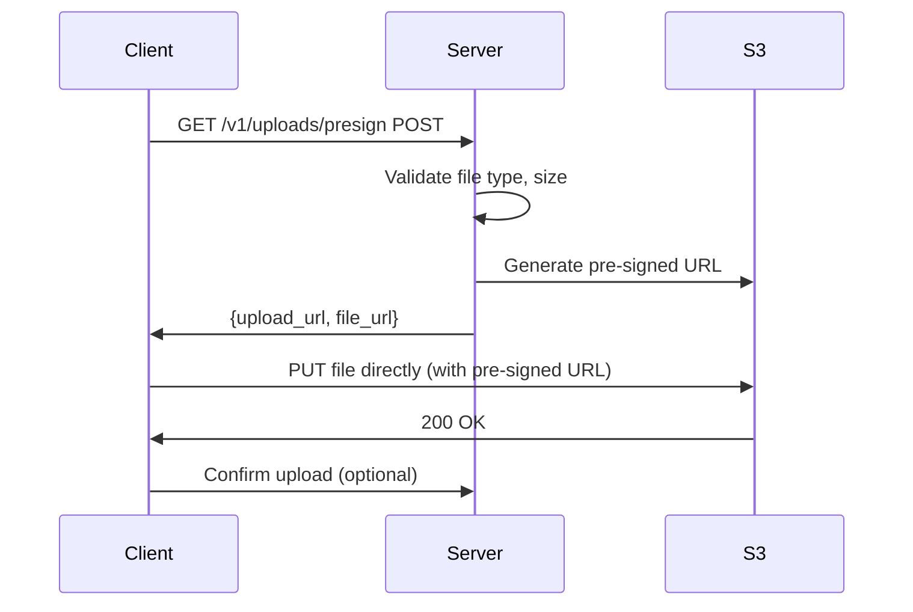

# File Uploads

> This document covers direct-to-S3 uploads, pre-signed URLs, and file validation.

## Overview

We use **pre-signed URLs** for file uploads. This avoids proxying large files through the API server and reduces load.

## Architecture



## Presigned URL Endpoint

```python
# src/uploads/router.py
from fastapi import APIRouter, Depends, HTTPException, status
from pydantic import BaseModel
from uuid import UUID
import boto3


class PresignRequest(BaseModel):
    filename: str
    content_type: str
    size_bytes: int


class PresignResponse(BaseModel):
    upload_url: str
    file_url: str
    expires_in: int = 3600


ALLOWED_TYPES = {
    "image/jpeg",
    "image/png",
    "image/webp",
    "application/pdf",
}

MAX_SIZE = 10 * 1024 * 1024  # 10 MB


@router.post("/uploads/presign", response_model=PresignResponse)
async def presign_upload(
    request: PresignRequest,
    s3_client = Depends(get_s3_client),
    settings = Depends(get_settings),
):
    # Validate content type
    if request.content_type not in ALLOWED_TYPES:
        raise HTTPException(
            status_code=status.HTTP_400_BAD_REQUEST,
            detail=f"Invalid content type. Allowed: {ALLOWED_TYPES}",
        )

    # Validate size
    if request.size_bytes > MAX_SIZE:
        raise HTTPException(
            status_code=status.HTTP_400_BAD_REQUEST,
            detail=f"File too large. Max size: {MAX_SIZE} bytes",
        )

    # Generate unique key
    file_key = f"uploads/{request.filename}"

    # Generate presigned URL
    upload_url = s3_client.generate_presigned_url(
        "put_object",
        Params={
            "Bucket": settings.S3_BUCKET,
            "Key": file_key,
            "ContentType": request.content_type,
        },
        ExpiresIn=3600,
    )

    file_url = f"https://{settings.S3_BUCKET}.s3.amazonaws.com/{file_key}"

    return PresignResponse(
        upload_url=upload_url,
        file_url=file_url,
    )
```

## Client Upload Flow

```javascript
// 1. Request presigned URL
const response = await fetch('/api/v1/uploads/presign', {
  method: 'POST',
  headers: {'Authorization': `Bearer ${token}`},
  body: JSON.stringify({
    filename: 'photo.jpg',
    content_type: 'image/jpeg',
    size_bytes: 1024000
  })
});

const { upload_url, file_url } = await response.json();

// 2. Upload directly to S3
await fetch(upload_url, {
  method: 'PUT',
  headers: {'Content-Type': 'image/jpeg'},
  body: fileBlob
});

// 3. Use file_url in your application
console.log('Uploaded file:', file_url);
```

## Validation

### Server-Side Validation

```python
# Validate after upload (async)
class UploadConfirmation(BaseModel):
    file_url: str
    file_key: str
    expected_size: int
    expected_content_type: str


@router.post("/uploads/confirm")
async def confirm_upload(
    request: UploadConfirmation,
    s3_client = Depends(get_s3_client),
    settings = Depends(get_settings),
):
    # Get file metadata from S3
    response = s3_client.head_object(
        Bucket=settings.S3_BUCKET,
        Key=request.file_key,
    )

    # Validate
    if response["ContentLength"] != request.expected_size:
        raise HTTPException(400, "Size mismatch")

    if response["ContentType"] != request.expected_content_type:
        raise HTTPException(400, "Content type mismatch")

    return {"status": "confirmed", "file_url": request.file_url}
```

## Malware Scanning

```python
# Virus scan uploaded files (async job)
async def scan_uploaded_file(file_key: str):
    # Download from S3
    # Scan with ClamAV or cloud service (e.g., SentinelOne)
    # If malicious: delete from S3 and notify

    await scanning_service.scan(
        file_key,
        on_complete=handle_scan_result,
    )
```

## Upload for Entity

```python
# Associate upload with entity
@router.post("/v1/customers/{customer_id}/avatar")
async def upload_avatar(
    customer_id: UUID,
    presign: PresignRequest,
    s3_client = Depends(get_s3_client),
):
    # Generate presigned URL with customer-specific path
    file_key = f"customers/{customer_id}/avatar/{presign.filename}"

    # ... generate URL ...

    # Update customer record
    await customer_repo.update_avatar(customer_id, file_url)

    return {"file_url": file_url}
```

## Response

```json
{
  "upload_url": "https://splashh-uploads.s3.amazonaws.com/...?Signature=...",
  "file_url": "https://splashh-uploads.s3.amazonaws.com/uploads/photo.jpg",
  "expires_in": 3600
}
```

## Security

1. **Validate content type** — Don't trust client-provided MIME
2. **Validate size** — Prevent large file attacks
3. **Generate unique keys** — Prevent overwrites
4. **Scan for malware** — Prevent malicious uploads
5. **Use HTTPS** — Encrypt in transit

## Anti-Patterns

1. **Proxy through API** — Slow, high memory usage
2. **No size limit** — DoS via large files
3. **No content type validation** — Execute uploaded code
4. **Predictable filenames** — Overwrite existing files

## Related Documents

- [Security - Input Validation](../09-security/input-validation.md)
- [Security - File Upload Security](../09-security/overview.md)
