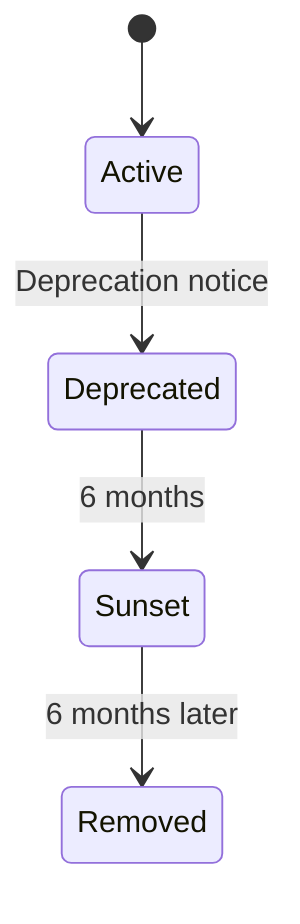

# API Versioning

> This document covers API versioning strategies, deprecation policies, and sunset headers.

## Overview

We use **URL path versioning** for clear visibility and simplicity. Each version is a separate URL prefix.

## Version Strategy

### URL Path (Preferred)

```
https://api.splashh.com/v1/bookings
https://api.splashh.com/v2/bookings
```

> **Rule** — URL prefix versioning is the standard approach.

### Why Not Header Versioning

| Approach | Pros | Cons |
|----------|------|------|
| URL path | Visible, cacheable, simple | URL changes on version bump |
| Header | Clean URLs | Hidden, requires client config |

## Version Lifecycle



## Deprecation Timeline

| Phase | Duration | Action |
|-------|----------|--------|
| Active | - | Full support, new features |
| Deprecated | 6 months | Works, documented, warning header |
| Sunset | After 6 months | Returns 410 Gone |
| Removed | 6 months later | Endpoint deleted |

## Implementation

### Adding a New Version

```python
# src/main.py
from fastapi import FastAPI
from booking.v1.router import router as booking_v1
from booking.v2.router import router as booking_v2

app = FastAPI()

app.include_router(booking_v1, prefix="/v1")
app.include_router(booking_v2, prefix="/v2")
```

### Deprecation Header

```python
# src/common/responses.py
from fastapi import Response


def deprecated_endpoint(response: Response, sunset_date: str):
    """Mark endpoint as deprecated."""
    response.headers["Deprecation"] = "true"
    response.headers["Sunset"] = sunset_date
    response.headers["Link"] = '<https://api.splashh.com/v2/bookings>; rel="successor-version"'
```

### Sunset Response

```python
# src/booking/v1/router.py
from datetime import datetime

SUNSET_DATE = "2024-07-01T00:00:00Z"


@router.get("/bookings", deprecated=True)
async def list_bookings_deprecated():
    """DEPRECATED: Use /v2/bookings instead."""
    from fastapi.responses import JSONResponse

    return JSONResponse(
        status_code=410,
        content={
            "type": "https://api.splashh.com/errors/endpoint_gone",
            "title": "Endpoint Deprecated",
            "detail": "This endpoint has been deprecated. Use /v2/bookings instead.",
            "sunset": SUNSET_DATE,
        },
        headers={
            "Deprecation": "true",
            "Sunset": SUNSET_DATE,
            "Link": '<https://api.splashh.com/v2/bookings>; rel="successor-version"',
        },
    )
```

## Version Detection

```python
# Determine version from path
def get_version_from_path(path: str) -> str:
    """Extract version from URL path."""
    match = re.match(r'/v(\d+)', path)
    if match:
        return f"v{match.group(1)}"
    return "v1"  # Default
```

## Client Version Handling

```python
# API client should handle versions
class SplashhClient:
    def __init__(self, base_url: str, version: str = "v1"):
        self.base_url = base_url
        self.version = version
        self.bookings = BookingsClient(self)

    def _request(self, method, endpoint, **kwargs):
        url = f"{self.base_url}/{self.version}{endpoint}"
        return requests.request(method, url, **kwargs)


# Usage
client = SplashhClient("https://api.splashh.com", version="v2")
bookings = client.bookings.list()
```

## Breaking vs Non-Breaking Changes

### Non-Breaking (Minor Version)

- Add new optional field
- Add new endpoint
- Add new enum value
- Fix error message text
- Change field order in response

### Breaking (Major Version)

- Remove field
- Rename field
- Change field type
- Change validation rules
- Remove endpoint

## Migration Guide

For major version changes, document migration:

```markdown
## Migration Guide: v1 to v2

### Changes
1. Response now includes `facility_name` and `facility_type`
2. New `metadata` field added
3. `status` values changed: `confirmed` -> `active`

### Actions Required
1. Update client to handle new fields (backward compatible)
2. Update `status` values in any hardcoded checks
3. Use `/v2/bookings` for new integrations

### Timeline
- v1 Deprecated: January 1, 2024
- v1 Sunset: July 1, 2024
- v1 Removed: January 1, 2025
```

## Testing Versions

```python
# tests/api/test_versioning.py
import pytest


def test_v1_endpoint_available(client):
    response = client.get("/v1/bookings")
    assert response.status_code == 200


def test_v2_endpoint_available(client):
    response = client.get("/v2/bookings")
    assert response.status_code == 200


def test_deprecated_endpoint_returns_410(client):
    response = client.get("/v1/bookings/deprecated")
    assert response.status_code == 410
    assert "Sunset" in response.headers


def test_deprecated_endpoint_has_warning(client):
    response = client.get("/v1/bookings")
    assert "Deprecation" in response.headers or response.status_code != 410
```

## Related Documents

- [REST Design](rest-design.md)
- [Status Codes](status-codes.md)
- [OpenAPI](openapi.md)
