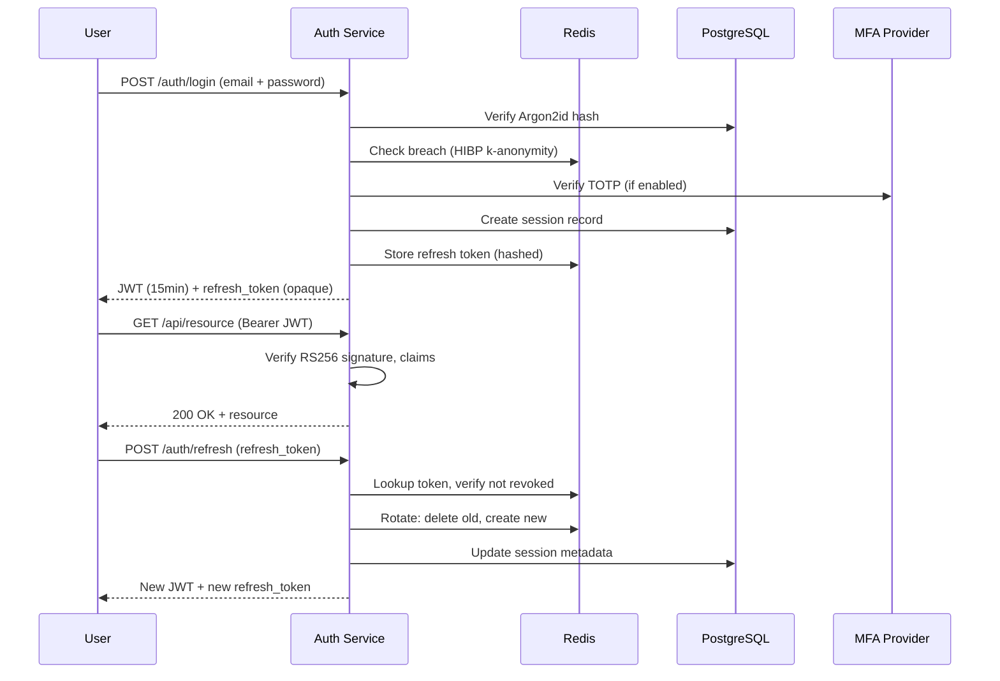
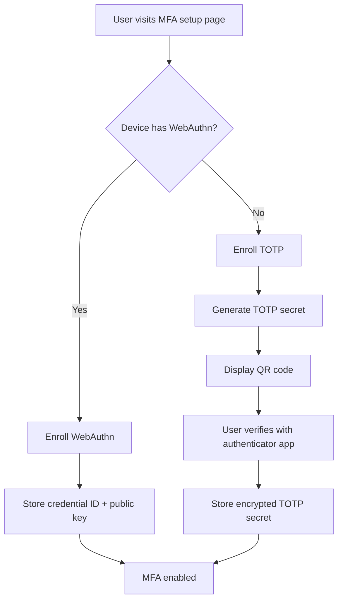

# Authentication

> This document details the authentication architecture for the Splashh platform, covering credential management, token lifecycle, MFA requirements, and account security controls.

Authentication is the first line of defense. The Splashh platform uses a split-token architecture: short-lived JWT access tokens for stateless API authentication, and opaque rotating refresh tokens for persistent sessions. This design balances security (short access token lifetime limits exposure window) with usability (members do not re-authenticate every 15 minutes).

---

## Authentication Architecture



---

## Password Security

### Hashing Algorithm: Argon2id

We use **Argon2id** (Argon2 version 1.3) for password hashing. Argon2id is the winner of the Password Hashing Competition and is specifically designed to resist GPU-based and timing-based attacks. We use the recommended parameters:

```python
# Python example using argon2-cffi
from argon2 import PasswordHasher

ph = PasswordHasher(
    time_cost=3,      # Number of iterations
    memory_cost=65536, # 64 MB memory usage
    parallelism=4,    # Parallel threads
    hash_len=32,      # 256-bit output
    type=Type.ID      # Argon2id variant
)

def hash_password(password: str) -> str:
    return ph.hash(password)

def verify_password(password: str, password_hash: str) -> bool:
    try:
        return ph.verify(password_hash, password)
    except VerifyMismatchError:
        return False
```

> **Rule** — Never use bcrypt, scrypt, or PBKDF2 for new implementations. Argon2id is the only approved password hashing algorithm.

> **Why Argon2id** — Argon2id combines the best properties of Argon2d (GPU-resistant) and Argon2i (memory-hard). The `id` variant is recommended by OWASP for applications where the hash is stored server-side, which is our case. Parameters are tuned for a 100-500ms verify time on modern hardware — fast enough for UX, slow enough to deter brute force.

### Password Breach Detection

Before accepting a password during registration or password change, we check it against the Have I Been Pwned (HIBP) database using **k-anonymity**:

```python
import hashlib
import httpx

def check_breach(password: str) -> bool:
    """Check password against HIBP using k-anonymity."""
    sha1 = hashlib.sha1(password.encode()).hexdigest().upper()
    prefix, suffix = sha1[:5], sha1[5:]

    response = httpx.get(
        f"https://api.pwnedpasswords.com/range/{prefix}",
        timeout=5.0
    )
    response.raise_for_status()

    for line in response.text.splitlines():
        hash_suffix, count = line.split(":")
        if hash_suffix == suffix:
            return True  # Password found in breach
    return False
```

This approach sends only the first 5 characters of the SHA-1 hash to HIBP, ensuring the full password hash never leaves our infrastructure.

---

## Token Architecture

### Access Token: JWT (15 minutes)

Access tokens are **stateless JWTs** signed with RS256. They contain only the claims necessary for authorization:

```python
from datetime import datetime, timedelta
from jose import jwt

def create_access_token(
    user_id: str,
    tenant_id: str,
    roles: list[str],
    private_key: bytes
) -> str:
    now = datetime.utcnow()
    payload = {
        "iss": "splashh-auth",           # Issuer
        "sub": user_id,                  # Subject (user ID)
        "aud": "splashh-api",            # Audience
        "iat": now,                      # Issued at
        "exp": now + timedelta(minutes=15), # Expiration
        "jti": uuid.uuid4().hex,         # Unique token ID
        "tenant_id": tenant_id,
        "roles": roles
    }
    return jwt.encode(payload, private_key, algorithm="RS256")
```

> **Rule** — Access tokens must be short-lived (15 minutes maximum). Shorter lifetimes limit the window during which a stolen token can be used.

### Refresh Token: Opaque (30 days, rotated)

Refresh tokens are **opaque** — they are not JWTs. They are stored server-side in Redis with a hashed representation:

```python
import secrets
import hashlib

def create_refresh_token() -> tuple[str, str]:
    """Create a refresh token pair: raw (sent to client) and hashed (stored)."""
    raw_token = secrets.token_urlsafe(32)
    hashed = hashlib.sha256(raw_token.encode()).hexdigest()
    return raw_token, hashed

def store_refresh_token(
    redis_client,
    user_id: str,
    hashed_token: str,
    family_id: str = None
):
    """Store refresh token with family tracking for reuse detection."""
    family = family_id or str(uuid.uuid4())
    pipe = redis_client.pipeline()
    # Token expires in 30 days
    pipe.setex(f"refresh:{hashed_token}", timedelta(days=30), f"{user_id}:{family}")
    # Track family for reuse detection
    pipe.sadd(f"family:{family}", hashed_token)
    pipe.expire(f"family:{family}", timedelta(days=30))
    pipe.execute()
    return family
```

> **Why opaque refresh tokens** — Storing refresh tokens server-side enables rotation, revocation, and reuse detection. A JWT refresh token cannot be revoked without a token revocation list, which adds latency and complexity. Opaque tokens give us precise control over session lifecycle.

### Token Rotation

Every use of a refresh token triggers rotation: the old token is invalidated and a new one issued. This pattern detects token theft — if an attacker steals a refresh token and uses it, the legitimate user's next refresh will fail because the token has been invalidated.

```python
def rotate_refresh_token(
    redis_client,
    raw_token: str,
    user_id: str
) -> tuple[str, str] | None:
    """Rotate refresh token: consume old, issue new."""
    hashed = hashlib.sha256(raw_token.encode()).hexdigest()
    stored = redis_client.get(f"refresh:{hashed}")

    if not stored:
        return None  # Token already used or revoked

    stored_user_id, family_id = stored.split(":")

    if stored_user_id != user_id:
        # Token stolen — revoke entire family
        redis_client.delete(f"refresh:{hashed}")
        redis_client.delete(f"family:{family_id}")
        # TODO: Notify user, invalidate all sessions
        return None

    # Token valid — rotate
    redis_client.delete(f"refresh:{hashed}")
    redis_client.srem(f"family:{family_id}", hashed)

    new_raw, new_hashed = create_refresh_token()
    store_refresh_token(redis_client, user_id, new_hashed, family_id)

    return new_raw
```

---

## Multi-Factor Authentication

MFA is **required** for all TenantAdmin accounts and **recommended** for all other users. We support TOTP (time-based one-time passwords) as the primary MFA method, with WebAuthn (passkeys) as a recommended upgrade path.

### MFA Enrollment



### TOTP Implementation

```python
import pyotp

def generate_totp_secret() -> str:
    return pyotp.random_base32()

def verify_totp(secret: str, code: str) -> bool:
    totp = pyotp.TOTP(secret)
    # Allow 1 step drift (30 seconds) for clock skew
    return totp.verify(code, valid_window=1)
```

---

## Account Lockout

After **10 failed login attempts** within **15 minutes**, the account is locked for **15 minutes**. This threshold balances security against denial-of-service — an attacker cannot easily lock out legitimate users without consuming significant attack resources.

```python
def check_login_attempt(email: str, redis_client) -> bool:
    """Check if account should be locked due to failed attempts."""
    key = f"login_failed:{email}"
    attempts = redis_client.get(key)

    if attempts and int(attempts) >= 10:
        # Check if lockout period has expired
        ttl = redis_client.ttl(key)
        if ttl > 0:
            return False  # Account is locked

    return True

def record_failed_attempt(email: str, redis_client):
    """Record a failed login attempt."""
    key = f"login_failed:{email}"
    pipe = redis_client.pipeline()
    pipe.incr(key)
    pipe.expire(key, 900)  # 15 minutes
    pipe.execute()

def record_successful_login(email: str, redis_client):
    """Clear failed attempts on successful login."""
    redis_client.delete(f"login_failed:{email}")
```

---

## Cross-Reference

- [JWT Best Practices](jwt-best-practices.md) — Algorithm selection, claims, key rotation
- [Refresh Token Rotation](refresh-token-rotation.md) — Detailed rotation and reuse detection
- [Password Policy](password-policy.md) — Length requirements, complexity rules
- [MFA](mfa.md) — TOTP, WebAuthn, backup codes
- [Session Management](session-management.md) — Token vs. session trade-offs
