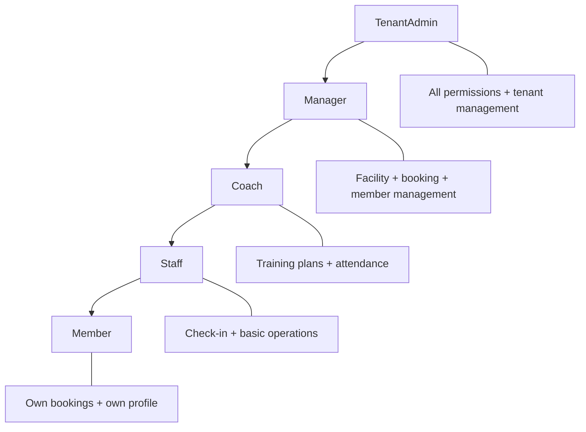

# Authorization & RBAC

> This document defines the role-based access control (RBAC) model, permission structure, and attribute-based access control (ABAC) extensions for tenant-scoped resources in the Splashh platform.

Authorization determines what an authenticated user can do. Authentication verifies identity; authorization defines permissions. We use **RBAC as the primary model** with **ABAC extensions** for fine-grained tenant-scoped resource control. Every request must pass both authentication and authorization checks.

---

## Role Model

We define five roles organized in a hierarchy. Permissions flow downward — each role inherits all permissions from roles below it:



| Role | Description | Typical Users |
|---|---|---|
| **TenantAdmin** | Full tenant control: user management, billing, settings, data export | Club administrators, owners |
| **Manager** | Operational control: facilities, bookings, members, reports | Club managers, reception staff |
| **Coach** | Training-specific: training plans, attendance, athlete profiles | Coaches, trainers |
| **Staff** | Basic operations: check-in, equipment, simple bookings | Front desk, maintenance |
| **Member** | Self-service: own bookings, own profile, limited payments | Club members |

> **Rule** — Default-deny. If a permission is not explicitly granted, it is denied. There are no implicit permissions beyond the role hierarchy.

---

## Permission Model

Permissions are defined as a triple: `(role, resource, action)`. This model is both human-readable and machine-enforceable:

| Permission | Meaning |
|---|---|
| `booking:read` | View any booking |
| `booking:read:own` | View only one's own bookings |
| `booking:create` | Create new bookings |
| `booking:update` | Modify any booking |
| `booking:update:own` | Modify only one's own bookings |
| `booking:cancel` | Cancel any booking |
| `booking:cancel:own` | Cancel only one's own bookings |
| `member:read` | View member profiles |
| `member:create` | Create new members |
| `member:update` | Modify member profiles |
| `payment:read` | View payment history |
| `payment:refund` | Issue refunds |
| `facility:manage` | Create/update/delete facilities |
| `tenant:settings` | Modify tenant configuration |
| `tenant:users` | Manage tenant users |

### Role-Permission Matrix

| Permission | TenantAdmin | Manager | Coach | Staff | Member |
|---|---|---|---|---|---|
| `tenant:settings` | Y | N | N | N | N |
| `tenant:users` | Y | N | N | N | N |
| `tenant:export` | Y | N | N | N | N |
| `member:*` | Y | Y | N | N | N |
| `booking:*` | Y | Y | Y (own) | Y (own) | Y (own) |
| `facility:manage` | Y | Y | N | N | N |
| `payment:*` | Y | Y | N | N | N |
| `coach:training:*` | Y | Y | Y | N | N |
| `member:read:own` | Y | Y | Y | Y | Y |
| `booking:read:own` | Y | Y | Y | Y | Y |

---

## ABAC Extensions

RBAC alone is insufficient for tenant-scoped resources. Every resource in our system belongs to a tenant. A Manager at Club A must never see Club B's data. We use **ABAC for tenant isolation**:

```python
from dataclasses import dataclass
from enum import Enum

class ResourceType(Enum):
    BOOKING = "booking"
    MEMBER = "member"
    FACILITY = "facility"
    PAYMENT = "payment"

@dataclass
class AuthorizationContext:
    user_id: str
    tenant_id: str
    roles: list[str]
    resource_type: ResourceType | None = None
    resource_id: str | None = None
    resource_owner_id: str | None = None
```

Every service checks that the requesting user's `tenant_id` matches the resource's `tenant_id`. This check happens at multiple layers:

1. **Application layer** — Service extracts tenant_id from JWT, queries only tenant-scoped data
2. **Repository layer** — Every query includes `WHERE tenant_id = :tenant_id`
3. **Database layer** — PostgreSQL Row-Level Security (RLS) enforces isolation

---

## Authorization Decorator Pattern

We implement authorization checks using a decorator pattern that keeps authorization logic centralized and testable:

```python
from functools import wraps
from fastapi import HTTPException, Depends
from typing import Callable

# Permission registry
PERMISSIONS = {
    "TenantAdmin": [
        "tenant:settings", "tenant:users", "tenant:export",
        "member:*", "booking:*", "facility:*", "payment:*"
    ],
    "Manager": [
        "member:read", "member:create", "member:update",
        "booking:*", "facility:manage", "payment:read"
    ],
    "Coach": [
        "member:read:own", "booking:read:own", "booking:create",
        "coach:training:*"
    ],
    "Staff": [
        "member:read:own", "booking:read:own", "booking:create",
        "booking:cancel:own", "facility:read"
    ],
    "Member": [
        "member:read:own", "booking:read:own", "booking:create:own",
        "booking:cancel:own"
    ]
}

def check_permission(required_permission: str):
    """Decorator to enforce permission checks."""
    def decorator(func: Callable):
        @wraps(func)
        async def wrapper(*args, context: AuthorizationContext, **kwargs):
            # Check if user has any role with the required permission
            user_permissions = set()
            for role in context.roles:
                user_permissions.update(PERMISSIONS.get(role, []))

            # Check exact match or wildcard
            has_permission = any(
                required_permission == perm or
                (perm.endswith(":") and required_permission.startswith(perm.rstrip(":")))
                for perm in user_permissions
            )

            if not has_permission:
                raise HTTPException(
                    status_code=403,
                    detail=f"Permission denied: {required_permission}"
                )

            return await func(*args, context=context, **kwargs)
        return wrapper
    return decorator
```

### Usage in Service Layer

```python
@check_permission("booking:read")
async def get_booking(
    booking_id: str,
    context: AuthorizationContext
) -> Booking:
    booking = await booking_repo.get(booking_id)

    # ABAC: Ensure tenant isolation
    if booking.tenant_id != context.tenant_id:
        raise HTTPException(status_code=404, detail="Booking not found")

    # ABAC: Check ownership for non-admin roles
    if "TenantAdmin" not in context.roles and "Manager" not in context.roles:
        if booking.user_id != context.user_id:
            raise HTTPException(status_code=403, detail="Access denied")

    return booking
```

---

## Ownership and Self-Service

The `:own` suffix in permissions represents **ownership**. A user with `booking:read:own` can read bookings they own. Ownership is determined by comparing the resource's `owner_id` (or `user_id`) with the requesting user's `user_id`:

```python
def check_ownership(resource, user_id: str) -> bool:
    """Check if user owns the resource."""
    if hasattr(resource, 'user_id'):
        return resource.user_id == user_id
    if hasattr(resource, 'owner_id'):
        return resource.owner_id == user_id
    if hasattr(resource, 'member_id'):
        return resource.member_id == user_id
    return False
```

> **Rule** — Every resource mutation (create, update, delete) must verify that the actor has permission for the action on the specific resource. This prevents BOLA (Broken Object Level Authorization) attacks.

---

## Testing Authorization

Authorization bugs are critical. We test authorization at multiple levels:

1. **Unit tests** — Test permission matrix, ownership checks in isolation
2. **Integration tests** — Test full authorization flow with mock identities
3. **API tests** — Test every endpoint with multiple role permutations

```python
@pytest.mark.parametrize("role,expected_status", [
    ("TenantAdmin", 200),
    ("Manager", 200),
    ("Coach", 403),    # No permission
    ("Staff", 403),
    ("Member", 403),
])
async def test_get_all_bookings(role, expected_status):
    context = AuthorizationContext(
        user_id="user-123",
        tenant_id="tenant-456",
        roles=[role]
    )
    response = await client.get(
        "/api/v1/bookings",
        headers={"Authorization": f"Bearer {generate_token(context)}"}
    )
    assert response.status_code == expected_status
```

---

## Cross-Reference

- [Tenant Isolation](tenant-isolation.md) — Database-level tenant separation
- [API Security](api-security.md) — BOLA, BFLA prevention at API layer
- [Authentication](authentication.md) — Identity verification
- [Audit Logging](audit-logging.md) — Tracking authorization decisions
