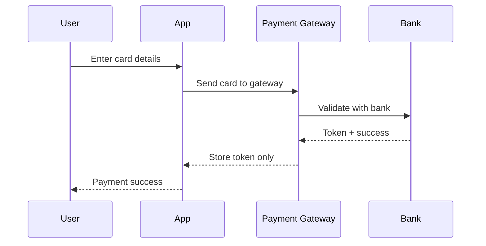

# Compliance & Privacy

> This document covers our compliance with DPDPA (India), PCI-DSS (via tokenization), RBI guidelines for recurring payments, and privacy-by-design principles.

The Splashh platform handles sensitive personal and financial data. We maintain compliance with relevant Indian regulations.

---

## DPDPA (Digital Personal Data Protection Act, India)

### Compliance Requirements

| Requirement | Implementation |
|---|---|
| Lawful basis for processing | Consent, contract, legal obligation |
| Data purpose limitation | Collected for defined purposes only |
| Data minimization | Only necessary fields collected |
| Accuracy | Member self-service for corrections |
| Storage limitation | Retention periods enforced |
| Security | Encryption, access controls, audit |
| Accountability | DPO appointed, documentation maintained |

### Data Subject Rights

| Right | Implementation |
|---|---|
| Access | Self-service profile view, data export |
| Correction | Profile editing |
| Deletion | Account deletion flow (anonymization) |
| Portability | JSON export in standard format |
| Withdrawal of consent | Preference management |

---

## PCI-DSS (via Tokenization)

We do not store card data. All payment processing uses tokenization:

| Requirement | Implementation |
|---|---|
| No card storage | Tokenization via Stripe/Razorpay |
| Secure transmission | TLS 1.3 |
| Access control | Limited personnel access |
| Monitoring | Transaction logging |
| Testing | Quarterly vulnerability scans |

### Tokenization Flow

---

## RBI Guidelines for Recurring Payments

For recurring payments (subscriptions):

| Requirement | Implementation |
|---|---|
| Pre-debit notification | SMS/email 24h before |
| Upper limit | Configurable per member |
| Member consent | Explicit opt-in for auto-debit |
| Easy cancellation | One-click cancellation |
| Transaction limits | Daily/monthly caps |

---

## Privacy by Design

We implement privacy at the architectural level:

| Principle | Implementation |
|---|---|
| Proactive | Privacy reviews in design phase |
| Privacy as default | Data minimization, purpose limitation |
| Privacy embedded | Technical controls in architecture |
| Full functionality | Security without sacrificing usability |
| End-to-end security | Encryption at rest and in transit |
| Transparency | Clear privacy policy |
| User-centric | Rights management built-in |

---

## Data Retention

| Data Type | Retention | Disposal |
|---|---|---|
| Member PII | Duration of membership + 7 years | Secure deletion |
| Transaction records | 7 years | Secure deletion |
| Audit logs | 7 years | Secure deletion |
| Session data | Until logout | Automatic expiry |
| Temporary data | Processing complete | Immediate deletion |

---

## DPO Responsibilities

| Role | Responsibility |
|---|---|
| DPO | Overall privacy compliance |
| Privacy reviews | New features, data flows |
| Incident response | Data breach notification |
| Training | Privacy awareness |
| Regulatory liaison | DPDPA, RBI coordination |

---

## Cross-Reference

- [Encryption](encryption.md) — Data protection
- [Audit Logging](audit-logging.md) — Compliance evidence
- [Incident Response](incident-response.md) — Breach handling
