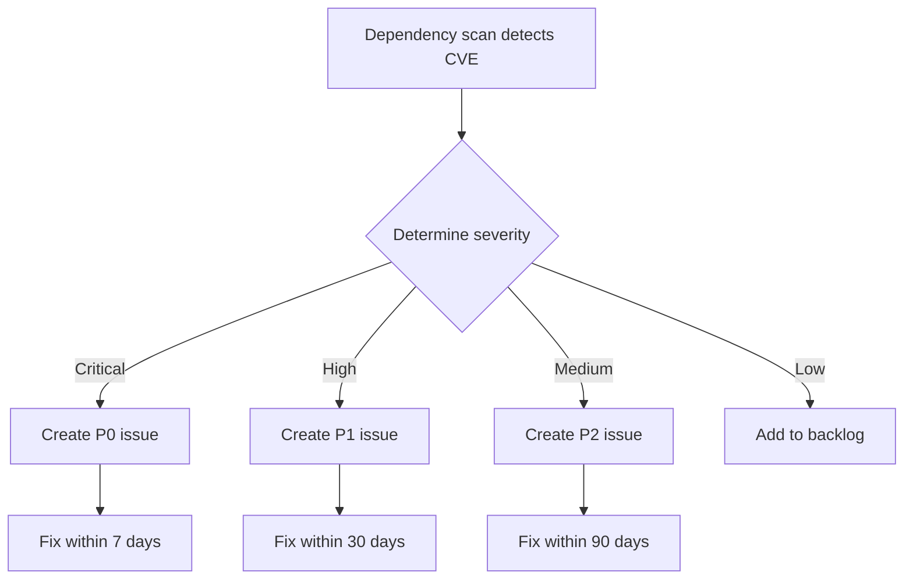

# Dependency Scanning

> This document covers our Software Composition Analysis (SCA) strategy, including dependency management, vulnerability scanning, SBOM generation, and license compliance.

Modern applications depend on hundreds of open-source packages. These dependencies may contain known vulnerabilities (CVEs) that attackers can exploit. We maintain a comprehensive dependency security program to identify, prioritize, and remediate vulnerable dependencies.

---

## Dependency Management

### Tooling

| Tool | Purpose | Integration |
|---|---|---|
| **Dependabot** | Automated PRs for updates | GitHub |
| **Renovate** | Extended dependency management | GitHub |
| **npm audit / pip-audit** | Vulnerability scanning | CI pipeline |
| **Trivy** | Container and dependency scanning | CI pipeline |
| **FOSSA** | License compliance | CI pipeline |

### Python Dependencies

```toml
# pyproject.toml
[project]
name = "splashh-backend"
version = "0.1.0"
dependencies = [
    "fastapi>=0.109.0,<1.0.0",
    "sqlalchemy>=2.0.0,<3.0.0",
    "pydantic>=2.0.0,<3.0.0",
    # Locked versions in requirements.txt
]
```

```txt
# requirements.txt (pinned)
fastapi==0.109.0
sqlalchemy==2.0.25
pydantic==2.5.3
# Generated by: pip-compile --generate-hashes
```

### JavaScript Dependencies

```json
// package.json
{
  "name": "splashh-frontend",
  "version": "0.1.0",
  "dependencies": {
    "react": "^18.2.0",
    "@tanstack/react-query": "^5.0.0"
  },
  "engines": {
    "node": ">=20.0.0"
  }
}
```

```json
// package-lock.json (auto-generated with exact versions)
```

---

## Vulnerability Scanning

### CI Pipeline Integration

```yaml
# .github/workflows/dependency-scan.yml
name: Dependency Scanning

on:
  push:
    branches: [main]
  schedule:
    - cron: '0 0 * * 0'  # Weekly scan

jobs:
  python-audit:
    runs-on: ubuntu-latest
    steps:
      - uses: actions/checkout@v4
      - uses: actions/setup-python@v4
        with:
          python-version: '3.12'
      - run: pip install pip-audit
      - run: pip-audit -r requirements.txt --require-hashes-mode

  npm-audit:
    runs-on: ubuntu-latest
    steps:
      - uses: actions/checkout@v4
      - uses: actions/setup-node@v4
        with:
          node-version: '20'
      - run: npm ci
      - run: npm audit --audit-level=high

  trivy-scan:
    runs-on: ubuntu-latest
    steps:
      - uses: actions/checkout@v4
      - uses: aquasecurity/trivy-action@master
        with:
          scan-type: 'fs'
          scan-ref: '.'
          format: 'sarif'
          output: 'trivy-results.sarif'
```

---

## Severity-Based SLAs

We triage vulnerabilities based on severity and apply remediation SLAs:

| Severity | CVSS Score | SLA | Example |
|---|---|---|---|
| **Critical** | 9.0-10.0 | 7 days | Remote code execution |
| **High** | 7.0-8.9 | 30 days | SQL injection |
| **Medium** | 4.0-6.9 | 90 days | Information disclosure |
| **Low** | 0.1-3.9 | Next cycle | Minor bypass |

### Vulnerability Response Process



---

## Software Bill of Materials (SBOM)

We generate SBOMs in CycloneDX format for each release:

```xml
<!-- sbom.xml -->
<?xml version="1.0" encoding="UTF-8"?>
<bom xmlns="http://cyclonedx.org/schema/bom/1.5"
     serialNumber="urn:uuid:xxx">
  <metadata>
    <timestamp>2024-01-15T10:00:00Z</timestamp>
    <tools>
      <tool name="syft" version="0.100.0"/>
    </tools>
  </metadata>
  <components>
    <component type="library">
      <name>fastapi</name>
      <version>0.109.0</version>
      <purl>pkg:pypi/fastapi@0.109.0</purl>
    </component>
    <component type="library">
      <name>sqlalchemy</name>
      <version>2.0.25</version>
      <purl>pkg:pypi/sqlalchemy@2.0.25</purl>
    </component>
  </components>
</bom>
```

```yaml
# Generate SBOM
syft splashh-backend:latest -o cyclonedx-xml > sbom.xml
```

---

## Private Package Allowlist

We restrict dependencies to approved sources:

```toml
# pip.conf or poetry config
[[source]]
name = "pypi"
url = "https://pypi.org/simple"
verify_ssl = true

# No external indexes allowed
# Only PyPI and internal Artifactory
```

```json
// .npmrc
registry=https://registry.npmjs.org/
# Only official npm registry
```

---

## License Compliance

We use **FOSSA** for license compliance scanning:

```yaml
# .github/workflows/fossa.yml
name: FOSSA

on:
  push:
    branches: [main]
  schedule:
    - cron: '0 0 * * 0'

jobs:
  fossa:
    runs-on: ubuntu-latest
    steps:
      - uses: actions/checkout@v4
      - uses: fossa/fossa-action@v1
        with:
          api-key: ${{ secrets.FOSSA_API_KEY }}
```

### License Categories

| Category | Action | Examples |
|---|---|---|
| **Allowed** | Use freely | MIT, Apache 2.0, BSD |
| **Copyleft** | Review required | GPL, AGPL, MPL |
| **Proprietary** | Blocked | No public license |
| **Unclear** | Blocked until clarified | No license file |

> **Rule** — New dependencies must have an allowed license. Copyleft licenses require legal review before use.

---

## Cross-Reference

- [Container Security](container-security.md) — Container vulnerability scanning
- [Supply Chain](supply-chain.md) — SLSA framework
- [Security Testing](security-testing.md) — Automated scanning in CI
