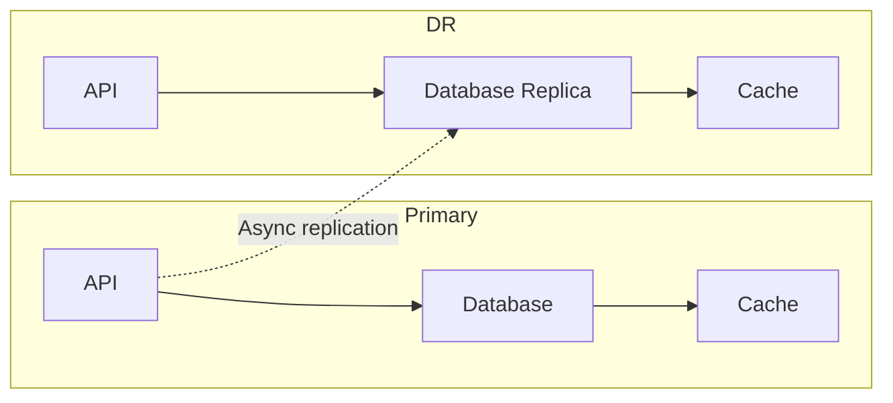

# Disaster Recovery

> This document covers our disaster recovery strategy, including DR scenarios, runbooks, communication plans, and quarterly drill requirements.

Disaster recovery (DR) ensures business continuity when catastrophic events occur. We plan for realistic failure scenarios and maintain the ability to recover services within our RTO target.

---

## DR Scenarios

| Scenario | Probability | Impact | RTO Target |
|---|---|---|---|
| Single instance failure | Medium | Medium | 30 minutes |
| Database failure | Low | High | 4 hours |
| Region outage | Very Low | Critical | 4 hours |
| Ransomware attack | Low | Critical | 24 hours |
| Data corruption | Low | High | 4 hours |

---

## DR Architecture

### Multi-Region Deployment



| Component | Primary | DR Region |
|---|---|---|
| Application | us-east-1 | us-west-2 |
| Database | RDS Multi-AZ | Read Replica |
| Cache | ElastiCache | ElastiCache |
| Storage | S3 | S3 Cross-Region |

---

## Runbooks

### Runbook: Database Failover

```
1. DETECT: Database health check fails
2. ASSESS: Determine if primary is recoverable
3. DECIDE: If unrecoverable, initiate failover
4. PROMOTE: Promote read replica to primary
5. UPDATE: Update DNS/app config to point to new primary
6. VERIFY: Run health checks on new primary
7. NOTIFY: Alert stakeholders of completion
8. POST-ACTION: Investigate root cause, plan remediation
```

### Runbook: Region Failover

```
1. DETECT: Region health check fails
2. ASSESS: Confirm primary region is unavailable
3. DECIDE: Authorize DR activation (requires CTO approval)
4. ACTIVATE: Deploy DR stack in secondary region
5. RESTORE: Restore database from latest backup
6. UPDATE: Update DNS to point to DR endpoints
7. VERIFY: Run smoke tests
8. NOTIFY: Update status page, notify customers
9. POST-ACTION: Plan primary region recovery
```

---

## Communication Plan

| Scenario | Channel | Message Template |
|---|---|---|
| Active incident | Slack #incidents | "DR ACTIVATED: [brief description]. All hands on deck." |
| Customer notification | Status page | "We're experiencing an outage. We apologize for the inconvenience. Updates every 30 minutes." |
| External communication | Email to customers | "We experienced an outage on [date]. Here's what happened and what we're doing about it." |
| Executive update | Slack #exec-updates | "DR situation update: [status], [RTO estimate], [actions taken]" |

### Contact Escalation

| Time | Escalation Level |
|---|---|
| 0-15 min | On-call engineer |
| 15-30 min | Engineering lead |
| 30-60 min | CTO |
| 60+ min | CEO |

---

## Quarterly DR Drill

We conduct quarterly disaster recovery drills:

### Drill Schedule

| Quarter | Scenario | Participants |
|---|---|---|
| Q1 | Database failover | DevOps, Backend lead |
| Q2 | Region failover | DevOps, SRE, CTO |
| Q3 | Ransomware response | Security, DevOps |
| Q4 | Full platform recovery | All engineering |

### Drill Checklist

- [ ] Pre-drill: Confirm backup integrity
- [ ] Execute: Follow runbook steps
- [ ] Document: Record timing and issues
- [ ] Review: Post-drill analysis
- [ ] Improve: Update runbooks based on findings

### Drill Metrics

| Metric | Target |
|---|---|
| Detection time | < 5 minutes |
| Failover time | < 30 minutes |
| Data loss | < 1 hour (RPO) |
| Communication time | < 15 minutes |

---

## Cross-Reference

- [Backup & Recovery](backup-recovery.md) — Backup procedures
- [Incident Response](incident-response.md) — Incident handling
- [Encryption](encryption.md) — Backup encryption
