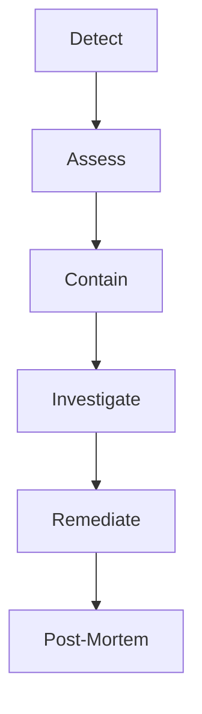

# Incident Response

> This document details our incident response procedures, including severity levels, response roles, containment steps, evidence preservation, and post-mortem requirements.

Security incidents require rapid, coordinated response to minimize impact. We define clear severity levels, roles, and procedures to ensure effective response.

---

## Severity Levels

| Severity | Definition | Response Time | Examples |
|---|---|---|---|
| **SEV1** | Critical: Data breach, complete service outage, financial impact | 15 minutes | PII exfiltration, ransomware |
| **SEV2** | High: Partial outage, potential data exposure | 30 minutes | SQL injection, account compromise |
| **SEV3** | Medium: Limited impact, service degradation | 2 hours | DDoS, spam abuse |
| **SEV4** | Low: Minor issues, no immediate risk | 24 hours | Single failed login attempts |

---

## Incident Response Team

| Role | Responsibility |
|---|---|
| **Incident Commander** | Overall coordination, decision-making |
| **Technical Lead** | Technical investigation and remediation |
| **Communications Lead** | Internal/external communication |
| **Security Lead** | Forensics, evidence preservation |
| **On-Call Engineer** | First responder, initial assessment |

---

## Response Procedure



### 1. Detection

- Automated alerts from monitoring
- User reports
- Vendor notifications

### 2. Assessment

```python
def assess_incident(alert) -> dict:
    """Initial incident assessment."""
    return {
        "severity": determine_severity(alert),
        "scope": identify_scope(alert),
        "type": classify_type(alert),
        "resources_affected": list_affected_resources(alert),
        "initial_containment": recommend_containment(alert)
    }
```

### 3. Containment

**Immediate (short-term)**:

- Isolate affected systems
- Block malicious IPs
- Disable compromised accounts
- Pause data processing

**Long-term**:

- Deploy fix
- Patch vulnerabilities
- Rotate credentials

### 4. Investigation

- Preserve evidence (logs, memory dumps, network captures)
- Identify root cause
- Determine scope of compromise

### 5. Remediation

- Apply fixes
- Verify resolution
- Monitor for recurrence

### 6. Post-Mortem

- Document timeline
- Identify improvement areas
- Update runbooks

---

## Evidence Preservation

> **Rule** — Do not modify or delete potential evidence before forensics.

### What to Preserve

| Evidence Type | Collection Method |
|---|---|
| Application logs | Export from logging system |
| Database logs | PostgreSQL logs, audit logs |
| Network logs | VPC Flow Logs, WAF logs |
| System logs | /var/log, systemd logs |
| Memory | Memory dump (if malware suspected) |
| Disk | Forensic image |

### Chain of Custody

```python
class EvidenceChain:
    """Track evidence chain of custody."""

    def __init__(self, evidence_id: str):
        self.evidence_id = evidence_id
        self.custody = []

    def record_collection(
        self,
        collector: str,
        location: str,
        hash: str
    ):
        self.custody.append({
            "timestamp": datetime.utcnow().isoformat(),
            "action": "collected",
            "collector": collector,
            "location": location,
            "hash": hash  # SHA-256 of evidence
        })
```

---

## Post-Mortem Template

```markdown
# Incident Post-Mortem

## Summary
- **Date**: 2024-01-15
- **Severity**: SEV2
- **Duration**: 2 hours
- **Impact**: 500 accounts affected

## Timeline (UTC)
- 10:00 - First alert
- 10:15 - Incident confirmed
- 10:30 - Containment complete
- 11:30 - Root cause identified
- 12:00 - Service restored

## Root Cause
SQL injection in booking search endpoint allowed data exfiltration.

## Impact
- 500 members' PII exposed
- No financial data exposed
- No privilege escalation

## Action Items
- [ ] Fix SQL injection (Owner: Backend Lead, Due: 2024-01-16)
- [ ] Add WAF rules (Owner: DevOps, Due: 2024-01-17)
- [ ] Review similar endpoints (Owner: Security, Due: 2024-01-20)

## Lessons Learned
1. Input validation was bypassed
2. WAF was not blocking SQLi patterns
3. Alert was delayed by 30 minutes
```

---

## Communication Templates

### Internal Slack

```
🚨 INCIDENT: [SEV2] SQL Injection Detected
- Detected: 10:00 UTC
- Status: CONTAINED
- Impact: 500 member records potentially exposed
- Action: Patching now
- Next update: 30 minutes
```

### Customer Email

```
Subject: Security Incident Notification

Dear [Customer],

We are writing to inform you of a security incident that may have affected your data.

What happened: [brief description]
What we did: [actions taken]
What you should do: [recommendations]
For more information: [support contact]
```

---

## Cross-Reference

- [Overview](overview.md) — Security principles
- [Threat Modeling](threat-modeling.md) — Proactive threat identification
- [Audit Logging](audit-logging.md) — Evidence collection
- [Disaster Recovery](disaster-recovery.md) — DR procedures
