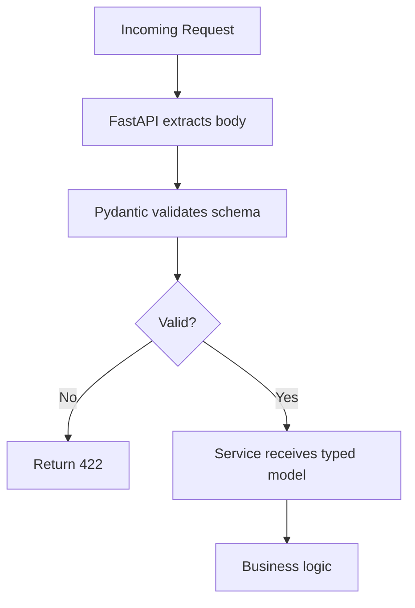

# Input Validation

> This document details our input validation strategy, focusing on Pydantic as the validation gate, allow-list patterns, length limits, and file upload security.

All untrusted input must be validated before processing. Input validation is our primary defense against injection attacks, data corruption, and business logic bypasses. We use **Pydantic** as the central validation layer, with strict schemas that reject anything not explicitly allowed.

---

## Pydantic: The Validation Gate

Every API request passes through Pydantic validation. Data is validated at the API boundary — before any business logic executes:

```python
from pydantic import BaseModel, Field, EmailStr, validator
from typing import Optional
from datetime import date
from enum import Enum

class SportType(str, Enum):
    TENNIS = "tennis"
    BADMINTON = "badminton"
    SWIMMING = "swimming"
    CRICKET = "cricket"
    FOOTBALL = "football"

class BookingCreateRequest(BaseModel):
    """Validate booking creation requests."""
    facility_id: str = Field(..., min_length=1, max_length=36)
    sport: SportType
    date: date
    start_time: str = Field(..., pattern=r"^\d{2}:\d{2}$")  # HH:MM
    end_time: str = Field(..., pattern=r"^\d{2}:\d{2}$")
    member_id: str = Field(..., min_length=1, max_length=36)

    @validator("start_time", "end_time")
    def validate_time_format(cls, v):
        hour, minute = map(int, v.split(":"))
        if hour < 6 or hour > 22:
            raise ValueError("Time must be between 06:00 and 22:00")
        if minute not in [0, 30]:
            raise ValueError("Time must be on the hour or half-hour")
        return v

    @validator("date")
    def validate_future_date(cls, v):
        if v < date.today():
            raise ValueError("Date must be in the future")
        if v > date.today() + timedelta(days=90):
            raise ValueError("Cannot book more than 90 days in advance")
        return v

    class Config:
        # Strict mode: extra fields are rejected
        extra = "forbid"
        validate_assignment = True
```

> **Rule** — All API request bodies must be Pydantic models. No raw dict or unvalidated data handling.

---

## Strict Validation Mode

We enforce strict validation at the application level:

```python
from pydantic import BaseModel

class BaseRequest(BaseModel):
    """Base request model with strict validation."""
    class Config:
        extra = "forbid"          # Reject unknown fields
        validate_assignment = True  # Validate on assignment
        str_strip_whitespace = True
```

> **Why strict mode** — `extra = "forbid"` prevents mass assignment attacks where attackers send extra fields that the application doesn't expect but might be processed.

---

## Allow-List Over Deny-List

We use allow-lists for structured input:

### Anti-pattern (Deny-List - Unsafe)

```python
# NEVER - deny-lists are incomplete
dangerous_chars = ["<", ">", "'", "\"", ";", "--"]
def sanitize(input_string):
    for char in dangerous_chars:
        input_string = input_string.replace(char, "")
    return input_string
```

### Correct Pattern (Allow-List - Safe)

```python
# CORRECT - allow only known good values
import re

class PhoneNumber(str):
    @classmethod
    def __get_validators__(cls):
        yield cls.validate

    @classmethod
    def validate(cls, v):
        # Only allow digits, spaces, +, -, ()
        pattern = r"^\+?[\d\s\-\(\)]{10,15}$"
        if not re.match(pattern, v):
            raise ValueError("Invalid phone number format")
        return cls(v)
```

---

## Length Limits

Every string input has explicit length limits:

| Field Type | Min Length | Max Length | Rationale |
|---|---|---|---|
| Email | 3 | 254 | RFC 5321 |
| Name | 1 | 100 | Display constraints |
| Password | 12 | 128 | See [Password Policy](password-policy.md) |
| UUID | 36 | 36 | Standard format |
| Free text | 0 | 5000 | DoS prevention |
| URL | 8 | 2048 | Browser limits |

```python
class MemberProfileUpdate(BaseModel):
    name: str = Field(..., min_length=1, max_length=100)
    phone: Optional[PhoneNumber] = None
    bio: Optional[str] = Field(None, max_length=5000)
```

---

## File Upload Validation

File uploads require strict validation:

```python
from pydantic import BaseModel, Field
from typing import Optional

ALLOWED_IMAGE_TYPES = {
    "image/jpeg": ".jpg",
    "image/png": ".png",
    "image/webp": ".webp"
}

MAX_FILE_SIZE = 5 * 1024 * 1024  # 5MB

class FileUploadRequest(BaseModel):
    """Validate file upload requests."""
    filename: str = Field(..., min_length=1, max_length=255)
    content_type: str
    size: int = Field(..., gt=0, le=MAX_FILE_SIZE)

    @validator("content_type")
    def validate_content_type(cls, v):
        if v not in ALLOWED_IMAGE_TYPES:
            raise ValueError(f"Allowed types: {list(ALLOWED_IMAGE_TYPES.keys())}")
        return v

    @validator("filename")
    def validate_filename(cls, v):
        # Remove path components
        import os
        filename = os.path.basename(v)
        # Check for dangerous extensions
        dangerous_extensions = [".exe", ".sh", ".php", ".phtml"]
        if any(filename.lower().endswith(ext) for ext in dangerous_extensions):
            raise ValueError("File type not allowed")
        return filename
```

### Magic Byte Verification

```python
import magic

def verify_magic_bytes(file_content: bytes, expected_type: str) -> bool:
    """Verify file type using magic bytes, not extension."""
    mime = magic.from_buffer(file_content, mime=True)
    return mime == expected_type

# Example: verify uploaded image
if not verify_magic_bytes(file_content, "image/jpeg"):
    raise ValueError("Invalid file type")
```

---

## JSON Schema Strict Mode

We use JSON Schema validation for additional safety:

```python
from fastapi import FastAPI
from pydantic import ValidationError

app = FastAPI(
    # Strict JSON parsing
    json_schema_extra={
        "strict": True
    }
)

@app.exception_handler(ValidationError)
async def validation_exception_handler(request, exc):
    return JSONResponse(
        status_code=422,
        content={"detail": exc.errors()}
    )
```

---

## Validation in the Request Pipeline



---

## Testing Input Validation

```python
import pytest
from pydantic import ValidationError

def test_valid_booking():
    """Test valid booking request."""
    request = BookingCreateRequest(
        facility_id="fac-123",
        sport="tennis",
        date=date(2025, 3, 15),
        start_time="10:00",
        end_time="11:00",
        member_id="mem-456"
    )
    assert request.sport == "tennis"

def test_invalid_date():
    """Test past date rejected."""
    with pytest.raises(ValidationError):
        BookingCreateRequest(
            facility_id="fac-123",
            sport="tennis",
            date=date(2020, 1, 1),  # Past date
            start_time="10:00",
            end_time="11:00",
            member_id="mem-456"
        )

def test_unknown_field_rejected():
    """Test extra fields are rejected."""
    with pytest.raises(ValidationError):
        BookingCreateRequest(
            facility_id="fac-123",
            sport="tennis",
            date=date(2025, 3, 15),
            start_time="10:00",
            end_time="11:00",
            member_id="mem-456",
            unknown_field="should_fail"  # Extra field
        )
```

---

## Cross-Reference

- [SQL Injection](sql-injection.md) — Database input safety
- [Output Encoding](output-encoding.md) — Safe output handling
- [API Security](api-security.md) — Endpoint-level validation
