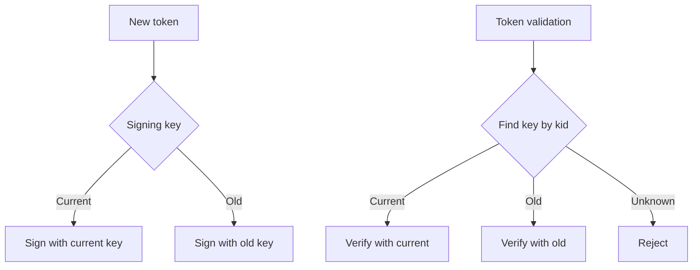

# Key Rotation

> This document covers our key rotation strategy for JWT signing keys, database encryption keys, and other cryptographic materials.

Regular key rotation limits the impact of a compromised key. We rotate keys on defined schedules while maintaining backwards compatibility.

---

## Rotation Cadence

| Key Type | Rotation Cadence | Method |
|---|---|---|
| JWT signing keys | 90 days | JWKS rollover |
| Database encryption | 90 days | Re-encryption |
| API keys (third-party) | Per provider | Manual |
| TLS certificates | 90 days | Automated (Let's Encrypt) |

---

## JWT Signing Key Rotation

We maintain multiple keys in JWKS:



### Rotation Procedure

1. Generate new RSA key pair
2. Add new public key to JWKS with new `kid`
3. New tokens signed with new key
4. Keep old key for token validation
5. After all old tokens expire, remove old key

---

## Database Encryption Key Rotation

```python
async def rotate_dek(tenant_id: str):
    """Rotate Data Encryption Key for tenant."""
    # 1. Get current DEK
    current_dek = await get_dek(tenant_id)

    # 2. Generate new DEK
    new_dek = generate_key()

    # 3. Re-encrypt all encrypted fields
    records = await fetch_encrypted_records(tenant_id)
    for record in records:
        decrypted = decrypt(record.encrypted_data, current_dek)
        re_encrypted = encrypt(decrypted, new_dek)
        await update_record(record.id, re_encrypted)

    # 4. Store new DEK in KMS
    await store_dek(tenant_id, new_dek)

    # 5. Archive old DEK (for audit)
    await archive_dek(tenant_id, current_dek)
```

---

## Cross-Reference

- [JWT Best Practices](jwt-best-practices.md) — JWT implementation
- [Encryption](encryption.md) — Encryption strategy
- [Secrets Management](secrets-management.md) — Secret storage
