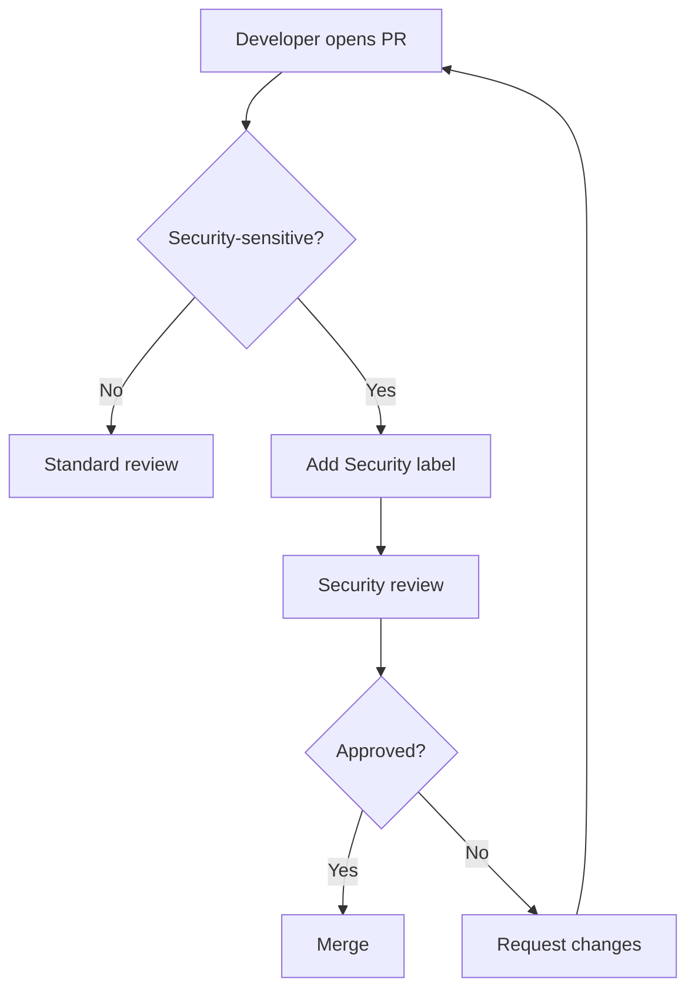

# Security Code Reviews

> This document outlines the security review process, mandatory checklist items, and criteria for code requiring security review.

Security reviews are mandatory for security-sensitive changes. This document defines what requires review, the checklist items, and reviewer responsibilities.

---

## What Requires Security Review

| Change Type | Example | Reviewer |
|---|---|---|
| Authentication | Login, logout, password reset | Security Lead |
| Authorization | Permission changes, RBAC | Security Lead |
| Payment processing | Refunds, payment flow | Security Lead + Finance |
| PII handling | Data export, deletion | DPO |
| Tenant isolation | New data access patterns | Security Lead |
| Cryptography | Key management, encryption | Security Lead |
| Infrastructure | Networking, secrets | DevOps Lead |

---

## Security Review Checklist

### Authentication

- [ ] Passwords hashed with Argon2id (not MD5, SHA, bcrypt)
- [ ] No password in URLs or logs
- [ ] JWT uses RS256 (not HS256)
- [ ] Access token expiry <= 15 minutes
- [ ] Refresh tokens are rotated
- [ ] MFA enforced for privileged roles
- [ ] Account lockout after failed attempts

### Authorization

- [ ] Default-deny permission model
- [ ] Every query includes tenant_id filter
- [ ] Ownership checks for resource access
- [ ] No privilege escalation possible
- [ ] RBAC matrix documented

### Input Validation

- [ ] All inputs validated via Pydantic
- [ ] Strict mode enabled (no extra fields)
- [ ] Length limits enforced
- [ ] Allow-list over deny-list

### Output Encoding

- [ ] React escapes by default
- [ ] No dangerouslySetInnerHTML without review
- [ ] CSP headers configured
- [ ] No innerHTML usage

### Database

- [ ] Parameterized queries only
- [ ] No string interpolation in SQL
- [ ] RLS enabled on all tables
- [ ] No raw SQL without review

### Secrets

- [ ] No secrets in code
- [ ] No secrets in logs
- [ ] Secrets from secret manager
- [ ] Rotation in place

---

## Review Process

---

## Reviewer Responsibilities

1. **Verify** each checklist item
2. **Test** the security controls
3. **Document** any exceptions or risks
4. **Sign off** with explicit approval

> **Rule** — Security review approval must be explicit. Do not assume silent approval.

---

## Cross-Reference

- [Security Testing](security-testing.md) — Automated scanning
- [Penetration Testing](penetration-testing.md) — External validation
- [OWASP Top 10](owasp-top-10.md) — Risk-specific guidance
