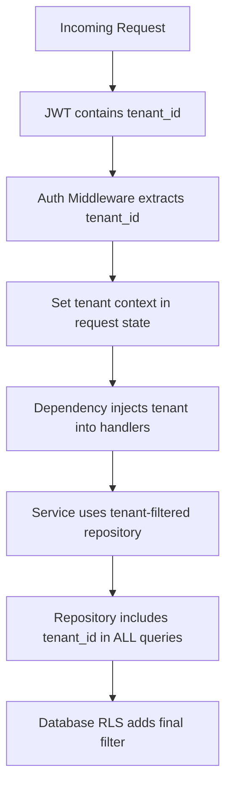

# Tenant Isolation

> This document details the multi-tenant isolation strategy for the Splashh platform, covering the shared-schema architecture, Row-Level Security (RLS), tenant context propagation, and testing strategy for isolation verification.

Multi-tenant isolation is the most critical security requirement for our SaaS platform. A breach of tenant isolation — where data from one club is visible to another — would be catastrophic. We enforce isolation at three layers: application, ORM, and database. No single layer is trusted.

---

## Architecture: Shared Schema

We use a **shared schema** multi-tenant architecture. All tenants share the same PostgreSQL database and schema, with data segregation via a `tenant_id` column on every table:

```sql
-- Every table includes tenant_id
CREATE TABLE users (
    id UUID PRIMARY KEY DEFAULT gen_random_uuid(),
    tenant_id UUID NOT NULL,
    email VARCHAR(255) NOT NULL,
    name VARCHAR(255),
    role VARCHAR(50) NOT NULL,
    password_hash VARCHAR(255),
    created_at TIMESTAMP DEFAULT NOW(),
    updated_at TIMESTAMP DEFAULT NOW()
);

CREATE INDEX idx_users_tenant ON users(tenant_id);
CREATE INDEX idx_users_email_tenant ON users(email, tenant_id) UNIQUE;
```

> **Why shared schema** — Shared schema is simpler than shared database (separate schemas) or dedicated databases. It avoids connection pool fragmentation, simplifies maintenance, and makes cross-tenant analytics queries straightforward. The trade-off is that application-level isolation must be air-tight.

---

## Row-Level Security (RLS)

PostgreSQL Row-Level Security provides a **database-enforced** isolation boundary. Even if application-layer controls fail (e.g., a bug in the ORM), RLS prevents cross-tenant queries at the database level:

```sql
-- Enable RLS on the users table
ALTER TABLE users ENABLE ROW LEVEL SECURITY;

-- Create a policy that filters by tenant_id
CREATE POLICY tenant_isolation_policy ON users
    USING (tenant_id::text = current_setting('app.current_tenant_id', true))
    WITH CHECK (tenant_id::text = current_setting('app.current_tenant_id', true));
```

The `current_setting('app.current_tenant_id')` is set by the application for each request. RLS policies automatically filter rows — a query for `SELECT * FROM users` returns only rows where `tenant_id` matches the session setting.

> **Rule** — RLS must be enabled on every table. There are no exceptions. Even read-only reference tables should have RLS if they contain tenant-scoped data.

### Service-Level Tenant Context

Every database connection is established with the tenant context set:

```python
from contextvars import ContextVar
from sqlalchemy import create_engine
from sqlalchemy.pool import NullPool

tenant_context: ContextVar[str | None] = ContextVar('tenant_context', default=None)

def get_tenant_connection(tenant_id: str):
    """Get a database connection with tenant context set."""
    engine = create_engine(
        DATABASE_URL,
        poolclass=NullPool,  # Each request gets its own connection
        connect_args={
            "options": f"-c app.current_tenant_id={tenant_id}"
        }
    )
    return engine
```

---

## Tenant Context Propagation

Tenant context must flow through the entire request lifecycle. We use a middleware pattern to ensure it is never missing:



### FastAPI Middleware Implementation

```python
from fastapi import Request, Depends
from starlette.middleware.base import BaseHTTPMiddleware
from contextvars import copy_context

class TenantContextMiddleware(BaseHTTPMiddleware):
    async def dispatch(self, request: Request, call_next):
        # Extract tenant_id from JWT
        auth_header = request.headers.get("Authorization", "")
        if auth_header.startswith("Bearer "):
            token = auth_header[7:]
            try:
                payload = jwt.decode(
                    token,
                    PUBLIC_KEY,
                    algorithms=["RS256"],
                    audience="splashh-api"
                )
                tenant_id = payload.get("tenant_id")

                if tenant_id:
                    # Set in request state for easy access
                    request.state.tenant_id = tenant_id
                    # Set in context var for RLS
                    tenant_context.set(tenant_id)
            except jwt.JWTError:
                pass  # Let auth endpoint handle errors

        response = await call_next(request)
        # Clear context after request
        tenant_context.set(None)
        return response
```

### Repository Pattern: Always Filter by Tenant

Every repository method must include tenant filtering. We enforce this via code review and automated tests:

```python
class BookingRepository:
    async def get_by_id(self, booking_id: str, tenant_id: str) -> Booking | None:
        """Get a booking by ID, filtered by tenant."""
        query = """
            SELECT * FROM bookings
            WHERE id = :booking_id
            AND tenant_id = :tenant_id
            LIMIT 1
        """
        result = await self.db.fetchone(query, {
            "booking_id": booking_id,
            "tenant_id": tenant_id
        })
        return Booking(**result) if result else None

    async def list_by_tenant(
        self,
        tenant_id: str,
        limit: int = 100,
        offset: int = 0
    ) -> list[Booking]:
        """List all bookings for a tenant."""
        query = """
            SELECT * FROM bookings
            WHERE tenant_id = :tenant_id
            ORDER BY created_at DESC
            LIMIT :limit OFFSET :offset
        """
        results = await self.db.fetchall(query, {
            "tenant_id": tenant_id,
            "limit": limit,
            "offset": offset
        })
        return [Booking(**r) for r in results]
```

> **Rule** — Never write a query that omits the tenant_id filter. Every single SELECT, UPDATE, and DELETE must include `tenant_id = :tenant_id`. This is the most important security rule in the codebase.

---

## Cross-Tenant Access Prevention

We prevent cross-tenant access at multiple layers:

| Layer | Control | Failure Mode |
|---|---|---|
| **API Gateway** | Validate JWT contains tenant_id | 401 if missing |
| **Application Service** | Extract tenant from JWT, pass to repository | 403 if not matching |
| **Repository** | Include tenant_id in every query | RLS blocks at DB |
| **Database (RLS)** | Filter rows by session tenant_id | Returns empty set |
| **Audit Log** | Log tenant_id on every operation | Detects anomalies |

### Defense in Depth Example

```python
async def get_booking(request: Request, booking_id: str) -> Booking:
    # Layer 1: API Gateway already validated JWT
    # Layer 2: Extract tenant from request state
    tenant_id = request.state.tenant_id
    if not tenant_id:
        raise HTTPException(status_code=401, detail="Missing tenant context")

    # Layer 3: Repository filters by tenant
    booking = await booking_repo.get_by_id(booking_id, tenant_id)

    if not booking:
        # Return 404 to avoid revealing whether booking exists
        # This prevents enumeration attacks
        raise HTTPException(status_code=404, detail="Booking not found")

    # Layer 4: RLS would have filtered anyway
    return booking
```

> **Pitfall** — Do not return different error messages for "tenant does not have this resource" vs. "resource does not exist." This distinction enables enumeration attacks. Always return the same 404 for both cases.

---

## Testing Tenant Isolation

We have a dedicated test suite that verifies tenant isolation is never bypassed:

### Isolation Test Patterns

```python
import pytest

@pytest.mark.asyncio
async def test_cross_tenant_booking_access_denied():
    """Verify User A cannot access User B's booking."""
    # Create two tenants
    tenant_a = await tenant_factory.create()
    tenant_b = await tenant_factory.create()

    # Create booking in Tenant A
    booking_a = await booking_factory.create(tenant_id=tenant_a.id)

    # Try to access with Tenant B's context
    context_b = AuthorizationContext(
        user_id="user-b",
        tenant_id=tenant_b.id,
        roles=["Manager"]
    )

    # Attempt to fetch booking from Tenant A
    result = await booking_service.get_booking(
        booking_id=booking_a.id,
        context=context_b
    )

    assert result is None  # Should not raise, should return None

@pytest.mark.asyncio
async def test_rls_prevents_cross_tenant_query():
    """Verify RLS blocks direct SQL access."""
    # Connect as Tenant A
    conn_a = await get_connection(tenant_id="tenant-a")
    result = await conn_a.fetch("SELECT * FROM bookings")
    assert all(row["tenant_id"] == "tenant-a" for row in result)

    # Connect as Tenant B
    conn_b = await get_connection(tenant_id="tenant-b")
    result = await conn_b.fetch("SELECT * FROM bookings")
    assert all(row["tenant_id"] == "tenant-b" for row in result)

    # Verify no overlap
    ids_a = {row["id"] for row in await conn_a.fetch("SELECT id FROM bookings")}
    ids_b = {row["id"] for row in await conn_b.fetch("SELECT id FROM bookings")}
    assert ids_a.isdisjoint(ids_b)
```

> **Rule** — Every new feature must include tenant isolation tests. If the feature involves data access, a test verifying cross-tenant access is blocked is mandatory.

---

## Migration Strategy for New Tables

When creating new tables, RLS must be added immediately:

```python
# Alembic migration example
def upgrade():
    # Create table
    op.create_table(
        'training_sessions',
        Column('id', UUID(), primary_key=True),
        Column('tenant_id', UUID(), nullable=False),
        Column('name', String(255)),
        # ... other columns
    )

    # Add indexes
    op.create_index('idx_training_tenant', 'training_sessions', ['tenant_id'])

    # Enable RLS
    op.execute("ALTER TABLE training_sessions ENABLE ROW LEVEL SECURITY")

    # Create policy
    op.execute("""
        CREATE POLICY training_tenant_isolation ON training_sessions
        USING (tenant_id::text = current_setting('app.current_tenant_id', true))
        WITH CHECK (tenant_id::text = current_setting('app.current_tenant_id', true))
    """)
```

---

## Cross-Reference

- [Authorization & RBAC](authorization-rbac.md) — Role-based permission model
- [PostgreSQL RLS Documentation](https://www.postgresql.org/docs/current/ddl-rowsecurity.html) — Database-level isolation
- [API Security](api-security.md) — BOLA prevention at API layer
- [Audit Logging](audit-logging.md) — Logging tenant context
