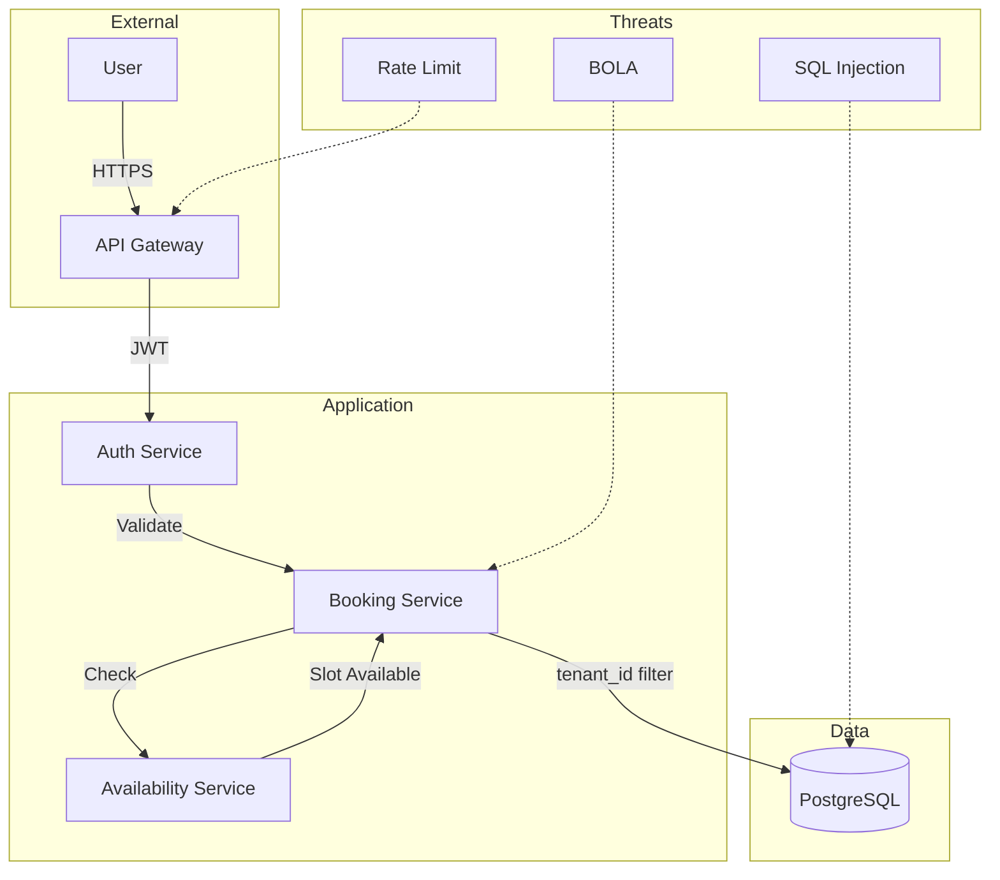
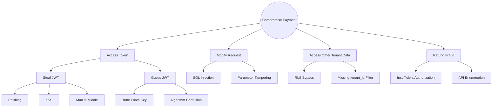

# Threat Modeling

> This document describes our threat modeling approach using STRIDE and attack trees for critical application flows.

Threat modeling identifies and mitigates threats during design, not after deployment. We use STRIDE for threat categorization and attack trees for complex flows.

---

## STRIDE Framework

| Threat | Description | Mitigation |
|---|---|---|
| **S**poofing | Impersonating users or systems | MFA, JWT signatures, certificate validation |
| **T**ampering | Modifying data in transit or at rest | TLS, encryption, checksums |
| **R**epudiation | Denying actions without evidence | Audit logging, digital signatures |
| **I**nformation Disclosure | Exposing sensitive data | Encryption, access control, RLS |
| **D**enial of Service | Making service unavailable | Rate limiting, redundancy |
| **E**levation of Privilege | Gaining unauthorized access | RBAC, principle of least privilege |

---

## Threat Model: Booking Flow



### STRIDE Analysis: Booking Flow

| Component | S | T | R | I | D | E |
|---|---|---|---|---|---|---|
| User Authentication | - | - | + | - | - | - |
| API Gateway | + | - | + | + | + | - |
| Booking Service | - | + | + | + | - | + |
| Database | - | + | + | + | + | - |

Legend: + = applicable threat, - = mitigated

---

## Attack Tree: Payment Processing



---

## Threat Model Template

```markdown
# Threat Model: [Feature Name]

## Overview
Brief description of the feature and its security boundaries.

## Data Flow
1. User submits request → API Gateway
2. Gateway validates JWT → Service
3. Service checks authorization → Database
4. Database returns data → Service

## Assets
- User credentials
- Payment tokens
- Member PII

## Threats (STRIDE)

### Spoofing
- Threat: Attacker impersonates legitimate user
- Mitigation: JWT with RS256, MFA for admins

### Tampering
- Threat: Attacker modifies request in transit
- Mitigation: TLS 1.3, request signing

### Repudiation
- Threat: User denies performing action
- Mitigation: Audit logging with hash chain

### Information Disclosure
- Threat: PII exposed to unauthorized users
- Mitigation: Field encryption, RLS, RBAC

### Denial of Service
- Threat: Service becomes unavailable
- Mitigation: Rate limiting, autoscaling

### Elevation of Privilege
- Threat: User gains unauthorized access
- Mitigation: RBAC, ownership checks
```

---

## Cross-Reference

- [OWASP Top 10](owasp-top-10.md) — Risk-specific mitigations
- [Authorization & RBAC](authorization-rbac.md) — Access control
- [Incident Response](incident-response.md) — Response procedures
