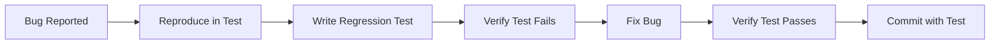

# Regression Tests

> A regression test is a test written after a bug is discovered to prevent that bug from recurring. Every bug fix must include a regression test that fails before the fix and passes after.

This document covers our regression testing workflow: bug to test pipeline, test tagging, CI integration, and the rule that regression tests are never deleted without an Architecture Decision Record (ADR).

---

## Bug to Regression Test Workflow



---

## Creating Regression Tests

### From Bug Report

```python
# apps/backend/tests/regression/test_booking_conflict.py
import pytest
from datetime import datetime, timedelta


class TestBookingConflictRegression:
    """
    Regression tests for booking conflict handling.

    Related issues:
    - GH-1234: Double booking possible for same time slot
    """

    @pytest.mark.regression
    @pytest.mark.regression.GH1234
    def test_prevents_double_booking_same_slot(self):
        """
        Regression GH-1234: Prevent double booking for the same time slot.

        Bug: Users could book the same slot twice if requests came in
        within milliseconds of each other.

        Fix: Database-level unique constraint + service-level check.
        """
        # ARRANGE: Create first booking
        booking1 = service.create_booking(
            tenant_id="tenant-001",
            request=CreateBookingRequest(
                facility_id="court-001",
                customer_id="customer-001",
                start_time=datetime(2024, 1, 15, 10, 0),
                duration_minutes=60,
            ),
        )

        # ACT: Try to book same slot
        with pytest.raises(SlotNotAvailableError):
            service.create_booking(
                tenant_id="tenant-001",
                request=CreateBookingRequest(
                    facility_id="court-001",
                    customer_id="customer-002",
                    start_time=datetime(2024, 1, 15, 10, 0),
                    duration_minutes=60,
                ),
            )
```

### From Production Incident

```python
# apps/backend/tests/regression/test_tenant_isolation.py
class TestTenantIsolationRegression:
    """
    Regression tests for multi-tenant data isolation.

    Related incidents:
    - INC-567: User from tenant-A could see tenant-B's bookings
    """

    @pytest.mark.regression
    @pytest.mark.regression.INC567
    def test_tenant_a_cannot_access_tenant_b_bookings(self):
        """
        Regression INC-567: Cross-tenant data leak.

        Bug: Missing tenant_id filter in repository query allowed
        users to see all tenants' bookings.
        """
        # ARRANGE: Bookings in two tenants
        create_booking(tenant_id="tenant-a", customer_id="user-a")
        create_booking(tenant_id="tenant-b", customer_id="user-b")

        # ACT: Query as tenant-A user
        bookings = repository.get_bookings(tenant_id="tenant-a")

        # ASSERT: Only tenant-A's bookings returned
        assert all(b.tenant_id == "tenant-a" for b in bookings)
        assert len(bookings) == 1
```

---

## Test Tagging

### pytest Markers

```python
# pytest.ini
[tool:pytest]
markers =
    regression: Regression tests for specific bugs
    regression.GH1234: GitHub issue reference
    regression.INC567: Incident reference
```

### Running Regression Tests

```bash
# Run all regression tests
pytest -m regression -v

# Run specific regression test
pytest -m regression.GH1234 -v

# Run all regression tests for an incident
pytest -m regression.INC567 -v
```

---

## CI Integration

### Run Regression Suite in CI

```yaml
# .github/workflows/regression-tests.yml
name: Regression Tests

on:
  push:
    branches: [main, develop]
  schedule:
    - cron: '0 2 * * *'  # Nightly full regression
  workflow_dispatch:

jobs:
  regression-tests:
    runs-on: ubuntu-latest
    services:
      postgres:
        image: postgres:15
        env:
          POSTGRES_PASSWORD: test
        ports:
          - 5432:5432

    steps:
      - uses: actions/checkout@v4

      - name: Run regression tests
        run: |
          pytest apps/backend/tests/regression/ \
            -m regression \
            --junitxml=regression-results.xml \
            -v

      - name: Upload results
        uses: actions/upload-artifact@v4
        with:
          name: regression-results
          path: regression-results.xml

      - name: Report regressions
        if: failure()
        uses: slack-notify-action@v1
        with:
          status: ${{ job.status }}
          message: "Regression tests failed! Review results at ${{ github.server_url }}/${{ github.repository }}/actions/runs/${{ github.run_id }}"
```

### Nightly Full Regression

```yaml
# Full regression runs every night
- name: Full Regression Suite
  run: |
    # All regression tests
    pytest apps/backend/tests/regression/ -m regression --tb=short

    # Integration regression
    pytest apps/backend/tests/integration/ -m regression --tb=short

    # E2E regression
    pytest apps/frontend/tests/e2e/ -m regression --tb=short
```

---

## Re-runnable Suite

### Idempotent Tests

```python
# Regression tests must be re-runnable

@pytest.mark.regression
def test_booking_cancellation_refund_calculation(self):
    """Regression: refund calculation for cancelled bookings."""
    # ARRANGE
    booking = create_booking(
        facility_id="court-001",
        start_time=datetime.utcnow() + timedelta(hours=48),  # 48h from now
        amount_paid=Decimal("40.00"),
    )

    # ACT: Cancel 24h before
    refund = service.cancel_booking(
        booking_id=booking.id,
        cancellation_time=datetime.utcnow() + timedelta(hours=24),
    )

    # ASSERT: 100% refund (cancelled >24h before)
    assert refund.amount == Decimal("40.00")

    # Cleanup: This test doesn't need explicit cleanup
    # Transaction rollback handles it
```

### No Shared State

```python
# BAD: Shared state between tests
@pytest.mark.regression
def test_booking_1():
    global booking_id  # Shared!
    booking_id = service.create_booking(...)


@pytest.mark.regression
def test_booking_2():
    # Depends on test_booking_1 running first
    service.cancel_booking(booking_id)
```

> **Anti-pattern** — Regression tests must not depend on execution order.

---

## ADR Requirement for Deletion

> **Rule** — Never delete a regression test without an ADR explaining why.

### ADR Template

```markdown
# ADR: Remove Regression Test GH-1234

## Status
Proposed

## Context
Regression test GH-1234 tests booking conflict prevention using
database-level unique constraints.

## Decision
Remove the regression test because:
1. The feature was deprecated in v2.0
2. The behavior is now covered by integration tests
3. The test is flaky due to timing dependencies

## Consequences
- Reduced test maintenance burden
- Rely on integration tests for coverage
- If feature is re-introduced, tests must be rewritten
```

---

## Regression Test Checklist

- [ ] Test fails before bug fix
- [ ] Test passes after bug fix
- [ ] Test is tagged with issue/incident reference
- [ ] Test is idempotent (can run multiple times)
- [ ] Test has no shared state with other tests
- [ ] Test is included in regression CI job
- [ ] Deletion has documented ADR (if applicable)

---

## Anti-patterns

### 1. No Regression Test for Bug Fix

```python
# BAD: Fix bug without test
def fix_booking_conflict():
    # Added unique constraint but no test!
    pass
```

> **Anti-pattern** — Bugs recur without regression tests.

### 2. Vague Test Names

```python
# BAD: Can't trace to bug
def test_booking_works():
    ...
```

> **Anti-pattern** — Unclear which bug this tests.

### 3. Deleting Regression Tests

> **Anti-pattern** — "This test is redundant." Without ADR, deletions cause bugs to recur.

---

## Summary

| Aspect | Rule |
|--------|------|
| Trigger | Every bug fix |
| Tagging | Issue/incident reference |
| Execution | Every commit + nightly |
| Deletion | Requires ADR |
| Idempotency | Must be re-runnable |

See also: [Unit Tests](unit-tests.md), [Integration Tests](integration-tests.md), [Quality Gates](../16-quality-gates/overview.md).
