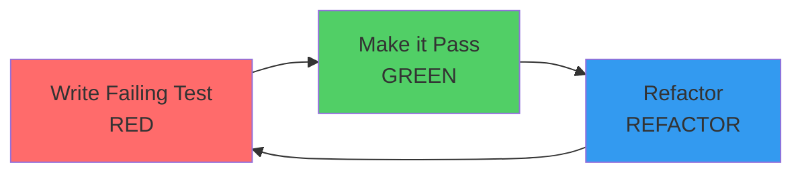

# TDD Handbook

> TDD is not about testing. It is about design. The tests are a byproduct. — Kent Beck

This handbook covers Test-Driven Development as practiced at Splashh: the Red-Green-Refactor cycle, when to apply TDD, when to skip it, and how TDD serves as a design tool rather than merely a verification mechanism. Every engineer writing business logic in the booking, membership, or payments domains must follow this workflow.

---

## The TDD Cycle



Each phase has a specific purpose and time budget. Do not skip phases or combine them.

---

## Phase 1: RED — Write the Failing Test

### What happens in this phase

1. **Read the acceptance criteria** — Understand what the feature must do before writing any code.
2. **Write the test first** — The test defines the API surface you want to use.
3. **Run the test** — It MUST fail. If it passes, you wrote production code first — go back.

### Why write the test first

The test is your **executable specification**. Writing it first forces you to:
- Design the API before implementing it
- Clarify requirements before coding
- Define the happy path AND error paths
- Catch design problems before they propagate

> **Why** — In our experience, engineers who write tests after implementation produce APIs that are awkward to test. The test-first approach naturally yields testable code because you are the first consumer of your own API.

### What to test in RED

- **Happy path** — The main behavior the feature must deliver
- **Error paths** — Invalid inputs, missing resources, permission denied
- **Edge cases** — Empty collections, boundary values, null handling

### Example: Booking Service

```python
# apps/backend/src/booking/tests/unit/test_booking_service.py
import pytest
from datetime import datetime, timedelta
from unittest.mock import MagicMock
from booking.service import BookingService
from booking.schemas import CreateBookingRequest
from booking.exceptions import (
    SlotNotAvailableError,
    FacilityNotFoundError,
    BookingWindowClosedError,
)


class TestCreateBooking:
    """Tests for the create_booking method."""

    def test_creates_booking_when_slot_available(self):
        """Happy path: booking is created when slot is free."""
        # ARRANGE
        tenant_id = "tenant-001"
        facility_id = "court-001"
        customer_id = "customer-001"
        start_time = datetime.utcnow() + timedelta(days=1)

        request = CreateBookingRequest(
            facility_id=facility_id,
            customer_id=customer_id,
            start_time=start_time,
            duration_minutes=60,
        )

        # Mock repository to return no existing bookings
        mock_repo = MagicMock()
        mock_repo.get_bookings_in_slot.return_value = []
        mock_repo.create.return_value = MagicMock(
            id="booking-123",
            tenant_id=tenant_id,
            facility_id=facility_id,
            customer_id=customer_id,
            start_time=start_time,
            status="confirmed",
        )

        service = BookingService(repository=mock_repo)

        # ACT
        result = service.create_booking(tenant_id, request)

        # ASSERT
        assert result.id == "booking-123"
        assert result.status == "confirmed"
        mock_repo.create.assert_called_once()

    def test_raises_slot_not_available_when_conflict(self):
        """Error path: booking fails when slot is already taken."""
        # ARRANGE
        tenant_id = "tenant-001"
        facility_id = "court-001"
        customer_id = "customer-001"
        start_time = datetime.utcnow() + timedelta(days=1)

        request = CreateBookingRequest(
            facility_id=facility_id,
            customer_id=customer_id,
            start_time=start_time,
            duration_minutes=60,
        )

        # Mock existing booking in this slot
        existing_booking = MagicMock(id="existing-booking")
        mock_repo = MagicMock()
        mock_repo.get_bookings_in_slot.return_value = [existing_booking]

        service = BookingService(repository=mock_repo)

        # ACT & ASSERT
        with pytest.raises(SlotNotAvailableError) as exc_info:
            service.create_booking(tenant_id, request)

        assert "Slot is not available" in str(exc_info.value)
        mock_repo.create.assert_not_called()

    def test_raises_facility_not_found(self):
        """Error path: booking fails when facility doesn't exist."""
        # ARRANGE
        tenant_id = "tenant-001"
        facility_id = "nonexistent-court"
        customer_id = "customer-001"
        start_time = datetime.utcnow() + timedelta(days=1)

        request = CreateBookingRequest(
            facility_id=facility_id,
            customer_id=customer_id,
            start_time=start_time,
            duration_minutes=60,
        )

        mock_repo = MagicMock()
        mock_repo.get_facility.return_value = None

        service = BookingService(repository=mock_repo)

        # ACT & ASSERT
        with pytest.raises(FacilityNotFoundError):
            service.create_booking(tenant_id, request)

    def test_raises_booking_window_closed_for_past_slots(self):
        """Edge case: cannot book slots in the past."""
        # ARRANGE
        tenant_id = "tenant-001"
        facility_id = "court-001"
        customer_id = "customer-001"
        past_time = datetime.utcnow() - timedelta(hours=1)

        request = CreateBookingRequest(
            facility_id=facility_id,
            customer_id=customer_id,
            start_time=past_time,
            duration_minutes=60,
        )

        mock_repo = MagicMock()
        service = BookingService(repository=mock_repo)

        # ACT & ASSERT
        with pytest.raises(BookingWindowClosedError):
            service.create_booking(tenant_id, request)
```

This test file demonstrates RED phase output:
- Tests are written BEFORE any service implementation exists
- The test defines what the service API should look like
- Error conditions are explicitly tested
- Each test has a descriptive name explaining the scenario

---

## Phase 2: GREEN — Make it Pass

### What happens in this phase

1. **Write minimum code to pass** — Implement only what the test expects.
2. **No optimization** — Do not refactor, add caching, or improve performance yet.
3. **Use mocks liberally** — Isolate the code under test from external dependencies.

### Why minimum code

> **Rule** — Write the simplest thing that could possibly work.

The goal is to get to GREEN as quickly as possible. The tests define the contract; the implementation fills in the details. Premature optimization in GREEN creates:
- Code that does more than required
- Tests that don't cover the actual implementation
- Wasted effort on features that might change

### Example: Minimal Implementation

```python
# apps/backend/src/booking/service.py
from datetime import datetime
from typing import Optional
from .schemas import CreateBookingRequest
from .models import Booking
from .repository import BookingRepository
from .exceptions import (
    SlotNotAvailableError,
    FacilityNotFoundError,
    BookingWindowClosedError,
)


class BookingService:
    def __init__(self, repository: BookingRepository):
        self._repository = repository

    def create_booking(
        self, tenant_id: str, request: CreateBookingRequest
    ) -> Booking:
        """Create a new booking for the given facility and time."""
        # Validate facility exists
        facility = self._repository.get_facility(request.facility_id)
        if not facility:
            raise FacilityNotFoundError(f"Facility {request.facility_id} not found")

        # Validate booking window
        if request.start_time < datetime.utcnow():
            raise BookingWindowClosedError("Cannot book slots in the past")

        # Check slot availability
        existing = self._repository.get_bookings_in_slot(
            tenant_id=tenant_id,
            facility_id=request.facility_id,
            start_time=request.start_time,
            duration_minutes=request.duration_minutes,
        )
        if existing:
            raise SlotNotAvailableError("Slot is not available")

        # Create booking (minimum code - no pricing, no notifications yet)
        booking = self._repository.create(
            tenant_id=tenant_id,
            facility_id=request.facility_id,
            customer_id=request.customer_id,
            start_time=request.start_time,
            duration_minutes=request.duration_minutes,
            status="confirmed",
        )

        return booking
```

This implementation:
- Passes all tests in the RED phase
- Contains no optimization (no caching, no pricing calculation)
- Is explicitly incomplete (no notifications, no payment integration)

### Common GREEN mistakes

| Mistake | Why it matters |
|---------|-----------------|
| Adding features not in tests | Violates YAGNI; creates untested code |
| Premature optimization | Wastes effort; requirements may change |
| Skipping edge cases | Tests only cover what you wrote |
| Using real DB in unit tests | Slows feedback loop; couples tests to infrastructure |

---

## Phase 3: REFACTOR — Improve Without Breaking

### What happens in this phase

1. **Improve code structure** — Extract methods, rename variables, reduce duplication
2. **Preserve behavior** — All tests must still pass
3. **No new tests** — Don't add coverage in this phase
4. **Technical debt cleanup** — Fix the things you noticed while writing GREEN code

### What to refactor

- **Naming** — Variable and method names that are confusing
- **Duplication** — Repeated code patterns that can be extracted
- **Long methods** — Functions > 20 lines should be split
- **God classes** — Services doing too much should delegate

### Example: Refactoring the Service

```python
# After refactoring - extracted validation logic
class BookingService:
    def __init__(self, repository: BookingRepository, validator: BookingValidator):
        self._repository = repository
        self._validator = validator

    def create_booking(
        self, tenant_id: str, request: CreateBookingRequest
    ) -> Booking:
        # Validation moved to dedicated class
        self._validator.validate_create_request(tenant_id, request)

        # Availability check extracted
        self._validator.ensure_slot_available(
            tenant_id, request.facility_id, request.start_time, request.duration_minutes
        )

        return self._repository.create(
            tenant_id=tenant_id,
            facility_id=request.facility_id,
            customer_id=request.customer_id,
            start_time=request.start_time,
            duration_minutes=request.duration_minutes,
            status="confirmed",
        )
```

The refactored code:
- Has clearer separation of concerns
- Is easier to test in isolation
- Maintains the same behavior (all tests pass)

---

## When to Use TDD

### Use TDD for

| Scenario | Why TDD helps |
|----------|---------------|
| New feature development | Forces API design before implementation |
| Complex business logic | Tests clarify edge cases upfront |
| Bug fixes | Regression tests prevent recurrence |
| Refactoring existing code | Tests verify behavior is preserved |
| API design | Tests document the contract |

### When NOT to Use TDD

> **Guideline** — TDD is not mandatory for every code change. Use judgment.

| Scenario | Why skip TDD |
|----------|--------------|
| Exploratory/spike code | Proof-of-concept may be thrown away |
| UI layout changes | Visual validation is more effective |
| Configuration-only changes | No logic to test |
| One-off scripts | Not part of production codebase |
| Trivial changes (fixing typos) | Overhead exceeds value |

> **Pitfall** — Do not use "it's exploratory" as an excuse to avoid tests entirely. Once exploratory code graduates to production, it must have tests.

---

## TDD as a Design Tool

### The design conversation

TDD forces a conversation between you and your code:

1. **What do I want to call this?** — The test names the interface
2. **What do I need to pass in?** — The test defines the input
3. **What do I expect back?** — The test defines the output
4. **What can go wrong?** — The test defines the errors

### Example: Designing the Pricing API

Suppose you need to add pricing to bookings. TDD guides the design:

```python
# RED: Write the test first - define what you want
def test_calculates_price_based_on_facility_and_duration():
    """Pricing depends on facility type and booking duration."""
    # Test defines the expected API
    pricing = pricing_service.calculate(
        facility_id="court-001",
        start_time=datetime(2024, 1, 15, 10, 0),
        duration_minutes=60,
    )

    assert pricing.amount == Decimal("45.00")
    assert pricing.currency == "GBP"
    assert pricing.breakdown == [
        {"item": "court", "amount": "30.00"},
        {"item": "equipment", "amount": "15.00"},
    ]
```

This test design:
- Names the method `calculate`
- Specifies required parameters
- Defines the return structure (amount, currency, breakdown)
- Documents business rules (court + equipment pricing)

> **Why** — Without TDD, you might implement `calculate_price()` that returns just a number. With TDD, the API is forced to be richer from the start.

---

## TDD Anti-patterns

### 1. Test after implementation

```python
# BAD: Writing tests after production code
def calculate_total():
    # ... production code first ...
    pass

# Then adding tests - defeats the purpose
def test_calculate_total():
    assert calculate_total() == 100
```

> **Anti-pattern** — This produces poorly designed APIs that are hard to test.

### 2. Testing implementation details

```python
# BAD: Testing internal state, not behavior
def test_internal_cache_is_used():
    service = BookingService()
    service.create_booking(...)  # populate cache
    assert service._cache.hits == 1  # Testing internals
```

> **Anti-pattern** — Tests should verify behavior, not implementation. Refactoring breaks these tests.

### 3. Giant test methods

```python
# BAD: One test does everything
def test_full_booking_flow():
    # 200 lines of setup, action, and assertions
    # Too many things can go wrong
    # Hard to diagnose failures
```

> **Anti-pattern** — Each test should verify one thing. Giant tests hide failures.

### 4. No error path tests

```python
# BAD: Only happy path tested
def test_creates_booking():
    booking = service.create_booking(...)
    assert booking is not None
```

> **Anti-pattern** — Users hit errors more often than happy paths. Missing error tests = unhandled production failures.

---

## Cycle Time Targets

| Phase | Target time | Maximum time |
|-------|-------------|--------------|
| RED | 2-5 min | 10 min |
| GREEN | 5-15 min | 30 min |
| REFACTOR | 5-10 min | 20 min |
| **Total cycle** | **12-30 min** | **60 min** |

If a cycle exceeds 60 minutes, the task is too large. Break it into smaller pieces.

---

## CI Integration

All TDD tests run in the CI pipeline before merge:

```yaml
# .github/workflows/test.yml
- name: Run unit tests
  run: |
    pytest apps/backend/src/booking/tests/unit/ \
      --cov=booking.service \
      --cov-fail-under=90 \
      -v --tb=short
```

> **Rule** — No PR merges without passing TDD tests. No exceptions.

---

## Summary

| Phase | Goal | Constraint |
|-------|------|------------|
| RED | Write failing test | Must fail before implementation |
| GREEN | Make it pass | Minimum code; no optimization |
| REFACTOR | Improve design | All tests pass; no new tests |

TDD is not about achieving 100% coverage. It is about building a specification-first mindset where every line of code is justified by a test that describes why it exists.

See also: [Unit Tests](unit-tests.md), [Integration Tests](integration-tests.md), [Testing Diamond](testing-diamond.md).
