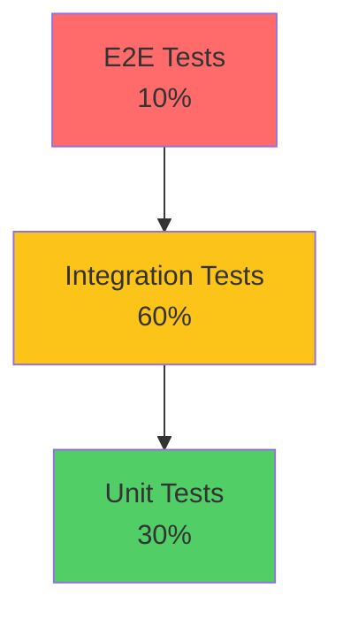

# Testing Diamond

> The diamond argues that most modern systems are integration-heavy rather than unit-heavy. We target: 30% unit tests, 60% integration tests, 10% E2E. This reflects the reality of database-heavy applications where composition matters more than isolated logic.

This document covers when the diamond beats the pyramid: the rationale for an integration-heavy strategy, how we implement it, and why it suits Splashh's architecture.

---

## The Diamond Model



| Layer | % of Tests | Purpose |
|-------|------------|---------|
| Unit | 30% | Core domain logic, pure functions |
| Integration | 60% | Database, repositories, service composition |
| E2E | 10% | Critical user journeys |

---

## Why Diamond for Modern Systems

### Database-Heavy Applications

Splashh is a booking platform — most behavior involves:
- Reading/writing to PostgreSQL
- Caching in Redis
- Publishing events
- Sending notifications

These are integration points that unit tests cannot verify.

### Composition Over Isolation

```python
# Integration test tests composition
def test_create_booking():
    # Real repository (SQL)
    repo = BookingRepository(session=real_db)

    # Real service with real repo
    service = BookingService(repository=repo)

    # Test actual composition
    booking = service.create_booking(...)

    # Verify persisted to real DB
    assert repo.get_by_id(booking.id) is not None

# Unit test only tests one component in isolation
def test_booking_service_create():
    mock_repo = MagicMock()
    service = BookingService(repository=mock_repo)

    # Mock doesn't prove real DB works
```

### Real Failure Modes

Unit tests miss:
- SQL query errors
- Transaction boundary issues
- FK constraint violations
- Redis connection failures

Integration tests catch these.

---

## Our Implementation

### Test Distribution

```python
tests/
├── unit/                         # 30%
│   ├── domain/
│   │   ├── test_booking.py      # Pure domain logic
│   │   └── test_pricing.py      # Pure pricing calculations
│   └── test_exceptions.py        # Exception handling
├── integration/                  # 60%
│   ├── repositories/
│   │   ├── test_booking_repo.py  # Real PostgreSQL
│   │   └── test_facility_repo.py
│   ├── services/
│   │   └── test_booking_service.py
│   └── cache/
│       └── test_redis_cache.py  # Real Redis
├── api/                         # 8%
│   └── test_booking_endpoints.py
└── e2e/                        # 2%
    └── test_booking_flow.py
```

### What Goes Where

| What | Where | Why |
|------|-------|-----|
| Pure domain logic | Unit | No dependencies, fast |
| Repository queries | Integration | Test real SQL |
| Service composition | Integration | Test real integration |
| API endpoints | API | Test HTTP contract |
| Full user journey | E2E | Browser automation |

---

## Justification

### Unit Tests (30%)

```python
# This stays in unit tests - pure logic
class Booking:
    @property
    def duration_minutes(self):
        return (self.end_time - self.start_time).total_seconds() / 60

    def is_within_cancellation_window(self, hours=24):
        return (self.start_time - datetime.utcnow()).total_seconds() / 3600 < hours
```

- No I/O
- Deterministic
- Fast execution
- Core business rules

### Integration Tests (60%)

```python
# This goes in integration tests - database
def test_booking_persists_to_database():
    repo = BookingRepository(session=real_db)

    booking = repo.create(
        tenant_id="t1",
        facility_id="f1",
        customer_id="c1",
        start_time=datetime.utcnow(),
        duration_minutes=60,
    )

    # Verify real database state
    result = real_db.execute("SELECT * FROM bookings WHERE id = ?", booking.id)
    assert result.fetchone() is not None
```

- Database behavior
- Query correctness
- Constraint validation
- Transaction handling

### E2E Tests (10%)

```python
# Only critical flows in E2E
@pytest.mark.critical
def test_complete_booking_journey():
    # Login
    page.goto("/login")
    page.fill("[name=email]", "user@test.com")
    page.fill("[name=password]", "password")
    page.click("[type=submit]")

    # Book facility
    page.goto("/bookings/new")
    page.select_option("[name=facility]", "court-001")
    page.click("[type=submit]")

    # Verify success
    assert page.locator(".success").is_visible()
```

- Full user journey
- Critical paths only
- Cross-system integration

---

## Trade-offs

| Aspect | Diamond | Pyramid |
|--------|---------|---------|
| Test execution time | Slower | Faster |
| DB confidence | Higher | Lower |
| Maintenance | Higher | Lower |
| Real failure detection | Better | Worse |
| Fast feedback | Less | More |

---

## When to Use Pyramid Instead

The pyramid is better when:
- Logic-heavy, data-light application
- In-memory processing
- Simple integrations
- Need maximum speed

The diamond is better when:
- Database-heavy application
- Complex integrations
- Need confidence in persistence
- Complex service composition

---

## CI Impact

```yaml
# Diamond: more integration tests to run
- name: Integration Tests
  run: |
    pytest tests/integration/ \
      --tb=short \
      --maxfail=3 \
      -v

  # ~60% of test execution time
```

---

## Summary

| Layer | Target % | Why |
|-------|----------|-----|
| Unit | 30% | Core domain logic only |
| Integration | 60% | Database, repositories, services |
| E2E | 10% | Critical user journeys |

The diamond reflects modern application reality: most bugs are in integration points, not isolated logic.

See also: [Testing Pyramid](testing-pyramid.md), [Unit Tests](unit-tests.md), [Integration Tests](integration-tests.md).
