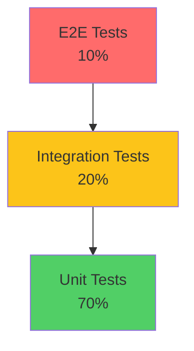

# Testing Pyramid

> The classic testing pyramid advocates many unit tests at the base, fewer integration tests in the middle, and fewest E2E tests at the top. This structure optimizes for fast feedback and low cost per test.

This document covers the classic testing pyramid: the ideal ratio, where we deviate (UI tests are expensive), and why the pyramid works.

---

## The Classic Pyramid



| Layer | % of Tests | Characteristics |
|-------|-------------|-----------------|
| Unit | 70% | Fast (<10ms), isolated, no I/O |
| Integration | 20% | Real DB/Redis, tests composition |
| E2E | 10% | Slow (min+), full stack, browser |

---

## Why the Pyramid Works

### Fast Feedback

- **Unit tests** run in milliseconds
- **Integration tests** run in seconds
- **E2E tests** run in minutes

More unit tests = faster feedback = quicker iteration.

### Cost Per Test

| Test Type | Setup Cost | Execution | Maintenance |
|-----------|------------|-----------|-------------|
| Unit | Low | <10ms | Low |
| Integration | Medium | <2s | Medium |
| E2E | High | >1min | High |

### Bug Localization

- Unit tests pinpoint exact function
- Integration tests narrow to component
- E2E only shows symptom, not cause

---

## Our Pyramid Implementation

### Test Distribution

```python
# apps/backend/tests/
tests/
├── unit/                    # 70% - unit tests
│   ├── domain/
│   ├── services/
│   └── ...
├── integration/             # 20% - integration tests
│   ├── repositories/
│   └── services/
├── api/                    # ~8% - API tests
│   └── test_endpoints.py
└── e2e/                   # ~2% - E2E tests
    └── test_critical_flows.py
```

### Ratio Enforcement

```yaml
# .github/workflows/test-ratio.yml
- name: Check Test Ratio
  run: |
    # Count test files
    UNIT=$(find tests/unit -name "test_*.py" | wc -l)
    INTEGRATION=$(find tests/integration -name "test_*.py" | wc -l)
    E2E=$(find tests/e2e -name "test_*.py" | wc -l)

    # Log distribution
    echo "Unit: $UNIT"
    echo "Integration: $INTEGRATION"
    echo "E2E: $E2E"

    # Warn if E2E > 15%
    TOTAL=$((UNIT + INTEGRATION + E2E))
    E2E_RATIO=$((E2E * 100 / TOTAL))

    if [ $E2E_RATIO -gt 15 ]; then
      echo "WARNING: E2E tests exceed 15% of suite"
    fi
```

---

## Where We Deviate

### UI Tests Are Expensive

```python
# E2E test costs
- Browser launch: 2-5 seconds
- Page load: 1-3 seconds
- Element interaction: 100-500ms per action
- Single test: 30-120 seconds
```

> **Guideline** — We limit E2E tests to critical user journeys:
> - Login
> - Complete booking
> - Payment processing
> - Cancellation

### Not Everything Needs E2E

```python
# BAD: Testing everything end-to-end
def test_calculator():
    # Launch browser
    # Navigate to calculator app
    # Click 1 + 2 = 3
    # Assert result

# GOOD: Unit test calculator logic
def test_addition():
    assert add(1, 2) == 3
```

---

## Optimizing the Pyramid

### Keep Units Fast

```python
# BAD: Slow unit test
def test_booking_creation():
    # HTTP call in unit test
    response = requests.get("http://api.example.com/facilities")
    service.create_booking(...)
```

> **Anti-pattern** — Unit tests should have no I/O.

### Keep Integration Tests Focused

```python
# GOOD: Test one thing in integration
def test_booking_repository_create():
    repo = BookingRepository(session=db)
    booking = repo.create(...)
    assert booking.id is not None

# BAD: Testing everything in one test
def test_full_booking_flow():
    # Too much for one test
    # Database, service, validation, notifications
```

### Keep E2E Critical

```python
# Only critical paths in E2E
@pytest.mark.e2e
@pytest.mark.critical
def test_complete_booking_flow():
    """Only critical E2E test."""
    pass

# NOT E2E - belongs in lower layer
def test_form_validation():
    # Unit or integration test
    pass
```

---

## When the Pyramid Works

The pyramid is ideal when:
- UI is stable
- Integration points are simple
- Business logic is complex
- Fast feedback is critical

---

## Summary

| Layer | Target % | Max % | Per Test |
|-------|----------|-------|----------|
| Unit | 70% | 80% | <10ms |
| Integration | 20% | 25% | <2s |
| E2E | 10% | 15% | >30s |

See also: [Testing Diamond](testing-diamond.md), [Unit Tests](unit-tests.md), [Integration Tests](integration-tests.md), [UI Tests](ui-tests.md).
