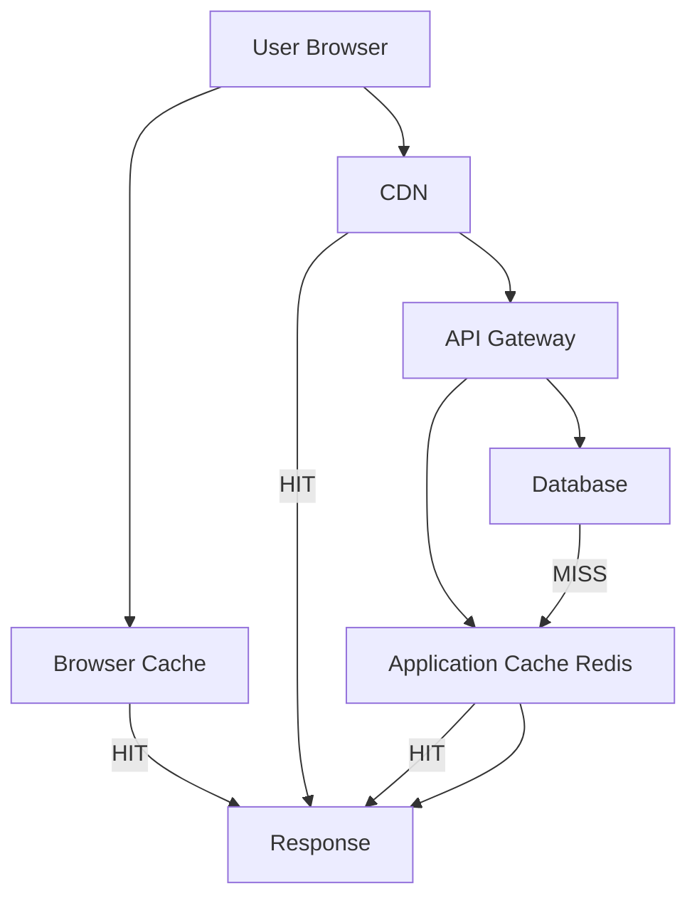

# Caching

> Cache layers: browser, CDN, application (Redis), DB. What to cache, TTLs, invalidation. Cache-aside vs. read-through vs. write-through. Cache stampede prevention.

This document establishes caching strategies for the Splashh Sports Platform. We implement a multi-layer caching architecture to minimize latency and reduce database load.

---

## Cache Layers Architecture



---

## What to Cache at Each Layer

| Layer | What to cache | Typical TTL | Invalidation |
|-------|---------------|-------------|-------------|
| Browser (HTTP) | Static assets, GET responses | Minutes to days | Version URLs |
| CDN | API responses, static assets | Minutes to hours | Cache headers |
| Redis | Query results, computed values | Seconds to hours | Explicit or TTL |
| Database | Materialized views, aggregations | Minutes to hours | Schedule or trigger |

---

## Cache-Aside Pattern

The most common pattern: check cache first, populate on miss:

```python
# apps/backend/src/common/cache.py
from functools import wraps
from typing import Callable, TypeVar, Optional
import json
import redis.asyncio as redis
from config import settings

T = TypeVar('T')

class CacheService:
    def __init__(self):
        self.redis = redis.Redis(
            host=settings.REDIS_HOST,
            port=settings.REDIS_PORT,
            db=settings.REDIS_DB,
            decode_responses=True
        )

    async def get_or_set(
        self,
        key: str,
        fetch_fn: Callable[[], T],
        ttl: int = 300,
        prefix: str = "cache"
    ) -> T:
        """Cache-aside pattern: get from cache or fetch and cache."""
        full_key = f"{prefix}:{key}"

        # Try cache first
        cached = await self.redis.get(full_key)
        if cached is not None:
            return json.loads(cached)

        # Cache miss - fetch from source
        value = await fetch_fn()

        # Store in cache
        if value is not None:
            await self.redis.setex(
                full_key,
                ttl,
                json.dumps(value)
            )

        return value

    async def invalidate(self, pattern: str, prefix: str = "cache"):
        """Invalidate keys matching pattern."""
        full_pattern = f"{prefix}:{pattern}"
        keys = []
        async for key in self.redis.scan_iter(match=full_pattern):
            keys.append(key)

        if keys:
            await self.redis.delete(*keys)

cache_service = CacheService()


def cached(ttl: int = 300, prefix: str = "cache"):
    """Decorator for caching function results."""
    def decorator(func: Callable[..., T]) -> Callable[..., T]:
        @wraps(func)
        async def wrapper(*args, **kwargs) -> T:
            # Generate cache key from function name and args
            key_parts = [func.__name__]
            if args:
                key_parts.extend(str(arg) for arg in args)
            if kwargs:
                key_parts.extend(f"{k}={v}" for k, v in sorted(kwargs.items()))

            cache_key = ":".join(key_parts)

            async def fetch():
                return await func(*args, **kwargs)

            return await cache_service.get_or_set(
                cache_key, fetch_fn, ttl, prefix
            )
        return wrapper
    return decorator
```

---

## Read-Through Pattern

Let the cache handle loading:

```python
# apps/backend/src/common/cache.py (continued)

class ReadThroughCache:
    """Read-through cache: cache automatically loads data on miss."""

    def __init__(self, cache: CacheService):
        self.cache = cache

    async def get_facilities(self, tenant_id: str) -> list[dict]:
        """Read-through caching for facilities."""
        cache_key = f"facilities:{tenant_id}"

        async def fetch():
            return await self._fetch_facilities_from_db(tenant_id)

        return await self.cache.get_or_set(cache_key, fetch, ttl=600)

    async def get_booking(self, booking_id: str) -> Optional[dict]:
        """Single booking with shorter TTL."""
        cache_key = f"booking:{booking_id}"

        async def fetch():
            return await self._fetch_booking_from_db(booking_id)

        return await self.cache.get_or_set(cache_key, fetch, ttl=60)
```

---

## Write-Through Pattern

Update cache synchronously with database:

```python
# apps/backend/src/common/cache.py (continued)

class WriteThroughCache:
    """Write-through: update cache when writing to DB."""

    def __init__(self, cache: CacheService):
        self.cache = cache

    async def create_booking(self, booking_data: dict) -> dict:
        """Create booking and immediately cache it."""
        # Write to DB first
        booking = await self._create_booking_in_db(booking_data)

        # Then update cache
        cache_key = f"booking:{booking['id']}"
        await self.cache.redis.setex(
            cache_key,
            60,
            json.dumps(booking)
        )

        # Invalidate list caches
        await self.cache.invalidate(f"bookings:*")

        return booking
```

---

## Cache Invalidation Strategies

### 1. TTL-Based

```python
# Simple expiration - cache auto-invalidates
await redis.setex(key, ttl=300, value=data)
```

### 2. Event-Based

```python
# Invalidate when data changes
@event_bus.on(Event.BookingCreated)
async def invalidate_booking_cache(event: Event.BookingCreated):
    await cache_service.invalidate(f"booking:{event.booking_id}")
    await cache_service.invalidate("bookings:*")
```

### 3. Scheduled

```python
# Cron job to refresh expensive computations
@app.on_event("startup")
async def schedule_cache_refresh():
    scheduler = AsyncIOScheduler()
    scheduler.add_job(
        refresh_daily_analytics,
        "cron",
        hour=1,  # 1 AM
        timezone="UTC"
    )
    scheduler.start()
```

---

## Cache Stampede Prevention

When multiple requests hit a missing cache simultaneously, prevent thundering herd:

```python
# apps/backend/src/common/cache.py (continued)

import asyncio
import hashlib

class CacheStampedePrevention:
    """Prevent cache stampede using probabilistic early expiration."""

    async def get_with_lock(
        self,
        key: str,
        fetch_fn: Callable,
        ttl: int = 300,
        lock_ttl: int = 10
    ) -> any:
        """Get value with stampede prevention."""
        # Try to get from cache
        cached = await self.redis.get(key)
        if cached is not None:
            return json.loads(cached)

        # Check if another process is already fetching
        lock_key = f"lock:{key}"
        lock_acquired = await self.redis.set(
            lock_key, "1", nx=True, ex=lock_ttl
        )

        if not lock_acquired:
            # Wait and retry cache
            await asyncio.sleep(0.1)
            cached = await self.redis.get(key)
            if cached:
                return json.loads(cached)

            # Still wait for other process
            for _ in range(10):
                await asyncio.sleep(0.1)
                cached = await self.redis.get(key)
                if cached:
                    return json.loads(cached)

        # We got the lock - fetch and cache
        try:
            value = await fetch_fn()
            if value:
                await self.redis.setex(key, ttl, json.dumps(value))
            return value
        finally:
            # Release lock
            await self.redis.delete(lock_key)
```

---

## TTL Guidelines by Data Type

| Data Type | Example | TTL | Rationale |
|-----------|---------|-----|-----------|
| Static config | Facility list | 1 hour | Changes rarely |
| User-specific | User profile | 5 min | Personalization, some staleness OK |
| Session | Auth token | Session | Security sensitive |
| Aggregations | Daily stats | 15 min | Computed, slightly stale OK |
| Real-time | Court availability | 30 sec | Must be fresh |
| Pricing | Membership prices | 1 hour | Changes infrequently |

---

## Trade-offs

| Strategy | What we gain | What we give up |
|----------|--------------|-----------------|
| Cache-aside | Simple, resilient | Cache miss latency |
| Read-through | Cleaner code | Coupling to cache |
| Write-through | Strong consistency | Write latency |
| Write-behind | Fast writes | Risk of data loss |

---

## Related Documents

- [Redis](redis.md) — Redis data structures
- [Database Optimization](database-optimization.md) — DB caching
- [Queue Design](queue-design.md) — Async cache warming
