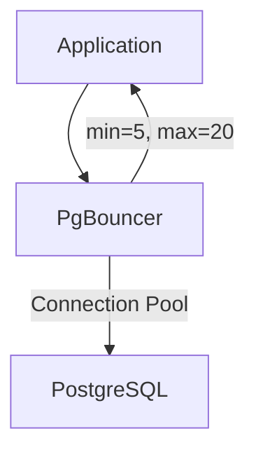

# Connection Pooling

> PgBouncer in transaction mode. Pool sizing (cores * 2 for app). Leak detection. Statement timeout. Idle timeout. Per-environment config.

This document establishes connection pooling strategies for the Splashh Sports Platform. Database connections are expensive — pooling reuses connections to minimize overhead.

---

## Architecture



---

## PgBouncer Configuration

```ini
# pgbouncer.ini
[databases]
splashh_main = host=postgres port=5432 dbname=splashh

[pgbouncer]
listen_addr = 0.0.0.0
listen_port = 6432
auth_type = md5
auth_file = /etc/pgbouncer/userlist.txt

# Transaction mode: connection returned to pool after transaction
pool_mode = transaction

# Pool sizing
min_pool_size = 5
default_pool_size = 20
reserve_pool_size = 5
reserve_pool_timeout = 5

# Timeouts
server_idle_timeout = 60
server_lifetime = 3600
server_connect_timeout = 15

# Statement limits
server_reset_query = DISCARD ALL
server_check_delay = 30

# Logging
log_connections = 0
log_disconnections = 0
log_pooler_errors = 1
```

### Transaction Mode

```ini
# Transaction mode - connections are recycled after each transaction
pool_mode = transaction

# This means:
# - Connection 1: BEGIN -> query -> COMMIT -> return to pool
# - Connection 2: BEGIN -> query -> COMMIT -> return to pool
# - Connections are shared across all transactions
```

> **Why** — Transaction mode maximizes connection utilization. Each transaction gets a connection from the pool, uses it, then returns it for the next transaction.

---

## Pool Sizing Guidelines

### Rule of Thumb

```
max_connections = (cores * 2) + effective_spindle_count
```

| App Instances | CPU Cores | Recommended PgBouncer Pool |
|--------------|-----------|---------------------------|
| 1 | 4 | 20 |
| 2 | 4 | 20 |
| 4 | 4 | 20 |
| 2 | 8 | 30 |

### PostgreSQL Settings

```sql
-- postgresql.conf
max_connections = 100  -- Must be >= PgBouncer max + some headroom

-- Per-connection settings
statement_timeout = 30000  -- 30 second max query time
idle_in_transaction_session_timeout = 60000  -- 1 min max idle time
```

---

## Application Configuration

```python
# apps/backend/src/common/database.py
from sqlalchemy.ext.asyncio import create_async_engine, AsyncSession
from sqlalchemy.orm import sessionmaker
from config import settings

# Connection string for PgBouncer
DATABASE_URL = (
    f"postgresql+asyncpg://{settings.DB_USER}:{settings.DB_PASSWORD}"
    f"@{settings.PGBOUNCER_HOST}:{settings.PGBOUNCER_PORT}"
    f"/{settings.DB_NAME}"
)

# Engine with pooling
engine = create_async_engine(
    DATABASE_URL,
    pool_size=20,           # Connections to maintain
    max_overflow=10,        # Additional connections under load
    pool_timeout=30,        # Wait time for connection
    pool_recycle=1800,     # Recycle connections after 30 min
    pool_pre_ping=True,    # Verify connection before use
    echo=settings.DEBUG,    # Log SQL in debug mode
)

# Session factory
async_session_factory = sessionmaker(
    engine,
    class_=AsyncSession,
    expire_on_commit=False,
)
```

---

## Leak Detection

### Connection Leak Patterns

```python
# Anti-pattern: Forgetting to close session
async def bad_handler(request):
    session = async_session_factory()  # Never closed!
    result = await session.execute(query)
    return result

# Good: Explicit cleanup
async def good_handler(request):
    async with async_session_factory() as session:
        result = await session.execute(query)
        return result

# Or with dependency injection
async def handler(request, session: AsyncSession = Depends(get_session)):
    result = await session.execute(query)
    return result
```

### Monitoring Leaks

```python
# Middleware to track connection leaks
from contextlib import asynccontextmanager
import time

@asynccontextmanager
async def tracked_session(session_factory):
    start = time.time()
    try:
        async with session_factory() as session:
            yield session
    finally:
        duration = time.time() - start
        if duration > 5:  # Warn if session held > 5 seconds
            logger.warning(
                "Long session",
                extra={
                    "duration": duration,
                    "stack": traceback.format_stack()
                }
            )
```

### PostgreSQL Monitoring

```sql
-- Check active connections
SELECT
    datname,
    numbackends AS connections,
    xact_commit AS commits,
    xact_rollback AS rollbacks,
    blks_read,
    blks_hit,
    ROUND(100.0 * blks_hit / NULLIF(blks_hit + blks_read, 0), 2) AS cache_hit_ratio
FROM pg_stat_database
WHERE datname = 'splashh';

-- Find idle connections
SELECT
    pid,
    usename,
    application_name,
    state,
    query,
    (now() - query_start) AS duration
FROM pg_stat_activity
WHERE datname = 'splashh'
  AND state = 'idle in transaction'
  AND (now() - query_start) > interval '5 minutes'
ORDER BY duration DESC;
```

---

## Idle Timeout

```python
# Ensure connections are returned to pool
engine = create_async_engine(
    DATABASE_URL,
    pool_size=20,
    max_overflow=10,
    pool_timeout=30,
    pool_recycle=1800,    # Recycle every 30 min
    pool_pre_ping=True,   # Verify before use
)

# Application: Use context managers
async def handler():
    # Session returned to pool automatically
    async with session_factory() as session:
        await session.execute(query)
    # Connection now available for other requests
```

---

## Per-Environment Config

```yaml
# docker-compose.yml
services:
  pgbouncer:
    environment:
      # Development
      - POOL_MODE=transaction
      - POOL_SIZE=5
      - MAX_CLIENT_CONN=50

  # docker-compose.prod.yml
  pgbouncer:
    environment:
      # Production
      - POOL_MODE=transaction
      - POOL_SIZE=20
      - MAX_CLIENT_CONN=200
```

---

## Health Checks

```python
# Health check for connection pool
@app.get("/health")
async def health_check():
    # Check database connectivity
    try:
        async with engine.connect() as conn:
            await conn.execute(text("SELECT 1"))
    except Exception as e:
        return {"status": "unhealthy", "database": str(e)}

    # Check pool status
    pool = engine.pool
    return {
        "status": "healthy",
        "pool": {
            "size": pool.size(),
            "checked_in": pool.checkedin(),
            "checked_out": pool.checkedout(),
            "overflow": pool.overflow(),
        }
    }
```

---

## Trade-offs

| Setting | What we gain | What we give up |
|---------|--------------|-----------------|
| Larger pool | Higher throughput | More DB connections |
| Smaller pool | Fewer resources | Potential contention |
| Longer idle timeout | Reuse connections | Stale connections |
| Pre-ping | Connection reliability | Slight latency |

---

## Related Documents

- [Database Optimization](database-optimization.md) — Query optimization
- [Async Processing](async-processing.md) — Background connection usage
- [PgBouncer Docs](https://www.pgbouncer.org) — Full reference
