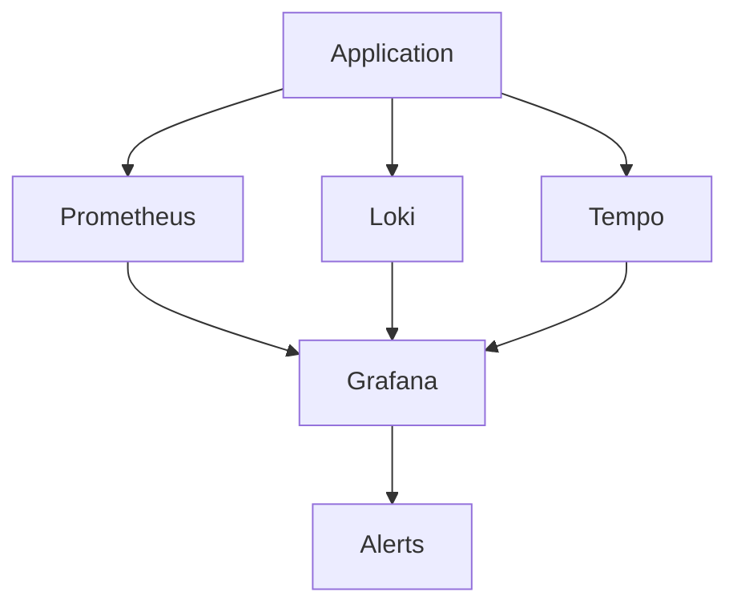

# Observability

> Three pillars: metrics (Prometheus), logs (Loki), traces (Tempo/Jaeger). RED method. USE method. OpenTelemetry.

This document establishes observability practices for the Splashh Sports Platform. We implement the three pillars: metrics, logs, and traces.

---

## Three Pillars Architecture



---

## Metrics: RED Method

Rate, Errors, Duration - for request-oriented services:

```python
# apps/backend/src/common/metrics/metrics.py
from prometheus_client import Counter, Histogram, Gauge
import time

# Request metrics
http_requests_total = Counter(
    "http_requests_total",
    "Total HTTP requests",
    ["method", "endpoint", "status"]
)

http_request_duration_seconds = Histogram(
    "http_request_duration_seconds",
    "HTTP request duration",
    ["method", "endpoint"],
    buckets=[0.01, 0.05, 0.1, 0.25, 0.5, 1.0, 2.5, 5.0]
)

# Business metrics
bookings_created = Counter(
    "bookings_created_total",
    "Total bookings created",
    ["tenant_id", "status"]
)

active_users = Gauge(
    "active_users",
    "Active users",
    ["tenant_id"]
)
```

### RED Dashboard Queries

```promql
# Rate - requests per second
sum(rate(http_requests_total[5m]))

# Errors - error rate
sum(rate(http_requests_total{status=~"5.."}[5m]))

# Duration - P95 latency
histogram_quantile(0.95,
  sum(rate(http_request_duration_seconds_bucket[5m])) by (le)
)
```

---

## Metrics: USE Method

Utilization, Saturation, Errors - for resource-oriented services:

```python
# Resource metrics
redis_memory_used = Gauge(
    "redis_memory_used_bytes",
    "Redis memory used"
)

postgres_connections = Gauge(
    "postgres_connections_active",
    "Active PostgreSQL connections"
)

worker_queue_depth = Gauge(
    "worker_queue_depth",
    "Worker queue depth",
    ["queue"]
)
```

### USE Dashboard Queries

```promql
# Utilization - CPU usage
100 - (avg by (instance) (rate(node_cpu_seconds_total{mode="idle"}[5m])) * 100)

# Saturation - Queue depth
max by (queue) (worker_queue_depth)

# Errors - Failed jobs
sum(rate(worker_jobs_failed_total[5m]))
```

---

## Structured Logging

```python
# apps/backend/src/common/logging/config.py
import logging
import json
from datetime import datetime
from typing import Any
import logfmt

class StructuredFormatter(logging.Formatter):
    def format(self, record: logging.LogRecord) -> str:
        log_data = {
            "timestamp": datetime.utcnow().isoformat() + "Z",
            "level": record.levelname,
            "logger": record.name,
            "message": record.getMessage(),
            "module": record.module,
            "function": record.funcName,
            "line": record.lineno,
        }

        # Add exception info
        if record.exc_info:
            log_data["exception"] = self.formatException(record.exc_info)

        # Add extra fields
        if hasattr(record, "extra"):
            log_data.update(record.extra)

        return json.dumps(log_data)


# Usage
logger = logging.getLogger(__name__)

# Contextual logging
logger.info(
    "booking_created",
    extra={
        "booking_id": booking.id,
        "tenant_id": booking.tenant_id,
        "user_id": user.id,
        "facility_id": facility.id,
    }
)
```

---

## Distributed Tracing

### OpenTelemetry Setup

```python
# apps/backend/src/common/tracing.py
from opentelemetry import trace
from opentelemetry.sdk.trace import TracerProvider
from opentelemetry.sdk.trace.export import BatchSpanProcessor
from opentelemetry.exporter.otlp.proto.grpc.trace_exporter import OTLPSpanExporter
from opentelemetry.instrumentation.fastapi import FastAPIInstrumentor

# Initialize tracing
trace.set_tracer_provider(TracerProvider())

# Export to Tempo
otlp_exporter = OTLPSpanExporter(
    endpoint=f"http://{settings.TEMPO_ENDPOINT}:4317",
)
trace.get_tracer_provider().add_span_processor(
    BatchSpanProcessor(otlp_exporter)
)

# Instrument FastAPI
FastAPIInstrumentor.instrument_app(app)
```

### Tracing in Code

```python
from opentelemetry import trace

tracer = trace.get_tracer(__name__)

@router.post("/bookings")
async def create_booking(booking_data: BookingCreate):
    with tracer.start_as_current_span("create_booking") as span:
        span.set_attribute("booking.tenant_id", booking_data.tenant_id)
        span.set_attribute("booking.facility_id", booking_data.facility_id)

        # Database call
        with tracer.start_as_current_span("db.insert_booking"):
            booking = await db.create(booking_data)

        # External API call
        with tracer.start_as_current_span("payment.process"):
            result = await payment.process(booking)

        return booking
```

---

## SLO Dashboards

```promql
# Booking API SLO
(
  sum(rate(http_requests_total{endpoint="/api/v1/bookings", status=~"2.."}[5m]))
  /
  sum(rate(http_requests_total{endpoint="/api/v1/bookings"}[5m]))
)
> 0.99
```

```yaml
# SLO alerts
groups:
  - name: slo-alerts
    rules:
      - alert: BookingAPISLOBreach
        expr: |
          (
            sum(rate(http_requests_total{endpoint=~"/api/v1/bookings.*", status=~"2.."}[5m]))
            /
            sum(rate(http_requests_total{endpoint=~"/api/v1/bookings.*"}[5m])
          ) < 0.99
        for: 5m
        labels:
          severity: critical
```

---

## Metrics Collection

### Application Metrics

```python
# Expose /metrics endpoint
from prometheus_client import make_asgi_app

app = FastAPI()
app.mount("/metrics", make_asgi_app())
```

### Node Exporter

```yaml
# kubernetes/node-exporter.yaml
apiVersion: v1
kind: DaemonSet
metadata:
  name: node-exporter
spec:
  containers:
    - name: node-exporter
      image: prom/node-exporter:latest
      ports:
        - containerPort: 9100
```

---

## Alerting Rules

| Alert | Condition | Severity |
|-------|-----------|----------|
| HighErrorRate | Error rate > 1% | Warning |
| CriticalErrorRate | Error rate > 5% | Critical |
| HighLatency | P95 > 500ms | Warning |
| CriticalLatency | P95 > 2s | Critical |
| SLOBreach | Availability < 99.9% | Critical |

---

## Trade-offs

| Approach | What we gain | What we give up |
|----------|--------------|-----------------|
| RED metrics | Request insight | Resource insight |
| USE metrics | Resource insight | Request insight |
| Sampling traces | Lower cost | May miss issues |
| Full traces | Complete picture | Higher cost |

---

## Related Documents

- [Response Time Goals](response-time-goals.md) — SLO targets
- [Performance Budgets](performance-budgets.md) — CI checks
- [OpenTelemetry](https://opentelemetry.io) — Full documentation
