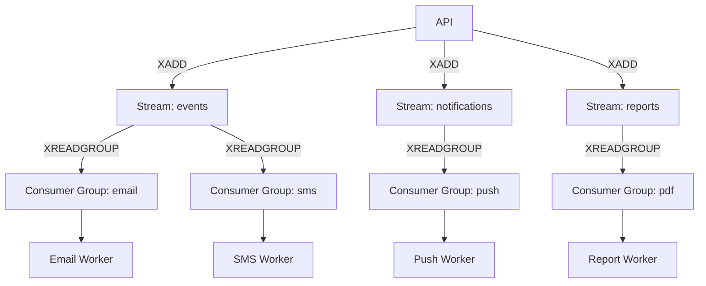

# Queue Design

> Redis Streams vs. dedicated broker. Priority queues. Fair scheduling via consumer groups. Dead-letter queues. Throughput targets.

This document establishes queue architecture for the Splashh Sports Platform. We use Redis Streams for job queuing due to its simplicity and integration with our existing Redis infrastructure.

---

## Redis Streams Architecture



---

## Stream Configuration

```python
# apps/backend/src/common/queues/streams.py
from redis.asyncio import Redis
from config import settings
import json

class StreamConfig:
    STREAMS = {
        "events": {
            "maxlen": 100000,
            "consumer_groups": ["email", "sms", "webhooks"],
        },
        "notifications": {
            "maxlen": 50000,
            "consumer_groups": ["email", "sms", "push"],
        },
        "reports": {
            "maxlen": 5000,
            "consumer_groups": ["pdf", "csv", "analytics"],
        },
    }

    @classmethod
    async def initialize(cls, redis: Redis):
        """Initialize streams and consumer groups."""
        for stream_name, config in cls.STREAMS.items():
            # Create stream with max length
            # Note: Stream created automatically on first XADD
            for group in config.get("consumer_groups", []):
                try:
                    await redis.xgroup_create(
                        stream_name,
                        group,
                        id="0",  # Start from beginning
                        mkstream=True
                    )
                except Exception as e:
                    # Group may already exist
                    if "BUSYGROUP" not in str(e):
                        raise
```

---

## Priority Queues

Use separate streams for priority levels:

```python
# Separate streams for priorities
STREAM_HIGH = "jobs:high"      # Critical: payments, bookings
STREAM_NORMAL = "jobs:normal"  # Standard: emails, notifications
STREAM_LOW = "jobs:low"        # Background: reports, analytics


class PriorityJobQueue:
    def __init__(self, redis: Redis):
        self.redis = redis

    async def enqueue(self, job: dict, priority: str = "normal"):
        """Enqueue job with priority."""
        stream = {
            "high": STREAM_HIGH,
            "normal": STREAM_NORMAL,
            "low": STREAM_LOW,
        }[priority]

        await self.redis.xadd(
            stream,
            {
                "job_id": job["id"],
                "payload": json.dumps(job),
                "job_type": job["type"],
            },
            maxlen=10000  # Limit stream size
        )

    async def dequeue(self, timeout: int = 5) -> list | None:
        """Read from high, then normal, then low."""
        # Try high priority first
        result = await self.redis.xread(
            {STREAM_HIGH: "0"},
            count=1,
            block=timeout * 1000
        )
        if result:
            return result

        # Try normal priority
        result = await self.redis.xread(
            {STREAM_NORMAL: "0"},
            count=1,
            block=timeout * 1000
        )
        if result:
            return result

        # Try low priority
        return await self.redis.xread(
            {STREAM_LOW: "0"},
            count=1,
            block=timeout * 1000
        )
```

---

## Fair Scheduling with Consumer Groups

```python
# apps/backend/src/workers/consumer.py
class FairConsumer:
    """Fair consumer that processes jobs from all streams."""

    def __init__(self, redis: Redis, group_name: str, consumer_name: str):
        self.redis = redis
        self.group = group_name
        self.consumer = consumer_name
        self.streams = ["jobs:high", "jobs:normal", "jobs:low"]

    async def consume(self):
        """Fairly read from multiple streams."""
        # Read from all streams simultaneously
        result = await self.redis.xreadgroup(
            groupname=self.group,
            consumername=self.consumer,
            streams={s: ">" for s in self.streams},
            count=1,
            block=5000
        )

        for stream_name, messages in result:
            for msg_id, msg_data in messages:
                try:
                    await self.process_message(msg_id, msg_data)
                    # Acknowledge successful processing
                    await self.redis.xack(stream_name, self.group, msg_id)
                except Exception as e:
                    # Requeue for retry
                    await self.requeue_message(stream_name, msg_id, msg_data, e)

    async def process_message(self, msg_id: str, msg_data: dict):
        """Process individual message."""
        job_type = msg_data["job_type"]
        payload = json.loads(msg_data["payload"])

        handler = JOB_HANDLERS.get(job_type)
        if not handler:
            raise ValueError(f"Unknown job type: {job_type}")

        await handler(payload)

    async def requeue_message(self, stream: str, msg_id: str, msg_data: dict, error: Exception):
        """Requeue failed message with delay."""
        retry_count = int(msg_data.get("retry_count", 0))

        if retry_count >= 3:
            # Move to dead letter
            await self.redis.xadd(
                "jobs:dead_letter",
                {
                    **msg_data,
                    "error": str(error),
                    "failed_at": str(datetime.utcnow()),
                }
            )
            await self.redis.xack(stream, self.group, msg_id)
        else:
            # Requeue with incremented retry count
            await self.redis.xadd(
                stream,
                {
                    **msg_data,
                    "retry_count": retry_count + 1,
                    "last_error": str(error),
                }
            )
            await self.redis.xack(stream, self.group, msg_id)
```

---

## Dead Letter Queue

```python
# Monitor dead letter queue
class DeadLetterMonitor:
    async def check_dead_letter(self, redis: Redis):
        """Check for dead letter messages."""
        while True:
            result = await redis.xread(
                {"jobs:dead_letter": "0"},
                count=10,
                block=5000
            )

            for stream, messages in result:
                for msg_id, data in messages:
                    logger.error(
                        "Dead letter message",
                        extra={
                            "job_id": data["job_id"],
                            "job_type": data["job_type"],
                            "error": data["error"],
                            "payload": data["payload"],
                        }
                    )

                    # Alert on dead letters
                    await self.alert_on_dead_letter(data)
```

---

## Throughput Targets

| Queue | Target Throughput | Latency Target | Consumer Instances |
|-------|------------------|---------------|-------------------|
| High priority | 100/sec | < 100ms | 2 |
| Normal | 1000/sec | < 1s | 4 |
| Low | 100/sec | < 60s | 2 |
| Dead letter | N/A | N/A | N/A |

```python
# Worker scaling configuration
WORKER_CONFIG = {
    "high": {
        "concurrency": 10,
        "max_workers": 2,
    },
    "normal": {
        "concurrency": 50,
        "max_workers": 4,
    },
    "low": {
        "concurrency": 5,
        "max_workers": 2,
    },
}
```

---

## Monitoring

```python
# Queue metrics
async def get_queue_metrics(redis: Redis) -> dict:
    """Get current queue metrics."""
    metrics = {}

    for stream in ["jobs:high", "jobs:normal", "jobs:low", "jobs:dead_letter"]:
        info = await redis.xinfo_stream(stream)
        metrics[stream] = {
            "length": info["length"],
            "first_entry": info["first-entry"],
            "last_entry": info["last-entry"],
        }

    return metrics
```

---

## Trade-offs

| Decision | What we gain | What we give up |
|----------|--------------|-----------------|
| Redis Streams | Simple, integrated | No built-in scheduling |
| Separate streams | Priority handling | More streams to manage |
| Consumer groups | Fair distribution | Complexity |
| Dead letter | Error visibility | Extra monitoring |

---

## Related Documents

- [Async Processing](async-processing.md) — Job design
- [Redis](redis.md) — Redis data structures
- [Observability](observability.md) — Queue monitoring
