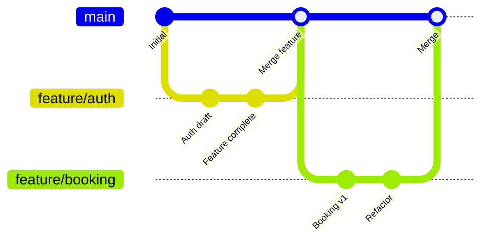
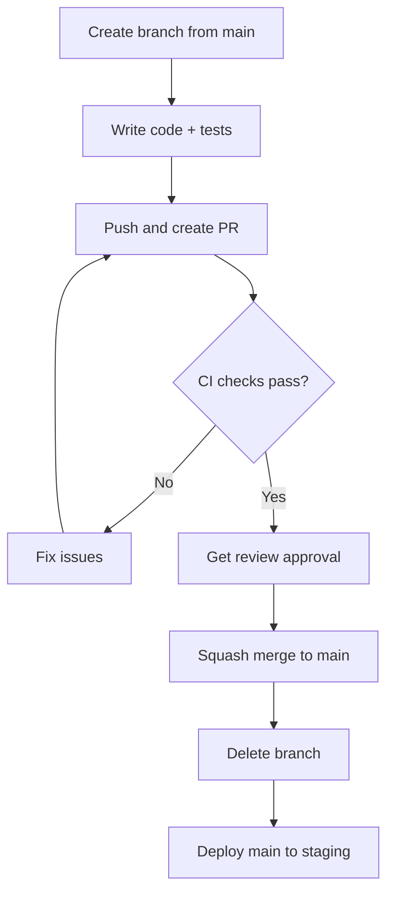
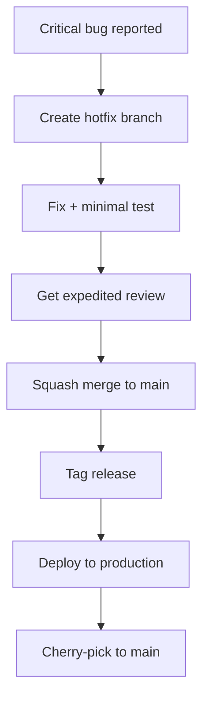

# Branch Strategy

> Trunk-based development with short-lived feature branches. main is always deployable.

This document defines our branching strategy. We chose trunk-based development after evaluating GitFlow, GitHub Flow, and trunk-based approaches. The trade-off: trunk-based requires discipline (feature flags, small PRs) but enables faster iteration and fewer merge conflicts.

---

## Trunk-Based Development

We use trunk-based development where developers work in short-lived branches (typically < 2 days) merged directly into main. This is different from GitFlow (long-lived develop/release branches) and GitHub Flow (deployable main, feature branches as needed).



> **Why** — Trunk-based development with short branches reduces integration pain. Long-lived branches diverge and create massive merge conflicts. The cost: we must use feature flags to hide incomplete work and maintain a deployable main branch at all times.

---

## Branch Types

| Branch Type | Naming | Lifespan | Merges To |
|---|---|---|---|
| main | `main` | Forever | — |
| feature | `feature/TICKET-123-description` | < 2 days | main |
| bugfix | `bugfix/TICKET-456-description` | < 1 day | main |
| hotfix | `hotfix/TICKET-789-description` | Hours | main |
| release | Not used | — | — |

> **Anti-pattern** — We do not use release branches. Releases are tagged from main. This simplifies the codebase by avoiding cherry-picking and branch divergence.

---

## Branch Lifecycle

### Feature Branch Workflow



1. **Create**: Branch from latest main (`git checkout -b feature/TICKET-123-description`)
2. **Develop**: Write code following TDD; commit early and often
3. **Push**: Push and create PR when ready for review
4. **Review**: At least one approval from a code owner
5. **Merge**: Squash-merge to main (preserves linear history)
6. **Delete**: Branch auto-deleted after merge

---

## Feature Flags

Incomplete features are hidden behind feature flags. This allows merging to main without exposing unfinished functionality to users.

```python
# apps/backend/src/common/feature_flags.py
from functools import lru_cache
import httpx


class FeatureFlags:
    """Feature flag client using LaunchDarkly or self-hosted."""

    def __init__(self, sdk_key: str | None = None):
        self._sdk_key = sdk_key
        self._cache: dict[str, bool] = {}

    def is_enabled(self, flag_name: str, default: bool = False) -> bool:
        """Check if a feature flag is enabled."""
        # In production, call LaunchDarkly/Flagsmith
        # For local dev, use environment variables
        if flag_name := f"FF_{flag_name.upper()}":
            import os
            return os.environ.get(flag_name, str(default)).lower() == "true"
        return default

    def is_enabled_for_tenant(self, flag_name: str, tenant_id: str) -> bool:
        """Check if flag is enabled for a specific tenant."""
        # Implementation calls flag service with tenant targeting
        ...


# Usage in code
flags = FeatureFlags()

async def create_booking(request: BookingRequest):
    if flags.is_enabled("new_booking_flow"):
        return await create_booking_v2(request)
    return await create_booking_v1(request)
```

> **Rule** — Every feature flag must have a cleanup plan: remove the flag and dead code within 2 sprints of enabling for 100% of users.

---

## PR Guidelines

### PR Size

- **Target**: < 400 lines of diff
- **Maximum**: 600 lines (requires Tech Lead approval)
- **Rationale**: Large PRs are hard to review thoroughly, leading to bugs

> **Guideline** — If your PR exceeds 400 lines, consider splitting into smaller PRs with feature flags to hide incomplete work.

### PR Description Template

```markdown
## Summary
Brief description of the change.

## Type of Change
- [ ] Bug fix
- [ ] New feature
- [ ] Breaking change
- [ ] Refactoring

## Testing
- [ ] Unit tests added/updated
- [ ] Integration tests added/updated
- [ ] Manual testing performed

## Checklist
- [ ] Code follows style guidelines
- [ ] Self-review completed
- [ ] Documentation updated
- [ ] Feature flag added (if applicable)
```

### Required Checks

All PRs must pass before merge:

- [ ] All CI checks green (lint, type, test, security)
- [ ] At least one approval from code owner
- [ ] No unresolved comments
- [ ] Branch up-to-date with main

---

## Commit Conventions

We use Conventional Commits for commit messages:

```
<type>(<scope>): <description>

[optional body]

[optional footer]
```

| Type | Description |
|---|---|
| feat | New feature |
| fix | Bug fix |
| docs | Documentation |
| style | Formatting |
| refactor | Code refactoring |
| test | Tests |
| chore | Maintenance |

Examples:

```
feat(booking): add waitlist functionality for fully booked slots
fix(auth): resolve token refresh race condition
docs(api): update booking endpoint documentation
refactor(customer): extract validation to domain service
```

> **Why** — Conventional Commits enables automated changelog generation and semantic version determination.

---

## Merge Strategy

We use **squash merge** by default. This creates a clean, linear history on main.

```
git checkout main
git merge --squash feature/TICKET-123
git commit -m "feat(booking): add booking cancellation
- Add cancellation endpoint
- Add refund calculation
- Add notification dispatch
Closes #123"
```

> **Why** — Squash merge keeps main readable with one commit per feature. The feature branch history is preserved in the PR, which serves as the mutable record.

---

## Protected Branches

`main` is a protected branch with the following rules:

```yaml
# .github/protected-branch.yml
rules:
  # Require status checks to pass
  required_status_checks:
    - ci/lint
    - ci/type-check
    - ci/unit-tests
    - ci/integration-tests
    - ci/security

  # Require PR reviews
  required_reviews: 1

  # Require branch up-to-date
  require_up_to_date_base_branch: true

  # Require conversation resolution
  require_signed_commits: false  # Can enable for higher security

  # Restrict who can push
  restrictions:
    teams:
      - eng-team
```

---

## Hotfix Procedure

Hotfixes bypass normal review for critical production issues:



1. Create branch: `hotfix/TICKET-789-critical-fix`
2. Fix the issue with minimal changes
3. Request expedited review (ping on Slack)
4. Squash merge after approval
5. Tag and deploy immediately

> **Rule** — Hotfixes must be followed up with a proper PR to main within 24 hours if additional changes are needed.

---

## Summary

| Practice | Implementation |
|---|---|
| Branching model | Trunk-based |
| Branch lifespan | < 2 days |
| Merge strategy | Squash merge |
| Incomplete work | Feature flags |
| Main protection | Required checks + approvals |
| Hotfixes | Expedited review, immediate merge |

---

## Related Documents

- [Release Strategy](./release-strategy.md) — Deployment process
- [Feature Flags](./feature-flags.md) — Flag lifecycle
- [Code Review Checklist](../13-coding-standards/code-review-checklist.md) — Review guidelines
- [Code Review](../15-workflows/code-review.md) — Review process
