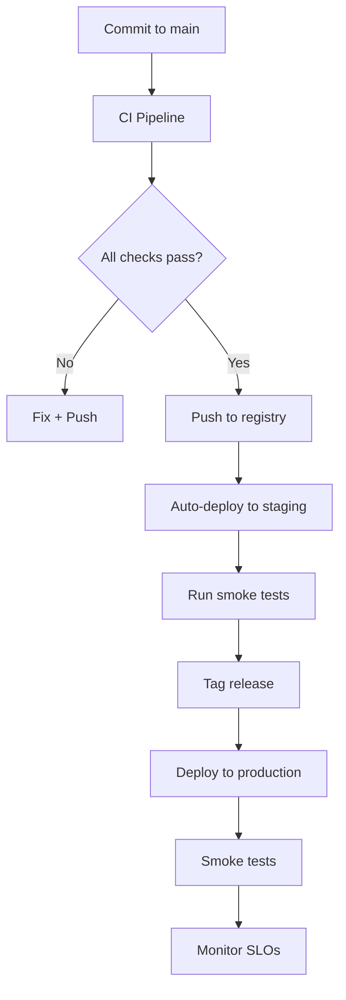

# Deployments

> CI/CD pipeline end-to-end. PR to preview, main to staging, tag to prod.

This document defines our complete deployment pipeline: from code merge to production. We prioritize automation (consistent, repeatable), safety (gates and smoke tests), and speed (fast feedback).

---

## Deployment Pipeline Overview



| Stage | Trigger | Automation | Approval |
|---|---|---|---|
| Preview | PR created/updated | Auto | None |
| Staging | Push to main | Auto | None |
| Production | Tag created | Manual | On-call approval |

---

## PR Preview Deployments

Every PR gets a preview environment for testing:

```yaml
# .github/workflows/preview.yml
name: Preview Environment

on:
  pull_request:
    types: [opened, synchronize, closed]

jobs:
  preview:
    name: Deploy Preview
    runs-on: ubuntu-latest
    if: github.event_name == 'pull_request'
    steps:
      - uses: actions/checkout@v4

      - name: Deploy preview
        run: |
          # Extract PR number
          PR_NUMBER=${{ github.event.pull_request.number }}
          PR_SLUG="pr-${PR_NUMBER}"

          # Deploy to preview namespace
          kubectl create namespace $PR_SLUG --dry-run=client -o yaml | kubectl apply -f -
          kubectl set image deployment/backend api=ghcr.io/${{ github.repository }}/backend:${{ github.sha }} -n $PR_SLUG

          # Report URL
          echo "::set-output name=url::https://${PR_SLUG}.preview.splashh.com"

      - name: Comment PR with preview URL
        uses: actions/github-script@v7
        with:
          script: |
            const url = '${{ steps.deploy.outputs.url }}';
            github.rest.issues.createComment({
              issue_number: context.issue.number,
              body: `Preview deployed: ${url}`
            })

  cleanup:
    name: Cleanup Preview
    runs-on: ubuntu-latest
    if: github.event_name == 'pull_request' && github.event.action == 'closed'
    steps:
      - name: Delete preview namespace
        run: |
          PR_NUMBER=${{ github.event.pull_request.number }}
          kubectl delete namespace "pr-${PR_NUMBER}" --ignore-not-found=true
```

> **Guideline** — Preview environments are automatically deleted when PR is closed or merged.

---

## Staging Deployment

Continuous deployment to staging on every merge:

```yaml
# .github/workflows/deploy-staging.yml
name: Deploy Staging

on:
  push:
    branches: [main]

jobs:
  deploy:
    name: Deploy to Staging
    runs-on: ubuntu-latest
    environment: staging
    steps:
      - uses: actions/checkout@v4

      - name: Configure kubectl
        run: |
          echo "${{ secrets.KUBECONFIG_STAGING }}" > kubeconfig
          export KUBECONFIG=kubeconfig

      - name: Deploy
        run: |
          # Update deployment image
          kubectl set image deployment/backend api=ghcr.io/${{ github.repository }}/backend:${{ github.sha }} -n splashh-staging

      - name: Wait for rollout
        run: |
          kubectl rollout status deployment/backend -n splashh-staging --timeout=300s

      - name: Health check
        run: |
          curl -f https://staging-api.splashh.com/health

      - name: Run smoke tests
        run: |
          ./scripts/smoke-tests.sh staging

      - name: Notify
        if: always()
        run: |
          # Notify Slack
          curl -X POST ${{ secrets.SLACK_WEBHOOK }} \
            -d "text=Staging deployed: ${{ github.sha }}"
```

---

## Production Deployment

Production deploys are manual, triggered by release tags:

```yaml
# .github/workflows/deploy-production.yml
name: Deploy Production

on:
  push:
    tags:
      - 'v*'

jobs:
  deploy:
    name: Deploy Production
    runs-on: ubuntu-latest
    environment: production
    steps:
      - uses: actions/checkout@v4

      - name: Deploy canary (10%)
        run: |
          # Deploy to canary (separate deployment with lower replicas)
          kubectl set image deployment/backend-canary api=ghcr.io/${{ github.repository }}/backend:${{ github.ref }} -n splashh-production

          # Wait for canary pods
          sleep 60

      - name: Check canary metrics
        run: |
          # Verify canary error rate
          ERROR_RATE=$(curl -s "https://monitoring.splashh.com/api/v1/query?query=sum(rate(http_requests_total{service='backend-canary',status=~'5..'}[5m])) / sum(rate(http_requests_total{service='backend-canary'}[5m]))" | jq -r '.data.result[0].value[1]')
          echo "Canary error rate: $ERROR_RATE"

          # Fail if error rate > 1%
          if (( $(echo "$ERROR_RATE > 0.01" | bc -l) )); then
            echo "Canary error rate too high"
            exit 1
          fi

      - name: Deploy full production
        run: |
          kubectl set image deployment/backend api=ghcr.io/${{ github.repository }}/backend:${{ github.ref }} -n splashh-production

          # Wait for rollout
          kubectl rollout status deployment/backend -n splashh-production --timeout=600s

      - name: Smoke tests
        run: |
          ./scripts/smoke-tests.sh production

      - name: Notify
        run: |
          curl -X POST ${{ secrets.SLACK_WEBHOOK }} \
            -d "text=Production deployed: ${{ github.ref }}"
```

---

## Database Migrations

Migrations run as a separate step:

```yaml
# .github/workflows/migrate.yml
jobs:
  migrate:
    name: Run Migrations
    runs-on: ubuntu-latest
    steps:
      - uses: actions/checkout@v4

      - name: Run migrations
        env:
          DATABASE_URL: ${{ secrets.STAGING_DATABASE_URL }}
        run: |
          python -m alembic upgrade head

      - name: Verify migration
        run: |
          python -m alembic current
          python -m alembic history --verbose
```

> **Rule** — Database migrations run before deployment. If migration fails, deployment is blocked.

---

## Smoke Tests

Every environment runs smoke tests post-deploy:

```bash
#!/bin/bash
# scripts/smoke-tests.sh

ENVIRONMENT=$1

case $ENVIRONMENT in
  staging)
    BASE_URL="https://staging-api.splashh.com"
    ;;
  production)
    BASE_URL="https://api.splashh.com"
    ;;
  preview)
    BASE_URL=$PREVIEW_URL
    ;;
  *)
    echo "Unknown environment: $ENVIRONMENT"
    exit 1
    ;;
esac

# Test 1: Health check
echo "Testing health endpoint..."
response=$(curl -s -o /dev/null -w "%{http_code}" $BASE_URL/health)
if [ "$response" != "200" ]; then
  echo "Health check failed: $response"
  exit 1
fi

# Test 2: Auth flow
echo "Testing authentication..."
token=$(curl -s -X POST $BASE_URL/auth/login \
  -H "Content-Type: application/json" \
  -d '{"email":"test@splashh.com","password":"testpassword"}' | jq -r '.access_token')
if [ -z "$token" ]; then
  echo "Auth failed"
  exit 1
fi

# Test 3: List bookings
echo "Testing bookings endpoint..."
response=$(curl -s -o /dev/null -w "%{http_code}" -H "Authorization: Bearer $token" $BASE_URL/bookings)
if [ "$response" != "200" ]; then
  echo "Bookings endpoint failed: $response"
  exit 1
fi

echo "All smoke tests passed!"
```

---

## Deployment Checklist

| Step | Automated | Owner |
|---|---|---|
| CI pipeline passes | Yes | System |
| Image pushed to registry | Yes | System |
| Staging deploy | Yes | System |
| Staging smoke tests | Yes | System |
| Tag created | Manual | Engineer |
| Production approval | Manual | On-call |
| Production deploy | Yes | System |
| Production smoke tests | Yes | System |
| SLO monitoring | Yes | System |

---

## Summary

| Environment | Trigger | Approval | Rollback |
|---|---|---|---|
| Preview | PR | None | Auto (PR close) |
| Staging | Push to main | None | Auto |
| Production | Tag | On-call | Manual |

---

## Related Documents

- [GitHub Actions](./github-actions.md) — CI/CD pipeline
- [Release Strategy](./release-strategy.md) — Release process
- [Rollback Strategy](./rollback-strategy.md) — Rollback procedures
- [Docker](./docker.md) — Container standards
