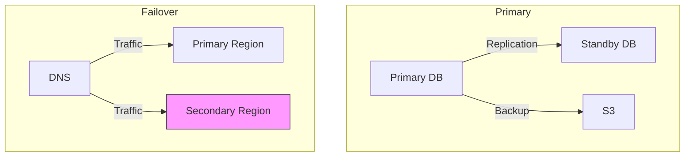
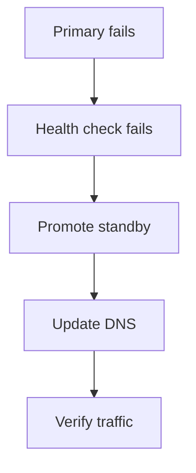

# Disaster Recovery

> Region failover. Read replica promotion. DNS failover. RTO 1h, RPO 5min.

This document defines our disaster recovery strategy: how we recover from catastrophic failures. We prioritize rapid recovery (RTO 1 hour), minimal data loss (RPO 5 minutes), and regular testing (quarterly drills).

---

## Recovery Objectives

| Metric | Target | Definition |
|---|---|---|
| RTO (Recovery Time Objective) | 1 hour | Maximum acceptable downtime |
| RPO (Recovery Point Objective) | 5 minutes | Maximum acceptable data loss |

> **Why** — RTO 1h and RPO 5min are appropriate for a sports club management platform. Meeting these targets requires synchronous replication and automated failover.

---

## Architecture



---

## Database Disaster Recovery

### Point-in-Time Recovery

PostgreSQL with continuous archiving:

```sql
-- Enable WAL archiving
ALTER SYSTEM SET wal_level = replica;
ALTER SYSTEM SET archive_mode = on;
ALTER SYSTEM SET archive_command = 'aws s3 cp %p s3://splashh-backups/wal/%f';
```

```bash
# Restore to point in time
pg_restore --target-time="2024-01-15 10:30:00" \
  --dbname=splashh_production \
  backup_file.dump
```

### Read Replica Promotion

```bash
# Promote read replica to primary
aws rds promote-read-replica \
  --db-instance-identifier splashh-prod-replica

# Update connection strings
# Point to new primary
```

> **Why** — Read replica promotion takes minutes rather than hours of restore time. We maintain hot standbys in each region.

---

## Multi-Region Failover

### DNS Failover

```yaml
# Route53 health check + failover record
{
  "Name": "api.splashh.com",
  "Type": "A",
  "Failover": {
    "Primary": {
      "HealthCheckId": "primary-health-check-id",
      "SetIdentifier": "primary"
    },
    "Secondary": {
      "SetIdentifier": "secondary"
    }
  }
}
```

### Health Check Configuration

```yaml
# Failover health check
{
  "Type": "HTTPS",
  "ResourcePath": "/health",
  "RequestInterval": 10,
  "FailureThreshold": 3,
  "Regions": ["us-east-1", "us-west-2"]
}
```

---

## Failover Procedure

### Automatic Failover (Database)



### Manual Failover (Full Region)

```bash
#!/bin/bash
# scripts/failover.sh

set -e

echo "Starting failover to secondary region..."

# 1. Verify secondary is healthy
curl -f https://secondary-api.splashh.com/health || exit 1

# 2. Promote database (if needed)
aws rds promote-read-replica \
  --db-instance-identifier splashh-prod-replica

# 3. Update DNS
aws route53 change-resource-record-sets \
  --hosted-zone-id ZONE_ID \
  --change-batch file://dns-failover.json

# 4. Notify
curl -X POST $SLACK_WEBHOOK \
  -d "text=Failover complete. Traffic now routing to secondary region."

echo "Failover complete!"
```

---

## Backup Strategy

| Backup Type | Frequency | Retention | Storage |
|---|---|---|---|
| Full snapshot | Daily | 30 days | S3 |
| WAL archiving | Continuous | 7 days | S3 |
| Transaction logs | Every 5 min | 7 days | S3 |

```bash
# Daily snapshot
aws rds create-db-snapshot \
  --db-instance-identifier splashh-prod \
  --db-snapshot-identifier "splashh-prod-$(date +%Y%m%d)"

# Automated cleanup (retain 30 days)
aws s3 cp s3://splashh-backups/cleanup-policy.json .
```

---

## DR Runbook

### Complete Region Failure

1. **Assess**: Is the entire region down? Check AWS status page.
2. **Decide**: Failover to secondary region?
3. **Execute**:
   ```bash
   ./scripts/failover.sh
   ```
4. **Verify**:
   - Health checks passing
   - Users can log in
   - Bookings work
5. **Communicate**: Update status page, notify customers

### Database Corruption

1. **Isolate**: Stop application to prevent further corruption
2. **Assess**: Determine corruption scope
3. **Restore**: Point-in-time restore from last good backup
4. **Verify**: Check data integrity
5. **Resume**: Bring application back online

### Data Center Loss

1. **Failover**: If using multi-AZ, automatic failover should handle
2. **Verify**: Check all services
3. **Escalate**: If not automatic, execute manual failover

---

## Communication Plan

| Scenario | Channel | Message Template |
|---|---|---|
| DR in progress | Status page, Slack | "Investigating potential issue with [service]" |
| Failover started | Status page, Slack, Twitter | "Initiating failover to backup region" |
| Service restored | Status page, Slack | "Service restored. Investigation ongoing." |
| Post-mortem | Email, blog | Full incident report within 48 hours |

---

## DR Drill Cadence

We run quarterly DR drills:

| Quarter | Drill Type | Scenario |
|---|---|---|
| Q1 | Database failover | Promote read replica |
| Q2 | Full region failover | Complete region failure |
| Q3 | Data corruption | Restore from backup |
| Q4 | Complete DR test | Full failover + restore |

### Drill Checklist

- [ ] Execute failover procedure
- [ ] Verify RTO (should be < 1 hour)
- [ ] Verify RPO (should be < 5 minutes data loss)
- [ ] Document issues found
- [ ] Update runbooks if needed
- [ ] Share learnings with team

---

## Summary

| Aspect | Strategy |
|---|---|
| RTO | 1 hour |
| RPO | 5 minutes |
| Database | PostgreSQL with read replica + PITR |
| Failover | DNS-based (Route53) |
| Backup | Daily snapshots + WAL archiving |
| Testing | Quarterly drills |
| Communication | Status page, Slack, email |

---

## Related Documents

- [Monitoring](./monitoring.md) — Alert definitions
- [Rollback Strategy](./rollback-strategy.md) — Rollback procedures
- [Environment Management](./environment-management.md) — Environment details
- [Incident Response](../09-security/incident-response.md) — Incident handling
