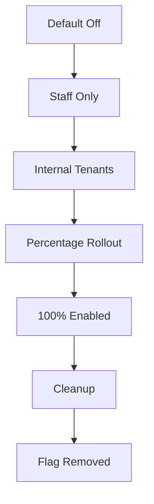

# Feature Flags

> Decoupling deploy from release. Flag types, lifecycle, and implementation.

This document defines our feature flag system. We use feature flags to hide incomplete work, enable gradual rollouts, and support A/B testing. The key discipline: flags must be temporary and removed once the feature is fully released.

---

## Feature Flag System

We support three options for feature flag providers. The choice depends on multi-tenant targeting needs:

| Provider | Pros | Cons | Best For |
|---|---|---|---|
| LaunchDarkly | Rich targeting, great UX | Cost at scale | Enterprises needing complex rules |
| Flagsmith | Self-hostable, open source | Less polished UI | Cost-conscious, self-host preference |
| In-house (Env vars) | Free, simple | No gradual rollout, no targeting | Simple on/off for internal tools |

> **Recommendation** — Start with LaunchDarkly for its superior multi-tenant targeting. If cost becomes an issue at scale, migrate to Flagsmith.

---

## Flag Types

We use four types of flags, each with different lifecycle and purpose:

| Type | Purpose | Example |
|---|---|---|
| Release | Hide incomplete features | `new_booking_flow` |
| Experiment | A/B testing | `checkout_button_color` |
| Ops | Operational control | `maintenance_mode` |
| Kill switch | Emergency disable | `payment_processing` |

### Release Flags

Used to hide incomplete features from users:

```python
# Usage
flags = FeatureFlags()

@router.get("/booking")
async def get_bookings():
    # Gradual rollout: 0% -> staff -> tenants -> 100%
    if flags.is_enabled("new_booking_ui"):
        return BookingListV2()
    return BookingListV1()
```

### Experiment Flags

Used for A/B testing:

```python
# Configuration in flag provider
{
    "name": "checkout_v2",
    "description": "New checkout flow",
    "type": "experiment",
    "variants": [
        {"name": "control", "weight": 50},
        {"name": "treatment", "weight": 50}
    ]
}

# Usage
variant = flags.get_variant("checkout_v2", user_id=user.id)
if variant == "treatment":
    return CheckoutFlowV2()
return CheckoutFlowV1()
```

### Ops Flags

Used for operational control:

```python
# Maintenance mode
if flags.is_enabled("maintenance_mode"):
    return HTMLResponse(
        "<h1>Maintenance</h1>",
        status_code=503,
        headers={"Retry-After": "3600"}
    )
```

### Kill Switches

Used for emergency disable:

```python
# Payment kill switch
if flags.is_enabled("kill_payment_processing"):
    logger.warning("Payment processing disabled via kill switch")
    raise ServiceUnavailable("Payments temporarily disabled")
```

> **Rule** — Kill switches must be testable via `/health` endpoint so monitoring can verify flag state.

---

## Flag Lifecycle

Every flag follows this lifecycle:



| Stage | Targeting | Duration |
|---|---|---|
| Default Off | Nobody | Until code merges |
| Staff Only | `user.role == staff` | 1-2 days |
| Internal Tenants | `tenant.id in [internal_tenants]` | 2-3 days |
| Percentage Rollout | `user.id % 100 < X` | 3-7 days |
| 100% | All users | 1 week max |
| Cleanup | Remove flag + dead code | Immediately after |

> **Rule** — Flags must be removed within 2 sprints of reaching 100%. Dead code behind flags degrades codebase quality.

---

## Naming Conventions

Consistent naming helps identify flag purpose and ownership:

| Pattern | Example | Meaning |
|---|---|---|
| `{feature}_ui` | `new_booking_ui` | New UI component |
| `{feature}_v2` | `checkout_v2` | New version of feature |
| `{feature}_rollout` | `dark_mode_rollout` | Gradual rollout |
| `kill_{service}` | `kill_payment` | Kill switch |
| `exp_{name}` | `exp_checkout_button` | Experiment |
| `ops_{action}` | `ops_maintenance` | Operational |

> **Guideline** — Prefix experiment flags with `exp_` to distinguish from release flags in dashboards.

---

## Implementation

### Feature Flag Client

```python
# apps/backend/src/common/feature_flags.py
from typing import Any
from functools import lru_cache
import httpx
import os


class FeatureFlags:
    """Feature flag client with caching and fallback."""

    def __init__(self, sdk_key: str | None = None):
        self._sdk_key = sdk_key or os.environ.get("LAUNCHDARKLY_SDK_KEY")
        self._cache: dict[str, Any] = {}
        self._cache_ttl = 30  # seconds

    def _get_client(self):
        """Lazy initialization of LaunchDarkly client."""
        if not hasattr(self, "_client"):
            import ldclient
            self._client = ldclient.init(self._sdk_key)
        return self._client

    def is_enabled(
        self,
        flag_name: str,
        default: bool = False,
        user_context: dict | None = None
    ) -> bool:
        """Check if a boolean flag is enabled."""
        # Local development: environment variable override
        env_flag = f"FF_{flag_name.upper()}"
        if env_value := os.environ.get(env_flag):
            return env_value.lower() == "true"

        # Production: use LaunchDarkly
        if self._sdk_key:
            try:
                client = self._get_client()
                context = self._build_context(user_context)
                return client.variation(flag_name, context, default)
            except Exception as e:
                # Fail open: default to provided default
                import logging
                logging.warning(f"Flag evaluation failed for {flag_name}: {e}")
                return default

        return default

    def get_variant(
        self,
        flag_name: str,
        user_context: dict | None = None
    ) -> str | None:
        """Get variant for experiment flags."""
        if self._sdk_key:
            client = self._get_client()
            context = self._build_context(user_context)
            return client.variation(flag_name, context)

        # Fallback for local dev
        return os.environ.get(f"FF_{flag_name.upper()}_VARIANT")

    def _build_context(self, user_context: dict | None) -> dict:
        """Build LaunchDarkly context from user data."""
        if user_context:
            return {
                "kind": "multi",
                "user": {
                    "key": user_context.get("user_id"),
                    "custom": {
                        "tenant_id": user_context.get("tenant_id"),
                        "role": user_context.get("role"),
                    }
                },
                "tenant": {
                    "key": user_context.get("tenant_id"),
                    "custom": {
                        "tier": user_context.get("tenant_tier"),
                    }
                }
            }
        # Anonymous context
        return {"kind": "anonymous", "key": "anonymous"}


# Singleton instance
@lru_cache
def get_feature_flags() -> FeatureFlags:
    return FeatureFlags()
```

### FastAPI Integration

```python
# apps/backend/src/common/dependencies.py
from fastapi import Depends, Request
from .feature_flags import FeatureFlags, get_feature_flags


def get_feature_flags_for_request(
    request: Request,
    flags: FeatureFlags = Depends(get_feature_flags)
) -> FeatureFlags:
    """Extract user context from request for flag evaluation."""
    # Build context from authenticated user
    user_context = None
    if hasattr(request.state, "user"):
        user = request.state.user
        user_context = {
            "user_id": user.id,
            "tenant_id": user.tenant_id,
            "role": user.role,
            "tenant_tier": user.tenant_tier,
        }

    # Return wrapper that uses context
    class ContextualFlags:
        def __init__(self, base: FeatureFlags, ctx: dict):
            self._base = base
            self._ctx = ctx

        def is_enabled(self, flag: str, default: bool = False) -> bool:
            return self._base.is_enabled(flag, default, self._ctx)

        def get_variant(self, flag: str) -> str | None:
            return self._base.get_variant(flag, self._ctx)

    return ContextualFlags(flags, user_context)


# Usage in router
@router.get("/bookings")
async def list_bookings(
    flags: FeatureFlags = Depends(get_feature_flags_for_request)
):
    if flags.is_enabled("new_booking_ui"):
        return await get_bookings_v2()
    return await get_bookings_v1()
```

---

## Flag Management Dashboard

Integrate with LaunchDarkly dashboard or self-hosted:

```yaml
# Provide links in service catalog
service_catalog:
  - name: Feature Flags
    url: https://app.launchdarkly.com/splashh
    description: Manage feature rollouts and experiments
    owners:
      - engineering-platform-team
```

---

## Monitoring

Track flag usage and impact:

```promql
# Flag evaluation rate
sum(rate(flag_evaluations_total{flag_name="new_booking_ui"}[5m])) by (flag_name, result)

# Error rate by variant (for experiments)
sum(rate(http_requests_total{status=~"5..", variant="treatment"}[5m]))
/
sum(rate(http_requests_total{variant="treatment"}[5m]))
```

> **Guideline** — Add custom metrics in your flag client to track evaluation count by flag name and result. This helps identify unused flags for cleanup.

---

## Summary

| Aspect | Standard |
|---|---|
| Provider | LaunchDarkly (switch to Flagsmith if cost issues) |
| Types | Release, Experiment, Ops, Kill Switch |
| Lifecycle | Off → Staff → Internal → % → 100% → Cleanup |
| Naming | `{feature}_{type}` |
| Removal | Within 2 sprints of 100% |
| Monitoring | Flag evaluation metrics |

---

## Related Documents

- [Release Strategy](./release-strategy.md) — Release pipeline
- [Branch Strategy](./branch-strategy.md) — Using flags for incomplete work
- [Monitoring](./monitoring.md) — SLO definitions
