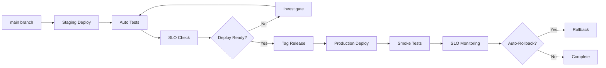

# Release Strategy

> Continuous deployment to staging, gated production deploys with SLO approval.

This document defines our release strategy: how code moves from main to production. We prioritize fast feedback (continuous staging deployment), safety (SLO-gated production), and rollbacks (automated detection + manual capability).

---

## Release Pipeline



| Environment | Trigger | Approval | Deploy Method |
|---|---|---|---|
| Development | Push to branch | None | Auto |
| Preview | PR created | None | Auto |
| Staging | Push to main | None | Auto |
| Production | Tag created | On-call approval | Manual (canary/blue-green) |

---

## Continuous Deployment to Staging

Every merge to main automatically deploys to staging:

```yaml
# .github/workflows/deploy-staging.yml
name: Deploy Staging

on:
  push:
    branches: [main]

jobs:
  deploy:
    name: Deploy to Staging
    runs-on: ubuntu-latest
    environment: staging
    steps:
      - uses: actions/checkout@v4

      - name: Configure kubectl
        run: |
          echo "${{ secrets.KUBECONFIG }}" > kubeconfig
          export KUBECONFIG=kubeconfig

      - name: Deploy to staging
        run: |
          kubectl set image deployment/backend \
            api=ghcr.io/${{ github.repository }}/backend:${{ github.sha }} \
            -n splashh-staging

      - name: Wait for rollout
        run: |
          kubectl rollout status deployment/backend -n splashh-staging --timeout=300s

      - name: Run smoke tests
        run: |
          ./scripts/smoke-tests.sh staging
```

> **Why** — Automatic staging deployment gives immediate feedback on production-like infrastructure. If staging fails, we know before merging to main (though staging deploys are after merge).

---

## Production Deployment

Production deploys are triggered by creating a release tag:

```bash
# Create a release
git tag -a v1.2.3 -m "Release v1.2.3: Booking improvements"
git push origin v1.2.3
```

This triggers the production deployment workflow:

```yaml
# .github/workflows/deploy-production.yml
name: Deploy Production

on:
  push:
    tags:
      - 'v*'

jobs:
  deploy:
    name: Deploy Production
    runs-on: ubuntu-latest
    environment: production
    steps:
      - uses: actions/checkout@v4
        with:
          fetch-depth: 0

      - name: Get version
        run: |
          VERSION=${GITHUB_REF#refs/tags/v}
          echo "VERSION=$VERSION" >> $GITHUB_ENV

      - name: Deploy canary (10%)
        run: |
          kubectl set image deployment/backend-canary \
            api=ghcr.io/${{ github.repository }}/backend:v$VERSION \
            -n splashh-production

      - name: Wait for canary
        run: sleep 60

      - name: Check canary metrics
        run: |
          ERROR_RATE=$(curl -s monitoring/api/error-rate?service=backend-canary)
          if (( $(echo "$ERROR_RATE > 0.01" | bc -l) )); then
            echo "Canary error rate too high: $ERROR_RATE"
            exit 1
          fi

      - name: Deploy full production
        run: |
          kubectl set image deployment/backend \
            api=ghcr.io/${{ github.repository }}/backend:v$VERSION \
            -n splashh-production
          kubectl rollout status deployment/backend -n splashh-production --timeout=600s

      - name: Run smoke tests
        run: |
          ./scripts/smoke-tests.sh production
```

---

## SLO Gates

Production deploys require SLO approval from on-call:

| SLO | Threshold | Action |
|---|---|---|
| Error rate | < 1% | Block deploy if above |
| P95 latency | < 500ms | Block deploy if above |
| Availability | > 99.9% | Block deploy if below |

> **Rule** — If any SLO threshold is breached, deployment is blocked until resolved or explicitly overridden by Engineering Manager.

---

## Semver for APIs

We follow Semantic Versioning for releases:

```
MAJOR.MINOR.PATCH
  │    │    │
  │    │    └── Bug fixes, no API changes
  │    └────── New features, backward compatible
  └────────── Breaking changes
```

| Change Type | Version Bump |
|---|---|
| New endpoint | MINOR |
| New optional parameter | MINOR |
| New required parameter | MAJOR |
| Removed endpoint | MAJOR |
| Changed response format | MAJOR |
| Bug fix | PATCH |

> **Why** — Semver provides clear versioning expectations. Consumers know immediately if a change is likely to break their integration.

---

## Blue/Green Deployment

We use blue/green for zero-downtime production deploys:

```yaml
# Infrastructure: Two identical environments
# - blue: current production
# - green: new version

# Deploy to green (inactive)
kubectl apply -f kubernetes/green/

# Run smoke tests against green
./scripts/smoke-tests.sh green

# Switch traffic to green (DNS or load balancer)
kubectl patch service api -p '{"spec":{"selector":{"version":"green"}}}'

# Keep blue for rollback (5 minutes)
sleep 300

# If healthy, destroy blue
kubectl delete -f kubernetes/blue/
```

> **Why** — Blue/green provides instant rollback (switch back to blue) and eliminates traffic during deployment. Trade-off: requires double the infrastructure.

---

## Canary Analysis

For gradual rollout with metrics analysis:

```python
# canary_analysis.py
import httpx
from dataclasses import dataclass


@dataclass
class CanaryResult:
    passed: bool
    error_rate_baseline: float
    error_rate_canary: float
    latency_baseline_p95: float
    latency_canary_p95: float


def analyze_canary(
    baseline_version: str,
    canary_version: str,
    sample_size: int = 1000
) -> CanaryResult:
    """Analyze canary against baseline using traffic split."""
    # Query metrics from Prometheus
    baseline_errors = query_prometheus(
        f'sum(rate(http_requests_total{{version="{baseline_version}",status=~"5.."}}[5m]))'
    )
    baseline_total = query_prometheus(
        f'sum(rate(http_requests_total{{version="{baseline_version}"}}[5m]))'
    )

    canary_errors = query_prometheus(
        f'sum(rate(http_requests_total{{version="{canary_version}",status=~"5.."}}[5m]))'
    )
    canary_total = query_prometheus(
        f'sum(rate(http_requests_total{{version="{canary_version}"}}[5m]))'
    )

    error_rate_baseline = baseline_errors / baseline_total if baseline_total else 0
    error_rate_canary = canary_errors / canary_total if canary_total else 0

    # Decision logic
    error_increase = error_rate_canary - error_rate_baseline
    passed = error_increase < 0.005  # Allow 0.5% increase

    return CanaryResult(
        passed=passed,
        error_rate_baseline=error_rate_baseline,
        error_rate_canary=error_rate_canary,
        latency_baseline_p95=0,  # Query similarly
        latency_canary_p95=0,
    )
```

> **Guideline** — Start canary at 5-10% traffic, monitor for 10-30 minutes, then increase if metrics are healthy.

---

## Rollback Triggers

Automated rollback triggers (see [Rollback Strategy](./rollback-strategy.md)):

| Trigger | Threshold | Action |
|---|---|---|
| Error rate spike | > 5% for 2 min | Auto-rollback |
| P95 latency spike | > 2x baseline for 2 min | Auto-rollback |
| Health check failure | 3 consecutive failures | Auto-rollback |

---

## Release Checklist

Before production deploy:

- [ ] All CI checks passing
- [ ] Changelog updated
- [ ] Database migration ready (if applicable)
- [ ] Feature flags configured for gradual rollout
- [ ] On-call engineer notified
- [ ] Rollback plan reviewed
- [ ] Communication sent to stakeholders (for major releases)

---

## Related Documents

- [Deployments](./deployments.md) — Deployment workflow
- [Rollback Strategy](./rollback-strategy.md) — Rollback procedures
- [Feature Flags](./feature-flags.md) — Gradual rollout
- [Monitoring](./monitoring.md) — SLO definitions
