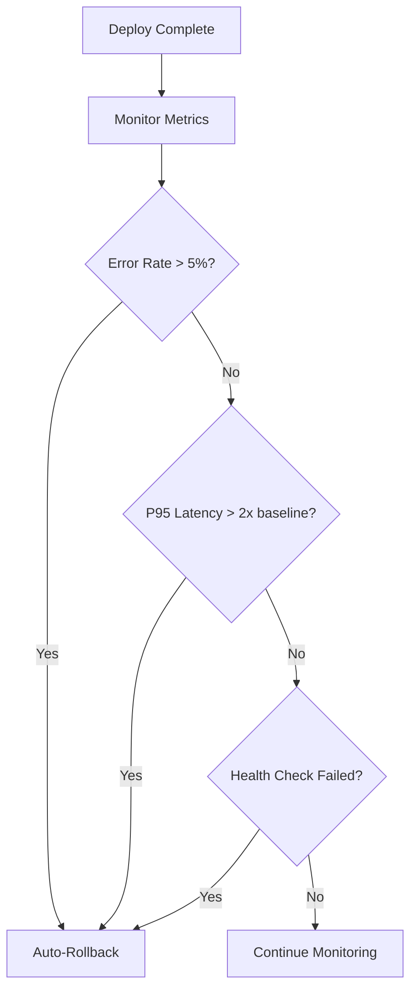

# Rollback Strategy

> Auto-rollback on error rate spike, P95 latency spike. Manual rollback via workflow_dispatch.

This document defines our rollback procedures: when to auto-rollback, how to manually rollback, and how to handle data rollbacks.

---

## Rollback Triggers



| Trigger | Threshold | Window | Action |
|---|---|---|---|
| Error rate spike | > 5% | 2 minutes | Auto-rollback |
| P95 latency spike | > 2x baseline | 2 minutes | Auto-rollback |
| Health check | 3 failures | Consecutive | Auto-rollback |
| Manual | Any | N/A | workflow_dispatch |

---

## Automated Rollback

```yaml
# .github/workflows/auto-rollback.yml
name: Auto Rollback

on:
  push:
    branches: [main]
  schedule:
    # Check every minute
    - cron: '* * * * *'

jobs:
  monitor-and-rollback:
    name: Monitor and Rollback
    runs-on: ubuntu-latest
    steps:
      - name: Check error rate
        id: check_error_rate
        run: |
          ERROR_RATE=$(curl -s "https://monitoring.splashh.com/api/v1/query?query=sum(rate(http_requests_total{service='backend',status=~'5..'}[2m])) / sum(rate(http_requests_total{service='backend'}[2m]))" | jq -r '.data.result[0].value[1] // 0')
          echo "error_rate=$ERROR_RATE" >> $GITHUB_OUTPUT
          echo "Error rate: $ERROR_RATE"

          # Fail if > 5%
          if (( $(echo "$ERROR_RATE > 0.05" | bc -l) )); then
            echo "Error rate exceeds 5%, triggering rollback"
            exit 1
          fi

      - name: Check latency
        id: check_latency
        run: |
          LATENCY_P95=$(curl -s "https://monitoring.splashh.com/api/v1/query?query=histogram_quantile(0.95, http_request_duration_seconds_bucket{service='backend'})" | jq -r '.data.result[0].value[1] // 0')
          BASELINE_P95=0.3  # 300ms baseline

          echo "latency_p95=$LATENCY_P95" >> $GITHUB_OUTPUT

          # Fail if > 2x baseline
          if (( $(echo "$LATENCY_P95 > ($BASELINE_P95 * 2)" | bc -l) )); then
            echo "Latency exceeds 2x baseline, triggering rollback"
            exit 1
          fi

      - name: Rollback on failure
        if: failure()
        run: |
          echo "Rolling back to previous deployment..."
          kubectl rollout undo deployment/backend -n splashh-production
          kubectl rollout status deployment/backend -n splashh-production --timeout=300s

      - name: Notify on rollback
        if: failure()
        run: |
          curl -X POST ${{ secrets.SLACK_WEBHOOK }} \
            -d "text=Auto-rollback triggered! Error rate: ${{ steps.check_error_rate.outputs.error_rate }}, Latency: ${{ steps.check_latency.outputs.latency_p95 }}"
```

---

## Manual Rollback

For situations requiring manual intervention:

```yaml
# .github/workflows/manual-rollback.yml
name: Manual Rollback

on:
  workflow_dispatch:
    inputs:
      environment:
        description: 'Environment'
        required: true
        type: choice
        options:
          - staging
          - production
      reason:
        description: 'Rollback reason'
        required: true
        type: string

jobs:
  rollback:
    name: Rollback ${{ github.event.inputs.environment }}
    runs-on: ubuntu-latest
    environment: ${{ github.event.inputs.environment }}
    steps:
      - uses: actions/checkout@v4

      - name: Configure kubectl
        run: |
          if [ "${{ github.event.inputs.environment }}" == "production" ]; then
            echo "${{ secrets.KUBECONFIG_PRODUCTION }}" > kubeconfig
          else
            echo "${{ secrets.KUBECONFIG_STAGING }}" > kubeconfig
          fi
          export KUBECONFIG=kubeconfig

      - name: Rollback deployment
        run: |
          kubectl rollout undo deployment/backend -n splashh-${{ github.event.inputs.environment }}

      - name: Wait for rollback
        run: |
          kubectl rollout status deployment/backend -n splashh-${{ github.event.inputs.environment }} --timeout=300s

      - name: Verify rollback
        run: |
          curl -f https://${{ github.event.inputs.environment }}-api.splashh.com/health

      - name: Notify
        run: |
          curl -X POST ${{ secrets.SLACK_WEBHOOK }} \
            -d "text=Manual rollback triggered for ${{ github.event.inputs.environment }}. Reason: ${{ github.event.inputs.reason }}. User: ${{ github.actor }}"
```

> **Why** — Manual rollback capability is essential for scenarios where automated triggers don't capture the issue (e.g., business logic bugs, data issues).

---

## Rollback Execution

```bash
# Quick rollback commands (for on-call)
# Rollback one version
kubectl rollout undo deployment/backend -n splashh-production

# Rollback to specific revision
kubectl rollout undo deployment/backend -n splashh-production --to-revision=42

# Check rollback status
kubectl rollout status deployment/backend -n splashh-production

# View rollout history
kubectl rollout history deployment/backend -n splashh-production
```

---

## Data Rollback Strategy

For data issues, we use multiple strategies:

### 1. Compensating Migrations

```python
# migrations/versions/add_booking_cancellable.py
from alembic import op
import sqlalchemy as sa


revision = 'add_booking_cancellable'
down_revision = 'previous_revision'


def upgrade():
    # Add column
    op.add_column('bookings', sa.Column('cancellable', sa.Boolean(), default=True))


def downgrade():
    # Remove column (DATA LOSS - be careful!)
    op.drop_column('bookings', 'cancellable')
```

> **Rule** — Never write destructive down migrations in production. Use compensating forward migrations instead.

### 2. Feature Flag Kill Switch

```python
# Disable feature that caused issues
# In LaunchDarkly or via API
flags.update_flag("new_payment_flow", False)

# All traffic routes to old implementation
```

### 3. Data Repair Scripts

For data integrity issues:

```python
# scripts/repair_bookings.py
"""
Data repair script for booking issue.
Run with: python scripts/repair_bookings.py --dry-run
"""
import argparse
from sqlalchemy import create_engine
from models import Booking


def repair_bookings(dry_run: bool = True):
    engine = create_engine(os.environ["DATABASE_URL"])

    # Find affected bookings
    affected = engine.execute("""
        SELECT id FROM bookings
        WHERE status = 'pending'
        AND created_at < NOW() - INTERVAL '24 hours'
    """)

    if dry_run:
        print(f"Would update {affected.count()} bookings")
        return

    # Update
    engine.execute("""
        UPDATE bookings
        SET status = 'cancelled'
        WHERE status = 'pending'
        AND created_at < NOW() - INTERVAL '24 hours'
    """)

    print(f"Updated {affected.count()} bookings")
```

> **Guideline** — Always use `--dry-run` first. Have a DBA review before running data repair scripts.

---

## Rollback Drill Cadence

We practice rollbacks quarterly:

```yaml
# .github/workflows/rollback-drill.yml
name: Quarterly Rollback Drill

on:
  schedule:
    # First Monday of each quarter
    - cron: '0 9 1 1,4,7,10 *'
  workflow_dispatch:

jobs:
  drill:
    name: Rollback Drill
    runs-on: ubuntu-latest
    steps:
      - name: Deploy canary
        run: |
          # Deploy test version
          kubectl set image deployment/backend-drill api=test:$RANDOM -n splashh-drill

      - name: Simulate error
        run: |
          # Trigger error condition
          kubectl exec -n splashh-drill deploy/backend-drill -- python -c "import sys; sys.exit(1)"

      - name: Verify auto-rollback triggers
        run: |
          sleep 60
          # Verify previous version is running
          kubectl get deployment backend-drill -n splashh-drill

      - name: Document results
        run: |
          echo "Drill completed at $(date)"
```

---

## Summary

| Trigger Type | Threshold | Window | Method |
|---|---|---|---|
| Error rate | > 5% | 2 min | Auto |
| P95 latency | > 2x baseline | 2 min | Auto |
| Health check | 3 failures | N/A | Auto |
| Manual | Any | N/A | workflow_dispatch |
| Data issue | N/A | N/A | Compensating migration/feature flag |

---

## Related Documents

- [Deployments](./deployments.md) — Deployment process
- [Release Strategy](./release-strategy.md) — Release process
- [Disaster Recovery](./disaster-recovery.md) — DR procedures
- [Monitoring](./monitoring.md) — Alert definitions
