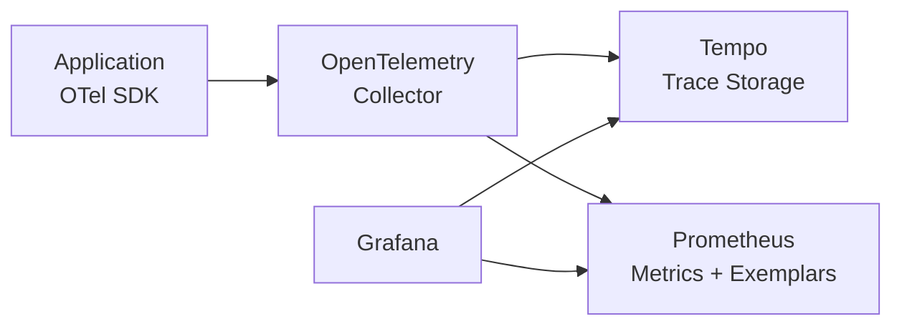

# Tracing

> OpenTelemetry SDK in app. Trace context propagation (W3C traceparent). Auto-instrumentation for FastAPI/SQLAlchemy/httpx.

This document defines our distributed tracing implementation using OpenTelemetry. We prioritize zero-code instrumentation (auto-instrumentation), W3C standard propagation, and correlation with metrics.

---

## Tracing Architecture



> **Why** — OpenTelemetry provides vendor-neutral instrumentation. Auto-instrumentation captures spans without manual annotation. W3C traceparent enables propagation across service boundaries.

---

## OpenTelemetry Setup

```python
# apps/backend/src/common/tracing.py
from opentelemetry import trace
from opentelemetry.sdk.trace import TracerProvider
from opentelemetry.sdk.trace.export import BatchSpanProcessor
from opentelemetry.exporter.otlp import OTLPSpanExporter
from opentelemetry.instrumentation.fastapi import FastAPIInstrumentor
from opentelemetry.instrumentation.sqlalchemy import SQLAlchemyInstrumentor
from opentelemetry.instrumentation.httpx import HTTPXClientInstrumentor
from opentelemetry.sdk.resources import Resource, SERVICE_NAME
import os


def configure_tracing(app_name: str = "backend") -> None:
    """Configure OpenTelemetry for the application."""

    # Create resource with service name
    resource = Resource(attributes={
        SERVICE_NAME: app_name,
        "deployment.environment": os.environ.get("ENVIRONMENT", "development"),
    })

    # Create tracer provider
    provider = TracerProvider(resource=resource)

    # Configure OTLP exporter
    otlp_endpoint = os.environ.get("OTEL_EXPORTER_OTLP_ENDPOINT", "http://localhost:4317")
    exporter = OTLPSpanExporter(
        endpoint=otlp_endpoint,
        insecure=True
    )
    provider.add_span_processor(BatchSpanProcessor(exporter))

    # Set global tracer provider
    trace.set_tracer_provider(provider)


def instrument_fastapi(app) -> None:
    """Instrument FastAPI application."""
    FastAPIInstrumentor.instrument_app(app)


def instrument_sqlalchemy(engine) -> None:
    """Instrument SQLAlchemy for database tracing."""
    SQLAlchemyInstrumentor().instrument(
        engine=engine,
        enable_commenter=True,
        commenter_options={"dbapi": True}
    )


def instrument_httpx() -> None:
    """Instrument httpx for HTTP client tracing."""
    HTTPXClientInstrumentor().instrument()
```

---

## W3C Trace Context Propagation

Trace context propagates across HTTP requests and background tasks:

```python
# apps/backend/src/common/tracing_propagation.py
from opentelemetry import trace
from opentelemetry.propagate import inject, extract
from opentelemetry.trace.propagation.tracecontext import TraceContextTextMapPropagator
import httpx
import asyncio

# W3C standard propagator
propagator = TraceContextTextMapPropagator()


def inject_trace_context(headers: dict) -> None:
    """Inject trace context into outgoing request headers."""
    # Extract current context
    carrier = {}
    inject(carrier)
    headers.update(carrier)


async def traced_http_call(url: str) -> dict:
    """Make HTTP call with trace context propagation."""
    tracer = trace.get_tracer(__name__)

    with tracer.start_as_current_span("http_call") as span:
        span.set_attribute("http.url", url)
        span.set_attribute("http.method", "GET")

        headers = {}
        inject_trace_context(headers)

        async with httpx.AsyncClient() as client:
            response = await client.get(url, headers=headers)

        span.set_attribute("http.status_code", response.status_code)
        return response.json()


# FastAPI integration - extract incoming trace context
@app.middleware("http")
async def trace_middleware(request: Request, call_next):
    """Extract trace context from incoming request."""
    # Extract from headers (W3C traceparent)
    context = extract(request.headers)
    token = trace.context_with_values(context)

    with tracer.start_as_current_span(
        request.url.path,
        context=token
    ) as span:
        span.set_attribute("http.method", request.method)
        span.set_attribute("http.url", str(request.url))

        response = await call_next(request)

        span.set_attribute("http.status_code", response.status_code)
        return response
```

---

## Custom Span Creation

Add custom spans for business operations:

```python
# apps/backend/src/booking/service.py
from opentelemetry import trace

tracer = trace.get_tracer(__name__)


class BookingService:
    def __init__(self, repo: BookingRepository, payment: PaymentService):
        self.repo = repo
        self.payment = payment

    async def create_booking(self, request: CreateBookingRequest) -> Booking:
        """Create a booking with full tracing."""
        with tracer.start_as_current_span("booking.create") as span:
            span.set_attribute("booking.tenant_id", request.tenant_id)
            span.set_attribute("booking.court_id", request.court_id)

            # Validate
            with tracer.start_as_current_span("booking.validate") as validate_span:
                await self._validate_availability(request)
                validate_span.set_attribute("validation.passed", True)

            # Create booking
            with tracer.start_as_current_span("booking.persist") as persist_span:
                booking = await self.repo.create(request)
                persist_span.set_attribute("booking.id", booking.id)

            # Process payment
            with tracer.start_as_current_span("booking.payment") as payment_span:
                await self.payment.charge(booking)
                payment_span.set_attribute("payment.amount", booking.total_amount)

            return booking

    async def _validate_availability(self, request: CreateBookingRequest):
        """Validate slot availability."""
        # Implementation
        pass
```

---

## Auto-Instrumentation

We use auto-instrumentation for common libraries:

```python
# apps/backend/src/main.py
from common.tracing import configure_tracing, instrument_fastapi, instrument_sqlalchemy, instrument_httpx
from common.database import engine


def create_app() -> FastAPI:
    # Configure tracing
    configure_tracing("splashh-backend")

    app = FastAPI(title="Splashh API")

    # Auto-instrumentation
    instrument_fastapi(app)
    instrument_sqlalchemy(engine)
    instrument_httpx()

    # ... rest of app setup

    return app
```

---

## Tail-Based Sampling

Not all traces are useful. We sample at the collector:

```yaml
# otel-collector.yaml
processors:
  tail_sampling:
    decision_wait: 10s
    policies:
      - name: errors-policy
        type: status_code
        status_code: {status_codes: [ERROR]}

      - name: slow-traces-policy
        type: latency
        latency: {threshold_ms: 1000}

      - name: probabilistic-policy
        type: probabilistic
        probabilistic: {sampling_percentage: 10}

      - name: always-sample
        type: always_on
```

> **Why** — Tail-based sampling selects traces after completion based on criteria (errors, slow traces). This ensures we keep interesting traces while reducing storage costs.

---

## Trace-Log-Correlation

Link traces to logs for debugging:

```python
# Include trace_id in log context
import logging
from opentelemetry import trace

trace_id_var = logging.ContextVar("trace_id", default="")


class TraceContextFilter(logging.Filter):
    """Add trace context to log records."""

    def filter(self, record):
        # Get current span
        span = trace.get_current_span()
        if span:
            trace_id = span.get_span_context().trace_id
            # Convert to hex
            record.trace_id = format(trace_id, '032x')
        else:
            record.trace_id = ""

        return True


# Now logs include trace_id
# Log query: {trace_id="abc123..."} | json
```

---

## Exemplars for Metrics

Link metrics to traces:

```python
# apps/backend/src/common/metrics.py
from opentelemetry import trace
from prometheus_client import Histogram

request_duration = Histogram(
    "http_request_duration_seconds",
    "Request duration",
    ["method", "endpoint"],
    buckets=[0.01, 0.05, 0.1, 0.25, 0.5, 1.0, 2.5, 5.0]
)


def track_request(method: str, endpoint: str):
    """Decorator to track request duration with exemplar."""
    def decorator(func):
        def wrapper(*args, **kwargs):
            span = trace.get_current_span()

            with request_duration.labels(method=method, endpoint=endpoint).time() as duration:
                # Add exemplar (link to trace)
                if span:
                    trace_id = format(span.get_span_context().trace_id, '032x')
                    # Exemplar is automatically added in OpenTelemetry SDK
                return func(*args, **kwargs)

        return wrapper
    return decorator
```

---

## Summary

| Component | Implementation |
|---|---|
| SDK | OpenTelemetry Python |
| Propagation | W3C traceparent |
| Auto-instrumentation | FastAPI, SQLAlchemy, httpx |
| Storage | Tempo |
| Sampling | Tail-based at collector |
| Correlation | trace_id in logs + exemplars |

---

## Related Documents

- [Monitoring](./monitoring.md) — Metrics and SLOs
- [Logging](./logging.md) — Log aggregation
- [Deployments](./deployments.md) — Deployment process
