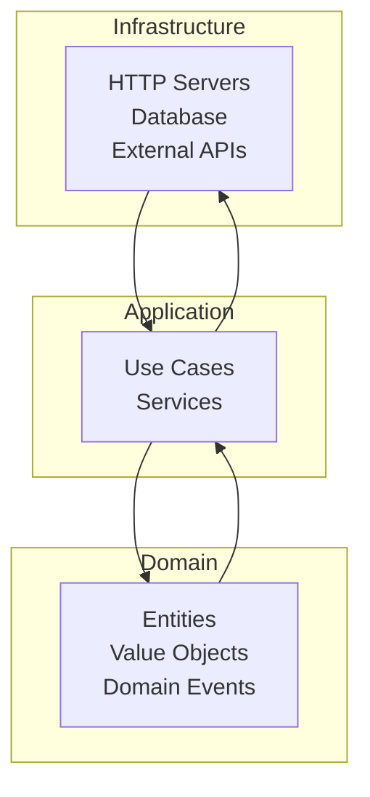
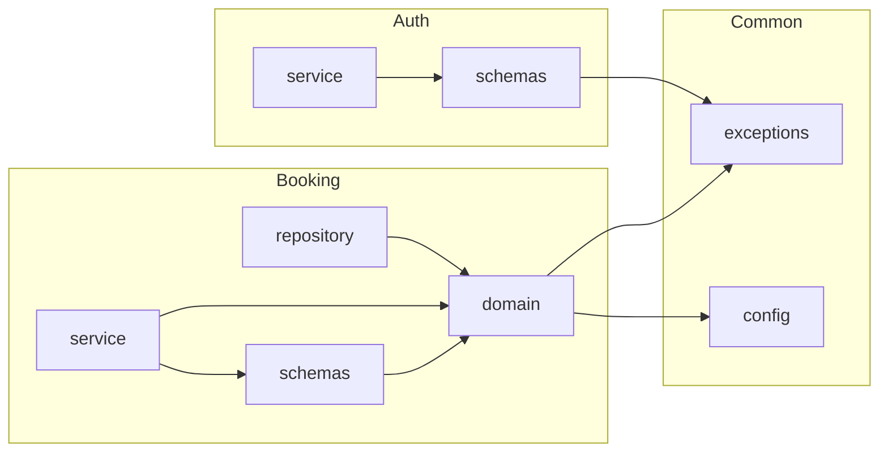

# Dependency Rules

> Layer dependency matrix (domain <- application <- infrastructure). Module dependency matrix. Forbidden imports (e.g., domain cannot import FastAPI). Architecture tests with pytest + importlib.

This document defines our architectural dependency rules. We follow Clean Architecture: dependencies point inward. The domain layer knows nothing of frameworks, databases, or HTTP.

---

## Layer Architecture



| Layer | Contains | Dependencies |
|---|---|---|
| Domain | Entities, Value Objects, Domain Events | None (pure Python) |
| Application | Services, Use Cases, Commands | Domain |
| Infrastructure | Repositories, HTTP Handlers, External Clients | Application, Domain |
| API (FastAPI) | Routes, Schemas | Application |

---

## Forbidden Imports

> **Rule** — Domain layer cannot depend on anything outside Python standard library.

| From Layer | Cannot Import |
|---|---|
| Domain | FastAPI, SQLAlchemy, httpx, Redis, Pydantic |
| Domain | Application services |
| Application | HTTP handlers, repositories |
| Domain | Infrastructure (must use interfaces) |

```python
# BAD: Domain importing infrastructure
# apps/backend/src/booking/domain/entities.py
from sqlalchemy import Column, String  # FORBIDDEN!


# GOOD: Domain is pure Python
# apps/backend/src/booking/domain/entities.py
from dataclasses import dataclass
from datetime import datetime
from decimal import Decimal
from typing import Literal


@dataclass
class Booking:
    """A booking for a court."""
    id: str
    court_id: str
    customer_id: str
    start_time: datetime
    end_time: datetime
    status: Literal["pending", "confirmed", "cancelled"]
    total_amount: Decimal

    def confirm(self) -> None:
        """Confirm the booking."""
        if self.status != "pending":
            raise ValueError("Can only confirm pending bookings")
        self.status = "confirmed"
```

---

## Interface Pattern

Use protocols (interfaces) to define dependencies:

```python
# apps/backend/src/booking/application/interfaces.py
from typing import Protocol
from abc import abstractmethod


class BookingRepository(Protocol):
    """Repository interface for bookings."""

    async def get(self, booking_id: str) -> Booking | None:
        """Get booking by ID."""

    async def create(self, booking: Booking) -> Booking:
        """Create a new booking."""

    async def update(self, booking: Booking) -> Booking:
        """Update an existing booking."""

    async def delete(self, booking_id: str) -> None:
        """Delete a booking."""


class PaymentGateway(Protocol):
    """Payment gateway interface."""

    async def charge(self, amount: Money, customer_id: str) -> PaymentResult:
        """Charge a customer."""

    async def refund(self, payment_id: str) -> RefundResult:
        """Refund a payment."""
```

---

## Dependency Injection

Inject dependencies, don't create them:

```python
# apps/backend/src/booking/application/service.py
class BookingService:
    """Application service for bookings."""

    def __init__(
        self,
        repository: BookingRepository,
        payment_gateway: PaymentGateway,
        event_dispatcher: EventDispatcher,
    ):
        """Initialize with dependencies (injected)."""
        self._repository = repository
        self._payment_gateway = payment_gateway
        self._event_dispatcher = event_dispatcher

    async def create_booking(
        self,
        customer_id: str,
        court_id: str,
        start_time: datetime,
        duration_minutes: int,
    ) -> Booking:
        """Create a booking using injected dependencies."""
        # Use repository
        existing = await self._repository.find_available(court_id, start_time)
        if existing:
            raise SlotUnavailableError(court_id, start_time)

        # Create booking
        booking = Booking(...)
        created = await self._repository.create(booking)

        # Use payment gateway
        await self._payment_gateway.charge(created.total_amount, customer_id)

        # Use event dispatcher
        await self._event_dispatcher.dispatch(BookingCreated(created))

        return created
```

---

## Module Dependency Matrix



| Module | Can Import |
|---|---|
| domain | domain, stdlib |
| application | domain, application, common |
| schemas | domain, common |
| infrastructure | application, common |

---

## Architecture Tests

We verify architecture rules with pytest:

```python
# tests/architecture/test_dependencies.py
"""Test that architecture rules are followed."""
import importlib
import ast
from pathlib import Path
import pytest


# Files that define forbidden imports
FORBIDDEN_IMPORTS = {
    "domain": ["fastapi", "sqlalchemy", "httpx", "redis", "pydantic"],
    "application": ["fastapi", "sqlalchemy"],
}


def test_domain_has_no_framework_imports():
    """Domain layer should not import frameworks."""
    domain_path = Path("apps/backend/src/booking/domain")
    forbidden = FORBIDDEN_IMPORTS["domain"]

    for py_file in domain_path.glob("**/*.py"):
        if py_file.name.startswith("test_"):
            continue

        source = py_file.read_text()
        tree = ast.parse(source)

        for node in ast.walk(tree):
            if isinstance(node, ast.Import):
                for alias in node.names:
                    for forb in forbidden:
                        if alias.name.startswith(forb):
                            pytest.fail(
                                f"{py_file} imports {alias.name} "
                                f"in domain layer"
                            )

            if isinstance(node, ast.ImportFrom):
                for alias in node.names:
                    for forb in forbidden:
                        if alias.name and alias.name.startswith(forb):
                            pytest.fail(
                                f"{py_file} imports {alias.name} "
                                f"in domain layer"
                            )
```

```python
# Run architecture tests
# $ pytest tests/architecture/ -v
# tests/architecture/test_dependencies.py::test_domain_has_no_framework_imports PASSED
```

---

## Example: Proper Layering

```python
# =============================================================================
# DOMAIN LAYER - Pure Python, no dependencies on frameworks
# =============================================================================
# apps/backend/src/booking/domain/entities.py

from dataclasses import dataclass
from datetime import datetime
from decimal import Decimal
from typing import Literal


@dataclass(frozen=True)
class BookingId:
    """Value object for booking ID."""
    value: str

    def __post_init__(self):
        if not self.value:
            raise ValueError("Booking ID cannot be empty")


@dataclass
class Booking:
    """Booking entity."""
    id: BookingId
    court_id: str
    customer_id: str
    start_time: datetime
    end_time: datetime
    status: Literal["pending", "confirmed", "cancelled"]
    total_amount: Decimal

    def confirm(self) -> None:
        """Confirm this booking."""
        if self.status != "pending":
            raise ValueError("Only pending bookings can be confirmed")
        self.status = "confirmed"


# =============================================================================
# APPLICATION LAYER - Uses domain + interfaces
# =============================================================================
# apps/backend/src/booking/application/interfaces.py (protocols)
from typing import Protocol

class BookingRepository(Protocol):
    async def get(self, id: BookingId) -> Booking | None: ...
    async def create(self, booking: Booking) -> Booking: ...


# apps/backend/src/booking/application/service.py
from datetime import datetime

class BookingService:
    def __init__(self, repository: BookingRepository):
        self._repository = repository

    async def create(self, customer_id: str, court_id: str, start: datetime, duration: int) -> Booking:
        booking = Booking(
            id=BookingId(...),
            court_id=court_id,
            customer_id=customer_id,
            start_time=start,
            end_time=start + timedelta(minutes=duration),
            status="pending",
            total_amount=Decimal("50.00")
        )
        return await self._repository.create(booking)


# =============================================================================
# INFRASTRUCTURE LAYER - Implements interfaces
# =============================================================================
# apps/backend/src/booking/infrastructure/repository.py

from sqlalchemy import Column, String, DateTime, Enum as SQLEnum
from sqlalchemy.dialect.postgresql import NUMERIC
from sqlalchemy.orm import declarative_base

from ..domain.entities import Booking, BookingId
from ..application.interfaces import BookingRepository


Base = declarative_base()


class BookingModel(Base):
    __tablename__ = "bookings"

    id = Column(String, primary_key=True)
    court_id = Column(String, nullable=False)
    customer_id = Column(String, nullable=False)
    start_time = Column(DateTime, nullable=False)
    end_time = Column(DateTime, nullable=False)
    status = Column(SQLEnum("pending", "confirmed", "cancelled"), nullable=False)
    total_amount = Column(NUMERIC(10, 2), nullable=False)


class SQLAlchemyBookingRepository(BookingRepository):
    def __init__(self, session):
        self._session = session

    async def get(self, id: BookingId) -> Booking | None:
        model = self._session.query(BookingModel).get(id.value)
        return self._to_domain(model) if model else None

    async def create(self, booking: Booking) -> Booking:
        model = self._to_model(booking)
        self._session.add(model)
        self._session.commit()
        return booking

    def _to_domain(self, model: BookingModel) -> Booking:
        return Booking(
            id=BookingId(model.id),
            court_id=model.court_id,
            customer_id=model.customer_id,
            start_time=model.start_time,
            end_time=model.end_time,
            status=model.status,
            total_amount=model.total_amount,
        )

    def _to_model(self, booking: Booking) -> BookingModel:
        return BookingModel(
            id=booking.id.value,
            court_id=booking.court_id,
            customer_id=booking.customer_id,
            start_time=booking.start_time,
            end_time=booking.end_time,
            status=booking.status,
            total_amount=booking.total_amount,
        )
```

---

## Summary

| Rule | Implementation |
|---|---|
| Dependencies point inward | Domain knows nothing |
| No framework imports in domain | FastAPI, SQLAlchemy, etc. |
| Use protocols | Define interfaces |
| Inject dependencies | Don't create internally |
| Architecture tests | Verify rules |

---

## Related Documents

- [Python Style](./python-style.md) — Formatting rules
- [Imports](./imports.md) — Import conventions
- [Code Review Checklist](./code-review-checklist.md) — Review standards
- [Refactoring Rules](./refactoring-rules.md) — Safe refactoring
