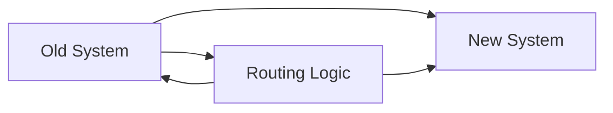

# Refactoring Rules

> Safe refactor playbook. Strangler fig pattern. Branch by abstraction. Refactor with tests as safety net. Never refactor + change behavior in same PR. Anti-patterns: shotgun surgery, divergent change.

This document defines safe refactoring practices. Refactoring is essential for code health, but must be done carefully to avoid introducing bugs.

---

## Golden Rules

> **Rule 1** — Never refactor and change behavior in the same PR.

> **Rule 2** — Tests are a prerequisite, not an afterthought.

> **Rule 3** — Small, frequent refactors beat massive rewrites.

---

## Refactor Checklist

Before refactoring:

- [ ] All tests passing
- [ ] Code coverage adequate for the area being refactored
- [ ] No other pending PRs on this code
- [ ] Refactor isolated to one module/package
- [ ] Backward compatibility maintained (or documented breaking change)

---

## Safe Refactor Patterns

### 1. Strangler Fig Pattern

Replace a system incrementally:



```python
# Before: Single monolith function
def process_booking(booking: Booking) -> None:
    """Process booking completely."""
    validate(booking)
    calculate_price(booking)
    save(booking)
    send_confirmation(booking)


# After: Strangler - route to new implementation
def process_booking(booking: Booking) -> None:
    """Process booking - routes to new implementation."""
    if feature_flags.is_enabled("new_booking_flow"):
        process_booking_v2(booking)  # New implementation
    else:
        process_booking_v1(booking)  # Original


# Gradually move functionality to v2
def process_booking_v2(booking: Booking) -> None:
    # New, refactored implementation
    validator = BookingValidator()
    calculator = PriceCalculator()
    repository = BookingRepository()

    validator.validate(booking)
    booking.price = calculator.calculate(booking)
    repository.save(booking)
    send_confirmation(booking)
```

### 2. Branch by Abstraction

Introduce abstraction before changing implementation:

```python
# Before: Direct dependency
class BookingService:
    async def create_booking(self, request: BookingRequest) -> Booking:
        # Direct Stripe API calls
        stripe.Charge.create(
            amount=request.amount,
            currency="usd",
            customer=request.stripe_customer_id,
        )


# Step 1: Create abstraction
class PaymentGateway(Protocol):
    """Payment gateway interface."""
    async def charge(self, amount: int, customer_id: str) -> PaymentResult: ...


# Step 2: Implement with adapter
class StripePaymentGateway(PaymentGateway):
    async def charge(self, amount: int, customer_id: str) -> PaymentResult:
        return stripe.Charge.create(
            amount=amount,
            currency="usd",
            customer=customer_id,
        )


# Step 3: Use abstraction
class BookingService:
    def __init__(self, payment_gateway: PaymentGateway):
        self._payment_gateway = payment_gateway

    async def create_booking(self, request: BookingRequest) -> Booking:
        # Now uses abstraction
        result = await self._payment_gateway.charge(
            amount=request.amount,
            customer_id=request.stripe_customer_id,
        )
        # ...


# Step 4: Switch implementation (in a separate PR)
class MockPaymentGateway(PaymentGateway):
    """For testing."""
    async def charge(self, amount: int, customer_id: str) -> PaymentResult:
        return PaymentResult(id="mock", status="succeeded")
```

### 3. Parallel Implementation

Run old and new code simultaneously:

```python
class BookingService:
    async def create_booking(self, request: BookingRequest) -> Booking:
        # Run both implementations
        result_old = await self._create_booking_v1(request)
        result_new = await self._create_booking_v2(request)

        # Compare results
        if result_old != result_new:
            logger.warning(
                f"Results differ! old={result_old}, new={result_new}"
            )

        # Return new result, but keep old for rollback
        return result_new
```

---

## Anti-Patterns to Avoid

### Shotgun Surgery

One change requires changes in multiple places:

```python
# BAD: Shotgun surgery
# Adding a new booking type requires changes in:
# - booking_service.py (create)
# - booking_repository.py (save)
# - price_calculator.py (calculate)
# - notification_service.py (notify)
# - booking_schema.py (validate)
# - tests everywhere

# GOOD: Encapsulated in one place
class Booking:
    """Booking entity owns all booking-related logic."""

    def create(self, booking_type: BookingType) -> Booking:
        # All logic in one place
        self._validate()
        self._calculate_price()
        self._set_notifications()
        return self
```

### Divergent Change

One module is changed for different reasons:

```python
# BAD: Divergent change
class BookingService:
    def create_booking(self): ...  # Changed for new feature
    def cancel_booking(self): ...  # Changed for bug fix
    def update_booking(self): ...  # Changed for performance

# GOOD: Separate services by responsibility
class BookingCreationService: ...
class BookingCancellationService: ...
class BookingUpdateService: ...
```

### Feature Envy

A function is more interested in another class than its own:

```python
# BAD: Feature envy
def calculate_order_total(order: Order) -> Decimal:
    # This function cares more about OrderItems than Order
    total = Decimal("0")
    for item in order.items:  # Order's data!
        total += item.price * item.quantity
    return total


# GOOD: Move logic to the class
class Order:
    def total(self) -> Decimal:
        return sum(item.price * item.quantity for item in self.items)
```

---

## Refactoring Steps

1. **Identify** the code to refactor
2. **Verify** tests exist and pass
3. **Create** a branch for refactoring
4. **Refactor** in small steps
5. **Run** tests after each change
6. **Commit** after each successful refactor
7. **Review** with the team
8. **Merge** after approval

---

## When to Refactor

| Trigger | Priority | Example |
|---|---|---|
| Code smell | High | Duplicate code, too long function |
| Before feature | Medium | Clean up before adding |
| Performance | High | N+1 queries |
| Bug fix | Low | Fix as you go if easy |
| Architecture | Medium | Extract service |

> **Guideline** — Refactor when you see code that makes debugging harder. Don't refactor working, simple code.

---

## When NOT to Refactor

- On a deadline
- Without test coverage
- In unfamiliar code
- Just for "cleanliness" without benefit
- In a large PR that's already big

---

## Summary

| Rule | Implementation |
|---|---|
| Separate from behavior change | Refactor PR first, then feature |
| Tests first | Verify existing behavior |
| Small steps | Commit frequently |
| Use patterns | Strangler, branch by abstraction |
| Avoid shotgun surgery | Encapsulate changes |

---

## Related Documents

- [Code Review Checklist](./code-review-checklist.md) — Review standards
- [Python Style](./python-style.md) — Formatting rules
- [Dependency Rules](./dependency-rules.md) — Architecture rules
- [Testing Pyramid](../10-testing/testing-pyramid.md) — Test strategy
